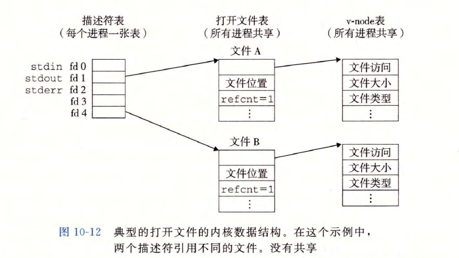
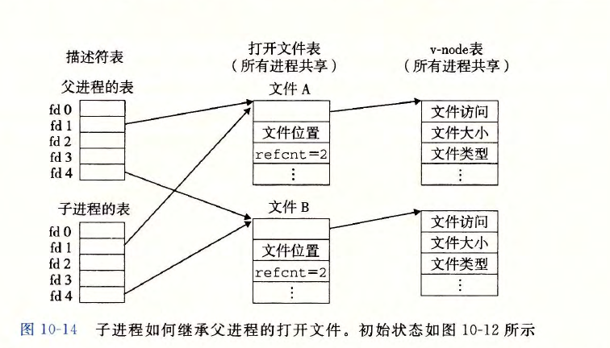
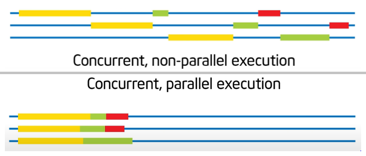

# Unix I/O
Basic File type
* regular file(text file and binary file)
* directory
* socket
```c
int open(char *filename, int flags, mode_t mode);
int close(int fd);
ssize_t read(int fd, void *buf, size_t n);//返回：若成功则为读的字节数，若 EOF 则为 0, 若出错为 一 1 。
ssize_t write(int fd, const void *buf, size_t n);//返回：若成功则为写的字节数，若出错则为 一 1 。
```
RIO
```c
void rio_readinitb(rio_t *rp, int fd);

ssize_t rio_readlineb(rio_t *rp, void *usrbuf, size_t maxlen);
ssize_t rio_readnb(rio_t *rp, void *usrbuf, size_t n);

ssize_t rio_writen(int fd, void *usrbuf, size_t n);
```
file metadata
```c
struct stat
{
    dev_t           st_dev;     // Device
    ino_t           st_ino;     // inode
    mode_t          st_mode;    // Protection & file type
    nlink_t         st_nlink;   // Number of hard links
    uid_t           st_uid;     // User ID of owner
    gid_t           st_gid;     // Group ID of owner
    dev_t           st_rdev;    // Device type (if inode device)
    off_t           st_size;    // Total size, in bytes
    unsigned long   st_blksize; // Blocksize for filesystem I/O
    unsigned long   st_blocks;  // Number of blocks allocated
    time_t          st_atime;   // Time of last access
    time_t          st_mtime;   // Time of last modification
    time_t          st_ctime;   // Time of last change
}

int stat(const char *filename, struct stat *buf);
int fstat(int fd, struct stat *buf);
// return 0 if success else -1
```
read directory 
```c
// example code
 #include "csapp . h"
 int main(int argc, char **argv)
 {
  DIR *Streamp;
  struct dirent *dep;
  streamp = Opendir(argv [1));
  errno = 0;
  while ((dep = readdir (streamp)) ! = NULL) {
    printf("Fou卫d file: %s\n", dep->d_name);
  }
  if (errno ! = 0)
  unix_error("readdir error");
  Closedir(streamp);
  exit(O);
 }
```
* descriptor table 
* open file table 
* v-node table(shared)<br>


### I/O redirection
`int dup2(int oldfd, int newfd);// locate the newfd to the oldfd` 

```c
#include <stdio.h>
extern FILE *stdin;     // descriptor 0
extern FILE *stdout;    // descriptor 1
extern FILE *stderr;    // descriptor 2
int main()
{
    fprintf(stdout, "Hello, Da Wang\n");
}
```


# Network Programming

## Client-Server model
every web application is based on `Client-Server model`<br>

## Network
web is an `I/O device` to a computer<br>

---
web can be divided into three parts
* SAN - System Area Network
  * Switched Ethernet, Quadrics QSW, ...
* LAN - Local Area Network
  * Ethernet, ..
* WAN - Wide Area Network
  * High speed point-to-point phone lines
---
|network part|graph description|
---|---
Ethernet Segment|
Bridged Ethernet Segment|
internets|
---
two thing needed to do to transmit message
* define internet address
* transmission protocol
---
## TCP/IP
Transmission Control Protocol/Internet Protocol
* IP (Internet Protocal)
    * Provides basic naming scheme and unreliable delivery capability of packets (datagrams) from host-to-host
* UDP (Unreliable Datagram Protocol)
    * Uses IP to provide unreliable datagram delivery from process-to-process
* TCP (Transmission Control Protocol)
    * Uses IP to provide reliable byte streams from process-to-process over connections
---
IP address(IPV4)
```c
/* IP address structure */
struct in_addr {
    uint32_t s_addr; /* Address in network byte order (big-endian) */
};
```
unix provides several functions to transfer between big-endian and little-endian<br>

Dotted Decimal Notation<br>
IP address：`0x8002C2F2 = 128.2.194.242`
### Internet domain name
Domain Naming System(DNS): maintain mapping between ip address and domain in database called DNS<br>
to `simplify`, people use domain name instead of ip address in usage(tranmission actually uses ip address)<br>

### Internet connection
`socket pair`: *`(cliaddr: cliport, servaddr: servport)`*<br>
the idea of port is to indentify different services<br>


## Socket Interface
socket interface is `a set functions combined with unix i/o functions` to create web applications
```c
/* IP socket address structure */
struct sockaddr_in {
uint16_t sin_family; /* Protocol family (always AF _INET) */
uint16_t sin_port; /* Port number in network byte order */
struct in_addr sin_addr; /* IP address in network byte order */
unsigned char sin_zero[8]; /* Pad to sizeof(struct sockaddr) */
};
/* Generic socket address structure (for connect, bind, and accept) */
struct sockaddr {
uint16_t sa_family; /* Protocol family */
char sa_data[14]; /* Address data */
};
```
## Server overview

---
`open_clientfd`: wrapped function to connect to a server
```c
int open_clientfd(char *hostname, char *port) {
    int clientfd;
    struct addrinfo hints, *listp, *p;
    
    // Get a list of potential server address
    memset(&hints, 0, sizeof(struct addrinfo));
    hints.ai_socktype = SOCK_STREAM; // Open a connection
    hints.ai_flags = AI_NUMERICSERV; // using numeric port arguments
    hints.ai_flags |= AI_ADDRCONFIG; // Recommended for connections
    getaddrinfo(hostname, port, &hints, &listp);
    
    // Walk the list for one that we can successfully connect to
    // 如果全部都失败，才最终返回失败（可能有多个地址）
    for (p = listp; p; p = p->ai_next) {
        // Create a socket descriptor
        // 这里使用从 getaddrinfo 中得到的参数，实现协议无关
        if ((clientfd = socket(p->ai_family, p->ai_socktype,
                               p->ai_protocol)) < 0)
            continue; // Socket failed, try the next
        
        // Connect to the server
        // 这里使用从 getaddrinfo 中得到的参数，实现协议无关
        if (connect(clientfd, p->ai_addr, p->ai_addrlen) != -1)
            break; // Success
        
        close(clientfd); // Connect failed, try another
    }
    
    // Clean up
    freeaddrinfo(listp);
    if (!p) // All connections failed
        return -1;
    else // The last connect succeeded
        return clientfd;
}
```
`open_listenfd`: create `listening descriptor`, accept request from client
```c
int open_listenfd(char *port){
    struct addrinfo hints, *listp, *p;
    int listenfd, optval=1;
    
    // Get a list of potential server addresses
    memset(&hints, 0, sizeof(struct addrinfo));
    hints.ai_socktype = SOCK_STREAM; // Accept connection
    hints.ai_flags = AI_PASSIVE | AI_ADDRCONFIG; // on any IP address
    hints.ai_flags |= AI_NUMERICSERV; // using port number
    // 因为服务器不需要连接，所以原来填写地址的地方直接是 NULL
    getaddrinfo(NULL, port, &hints, &listp); 
    
    // Walk the list for one that we can successfully connect to
    // 如果全部都失败，才最终返回失败（可能有多个地址）
    for (p = listp; p; p = p->ai_next) {
        // Create a socket descriptor
        // 这里使用从 getaddrinfo 中得到的参数，实现协议无关
        if ((listenfd = socket(p->ai_family, p->ai_socktype,
                               p->ai_protocol)) < 0)
            continue; // Socket failed, try the next
        
        // Eliminates "Address already in use" error from bind
        setsockopt(listenfd, SOL_SOCKET, SO_REUSEADDR), 
                    (const void *)&optval, sizeof(int));
        
        // Bind the descriptor to the address
        if (bind(listenfd, p->ai_addr, p->ai_addrlen) == 0)
            break; // Success
        
        close(listenfd); // Bind failed, try another
    }
    
    // Clean up
    freeaddrinfo(listp);
    if (!p) // No address worked
        return -1;
    
    // Make it a listening socket ready to accept connection requests
    if (listen(listenfd, LISTENQ) < 0) {
        close(listenfd);
        return -1;
    }
    return listenfd;
}
```
### Example Socket Server
`echo server`
```c
// echoserveri.c
#include "csapp.h"
void echo(int connfd);

int main(int argc, char **argv){
    int listenfd, connfd;
    socklen_t clientlen;
    struct sockaddr_storage clientaddr; // Enough room for any addr
    char client_hostname[MAXLINE], client_port[MAXLINE];
    
    // 开启监听端口，注意只开这么一次
    listenfd = Open_listenfd(argv[1]);
    while (1) {
        // 需要具体的大小
        clientlen = sizeof(struct sockaddr_storage); // Important!
        // 等待连接
        connfd = Accept(listenfd, (SA *)&clientaddr, &clientlen);
        // 获取客户端相关信息
        Getnameinfo((SA *) &clientaddr, clientlen, client_hostname,
                     MAXLINE, client_port, MAXLINE, 0);
        printf("Connected to (%s, %s)\n", client_hostname, client_port);
        // 服务器具体完成的工作
        echo(coonfd);
        Close(connfd);
    }
    exit(0);
}

void echo(int connfd) {
    size_t n;
    char buf[MAXLINE];
    rio_t rio;
    
    // 读取从客户端传输过来的数据
    Rio_readinitb(&rio, connfd);
    while((n = Rio_readlineb(&rio, buf, MAXLINE)) != 0) {
        printf("server received %d bytes\n", (int)n);
        // 把从 client 接收到的信息再写回去
        Rio_writen(connfd, buf, n);
    }
}
```
## Web Server
HTTP(Hypertext Transfer Protocol): use between web client and server
* static content
* dynamic content

# Concurrent Programming
three ways to create concurrent programme
* process(IPC)
* I/O multiplexing
* threads
---

## Process
A `separate process` is used for each client, and the process only starts in `parallel` after a connection is established, while the connection establishment is still `serial`.<br>
```c
void sigchld_handler(int sig){
    while (waitpid(-1, 0, WNOHANG) > 0)
        ;
    return;
    // Reap all zombie children
}

int main(int argc, char **argv) {
    int listenfd, connfd;
    socklen_t clientlen;
    struct sockaddr_storage clientaddr;
    
    Signal(SIGCHLD, sigchld_handler);
    listenfd = Open_listenfd(argv[1]);
    while (1) {
        clientlen = sizeof(struct sockaddr_storage);
        connfd = Accept(listenfd, (SA *) &clientaddr, &clientlen);
        if (Fork() == 0) {
            Close(listenfd); // Child closes its listening socket
            echo(connfd); // Child services client
            Close(connfd); // Child closes connection with client
            exit(0); // Child exits
        }
        Close(connfd); // Parent closes connected socket (important!)
    }
}
```
each process has it's own virtual memory, but must use IPC and tends to be slow
## I/O Multiplexing
`event-driven` programme<br>
views
* more control on events compared to process
* complex code needed
* easy to be attacked
## Thread
below description from [小土刀](https://www.wdxtub.com/blog/csapp/thin-csapp-9)<br>
```
和基于进程的方法非常相似，唯一的区别是这里用线程。进程其实是比较『重』的，一个进程包括进程上下文、代码、数据和栈。如果从线程的角度来描述，一个进程则包括线程、代码、数据和上下文。也就是说，线程作为单独可执行的部分，被抽离出来了，一个进程可以有多个线程。

每个线程有自己的线程 id，有自己的逻辑控制流，也有自己的用来保存局部变量的栈（其他线程可以修改）但是会共享所有的代码、数据以及内核上下文。

和进程不同的是，线程没有一个明确的树状结构（使用 fork 是有明确父进程子进程区分的）。和进程中『并行』的概念一样，如果两个线程的控制流在时间上有『重叠』（或者说有交叉），那么就是并行的。

进程和线程的差别已经被说了太多次，这里简单提一下。相同点在于，它们都有自己的逻辑控制流，可以并行，都需要进行上下文切换。不同点在于，线程共享代码和数据（进程通常不会），线程开销比较小（创建和回收）
```
### POSIX Threads
POSIX is library for threads in `c` language
```c
#include "csapp.h"
void echo (int connfd);
void *thread(void *vargp);
int main(int argc, char **argv)
{
    int listenfd, *connfdp;
    socklen_t clientlen;
    struct sockaddr_storage clientaddr;
    pthread_t tid;
    
    if (argc != 2) {
    fprintf (stderr, "usage: %s <port>\n", argv [0]);
    exit (0);
    }
    listenfd = Open_listenfd(argv [1]);
    
    while (1) {
        clientlen=sizeof(struct sockaddr_storage);
        connfdp = Malloc (sizeof (int));
        *connfdp = Accept(listenfd, (SA *) &clientaddr, &clientlen);
        Pthread_create(&tid, NULL, thread, connfdp);
    }
} 
/* Thread routine */
void *thread (void *vargp)
{
    int connfd = *((int *)vargp);
    Pthread_detach(pthread_self ());
    Free(vargp);
    echo(connfd);
    Close(connfd);
    return NULL;
}
```
### Shared Variable in Threads
mapping variable to memory
|variable | description|
---|---
gloabl variable| one instance in virtual memory read/write area, can be refered by any thread
local variable|every thread has it's own instance
static local variable|same as global variable
### Synchronization
shared variable: a variable is shared if and only if `mutliple threads` reference some instacne of it<br>

`Synchronization error`
### Semaphore
```c
// define semaphore
volatile long cnt = 0;
sem_t mutex;

Sem_init(&mutex, 0, 1);

// 在线程中用 P 和 V 包围关键操作
for (i = 0; i < niters; i++)
{
    P(&mutex);
    cnt++;
    V(&mutex);
}
```
### Producer-Consumer Problem

```c
#include "csapp.h"

typedef struct {
    int *buf;    // Buffer array
    int n;       // Maximum number of slots
    int front;   // buf[(front+1)%n] is first item
    int rear;    // buf[rear%n] is the last item
    sem_t mutex; // Protects accesses to buf
    sem_t slots; // Counts available slots
    sem_t items; // Counts available items
} sbuf_t;

void sbuf_init(sbuf_t *sp, int n);
void sbuf_deinit(sbuf_t *sp);
void sbuf_insert(sbuf_t *sp, int item);
int sbuf_remove(sbuf_t *sp);

// sbuf.c

// Create an empty, bounded, shared FIFO buffer with n slots
void sbuf_init(sbuf_t *sp, int n) {
    sp->buf = Calloc(n, sizeof(int));
    sp->n = n;                  // Buffer holds max of n items
    sp->front = sp->rear = 0;   // Empty buffer iff front == rear
    Sem_init(&sp->mutex, 0, 1); // Binary semaphore for locking
    Sem_init(&sp->slots, 0, n); // Initially, buf has n empty slots
    Sem_init(&sp->items, 0, 0); // Initially, buf has 0 items
}

// Clean up buffer sp
void sbuf_deinit(sbuf_t *sp){
    Free(sp->buf);
}

// Insert item onto the rear of shared buffer sp
void sbuf_insert(sbuf_t *sp, int item) {
    P(&sp->slots);                        // Wait for available slot
    P(&sp->mutext);                       // Lock the buffer
    sp->buf[(++sp->rear)%(sp->n)] = item; // Insert the item
    V(&sp->mutex);                        // Unlock the buffer
    V(&sp->items);                        // Announce available item
}

// Remove and return the first tiem from the buffer sp
int sbuf_remove(sbuf_f *sp) {
    int item;
    P(&sp->items);                         // Wait for available item
    P(&sp->mutex);                         // Lock the buffer
    item = sp->buf[(++sp->front)%(sp->n)]; // Remove the item
    V(&sp->mutex);                         // Unlock the buffer
    V(&sp->slots);                         // Announce available slot
    return item;
}
```
### Reader-Writer Problem


```c
sbuf_t sbuf; // Shared buffer of connected descriptors


static int byte_cnt;  // Byte counter
static sem_t mutex;   // and the mutex that protects it


void echo_cnt(int connfd){
    int n;
    char buf[MAXLINE];
    rio_t rio;
    static pthread_once_t once = PTHREAD_ONCE_INIT;
    
    Pthread_once(&once, init_echo_cnt);
    Rio_readinitb(&rio, connfd);
    while ((n = Rio_readlineb(&rio, buf, MAXLINE)) != 0) {
        P(&mutex);
        byte_cnt += n;
        printf("thread %d received %d (%d total) bytes on fd %d\n",
                    (int) pthread_self(), n, byte_cnt, connfd);
        V(&mutex);
        Rio_writen(connfd, buf, n);
    }
}

static void init_echo_cnt(void){
    Sem_init(&mutex, 0, 1);
    byte_cnt = 0;
}

void *thread(void *vargp){
    Pthread_detach(pthread_self());
    while (1) {
        int connfd = sbuf_remove(&sbuf); // Remove connfd from buf
        echo_cnt(connfd);                // Service client
        Close(connfd);
    }
}

int main(int argc, char **argv) {
    int i, listenfd, connfd;
    socklen_t clientlen;
    struct sockaddr_storage clientaddr;
    pthread_t tid;
    
    listenfd = Open_listenfd(argv[1]);
    sbuf_init(&sbuf, SBUFSIZE);
    for (i = 0; i < NTHREADS; i++) // Create worker threads
        Pthread_create(&tid, NULL, thread, NULL);
    while (1) {
        clientlen = sizeof(struct sockaddr_storage);
        connfd = Accept(listenfd, (SA *)&clientaddr, &clientlen);
        sbuf_insert(&sbuf, connfd); // Insert connfd in buffer
    }
}
```
---
4 class of thread-unsafe function
1. function that do not protect shared variable
    * solution: use P and V semaphore operation
    * problem: slow down the code
2. funciton that keep state across mutliple invocations
    * solution: pass state as part of argument
3. function that return a pointer to a static variable
    * solution1: rewrite function so caller pass address of variable to store result
    * solution2: Lock-and-Copy
4. function that call thread-unsafed functions
    * solution: only call thread-safe functions
---
### Reentrant Functions

### Race and Deadlock
