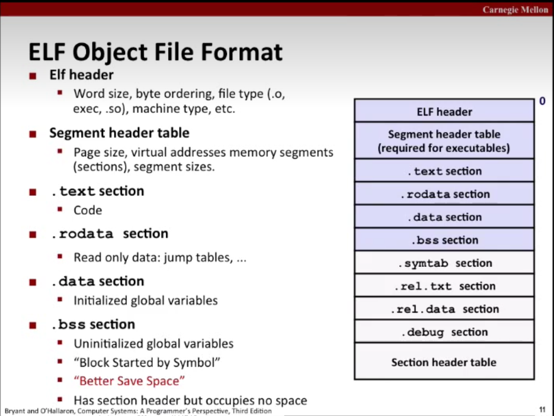

# Linking
two main tasks
* symbol resolution
* relocation
### ELF format


### Local variable
* local non-static C variable
  * store on stack(linker know nothing about it)
* local C variable
  * stored in either .bss or .data
### symbols and rules
strong symbols
* precedures and initialized globals
weak symbols
* uninitialized globals
three rules(be careful for tricky bug)
* not more than one strong symbol with same name
* one strong symbol and one weak symbol has the same name , choose the strong one
* more than one weak symbols all has the same name , random choose one

relocate entry<br>
static library(.a)<br>
* command line order matters!
* Moral: put the libraries at the end of the commmand line.
shared library(.so)
### Library interpositioning
intercept calls to arbitrary function
* Complie time(#define)
* Link time(-Wl)
* run-time(library interpositioning, lysm, LD_PRELOADED environment variable)
# Exceptional Control Flow
An exception is a transfer of control to the OS kernal in response to some event<br>

Exception
* Asynchronous Exceptions 
  * interrupt
    * time interrupt 
    * I/O interrrupt
* Synchronous Exceptions
  * trap
    * intentional
    * system calls, breakpoint traps
  * fault
    * unintentional and possibly recoverable
    * page faults, protection faults
  * abort
    * unintentional and unrecoverable
    * illegal instruction

`syscall`<br>

A `process` is an instance of a running program
* Logical Control Flow
* private address space<br>

mode bit<br>
> concurrent flow, concurrency<br>
> mutiltasking, time slice, time slicing<br>
> parallel flow, running in pararllel and parallel execution

## Context switch

A context is being in one of three states
* running
* stopped
* terminated
### Process control
signal concepts
* A signal is `pending` if sent but not yet received
* A process can `block` the receipt of certain signal
* A pending signal is received at most once
* Kernal maintain pending and blocked bit vectors in the context of each process<br>
`write` is the only async-signal-safe output function
PID(process id, positive number)<br>
```c
pid_t getpid(void); //return pid
pid_t getppid(void);//return parent pid
``` 

```c
int fork(void);
// return 0 to the child process, return child's pid to parent process
```


```c
pid_t waitpid(pid_t pid, int *statusp, int options);
pid_t wait(int *statusp); 
// suspend current process until one of its children terminates

unsigned int sleep(unsigned int secs);
int pause(void);

int execve(const char *filename, const char *argv[], const char *envp[]);
// Loads and runs in the current process, call once and never return

pid_t getpgrp(void);
int setpgid(pid_t pid, pid_t pgid);

int kill(pid_t pid, int sig);
```
### non-local jump
```c
jup_buf env;
int setjmp(jmp_buf env); // return 0
int sigsetjmp(sigjmp_buf env, int savesigs); // return non-zero

void longjmp(jmp_buf env, int retval); // never return
void siglongjmp(sigjmp_buf env, int retval); // never return
```
# Virtual Memory
## basic concepts
<br>
Adavantages
* use main memory efficiently
* simplifies memory management
* isolate address spaces<br>
---
DRAM cache organization
* large page size: usually 4K~2M
* Fully associative: any virual page can be stored in any physical page, no limitation
* use write-back instead of write-through<br>
Page table
---
PS(from [小土刀](https://www.wdxtub.com/blog/csapp/thin-csapp-7#%E5%AD%A6%E4%B9%A0%E7%9B%AE%E6%A0%87))
* Write-through: 命中后更新缓存，同时写入到内存中
* Write-back: 直到这个缓存需要被置换出去，才写入到内存中（需要额外的 dirty bit 来表示缓存中的数据是否和内存中相同，因为可能在其他的时候内存中对应地址的数据已经更新，那么重复写入就会导致原有数据丢失）
---
Virtual Page
* allocated
* cached
* uncached<br>


Page Table Entry(PTE)
* page hit
* page fault
  * page fault handler
  * deamand paging<br>


### VM as a tool for memory management
also simplify linking and loading<br>

### VM as a tool for memory protection

---
Translation Lookaside Buffer(TLB): speed up memory translation<br>

---
## Adress Translation

### Mutli-page tables

## Dynamic memory allocation
allocator
* explicit allocator
* implicit allocator(with grabage collector)
```c
#include <stdlib.h>
void *malloc(size_t size); // return allcated pointer if success else NULL

#include <stdlib . h>
void free(void *ptr); // no return

// remember that brk is `pointer variable` pointing to the top of the heap
#include <unistd.h>
void *sbrk(intptr_t incr); // return old brk pointer if success else -1

Other funcitons
* calloc: initialize allocated block to zero
* realloc: change the size of a previously allocated block
* sbrk: Used internally by allocator to grow or shrink the heap
```
---
### goal of allocator
* Maximize throughput(最大化吞吐率)
* Maximize memory usage
---
### fragmentation
|type|description|
---|---
internal fragmentation|
external fragmentation|
### implenmentation
* Implicit List(隐式空闲列表)
* Explicit List(显式空闲列表)
* Segregated Free List(分离的空闲列表)
* Blocks Sorted by Size(按照大小对块进行排序)
### grabage colloctor
<br>
---
Mark & Sweep grabage colloctor
```c
* ptr isPtr (ptr p);
• int blockMarked (ptr b)
• int blockAllocated (ptr b)
• void markBlock (p 七 r b)
• int length (b)
• void unmarkBlock (ptr b)
• ptr nextBlock (p 七 r b)
```
### familiar memory error in c
* Dereference bad pointer
* Read uninitialized memory
* Buffer overflow
* Assume pointer the same size as the object it pointed to
* Off-by-one
* Reference to the pointer, not the object
* Misunderstand pointer computation
* Reference variable not exist
* Memory leak
* Freeing blocks multiple times