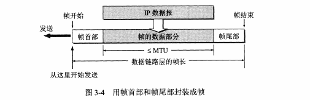
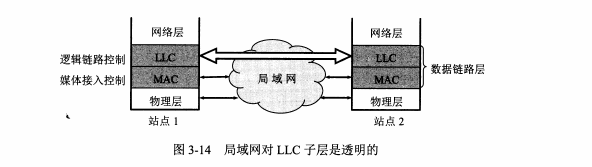

# Data Link layer

data unit: `frame`

## Problem
### framing
add `header` and `tailer` to a data

### Transparent Transmission

`solution: byte stuffing`

## Error detection
* CRC
* FCS
## PPP(Point-to-Point Protocol)

* F(flag)
* A(preserved)
* C(preserved)
### byte stuffing and zero-bit stuffing

## boradcast
owned by one unit with limited amout of stations and area

*   LLC(Logical Link Control)
*   MAC(Medium Access Control) 

CSMA/CD Protocol
hardware address

Filter frame
* unicast
* broadcast
* multicast

`Sniffer` track the frame
