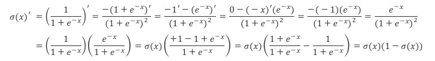
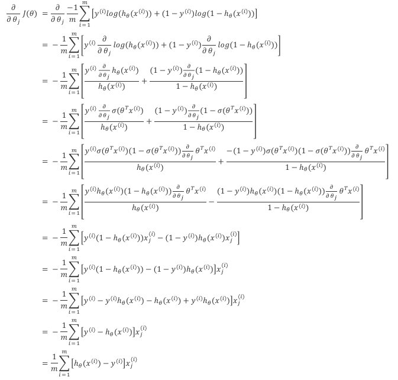

# Introduction
machine learning is widely used
* web search
* spam identification
* DNA Sequence
---
machine learning algorithm
* Supervised learning
* Unsupervised learning
* Recommended system
* Reinforcement learning
## Supervised Learning 
### Regression
`predict number`<br>

example<br>

### Classification
`predict categories`<br>

example<br>

## Unsupervised Learning
find `structure` in unlabled data<br>
* Clustering
* Dimensionality reduction
* Anomaly detection
# Linear Regression

## Cost Function
define how well the linear regression works<br>

Squared error cost function
$$ J(\theta_{0}, \theta_{1}) = \frac{1}{2m} \sum_{i = 1}^{m}(h_{\theta}(x^{i}) - y ^ {i}) ^ {2} $$


### Gradient Descent
find the `best parameters` to `minimize` the cost function<br>

* local minimum
* global minimum
---
gradient descent algorithm<br>

`learning rate`<br>

fixed learning rate
* Near a local minimum
  * Derivative becomes smaller
  * Update steps becomes smaller
---
## Multiple features
multiple feature function
$$h_{\theta}(x) = \theta_0 + \theta_1 x_1 + \theta_2 x_2 + \theta_3 x_3 + ... + \theta_n x_n$$

`Vectorlization`:

$$h_{\theta}(x) = \big[\theta_0\ \ \theta_1\ \ ... \ \ \theta_n\big] \left[\begin{matrix}x_0\\\ x_1\\\ ...\\\ x_n\end{matrix}\right]= \theta^Tx$$
### Gradient Descent
$$\theta_j := \theta_j - \alpha\frac{\partial}{\partial \theta_j}J(\theta)$$

for m >= 1:<br>
 
$$\frac{\partial}{\partial \theta_j}J(\theta) = \frac{1}{m}\sum^m_{i=1}(h\_{\theta}(x^{(i)}) - y^{(i)})x^{(i)}_j$$

notice that:

$$J(\theta) = \frac{1}{2m}\sum^m_{i=1}(h_{\theta}(x^{(i)}) - y^{(i)})^2$$
### Feature scaling and normalization
#### Mean normalization
note from [here](https://github.com/bighuang624/Andrew-Ng-Machine-Learning-notes/blob/master/docs/week2.md)<br>
```
可以通过使每个输入值在大致相同的范围内来加速梯度下降。这是因为梯度在小范围内下降快，而在大范围内下降较慢；另外，对于不平整的变量，梯度在下降至最优值的过程中会出现降低效率的震荡。
```
$$x_i := \frac{x_i - \mu_i}{s_i}$$
$\mu_i$ is mean of feature $x_i$<br>
$s_i$ = $Max(x_i) - Min(x_i)$
#### Zero-Score normalization
$$x_i := \frac{x_i - \mu_i}{\sigma_i}$$
$\mu_i$ is mean of feature $x_i$<br>
$\sigma_i$ = $Variance(x_i)$ = $E[(x_i-\mu_i)^2]$
### Normal Equation
reference note from [here](https://github.com/bighuang624/Andrew-Ng-Machine-Learning-notes/blob/master/docs/week2.md)<br>
> 把数据集表示为矩阵
>
> $$X = \left( \begin{matrix} x_{11} & x_{12} & \cdots & x_{1d} & 1 \\\ x_{21} & x_{22} & \cdots & x_{2d} & 1 \\\ \vdots & \vdots & \ddots & \vdots & \vdots \\\ x_{m1} & x_{m2} & \cdots & x_{md} & 1 \\\ \end{matrix} \right) = \left( \begin{matrix} x_{1}^T & 1 \\\ x_{2}^T & 1 \\\ \vdots & \vdots \\\ x_{m}^T & 1 \\\ \end{matrix} \right)$$
>
> 同时将标签也写成向量形式
>
> $$y = (y_1;y_2;...;y_m)$$
>
> 由均方误差最小化，可得
>
> $$\theta^* = arg_{\theta}min(y-X\theta)^T(y-X\theta)$$
>
> 其中，$\theta^*$表示 $\theta$ 的解。
> 令
>
> $$E_{\theta} = (y-X\theta)^T(y-X\theta)$$
>
> 对 $\theta$ 求导得到
>
> $$
> \begin{equation}
> \begin{split}
> \frac{\partial E_{\theta}}{\partial \theta}&=-X^T(y-X\theta) + (y^T - \theta^TX^T) \cdot (-X)\\\
> &=2X^T(X\theta - y)
> \end{split}
> \end{equation}
> $$
>
> 令上式为 0，有
>
> $$2X^T(X\theta - y) = 0$$
>
> $$X^TX\theta = X^Ty$$
>
> 最终得到
>
> $$\theta = (X^TX)^{-1}X^Ty$$
>
> 当 $X^TX$ 不为满秩矩阵（不可逆）时，可解出多个 $\theta$ 使均方误差最小化。因此将由学习算法的归纳偏好来决定选择哪一个解作为输出，常见的做法就是引入正则化项。
> 正规方程方法中，无需做特征缩放。两种方法的对比如下：
> | 梯度下降 | 正规方程 |
> | :--: | :--: |
> | 需要选择学习率 | 不需要选择学习率 |
> | 需要多次迭代 | 不需要迭代 |
> | $O(kn^2)$ | $O(n^3)$，需要计算 $(X^TX)^{-1}$ |
> | 当 n 较大时效果很好 | 当 n 较大时速度较慢 |
> 不过正规方程方法要求 $X^TX$ 可逆。$X^TX$ 不可逆的原因有两种可能：
> 1. 列向量线性相关：即训练集中存在冗余特征（特征线性依赖），此时应该剔除掉多余特征；
> 2. 特征过多（多于样本数量）：此时应该去掉影响较小的特征，或引入正则化（regularization）项。
# Logistic Regression
## Sigmoid function
$$h_{\theta} = g(\theta^Tx)$$

$$z = \theta^Tx$$

$$g(z) = \frac{1}{1 + e^{-z}}$$
```python
import numpy as np
def sigmoid(z):
   return 1 / (1 + np.exp(-z))
```
## Decision Boundary 
boundary to descides output to be which categories<br>

---
Logistic Regression cannot use the same cost function as linear regression because the `Sigmoid function is non-convex` and prone to getting `trapped in local optima`.

As an alternative, the following `cost function` can be used:

$$J(\theta) = \frac{1}{m}\sum^m_{i=1}Cost(h\_{\theta}(x^{(i)}), y^{(i)})$$

$$Cost(h\_{\theta}(x), y) = -y log(h_{\theta}(x)) - (1-y)log(1-h_{\theta}(x))$$

vectorlization:

$$h = g(X\theta)$$

$$J(\theta) = \frac{1}{m} \cdot (-y^Tlog(h) - (1-y)^Tlog(1-h))$$
## Gradient Descent


$$\theta_j := \theta_j - \alpha \frac{\partial}{\partial \theta_j}J(\theta)$$

logistic regression gradient descent:

$$\theta_j := \theta_j - \frac{\alpha}{m} \sum^m_{i=1}(h_{\theta}(x^{(i)}) - y^{(i)})x_j^{(i)}$$

vectorlization:

$$\theta := \theta - \frac{\alpha}{m}X^T(g(X\theta) - \vec y)$$




## Regularization
### The Problem of Overfitting

### Linear Regression with regularization
cost function

$$min_{\theta}\frac{1}{2m}\Big[\sum^m_{i=1}(h_{\theta}(x^{(i)}) - y^{(i)})^2 + \lambda \sum^n_{j=1}\theta_j^2\Big]$$

gradient descent:

$$\theta_0 := \theta_0 - \alpha \frac{1}{m}\sum^m_{i=1}(h_{\theta}(x^{(i)}) - y^{(i)})x_0^{(i)}$$

$$\theta_j := \theta_j - \alpha \Big[\Big(\frac{1}{m}\sum^m_{i=1}(h_{\theta}(x^{(i)}) - y^{(i)})x_j^{(i)} \Big) + \frac{\lambda}{m}\theta_j \Big] \ \ \ \ j = 1, 2, ..., n$$

### Logistic Regression with regularization
cost function

$$J(\theta) = -\frac{1}{m}\sum^m_{i=1}\Big[y ^{(i)}log(h_{\theta}(x^{(i)})) + (1-y^{(i)})log(1-h_{\theta}(x^{(i)}))\Big] + \frac{\lambda}{2m}\sum^n_{j=1}\theta^2_j$$

gradient function

$$\theta_0 := \theta_0 - \alpha \frac{1}{m}\sum^m_{i=1}(h_{\theta}(x^{(i)}) - y^{(i)})x_0^{(i)}$$

$$\theta_j := \theta_j - \alpha \Big[\Big(\frac{1}{m}\sum^m_{i=1}(h_{\theta}(x^{(i)}) - y^{(i)})x_j^{(i)} \Big) + \frac{\lambda}{m}\theta_j \Big] \ \ \ \ j = 1, 2, ..., n$$