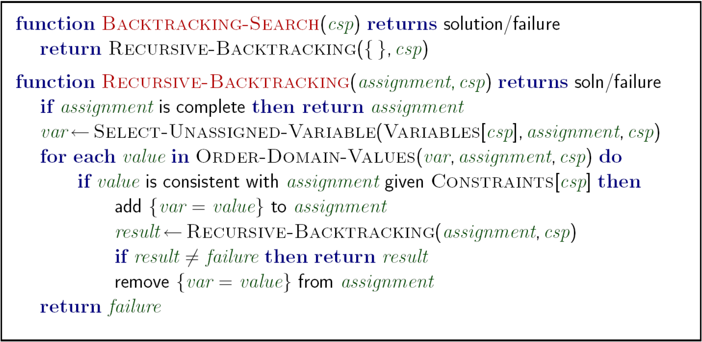
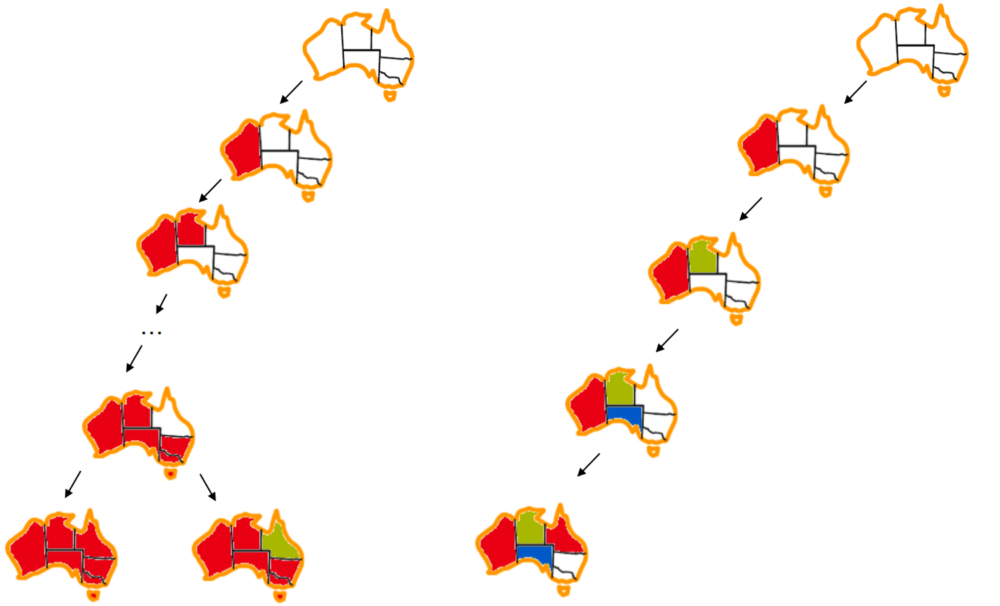
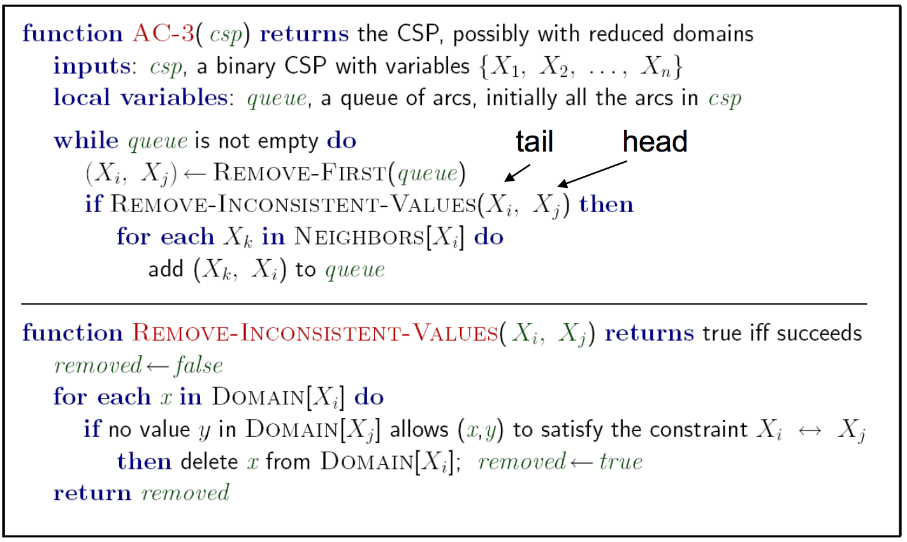

# CSP
represent constraints with **constraint graph**

Consider map coloring the map of Australia:

# Solving CSP
**backtracking search**

visualization dfs and backtracking

## forward checking
use **forward checking** to prun the contradict condition to speed up
### arc-3
use arc to implement Arc consitstency

# PS
for the rest of note, refer to [official textbook CSP chapter](https://inst.eecs.berkeley.edu/~cs188/textbook/csp/)