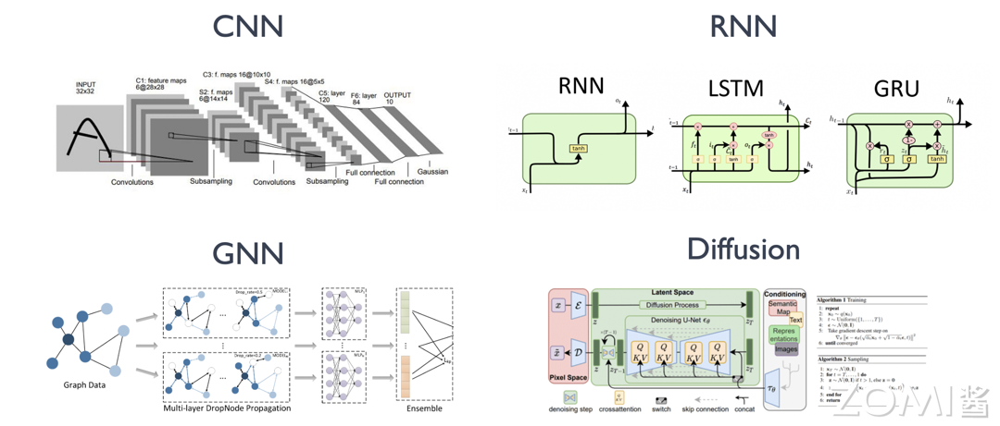
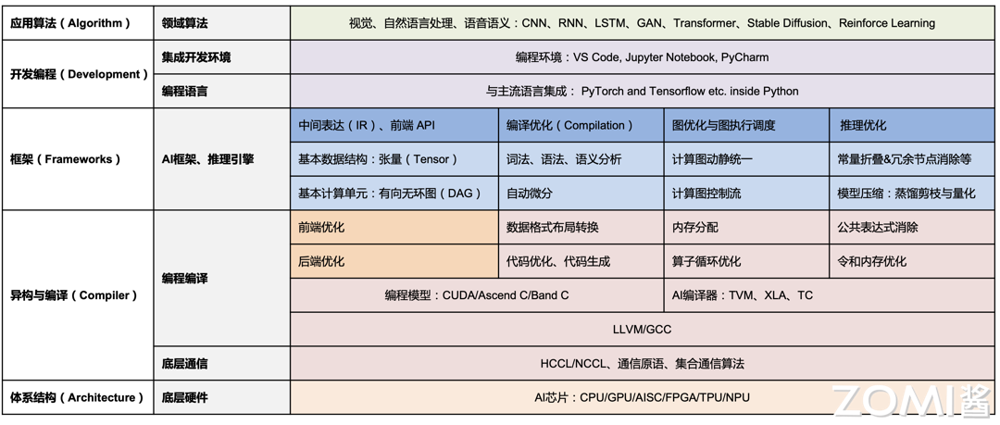

[课程地址]( https://infrasys-ai.github.io/aisystem-docs/index.html)

课程大纲如下

> 探讨和学习 AI 、深度学习的系统设计, 整个系统是围绕着在 NVIDIA、ASCEND 等芯片厂商构建算力层面，所用到的、积累、梳理得到 AI 系统全栈的内容。

# Introduction
## History
深度学习在三大领域方向中都取得了显著的成果.
- 计算机视觉 CV
- 自然语言处理 NLP
- 语音识别 Audio 

## Develop
神经网络的开发与工作模式抽象为以下几个步骤
- 确定模型输入输出
- 设计与开发模型
- 训练模型
- 推理

典型的基本 AI 模型结构分类
1. **卷积神经网络（Convolutional Neural Network，CNN）**：以卷积层（Convolution Layer）为主，池化层（Pooling Layer），全连接层（Fully Connected Layer）等算子（Operator）的组合形成的 AI 网络模型，并在计算机视觉领域取得明显效果和广泛应用的模型结构。

2. **循环神经网络（Recurrent Neural Network，RNN）**：以循环神经网络、长短时记忆（LSTM）等基本单元组合形成的适合时序数据预测（例如，自然语言处理、语音识别、监控时序数据等）的模型结构。

3. **图神经网络（Graph Neural Network，GNN）**：使用神经网络来学习图结构数据，提取和发掘图结构数据中的特征和模式，满足聚类、分类、预测、分割、生成等图学习任务需求的算法总称。目的是为了尽可能多的提取 “图” 中潜在的表征信息。

4. **生成对抗网络（Generative Adversarial Network，GAN）**：该架构训练两个神经网络相互竞争，从而从给定的训练数据集生成更真实的新数据。例如，可以从现有图像数据库生成新图像，也可以从歌曲数据库生成原创音乐。GAN 之所以被称为对抗网络，是因为该架构训练两个不同的网络并使其相互对抗。

5. **扩散概率模型（Diffusion Probabilistic Models）**：扩散概率模型是一类潜变量模型，是用变分估计训练的马尔可夫链。目标是通过对数据点在潜空间中的扩散方式进行建模，来学习数据集的潜结构。如计算机视觉中，意味着通过学习逆扩散过程训练神经网络，使其能对叠加了高斯噪声的图像进行去噪。

6. **混合结构网络（Model Ensemble）**：组合以上不同结构类型的网络模型，如结合卷积神经网络和循环神经网络，进而解决如光学字符识别（OCR）等复杂应用场景的预测任务。

---

AI 系统的发展受到大数据积累、计算能力提升和算法进步的推动。

## architecture
大致可以将 AI 系统分为以下几个具体的方向：

## Foundation
> 算子：深度学习算法由一个个计算单元组成，称这些计算单元为算子（Operator，Op）。AI 框架中对张量计算的种类有很多，比如加法、乘法、矩阵相乘、矩阵转置等，这些计算被称为算子（Operator）。
> 
> 为了更加方便的描述计算图中的算子，现在来对**算子**这一概念进行定义：
>
> **数学上定义的算子**：一个函数空间到函数空间上的映射 O：X→X，对任何函数进行某一项操作都可以认为是一个算子。
> 
> - **狭义的算子（Kernel）**：对张量 Tensor 执行的基本操作集合，包括四则运算，数学函数，甚至是对张量元数据的修改，如维度压缩（Squeeze），维度修改（reshape）等。
> 
> - **广义的算子（Function）**：AI 框架中对算子模块的具体实现，涉及到调度模块，Kernel 模块，求导模块以及代码自动生成模块。
>
> 对于神经网络模型而言，算子是网络模型中涉及到的计算函数。在 PyTorch 中，算子对应层中的计算逻辑，例如：卷积层（Convolution Layer）中的卷积算法，是一个算子；全连接层（Fully-connected Layer，FC layer）中的权值求和过程，也是一个算子。

在实际 Kernel 的计算过程中有很多有趣的问题：

- **硬件加速**：通用矩阵乘是计算机视觉和自然语言处理模型中的主要的计算方式，同时 NPU、GPU，又或者如 TPU 脉动阵列的矩阵乘单元等其他专用 AI 芯片 ASIC 是否会针对矩阵乘作为底层支持？（第二章 AI 芯片体系结构相关内容）

- **片上内存**：其中参与计算的输入、权重和输出张量能否完全放入 NPU/GPU 片内缓存（L1、L2、Cache）？如果不能放入则需要通过循环块（Loop Tile）编译优化进行切片。（第二章 AI 芯片体系结构相关内容）

- **局部性**：循环执行的主要计算语句是否有局部性可以利用？空间局部性（缓存线内相邻的空间是否会被连续访问）以及时间局部性（同一块内存多久后还会被继续访问），这样我们可以通过预估后，尽可能的通过编译调度循环执行。（第三章 AI 编译器相关内容）

- **内存管理与扩展（Scale Out）**：AI 系统工程师或者 AI 编译器会提前计算每一层的输出（Output）、输入（Input）和内核（Kernel）张量大小，进而评估需要多少计算资源、内存管理策略设计，以及换入换出策略等。（第三章 AI 编译器相关内容）

- **运行时调度**：当算子与算子在运行时按一定调度次序执行，框架如何进行运行时管理？（第四章推理引擎相关内容）

- **算法变换**：从算法来说，当前多层循环的执行效率无疑是很低的，是否可以转换为更加易于优化和高效的矩阵计算？（第四章推理引擎相关内容）

- **编程方式**：通过哪种编程方式可以让神经网络模型的程序开发更快？如何才能减少或者降低算法工程师的开发难度，让其更加聚焦 AI 算法的创新？（第五章 AI 框架相关内容）

底层 cuda 的代码量很大，不能快速开发，使用ai框架进行开发可以加速

AI 框架一般会提供以下功能：

1. 以 Python API 供读者编写网络模型计算图结构；
2. 提供调用基本算子实现，大幅降低开发代码量；
2. 自动化内存管理、不暴露指针和内存管理给用户；
3. 实现自动微分功能，自动构建反向传播计算图；
4. 调用或生成运行时优化代码，调度算子在指定 NPU 的执行；
6. 并在运行期应用并行算子，提升 NPU 利用率等优化（动态优化）。

# Hardware Introduction
AI 的硬件体系架构主要是指 AI 芯片

AI 计算中的四种主流芯片
- CPU
- GPU（Graphics Processing Unit，图形处理单元）
- 半定制化的 FPGA（Field Programmable Gate Array，现场可编程门阵列）
- 全定制化 ASIC（Application-Specific Integrated Circuit，专用集成电路）。

CPU、GPU、FPGA 是前期较为成熟的芯片架构，属于通用性芯片，ASIC 是为 AI 特定场景定制的芯片。

从应用场景的角度，AI 芯片可以分为云端，边缘端两类
- **云端** 的场景又分为训练应用和推理应用，像电商网站的用户推荐系统、搜索引擎、短视频网站的 AI 变脸等都是属于推理应用。
- **边缘** 的应用场景更加丰富，如智能手机、智能驾驶、智能安防等。通过 AI 芯片丰富的应用场景，可以看到人工智能技术对我们未来生活的影响程度。

## Computation mode
神经网络模型的基础组件大致如下
- **神经元（Neuron）**：神经网络的基本组成单元，模拟生物神经元的功能，接收输入信号并产生输出，这些神经元在一个神经网络中称为 **模型权重** 。
- **激活函数（Activation Function）**：用于神经元输出非线性化的函数，常见的激活函数包括 Sigmoid、ReLU 等。
- **模型层数（Layer）**：神经网络由多个层次组成，包括输入层、隐藏层和输出层。隐藏层可以有多层，用于提取数据的不同特征。
- **前向传播（Forward Propagation）**：输入数据通过神经网络从输入层传递到最后输出层的过程，用于生成预测结果。
- **反向传播（Backpropagation）**：通过计算损失函数对网络参数进行调整的过程，以使网络的输出更接近预期输出。
- **损失函数（Loss Function）**：衡量模型预测结果与实际结果之间差异的函数，常见的损失函数包括均方误差和交叉熵。
- **优化算法（Optimization Algorithm）**：用于调整神经网络参数以最小化损失函数的算法，常见的优化算法包括梯度下降、自适应评估算法（Adaptive Moment Estimation）等，不同的优化算法会影响模型训练的收敛速度和达到的性能。

神经网络中 90% 的计算量都是在做乘加（multiply and accumulate, MAC）的操作，也称为 **权重求和** 。

