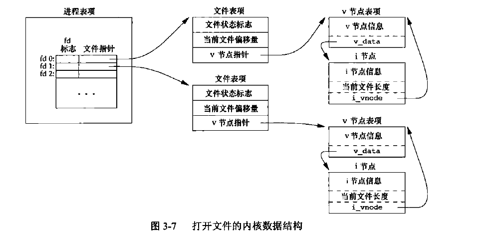

[TOC]

# Introduction
**Kernel** 控制计算机资源，提供程序运行环境。

## file and directory
Unix 文件系统是目录和文件的一种层次结构。起点是 root directory ("/")  

创建目录时会自动创建两个文件名：`.`（指向当前目录）、`..`（指向父目录）。  

值得一提的是在最高层次的根目录中，这两个文件名是一样的。  

书中的第一个代码例子值得学习  

```c
// 列出文件目录下的所有文件
#include "apue.h"
#include <dirent.h>

int
main(int argc, char *argv[])
{
    DIR    *dp;
    struct dirent  *dirp;

    if (argc != 2)
        err_quit("usage: ls directory_name");

    if ((dp = opendir(argv[1])) == NULL)
        err_sys("can't open %s", argv[1]);

    while ((dirp = readdir(dp)) != NULL)
        printf("%s\n", dirp->d_name);

    closedir(dp);
    exit(0);
}
```
## Input and output
重定向"<"和">".

书中代码例子值得细读.

```c
// 将标准输入复制到标准输出
#include "apue.h"

#define BUFFSIZE 4096

int
main(void)
{
    int n;
    char buf[BUFFSIZE];

    while ((n = read(STDIN_FILENO, buf, BUFFSIZE)) > 0)
        if (write(STDOUT_FILENO, buf, n) != n)
            err_sys("write error");

    if (n < 0)
        err_sys("read error");

    exit(0);
}
```

```c
// 上面的标准I/O 版本, 不过没有使用buf
#include "apue.h"

int
main(void)
{
    int c;

    while ((c = getc(stdin)) != EOF)
        if (putc(c, stdout) == EOF)
            err_sys("output error");

    if (ferror(stdin))
        err_sys("input error");

    exit(0);
}
```

## programme and process
**程序(program)** 是一个可执行文件  

**进程(process)** 是程序的执行实例  

每个进程有独特的ID (process ID)，可以使用`getpid()`获取PID。  

三个控制流函数`fork()`、`exec()`、`waitpid()`

书中的列子是将读取输入的字符串命令然后执行

```c
#include "apue.h"
#include <sys/wait.h>

int
main(void)
{
    char buf[MAXLINE]; /* from apue.h */
    pid_t pid;
    int status;

    printf("%s", /* print prompt (printf requires %% to print %) */
    while ((fgets(buf, MAXLINE, stdin) != NULL) {
        if (buf[strlen(buf) - 1] == '\n')
            buf[strlen(buf) - 1] = 0; /* replace newline with null */

        if ((pid = fork()) < 0) {
            err_sys("fork error");
        } else if (pid == 0) { /* child */
            execvp(buf, buf, (char *)0);
            err_ret("couldn't execute: %s", buf);
            exit(127);
        }

        /* parent */
        if ((pid = waitpid(pid, &status, 0)) < 0)
            err_sys("waitpid error");
        printf("%s ");
    }

    exit(0);
}
```

waitpid 函数返回子进程的终止状态(status变量)，例子中没有使用返回值  

## error handling
在以前只有进程的时候，使用`extern int errno;` 来定义errno  

UNIX系统默认错误码通常会返回一个负值，整型变量errno通常会被设定成相应的值  

在线程中，所以线程都指向同一个全局变量errno，是新定义为

```c
extern int *_errno_location(void);  
#define _errno (*_errno_location())  
```

strerror 函数并返回值是指向消息字符串的指针，errnum 通常是 errno 的值  

```c
#include <string.h>  
char* strerror(int errnum);  
```

`perror()`基于errno的值，在标准错误上产生一条出错信息，它首先输出msg的字符串，然后是一个冒号，一个空格, 接着是errno值的出错信息  

```c
#include <stdio.h>  
void perror(const char* msg);  
```

## user ID  
用户ID为0的用户为根用户(root)  

用户也可以属于一个组，于是有组ID  

相关函数：`getuid()`、`getgid()`  

## signal  
信号(signal)用于通知进程发生了某种情况。  

三种处理信号的方式  
1. 忽略信号，有些信号表示硬件异常  
2. 按优先级处理  
3. 提供捕获信号的函数，并按我们希望的次序处理信号  

SIGINT的系统默认动作是终止进程。  

书中的一个简单例子是定义了一个`sig-int(int)`函数, 不过只是简单的打印出 interrupt 字符串

```c
#include "apue.h"
#include <sys/wait.h>

static void sig_int(int);    /* our signal-catching function */

static void
sig_int(int signo)
{
    printf("interrupt\n");
}

int
main(void)
{
    char buf[MAXLINE];    /* from apue.h */
    pid_t pid;
    int status;

    if (signal(SIGINT, sig_int) == SIG_ERR)
        err_sys("signal error");

    printf("%% ");  /* print prompt */
    while (fgets(buf, MAXLINE, stdin) != NULL) {
        if (buf[strlen(buf) - 1] == '\n')
            buf[strlen(buf) - 1] = 0;    /* replace newline with null */

        if ((pid = fork()) < 0) {
            err_sys("fork error");
        } else if (pid == 0) {    /* child */
            execlp(buf, buf, (char *)0);
            err_ret("couldn't execute: %s", buf);
            exit(127);
        }

        /* parent */
        if ((pid = waitpid(pid, &status, 0)) < 0)
            err_sys("waitpid error");
        printf("%% ");
    }

    exit(0);
}
```

# UNIX standard
这一章不做笔记介绍

# file I/O
在 <unistd.h> 中定义了三个常量, 与文件描述符有关：
- `STDIN_FILENO` : 0
- `STDOUT_FILENO`: 1
- `STDERR_FILENO`: 2

---

`open` and `openat`

```c
#include <fcntl.h>
// 两函数的返回值：若成功，返回文件描述符；若出错，返回-1

int open(const char *path, int oflag, ... /* mode_t mode */);

int openat(int fd, const char *path, int oflag, ... /* mode_t mode */);
```

path 参数是要打开或创建文件的名字，oflag有多个选项

常见的oflag如下

> 前 5 个常量（`O_RDONLY`、`O_WRONLY`、`O_RDWR`、`O_EXEC`、`O_SEARCH`）必须且只能指定其中一个；其余为可选常量。

| 常量 | 说明 |
|------|------|
| `O_RDONLY` | 只读打开。 |
| `O_WRONLY` | 只写打开。 |
| `O_RDWR` | 读、写打开。 |
| `O_EXEC` | 只执行打开。 |
| `O_SEARCH` | 只搜索打开（应用于目录）。目前支持的操作系统较少。 |
| `O_APPEND` | 每次写时都追加到文件的尾部。 |
| `O_CLOEXEC` | 把 `FD_CLOEXEC` 设置为文件描述符标志。 |
| `O_CREAT` | 若文件不存在则创建。需同时指定第 3 个参数 `mode`。 |
| `O_DIRECTORY` | 如果 `path` 引用的不是目录，则出错。 |
| `O_EXCL` | 与 `O_CREAT` 同时使用，若文件已存在则出错。 |
| `O_NOCTTY` | 如果 `path` 引用终端设备，不将其分配为控制终端。 |
| `O_NOFOLLOW` | 如果 `path` 引用符号链接，则出错。 |
| `O_NONBLOCK` | 如果 `path` 引用 FIFO、块特殊文件或字符特殊文件，则使用非阻塞模式。 |

---

`create`, 返回值：若成功，返回为只写打开的文件描述符；若出错，返回-1

```c
#include <fcntl.h>

int creat(const char *path, mode_t mode);
```

等效于
```c
open(path, O_WRONLY | O_CREAT | O_TRUNC, mode)
```
- `create` 的缺点：以**只写**方式打开所创建的文件。

---

`close` 函数
```c
#include <unistd.h>
int close(int fd);
```
- **返回值**：成功返回 `0`，出错返回 `-1`。
- 关闭一个文件时，还会释放该进程在该文件上施加的**记录锁**。

**当前文件偏移量(current file offset)**是一个非负整数，用以度量从**文件开始处**计算的字节数。
- 通常，读、写操作从**当前文件偏移量**开始。
- 读写完成后，偏移量增加所读/写的字节数。

---

`lseek` 函数: 显式地设置文件的偏移量。
```c
#include <unistd.h>

off_t lseek(int fd, off_t offset, int whence);
```
- **返回值**：若成功，返回新的文件偏移量；若出错，返回 `-1`。

`offset` 参数的解释与 `whence` 有关
- 若 `whence` 是 `SEEK_SET`，则将该文件的偏移量设置为距文件开始处 `offset` 个字节。
- 若 `whence` 是 `SEEK_CUR`，则将该文件的偏移量设置为其当前值加 `offset`，`offset` 可为正或负。
- 若 `whence` 是 `SEEK_END`，则将该文件的偏移量设置为文件长度加 `offset`，`offset` 可正可负。

代码示例如下

```c
#include "apue.h"
int
main(void)
{
    if (lseek(STDIN_FILENO, 0, SEEK_CUR) == -1)
        printf("cannot seek\n");
    else
        printf("seek OK\n");
    exit(0);
}
```

输出如下

```console
$ ./a.out < /etc/passwd
seek OK
$ cat < /etc/passwd| ./a.out
cannot seek
$ ./a.out < /var/spool/cron/FIFO
cannot seek
```

---

`read` —— 从打开的文件中读取数据
```c
#include <unistd.h>
ssize_t read(int fd, void *buf, size_t count);
```

`write` —— 向打开的文件写数据
```c
#include <unistd.h>
ssize_t write(int fd, const void *buf, size_t count);
```
返回值：读到的字节数，若已到文件尾，返回 0；若出错，返回 -1

---

在介绍文件共享之前，先了解一下内核中一些 I/O 的数据结构。

内核使用 **3 种数据结构** 表示打开文件，它们之间的关系决定了在文件共享方面一个进程对另一个进程可能产生的影响。

1. 进程级文件描述符表
每个进程在进程表中都有一个记录项，其中包含一张**打开文件描述符表**（可视为一个矢量，每个描述符占用一项）。  
与每个文件描述符相关联的是：
- **a. 文件描述符标志**（如 `close_on_exec`）
- **b. 指向一个文件表项的指针**

2. 系统级文件表
内核为所有打开文件维护一张**文件表**。每个文件表项包含：
- **a. 文件状态标志**（读、写、同步、非阻塞等）
- **b. 当前文件偏移量**
- **c. 指向该文件 v 节点表项的指针**

3. v 节点（v-node）
每个打开文件（或设备）都有一个 **v 节点** 结构，包含：
- 文件类型
- 对此文件进行各种操作的函数指针
- 对于大多数文件，v 节点还包含该文件的 **i 节点（索引节点）**  
  - i 节点在打开文件时从磁盘读入内存，包含所有相关信息（如文件所有者、文件长度、指向磁盘数据块的指针等）

附图表加以理解



---

多进程写文件的数据竞争
- 多个进程同时写同一个文件可能存在**数据竞争**问题。
- 解决方案：使用 **`pread`** 和 **`pwrite`** 等扩展函数，它们允许**原子性定位并执行 I/O**。

调用 `pread` 相当于调用 `lseek` 后调用 `read`，但是 `pread` 又与这种顺序调用有下列重要区别。
- 调用 `pread` 时，无法中断其定位和读操作。
- 不更新当前文件偏移量。

调用 `pwrite` 相当于调用 `lseek` 后调用 `write`，但也与它们有类似的区别。

---

复制文件描述符
- **`dup`** 和 **`dup2`** 用于复制一个现有的文件描述符, `dup2`是一个原子操作
- 两函数的返回值：若成功，返回新的文件描述符；若出错，返回-1

```c
#include <unistd.h>

int dup(int fd);

int dup2(int fd, int fd2);
```

---

缓冲区一致性
- 当内核需要重用缓冲区时，会将所有**延迟写数据块**写入磁盘。
- **`sync`**、**`fsync`**、**`fdatasync`** 用于保证磁盘上文件系统与缓冲区内容的一致性。

```c
#include <unistd.h>

int fsync(int fd);

int fdatasync(int fd);

// 返回值：若成功，返回0；若出错，返回-1

void sync(void);
```

`sync`只是将所有修改过的块缓冲区排入写队列，然后就返回，它并不等待实际写磁盘操作结束。

通常，称为update的系统守护进程周期性地调用（一般每隔30秒）sync函数。这就保证了定期冲洗（flush）内核的块缓冲区。命令sync(1)也调用sync函数。

fsync函数只对由文件描述符fd指定的一个文件起作用，并且等待写磁盘操作结束才返回, fsync可用于数据库这样的应用程序，这种应用程序需要确保修改过的块立即写到磁盘上。

fdatasync函数类似于fsync，但它只影响文件的数据部分。而除数据外，fsync还会同步更新文件的属性。

# file and dir