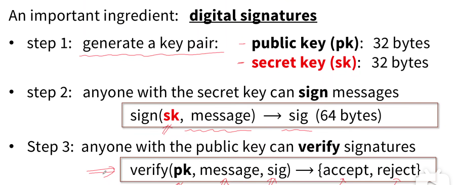

# Basic

## Bitcoin addresses (simplified)

To be paid in Bitcoins:
- Generate a public/private key pair **PK/SK**
- Bitcoin address: hash of public key, address = \( H(PK) \)
- Keep **SK** secret: needed to spend funds from the address

## UTXO

UTXO（Unspent Transaction Output，未花费交易输出）模型是比特币用来追踪和管理资产所有权的核心记账模型。
不像传统银行那样记录每个账户的最终余额，而是追踪每一笔“钱”（即UTXO）的完整流转历史。

一笔比特币交易由“输入”和“输出”构成。

1.  **输入 (Inputs)**：你**花费**的UTXO，它们必须是你拥有的、尚未被花费的。
2.  **输出 (Outputs)**：交易**创造**的新的UTXO。

其核心流程是：
*   **锁定与解锁**：每个UTXO都被一把“锁”（一个脚本，如P2PKH）锁住，只有持有对应“钥匙”（私钥签名）的人才能花费它。
*   **消耗与创造**：花费一个UTXO时，它会被**完全消耗（销毁）**，同时创造出一个或多个全新的UTXO作为“输出”。
*   **验证**：网络节点会验证交易引用的UTXO是否存在、未被花费，并且签名正确。

### a simple example for understanding

假设A有5个比特币（记为`UTXO_0`），他想转给B 3.15个比特币。

这笔交易会这样发生：
1.  **输入**：`UTXO_0`（5 BTC）被“花费”。
2.  **输出**：
    *   输出1：`UTXO_1`，金额 **3.15 BTC**，转给 **B**。
    *   输出2：`UTXO_2`，金额 **1.85 BTC**，作为“找零”转回给 **A**。
    *   （交易手续费会从`UTXO_2`中扣除，实际收到的找零会略少。）

交易完成后，A不再拥有`UTXO_0`，但他拥有了新找零`UTXO_2`；而B拥有了新收到的`UTXO_1`。

优点：
*   **安全性高**：能有效防止“双花”（双重支付）问题，因为每个UTXO只能被花费一次。
*   **可追溯性强**：每一枚比特币的完整交易历史都可以被追踪和验证。

缺点：
*   **用户不友好**：理解和管理UTXO（如小额UTXO合并）对普通用户有一定门槛。
*   **状态管理复杂**：其全局状态是离散的UTXO集合，管理比账户模型更复杂。

# Wallet

to send fund from wallet

- wallet software creates a transaction Tx
- wallet signs Tx with my signing key
- wallet sends Tx to Ethereum network
- some miner validates Tx
  - if valid, includes Tx in a block
- broadcasts block on Ethereum network
⇒ Tx recorded on blockchain

## deposit funds into the wallet

**step 1:** get an account on a crypto exchange -- many available

- coinbase
- mKraken
- BITFINEX

BTC, BCH, ETH, LTC

**step 2:** buy crypto currency using fiat currency

**step 3:** send tokens to your local wallet address

want to convert back?

just use the crypto exchange again.

# Application beyond a cryptocurrencys

successful application for bitcoin: replacement for gold
- easy to store, transport and exchange

problems
- scaling: 3trans/sec -> many scaling proposals
- high volatility   -> stable coin

Decentraliazed apps(DAPPs) could be made for many prespectives

# Data privacy

confidential transactions: replace "value" by commitments to "value"

Pedersen commitment: $commitment(v) = g^v \times h^r \quad (random r)$

can hide more info(payer, payee, and amount) : **zcash**

# Proof of work
Proof of work: choosing a random miner

Previous block defines a puzzle X
- **Goal:** miner must find a value Y that solves the puzzle X  
- Suppose density of valid solutions is \( 1/2^{70} \implies \)  
  - find Y by trying many candidates \( \implies 2^{70} \) tries on average  
- **Assumption:** no faster way to find a solution  

Miner who finds solution Y is chosen to mint new block

## just more
- proof of space
- proof of stake
- quorum system: quorum miners issue new blocks(Stellar, ...)
