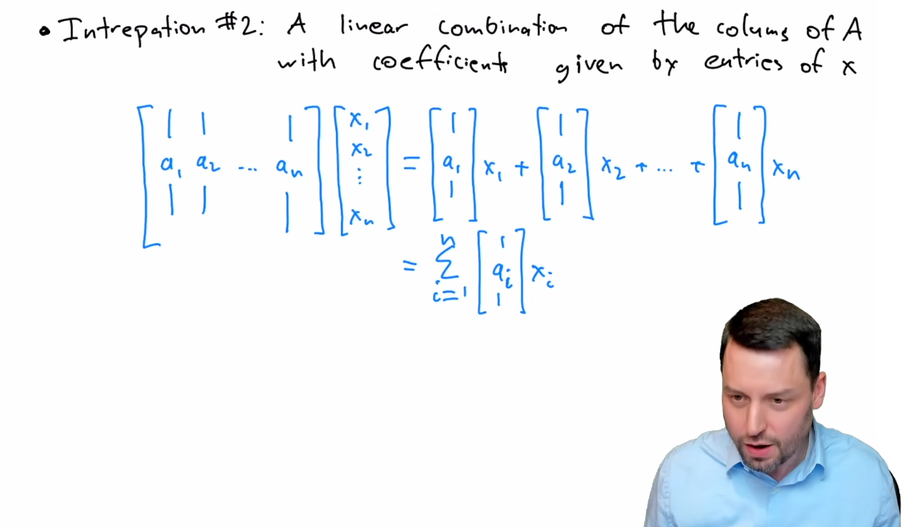

[TOC]

# Lec 2
**The supervised machine learning paradigm**

- The "usual" programming approach
  - Specification of the desired behavior
  - Think about logic that will achieve that behavior
  - Write program

- The ML approach
  - Examples of the desired behavior
  - ML Algorithm
  - Produced "program"

**Downstream tasks** are specific AI, NLP, or computer vision applications that utilize pre-trained foundational models to achieve a targeted goal

# Lec 3
**vector** : one dimensional of array
- addition
- inner product
- transpose

**matrix** : two dimensional of array
- addition
- matrix multiplication
- transpose

there is another intersting interpation of matrix-verctor interpation



- Properties of matrix multiplication  
  - Distributive: $A(B + C) = AB + AC$
  - Associative:  $(AB)C = A(BC) $
  - Not commutative: $ AB \neq BA $
  - Transpose of product: $ (AB)^T = B^TA^T $

# Lec 4
one intersting thing of this lecture is how the prof assign the W marix

the example use the MNIST traning set

```python
W = torch.zeros(10,784)
for i in range(10):
  # assign mean of training example of all the data
    W[i] = X_train[y_train==i].mean(dim=0)

y_pred = X_train @ W.T
(y_pred.argmax(dim=1) == y_train).float().mean()
```
```console
tensor(0.6233)
```

but when you normalize the W using `W[i] = W[i] / W[i].norm()`, the accuary of predicting 1 comes to 0.8216

# Lec 5
从“最大化似然”到“最小化负对数似然”

最大似然估计说：我们要选择模型参数，使得训练数据出现的概率最大。对单个样本，似然就是 \(P(\text{output}=y \mid \hat{y})\)。

最大化这个概率等价于 **最小化它的负对数**（因为负对数是单调递减函数）：

\[
-\log P(\text{output}=y \mid \hat{y})
\]

当概率接近1时，负对数接近0；当概率接近0时，负对数趋向无穷大。这正好是一个理想的损失函数：预测越准确，损失越小。

代入 Softmax 表达式，就得到：

\[
L_{CE} = -\log\left( \frac{e^{\hat{y}_y}}{\sum_j e^{\hat{y}_j}} \right)
\]

利用对数性质展开：

\[
-\log\left( \frac{e^{\hat{y}_y}}{\sum_j e^{\hat{y}_j}} \right)
= -\left[ \hat{y}_y - \log \sum_j e^{\hat{y}_j} \right]
= -\hat{y}_y + \log \sum_{j=1}^K e^{\hat{y}_j}
\]