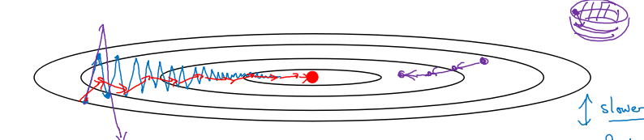

this note is made from coursera deep learning course, good reference note: [bighuang624/Andrew-Ng-Deep-Learning-notes](https://kyonhuang.top/Andrew-Ng-Deep-Learning-notes/#/)

[TOC]

# Week1
## cross validation
交叉验证的基本思想是重复地使用数据；把给定的数据进行切分，将切分的数据集组合为训练集与测试集，在此基础上反复地进行训练、测试以及模型选择。

## bias and variance
* **偏差**：度量了学习算法的期望预测与真实结果的偏离程度，即刻画了**学习算法本身的拟合能力**；
* **方差**：度量了同样大小的训练集的变动所导致的学习性能的变化，即刻画了**数据扰动所造成的影响**；
* **噪声**：表达了在当前任务上任何学习算法所能够达到的期望泛化误差的下界，即刻画了**学习问题本身的难度**。

存在高偏差：

* 扩大网络规模，如添加隐藏层或隐藏单元数目；
* 寻找合适的网络架构，使用更大的 NN 结构；
* 花费更长时间训练。

存在高方差：

* 获取更多的数据；
* 正则化（regularization）；
* 寻找更合适的网络结构。

## regularization

**正则化**是在成本函数中加入一个正则化项，惩罚模型的复杂度。正则化可以用于解决高方差的问题。

## Logistic regularization
$$J(w,b) = \frac{1}{m}\sum_{i=1}^mL(\hat{y}^{(i)},y^{(i)})+\frac{\lambda}{2m}{||w||}^2_2$$

* L2 正则化：$$\frac{\lambda}{2m}{||w||}^2_2 = \frac{\lambda}{2m}\sum_{j=1}^{n\_x}w^2_j = \frac{\lambda}{2m}w^Tw$$
* L1 正则化：$$\frac{\lambda}{2m}{||w||}_1 = \frac{\lambda}{2m}\sum_{j=1}^{n\_x}{|w\_j|}$$

其中，λ 为**正则化因子**，是**超参数**。

由于 L1 正则化最后得到 w 向量中将存在大量的 0，使模型变得稀疏化，因此 L2 正则化更加常用。

## regularization in neural network
对于神经网络，加入正则化的成本函数：

$$J(w^{[1]}, b^{[1]}, ..., w^{[L]}, b^{[L]}) = \frac{1}{m}\sum\_{i=1}^mL(\hat{y}^{(i)},y^{(i)})+\frac{\lambda}{2m}\sum\_{l=1}^L{{||w^{[l]}||}}^2\_F$$

因为 w 的大小为 ($n^{[l−1]}$, $n^{[l]}$)，因此

$${{||w^{[l]}||}}^2\_F = \sum^{n^{[l-1]}}\_{i=1}\sum^{n^{[l]}}\_{j=1}(w^{[l]}\_{ij})^2$$

该矩阵范数被称为**弗罗贝尼乌斯范数（Frobenius Norm）**，所以神经网络中的正则化项被称为弗罗贝尼乌斯范数矩阵。

## Dropout regularization
**dropout（随机失活）**是在神经网络的隐藏层为每个神经元结点设置一个随机消除的概率，保留下来的神经元形成一个结点较少、规模较小的网络用于训练。dropout 正则化较多地被使用在**计算机视觉（Computer Vision）**领域。

## Inverted dropout
Inverted dropout is an implementation of Dropout reglarization

```py
keep_prob = 0.8    # 设置神经元保留概率
dl = np.random.rand(al.shape[0], al.shape[1]) < keep_prob
al = np.multiply(al, dl)
al /= keep_prob
```

最后一步`al /= keep_prob`是因为 $a^{[l]}$中的一部分元素失活（相当于被归零），为了在下一层计算时不影响 $Z^{[l+1]} = W^{[l+1]}a^{[l]} + b^{[l+1]}$的期望值，因此除以一个`keep_prob`。

**注意**，在**测试阶段不要使用 dropout**，因为那样会使得预测结果变得随机。

## Dropout understanding
对于单个神经元，其工作是接收输入并产生一些有意义的输出。但是加入了 dropout 后，输入的特征都存在被随机清除的可能，所以该神经元不会再特别依赖于任何一个输入特征，即不会给任何一个输入特征设置太大的权重。

因此，通过传播过程，dropout 将产生和 L2 正则化相同的**收缩权重**的效果。

对于不同的层，设置的`keep_prob`也不同。一般来说，神经元较少的层，会设`keep_prob`为 1.0，而神经元多的层则会设置比较小的`keep_prob`。

dropout 的一大**缺点**是成本函数无法被明确定义。因为每次迭代都会随机消除一些神经元结点的影响，因此无法确保成本函数单调递减。因此，使用 dropout 时，先将`keep_prob`全部设置为 1.0 后运行代码，确保 $J(w, b)$函数单调递减，再打开 dropout。

## Other regularization
* 数据扩增（Data Augmentation）：通过图片的一些变换（翻转，局部放大后切割等），得到更多的训练集和验证集。
* 早停止法（Early Stopping）：将训练集和验证集进行梯度下降时的成本变化曲线画在同一个坐标轴内，当训练集误差降低但验证集误差升高，两者开始发生较大偏差时及时停止迭代，并返回具有最小验证集误差的连接权和阈值，以避免过拟合。这种方法的缺点是无法同时达成偏差和方差的最优。

## Normalize input
$$x = \frac{x - \mu}{\sigma}$$

其中，

$$\mu = \frac{1}{m}\sum^m_{i=1}x^{(i)}$$

$$\sigma = \sqrt{\frac{1}{m}\sum^m_{i=1}x^{{(i)}^2}}$$

使用标准化前后，成本函数的形状有较大差别, 能够减少迭代的次数。

## Vanishing/exploding gradients
在梯度函数上出现的以指数级递增或者递减的情况分别称为**梯度爆炸**或者**梯度消失**, 这是训练深层神经网络的一个障碍.

假定 $g(z) = z, b^{[l]} = 0$，对于目标输出有：

$$\hat{y} = W^{[L]}W^{[L-1]}...W^{[2]}W^{[1]}X$$

* 对于 $W^{[l]}$的值大于 1 的情况，激活函数的值将以指数级递增；
* 对于 $W^{[l]}$的值小于 1 的情况，激活函数的值将以指数级递减。

对于导数同理。因此，在计算梯度时，根据不同情况梯度函数会以指数级递增或递减，导致训练导数难度上升，梯度下降算法的步长会变得非常小，需要训练的时间将会非常长。

### careful random initlization
a partial solution to vanishing/exploding gradients

根据

$$z={w}_1{x}\_1+{w}\_2{x}\_2 + ... + {w}\_n{x}\_n + b$$

可知，当输入的数量 n 较大时，我们希望每个 wi 的值都小一些，这样它们的和得到的 z 也较小。

为了得到较小的 wi，设置`Var(wi)=1/n`，这里称为 **Xavier initialization**。

```py
WL = np.random.randn(WL.shape[0], WL.shape[1]) * np.sqrt(1/n)
```

其中 n 是输入的神经元个数，即`WL.shape[1]`。

这样，激活函数的输入 x 近似设置成均值为 0，标准方差为 1，神经元输出 z 的方差就正则化到 1 了。虽然没有解决梯度消失和爆炸的问题，但其在一定程度上确实减缓了梯度消失和爆炸的速度。

同理，也有 **He Initialization**。它和  Xavier initialization 唯一的区别是`Var(wi)=2/n`，适用于 **ReLU** 作为激活函数时。

当激活函数使用 ReLU 时，`Var(wi)=2/n`；当激活函数使用 tanh 时，`Var(wi)=1/n`。

## Gradient checking 
use gradient checking to check wheather the implementation of backward propagation is correct

使用双边误差的方法去逼近导数，精度要高于单边误差。

$$f'(\theta) = {\lim_{\varepsilon\to 0}} = \frac{f(\theta + \varepsilon) - (\theta - \varepsilon)}{2\varepsilon}$$

将 $W^{[1]}$，$b^{[1]}$，...，$W^{[L]}$，$b^{[L]}$全部连接出来，成为一个巨型向量 θ。这样，

$$J(W^{[1]}, b^{[1]}, ..., W^{[L]}，b^{[L]}) = J(\theta)$$

同时，对 $dW^{[1]}$，$db^{[1]}$，...，$dW^{[L]}$，$db^{[L]}$执行同样的操作得到巨型向量 dθ，它和 θ 有同样的维度。

$$J(dW^{[1]}, db^{[1]}, ..., dW^{[L]}，db^{[L]}) = J(\theta)$$

求得一个梯度逼近值

$$d\theta_{approx}[i] ＝ \frac{J(\theta_1, \theta_2, ..., \theta_i+\varepsilon, ...) - J(\theta_1, \theta_2, ..., \theta_i-\varepsilon, ...)}{2\varepsilon}$$

应该

$$\approx{d\theta[i]} = \frac{\partial J}{\partial \theta_i}$$

因此，我们用梯度检验值是否小于某个阈值，一般是 $10^{-7}$

$$\frac{{||d\theta_{approx} - d\theta||}_2}{{||d\theta_{approx}||}_2+{||d\theta||}_2}$$

检验反向传播的实施是否正确。其中，

$${||x||}_2 = \sum^N_{i=1}{|x_i|}^2$$

表示向量 x 的 2-范数（也称“欧几里德范数”）。

如果梯度检验值和 ε 的值相近，说明神经网络的实施是正确的，否则要去检查代码是否存在 bug。

## Gradient checking implementation notes
- Don’t use in training – only to debug
- If algorithm fails grad check, look at components to try to identify bug.
- Remember regularization.
- Doesn’t work with dropout.
- Run at random initialization; perhaps again after some training.

# Week2
## Mini-batch gradient descent
**batch 梯度下降法**（批梯度下降法，我们之前一直使用的梯度下降法）是最常用的梯度下降形式，即同时处理整个训练集。其在更新参数时使用所有的样本来进行更新。

每次处理训练数据的一部分即进行梯度下降法，则我们的算法速度会执行的更快。而处理的这些一小部分训练子集即称为 **mini-batch**。

### Mini-batch size influence
* mini-batch 的大小为 1，即是**随机梯度下降法（stochastic gradient descent）**，每个样本都是独立的 mini-batch；
* mini-batch 的大小为 m（数据集大小），即是 batch 梯度下降法；

---

* 随机梯度下降法：
    * 对每一个训练样本执行一次梯度下降，训练速度快，但**丢失了向量化带来的计算加速**；
    * 有很多噪声，减小学习率可以适当；
    * 成本函数总体趋势向全局最小值靠近，但永远不会收敛，而是一直在最小值附近波动。

因此，选择一个`1 < size < m`的合适的大小进行 Mini-batch 梯度下降，可以实现快速学习，也应用了向量化带来的好处，且成本函数的下降处于前两者之间。

### Size choices
* 如果训练样本的大小比较小，如 m ⩽ 2000 时，选择 batch 梯度下降法；
* 如果训练样本的大小比较大，选择 Mini-Batch 梯度下降法。为了和计算机的信息存储方式相适应，代码在 mini-batch 大小为 2 的幂次时运行要快一些。典型的大小为 $2^6$、$2^7$、...、$2^9$；
* mini-batch 的大小要符合 CPU/GPU 内存。

mini-batch 的大小也是一个重要的 **超变量** ，需要根据经验快速尝试，找到能够最有效地减少成本函数的值。

### Mini-batch usage
1. 将数据集打乱；
2. 按照既定的大小分割数据集；

打乱数据集的代码如下：

```py
m = X.shape[1] 
permutation = list(np.random.permutation(m))
shuffled_X = X[:, permutation]
shuffled_Y = Y[:, permutation].reshape((1,m))
```
## Gradient Descent with Momentum
**指数加权平均(Exponentially Weight Average)** 是一种常用的序列数据处理方式，我们可以利用它来进行 **动量梯度下降(Gradient Descent with Momentum)** , 下面先介绍它的概念
### Exponentially Weight Average

$$
S_t = 
\begin{cases} 
Y_1, &t = 1 \\\\ 
\beta S_{t-1} + (1-\beta)Y_t, &t > 1 
\end{cases}
$$

其中 $Y_t$ 为 t 下的实际值，$S_t$ 为 t 下加权平均后的值，β 为权重值。

当 β 为 0.9 时，

$$v_{100} = 0.9v_{99} + 0.1 \theta_{100}$$

$$v_{99} = 0.9v_{98} + 0.1 \theta_{99}$$

$$v_{98} = 0.9v_{97} + 0.1 \theta_{98}$$

$$...$$

展开：

$$v_{100} = 0.1 \theta_{100} + 0.1 * 0.9 \theta_{99} + 0.1 * {(0.9)}^2 \theta_{98} + ...$$

根据函数极限的一条定理：

$${\lim_{\beta\to 0}}(1 - \beta)^{\frac{1}{\beta}} = \frac{1}{e} \approx 0.368$$

记得:

$$v_t = \beta v_{t-1} + (1 - \beta)\theta_t$$

考虑到代码，只需要不断更新 v 即可：

$$v := \beta v + (1 - \beta)\theta_t$$

当 β 为 0.9 时，可以当作把过去 10 天的气温指数加权平均作为当日的气温，因为 10 天后权重已经下降到了当天的 1/3 左右。同理，当 β 为 0.98 时，可以把过去 50 天的气温指数加权平均作为当日的气温。

指数平均加权并**不是最精准**的计算平均数的方法，你可以直接计算过去 10 天或 50 天的平均值来得到更好的估计，但缺点是保存数据需要占用更多内存，执行更加复杂，计算成本更加高昂。

指数加权平均数公式的好处之一在于它只需要一行代码，且占用极少内存，因此**效率极高，且节省成本**。

### Bias correction in exponentially weighted average
偏差修正在前期学习可以帮助更好的预测数据, 让我们的计算值更准确

我们通常有

$$v_0 = 0$$
$$v_1 = 0.98v_0 + 0.02\theta_1$$

因此，$v_1$ 仅为第一个数据的 0.02（或者说 1-β），显然不准确。往后递推同理。

因此，我们修改公式为

$$v_t = \frac{\beta v_{t-1} + (1 - \beta)\theta_t}{{1-\beta^t}}$$

随着 t 的增大，β 的 t 次方趋近于 0。因此当 t 很大的时候，偏差修正几乎没有作用，但是在前期学习可以帮助更好的预测数据。在实际过程中，一般会忽略前期偏差的影响。

### Gradient Descent with Momentum introduction
**动量梯度下降（Gradient Descent with Momentum）**是计算梯度的指数加权平均数，并利用该值来更新参数值。具体过程为：

for l = 1, .. , L：

$$v_{dW^{[l]}} = \beta v_{dW^{[l]}} + (1 - \beta) dW^{[l]}$$
$$v_{db^{[l]}} = \beta v_{db^{[l]}} + (1 - \beta) db^{[l]}$$
$$W^{[l]} := W^{[l]} - \alpha v_{dW^{[l]}}$$
$$b^{[l]} := b^{[l]} - \alpha v_{db^{[l]}}$$



进行一般的梯度下降将会得到图中的蓝色曲线，由于存在上下波动，减缓了梯度下降的速度，因此只能使用一个较小的学习率进行迭代。如果用较大的学习率，结果可能会像紫色曲线一样偏离函数的范围。

而使用动量梯度下降时，通过累加过去的梯度值来减少抵达最小值路径上的波动，加速了收敛，因此在横轴方向下降得更快，从而得到图中红色的曲线。

当前后梯度方向一致时，动量梯度下降能够加速学习；而前后梯度方向不一致时，动量梯度下降能够抑制震荡。

另外，在 10 次迭代之后，移动平均已经不再是一个具有偏差的预测。因此实际在使用梯度下降法或者动量梯度下降法时，不会同时进行偏差修正。

## RMSprop

**RMSProp（Root Mean Square Propagation，均方根传播）**算法是在对梯度进行指数加权平均的基础上，引入平方和平方根。具体过程为（省略了 l）：

$$s_{dw} = \beta s_{dw} + (1 - \beta)(dw)^2$$
$$s_{db} = \beta s_{db} + (1 - \beta)(db)^2$$
$$w := w - \alpha \frac{dw}{\sqrt{s_{dw} + \epsilon}}$$
$$b := b - \alpha \frac{db}{\sqrt{s_{db} + \epsilon}}$$

其中，ϵ 是一个实际操作时加上的较小数（例如 $10^{-8}$ ），为了防止分母太小而导致的数值不稳定。

如下图所示，蓝色轨迹代表初始的移动，可以看到在 b 方向上走得比较陡峭（即$db$较大），相比起来$dw$较小，这影响了优化速度。因此，在采用 RMSProp 算法后，由于$(dw)^2$较小、$(db)^2$较大，进而 $s_{dw}$也会较小、$s_{db}$也会较大，最终使得

$$\frac{dw}{\sqrt{s_{dw} + \epsilon}}$$

较大，而

$$\frac{db}{\sqrt{s_{db} + \epsilon}}$$

较小。后面的更新就会像绿色轨迹一样，明显好于蓝色的更新曲线。RMSProp 减小某些维度梯度更新波动较大的情况，使下降速度变得更快。


RMSProp 有助于减少抵达最小值路径上的摆动，并允许使用一个更大的学习率 α，从而加快算法学习速度。并且，它和 Adam 优化算法已被证明适用于不同的深度学习网络结构。

注意，β 也是一个超参数。

## Adam
**Adam 优化算法（Adaptive Moment Estimation，自适应矩估计）** 基本上就是将 Momentum 和 RMSProp 算法结合在一起，通常有超越二者单独时的效果。具体过程如下（省略了 l）：

首先进行初始化：

$$v_{dW} = 0, s_{dW} = 0, v_{db} = 0, s_{db} = 0$$

用每一个 mini-batch 计算 dW、db，第 t 次迭代时：

$$v_{dW} = \beta\_1 v_{dW} + (1 - \beta_1) dW$$
$$v_{db} = \beta\_1 v_{db} + (1 - \beta_1) db$$
$$s_{dW} = \beta\_2 s_{dW} + (1 - \beta_2) {(dW)}^2$$
$$s_{db} = \beta\_2 s_{db} + (1 - \beta_2) {(db)}^2$$

一般使用 Adam 算法时需要计算偏差修正：

$$v^{corrected}_{dW} = \frac{v\_{dW}}{1-{\beta_1}^t}$$
$$v^{corrected}_{db} = \frac{v\_{db}}{1-{\beta_1}^t}$$
$$s^{corrected}_{dW} = \frac{s\_{dW}}{1-{\beta_2}^t}$$
$$s^{corrected}_{db} = \frac{s\_{db}}{1-{\beta_2}^t}$$

所以，更新 W、b 时有：

$$W := W - \alpha \frac{v^{corrected}_{dW}}{{\sqrt{s^{corrected}_{dW}} + \epsilon}}$$

$$b := b - \alpha \frac{v^{corrected}_{db}}{{\sqrt{s^{corrected}_{db}} + \epsilon}}$$

## Learning rate decay

如果设置一个固定的学习率 α，在最小值点附近，由于不同的 batch 中存在一定的噪声，因此不会精确收敛，而是始终在最小值周围一个较大的范围内波动。

而如果随着时间慢慢减少学习率 α 的大小，在初期 α 较大时，下降的步长较大，能以较快的速度进行梯度下降；而后期逐步减小 α 的值，即减小步长，有助于算法的收敛，更容易接近最优解。

最常用的学习率衰减方法：

$$\alpha = \frac{1}{1 + decay_rate * epoch\_num} * \alpha_0$$

其中，`decay_rate`为衰减率（超参数），`epoch_num`为将所有的训练样本完整过一遍的次数。

* 指数衰减：

$$\alpha = 0.95^{epoch\_num} * \alpha_0$$

* 其他：

$$\alpha = \frac{k}{\sqrt{epoch\_num}} * \alpha_0$$

* 离散下降

对于较小的模型，也有人会在训练时根据进度手动调小学习率。

## saddle
**鞍点（saddle）**是函数上的导数为零，但不是轴上局部极值的点。

结论：

* 在训练较大的神经网络、存在大量参数，并且成本函数被定义在较高的维度空间时，困在极差的局部最优中是不大可能的；
* 鞍点附近的平稳段会使得学习非常缓慢，而这也是动量梯度下降法、RMSProp 以及 Adam 优化算法能够加速学习的原因，它们能帮助尽早走出平稳段。

# Week3
## Hyperparameter tunning
目前已经讲到过的超参数中，重要程度依次是：
* **最重要**：
    * 学习率 α；
* **其次重要**：
    * β：动量衰减参数，常设置为 0.9；
    * #hidden units：各隐藏层神经元个数；
    * mini-batch 的大小；
* **再次重要**：
    * β1，β2，ϵ：Adam 优化算法的超参数，常设为 0.9、0.999、$10^{-8}$；
    * #layers：神经网络层数;
    * decay_rate：学习衰减率；

---

系统地组织超参调试过程的技巧：

* **随机选择**点（而非均匀选取），用这些点实验超参数的效果。这样做的原因是我们提前很难知道超参数的重要程度，可以通过选择更多值来进行更多实验；
* 由粗糙到精细：聚焦效果不错的点组成的小区域，在其中更密集地取值，以此类推；

* 对于学习率 α，用**对数标尺**而非线性轴更加合理：0.0001、0.001、0.01、0.1 等，然后在这些刻度之间再随机均匀取值；
* 对于 β，取 0.9 就相当于在 10 个值中计算平均值，而取 0.999 就相当于在 1000 个值中计算平均值。可以考虑给 1-β 取值，这样就和取学习率类似了。

上述操作的原因是当 β 接近 1 时，即使 β 只有微小的改变，所得结果的灵敏度会有较大的变化。例如，β 从 0.9 增加到 0.9005 对结果（1/(1-β)）几乎没有影响，而 β 从 0.999 到 0.9995 对结果的影响巨大（从 1000 个值中计算平均值变为 2000 个值中计算平均值）。

## Batch Normalization

**批标准化（Batch Normalization，经常简称为 BN）** 会使参数搜索问题变得很容易，使神经网络对超参数的选择更加稳定，超参数的范围会更庞大，工作效果也很好，也会使训练更容易。

之前，我们对输入特征 X 使用了标准化处理。我们也可以用同样的思路处理**隐藏层**的激活值 $a^{[l]}$，以加速 $W^{[l+1]}$和 $b^{[l+1]}$的训练。在**实践**中，经常选择标准化 $Z^{[l]}$：

$$\mu = \frac{1}{m} \sum_i z^{(i)}$$
$$\sigma^2 = \frac{1}{m} \sum_i {(z_i - \mu)}^2$$
$$z_{norm}^{(i)} = \frac{z^{(i)} - \mu}{\sqrt{\sigma^2 + \epsilon}}$$

其中，m 是单个 mini-batch 所包含的样本个数，ϵ 是为了防止分母为零，通常取 $10^{-8}$。

这样，我们使得所有的输入 $z^{(i)}$均值为 0，方差为 1。但我们不想让隐藏层单元总是含有平均值 0 和方差 1，也许隐藏层单元有了不同的分布会更有意义。因此，我们计算

$$\tilde z^{(i)} = \gamma z^{(i)}_{norm} + \beta$$

其中，γ 和 β 都是模型的学习参数，所以可以用各种梯度下降算法来更新 γ 和 β 的值，如同更新神经网络的权重一样。

通过对 γ 和 β 的合理设置，可以让 $\tilde z^{(i)}$的均值和方差为任意值。这样，我们对隐藏层的 $z^{(i)}$进行标准化处理，用得到的 $\tilde z^{(i)}$替代 $z^{(i)}$。

**设置 γ 和 β 的原因**是，如果各隐藏层的输入均值在靠近 0 的区域，即处于激活函数的线性区域，不利于训练非线性神经网络，从而得到效果较差的模型。因此，需要用 γ 和 β 对标准化后的结果做进一步处理。

### BN understanding

Batch Normalization 效果很好的原因有以下两点：

1. 通过对隐藏层各神经元的输入做类似的标准化处理，提高神经网络训练速度；
2. 可以使前面层的权重变化对后面层造成的影响减小，整体网络更加健壮。

即使输入的值改变了，由于 Batch Normalization 的作用，使得均值和方差保持不变（由 γ 和 β 决定），限制了在前层的参数更新对数值分布的影响程度，因此后层的学习变得更容易一些。Batch Normalization 减少了各层 W 和 b 之间的耦合性，让各层更加独立，实现自我训练学习的效果。

另外，Batch Normalization 也**起到微弱的正则化**（regularization）效果。因为在每个 mini-batch 而非整个数据集上计算均值和方差，只由这一小部分数据估计得出的均值和方差会有一些噪声，因此最终计算出的 $\tilde z^{(i)}$也有一定噪声。类似于 dropout，这种噪声会使得神经元不会再特别依赖于任何一个输入特征。

因为 Batch Normalization 只有微弱的正则化效果，因此可以和 dropout 一起使用，以获得更强大的正则化效果。通过应用更大的 mini-batch 大小，可以减少噪声，从而减少这种正则化效果。

最后，不要将 Batch Normalization 作为正则化的手段，而是 **当作加速学习** 的方式。正则化只是一种非期望的副作用，Batch Normalization 解决的还是反向传播过程中的 **梯度问题（梯度消失和爆炸）** 。

## Softmax regression
对于**多分类问题**，用 C 表示种类个数，则神经网络输出层，也就是第 L 层的单元数量 $n^{[L]} = C$。每个神经元的输出依次对应属于该类的概率，即 $P(y = c|x), c = 0, 1, .., C-1$

对于 Softmax 回归模型的输出层，即第 L 层，有：

$$Z^{[L]} = W^{[L]}a^{[L-1]} + b^{[L]}$$

for i in range(L)，有：

$$a^{[L]}_i = \frac{e^{Z^{[L]}_i}}{\sum^C_{i=1}e^{Z^{[L]}_i}}$$

为输出层每个神经元的输出，对应属于该类的概率，满足：

$$\sum^C_{i=1}a^{[L]}_i = 1$$

定义**损失函数**为：

$$L(\hat y, y) = -\sum^C_{j=1}y_jlog\hat y_j$$

当 i 为样本真实类别，则有：

$$y_j = 0, j \ne i$$

因此，损失函数可以简化为：

$$L(\hat y, y) = -y_ilog\hat y_i = - log \hat y_i$$

所有 m 个样本的**成本函数**为：

$$J = \frac{1}{m}\sum^m_{i=1}L(\hat y, y)$$

### Softmax gradient descent

多分类的 Softmax 回归模型与二分类的 Logistic 回归模型只有输出层上有一点区别。经过不太一样的推导过程，仍有

$$dZ^{[L]} = A^{[L]} - Y$$

反向传播过程的其他步骤也和 Logistic 回归的一致。