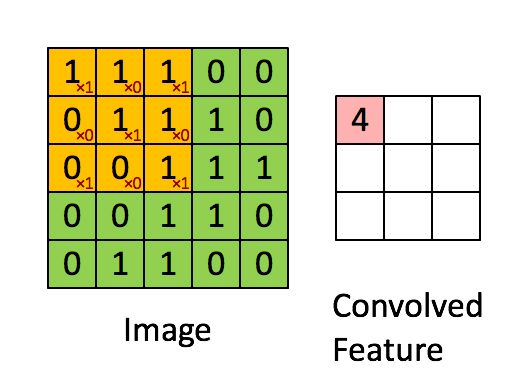
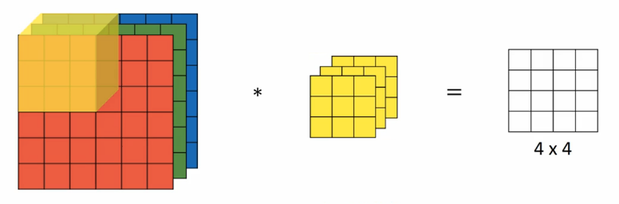
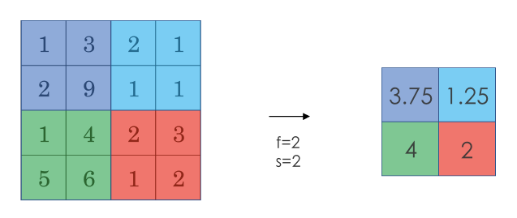
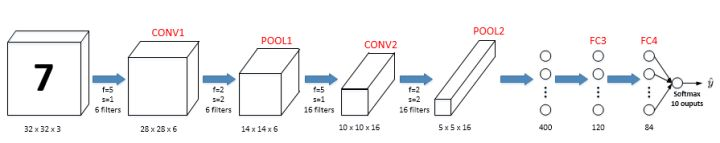
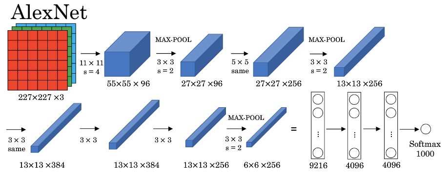
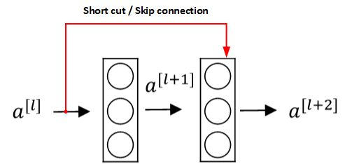
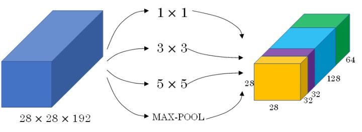
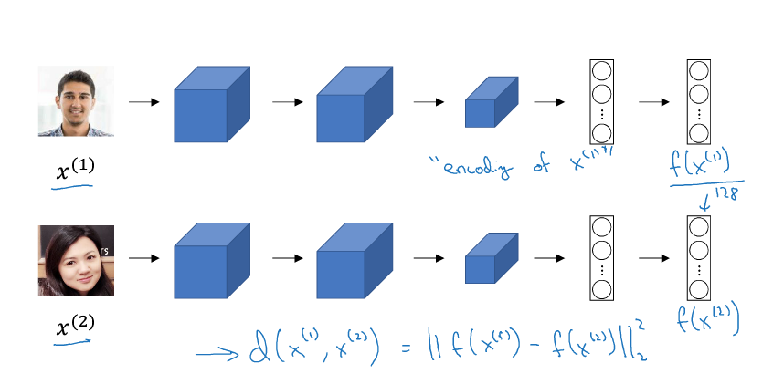
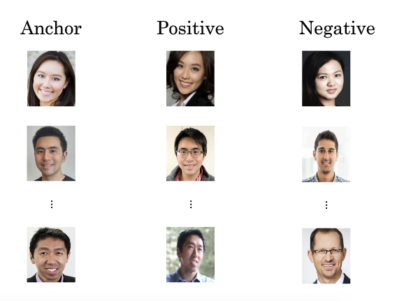

this note is made from coursera deep learning course, good reference note: [bighuang624/Andrew-Ng-Deep-Learning-notes](https://kyonhuang.top/Andrew-Ng-Deep-Learning-notes/#/)

[TOC]

# Week1
## Computer vision introduction
computer problems
* Image classification : 图片分类
* Object detection : 目标检测
* Neural Style Transfer : 神经风格转换

the challenge is the input image is very large, one solution is to use **Convolutional neural netorwk** (CNN)

## Edge detection
**Convolutional Operation** is the basis of component of convolutional neural network

two mainly type of edge detection
* Vertical edges
* Horizontal edges

a dynamic example of convolutional operation as follow: 

卷积操作的 API：
* 在 Python 中，卷积用`conv_forward()`表示；
* 在 Tensorflow 中，卷积用`tf.nn.conv2d()`表示；
* 在 keras 中，卷积用`Conv2D()`表示。

### filter
typical filter
- Sobel filter
- Scharr filter

滤波器中的值还可以设置为 **参数** ，通过模型训练来得到。这样，神经网络使用反向传播算法可以学习到一些低级特征，从而实现对图片所有边缘特征的检测, 这是一个很强大的想法

### padding
假设输入图片的大小为 $n \times n$，而滤波器的大小为 $f \times f$，则卷积后的输出图片大小为 $(n-f+1) \times (n-f+1)$。

the problem without padding
* shrinking output
* throw away info from edge of input

use padding to pad zeros to extend the original image

设每个方向扩展像素点数量为 $p$，则填充后原始图片的大小为 $(n+2p) \times (n+2p)$，滤波器大小保持 $f \times f$不变，则输出图片大小为 $(n+2p-f+1) \times (n+2p-f+1)$。

typical convolution
- Valid convolution: no padding, output size is $(n-f+1) \times (n-f+1)$;
- Same convolution: padding to make the output size to be the same as input size,  $p = \frac{f-1}{2}$ .

在计算机视觉领域，$f$通常为奇数。原因包括 Same 卷积中 $p = \frac{f-1}{2}$能得到自然数结果，并且滤波器有一个便于表示其所在位置的中心点。

### strided convolutions
设置**步长（Stride）** 来压缩一部分信息

设步长为 $s$，填充长度为 $p$，输入图片大小为 $n \times n$，滤波器大小为 $f \times f$，则卷积后图片的尺寸为：

$$\biggl\lfloor \frac{n+2p-f}{s}+1   \biggr\rfloor \times \biggl\lfloor \frac{n+2p-f}{s}+1 \biggr\rfloor$$

目前为止我们学习的“卷积”实际上被称为**互相关（cross-correlation）**，而非数学意义上的卷积。真正的卷积操作在做元素乘积求和之前，要将滤波器沿水平和垂直轴翻转（相当于旋转 180 度）。因为这种翻转对一般为水平或垂直对称的滤波器影响不大，按照机器学习的惯例，我们通常不进行翻转操作，在简化代码的同时使神经网络能够正常工作。

## Convolution over volumes
三维卷积的图示如下

如果想同时检测垂直和水平边缘，或者更多的边缘检测，可以增加更多的滤波器组。例如设置第一个滤波器组实现垂直边缘检测，第二个滤波器组实现水平边缘检测。设输入图片的尺寸为 $n \times n \times n\_c$（$n\_c$为通道数），滤波器尺寸为 $f \times f \times n_c$，则卷积后的输出图片尺寸为 $(n-f+1) \times (n-f+1) \times n'_c$，$n'_c$为滤波器组的个数。

对于一个 3x3x3 的滤波器，包括偏移量 $b$在内共有 28 个参数。不论输入的图片有多大，用这一个滤波器来提取特征时，参数始终都是 28 个，固定不变。即**选定滤波器组后，参数的数目与输入图片的尺寸无关**

因此，卷积神经网络的参数相较于标准神经网络来说要少得多。这是 CNN 的优点之一。

## Notation
设 $l$ 层为卷积层：

* $f^{[l]}$：**滤波器的高（或宽）**
* $p^{[l]}$：**填充长度**
* $s^{[l]}$：**步长**
* $n^{[l]}_c$：**滤波器组的数量**

* **输入维度**：$n^{[l-1]}_H \times n^{[l-1]}_W \times n^{[l-1]}_c$ 。其中 $n^{[l-1]}_H$表示输入图片的高，$n^{[l-1]}_W$表示输入图片的宽。之前的示例中输入图片的高和宽都相同，但是实际中也可能不同，因此加上下标予以区分。

* **输出维度**：$n^{[l]}_H \times n^{[l]}_W \times n^{[l]}_c$ 。其中

$$n^{[l]}_H = \biggl\lfloor \frac{n^{[l-1]}_H+2p^{[l]}-f^{[l]}}{s^{[l]}}+1   \biggr\rfloor$$

$$n^{[l]}_W = \biggl\lfloor \frac{n^{[l-1]}_W+2p^{[l]}-f^{[l]}}{s^{[l]}}+1   \biggr\rfloor$$

* **每个滤波器组的维度**：$f^{[l]} \times f^{[l]} \times n^{[l-1]}_c$ 。其中$n^{[l-1]}_c$ 为输入图片通道数（也称深度）。
* **权重维度**：$f^{[l]} \times f^{[l]} \times n^{[l-1]}_c \times n^{[l]}_c$
* **偏置维度**：$1 \times 1 \times 1 \times n^{[l]}_c$

## Convolutional neural netowrk architecture
随着神经网络计算深度不断加深，图片的高度和宽度 $n^{[l]}_H $、$n^{[l]}_W$一般逐渐减小，而 $n^{[l]}_c$在增加。

a typical convolutional neural network contains three parts
- Convolution layer : 卷积层
- Pooling layer : 池化层
- Fully Connected layer : 全连接层

## Pooling layer
**池化层** 的作用是缩减模型的大小，提高计算速度，同时减小噪声提高所提取特征的稳健性。

max pooling

avarage pooling

Hyperparameters
- f: filter size
- s: stride
- Max or avarage pooling

input dimensions:

$$n_H \times n_W \times n_c$$

output dimensions：

$$\biggl\lfloor \frac{n_H-f}{s}+1   \biggr\rfloor \times \biggl\lfloor \frac{n_W-f}{s}+1   \biggr\rfloor \times n_c$$

## Convolutional neural network example

FC3 和 FC4 为全连接层，与标准的神经网络结构一致.

|| Activation shape | Activation Size | #parameters|
|:--- | :--- | :--- | :--- |
|**Input:** | (32, 32, 3) | 3072 | 0
|**CONV1(f=5, s=1)** | (28, 28, 6) | 4704 | 158
|**POOL1** | (14, 14, 6) | 1176 | 0
|**CONV2(f=5, s=1)** | (10, 10, 16) | 1600 | 416
|**POOL2** | (5, 5, 16) | 400 | 0
|**FC3** | (120, 1) | 120 | 48120
|**FC4** | (84, 1) | 84 | 10164
|**Softmax** | (10, 1) | 10 | 850

## CNN advantages

相比标准神经网络，对于大量的输入数据，卷积过程有效地减少了 CNN 的参数数量，原因有以下两点：

* **参数共享（Parameter sharing）** ：特征检测如果适用于图片的某个区域，那么它也可能适用于图片的其他区域。即在卷积过程中，不管输入有多大，一个特征探测器（滤波器）就能对整个输入的某一特征进行探测。
* **稀疏连接（Sparsity of connections）** ：在每一层中，由于滤波器的尺寸限制，输入和输出之间的连接是稀疏的，每个输出值只取决于输入在局部的一小部分值。

池化过程则在卷积后很好地聚合了特征，通过降维来减少运算量。

由于 CNN 参数数量较小，所需的训练样本就相对较少，因此在一定程度上不容易发生过拟合现象。并且 CNN 比较擅长捕捉区域位置偏移。即进行物体检测时，不太受物体在图片中位置的影响，增加检测的准确性和系统的健壮性。

# Week2
## Outline
classic networks
- LeNet-5
- AlexNet
- VGG

ResNet (Residual Network，残差网络)

Inception Neural network

## Classic networks
### LeNet-5
refernce note is good enough to cover all the details

特点：

* LeNet-5 针对灰度图像而训练，因此输入图片的通道数为 1。
* 该模型总共包含了约 6 万个参数，远少于标准神经网络所需。
* 典型的 LeNet-5 结构包含卷积层（CONV layer），池化层（POOL layer）和全连接层（FC layer），排列顺序一般为 CONV layer->POOL layer->CONV layer->POOL layer->FC layer->FC layer->OUTPUT layer。一个或多个卷积层后面跟着一个池化层的模式至今仍十分常用。
* 当 LeNet-5模型被提出时，其池化层使用的是平均池化，而且各层激活函数一般选用 Sigmoid 和 tanh。现在，我们可以根据需要，做出改进，使用最大池化并选用 ReLU 作为激活函数。

### AlexNet

特点：

* AlexNet 模型与 LeNet-5 模型类似，但是更复杂，包含约 6000 万个参数。另外，AlexNet 模型使用了 ReLU 函数。
* 当用于训练图像和数据集时，AlexNet 能够处理非常相似的基本构造模块，这些模块往往包含大量的隐藏单元或数据。

### VGG

特点：

* VGG 又称 VGG-16 网络，“16”指网络中包含 16 个卷积层和全连接层。
* 超参数较少，只需要专注于构建卷积层。
* 结构不复杂且规整，在每一组卷积层进行滤波器翻倍操作。
* VGG 需要训练的特征数量巨大，包含多达约 1.38 亿个参数。

## ResNet
因为存在梯度消失和梯度爆炸问题，网络越深，就越难以训练成功。**残差网络（Residual Networks，简称为 ResNets）**可以有效解决这个问题。

上图的结构被称为**残差块（Residual block）**。通过**捷径（Short cut，或者称跳远连接，Skip connections）**可以将 $a^{[l]}$添加到第二个 ReLU 过程中，直接建立 $a^{[l]}$与 $a^{[l+2]}$之间的隔层联系。表达式如下：

$$z^{[l+1]} = W^{[l+1]}a^{[l]} + b^{[l+1]}$$

$$a^{[l+1]} = g(z^{[l+1]})$$

$$z^{[l+2]} = W^{[l+2]}a^{[l+1]} + b^{[l+2]}$$

$$a^{[l+2]} = g(z^{[l+2]} + a^{[l]})$$

构建一个残差网络就是将许多残差块堆积在一起，形成一个深度网络。

在理论上，随着网络深度的增加，性能应该越来越好。但实际上，对于一个普通网络，随着神经网络层数增加，训练错误会先减少，然后开始增多.

残差网络的训练效果显示，即使网络再深，其在训练集上的表现也会越来越好.

### Inituition
假设有一个大型神经网络，其输入为 $X$，输出为 $a^{[l]}$。给这个神经网络额外增加两层，输出为 $a^{[l+2]}$。将这两层看作一个具有跳远连接的残差块。为了方便说明，假设整个网络中都选用 ReLU 作为激活函数，因此输出的所有激活值都大于等于 0。

则有：

$$
\begin{equation}
\begin{split}
 a^{[l+2]} &= g(z^{[l+2]}+a^{[l]})  
     \\\ &= g(W^{[l+2]}a^{[l+1]}+b^{[l+2]}+a^{[l]})
\end{split}
\end{equation}
$$

当发生梯度消失时，$W^{[l+2]}\approx0$，$b^{[l+2]}\approx0$，则有：

$$a^{[l+2]} = g(a^{[l]}) = ReLU(a^{[l]}) = a^{[l]}$$

因此，这两层额外的残差块不会降低网络性能。而如果没有发生梯度消失时，训练得到的非线性关系会使得表现效果进一步提高。

注意，如果 $a^{[l]}$与 $a^{[l+2]}$的维度不同，需要引入矩阵 $W_s$与 $a^{[l]}$相乘，使得二者的维度相匹配。参数矩阵 $W_s$既可以通过模型训练得到，也可以作为固定值，仅使 $a^{[l]}$截断或者补零。

## 1x1 convolution
1x1 卷积（1x1 convolution，或称为 Network in Network）指滤波器的尺寸为 1。当通道数为 1 时，1x1 卷积意味着卷积操作等同于乘积操作。

而当通道数更多时，1x1 卷积的作用实际上类似全连接层的神经网络结构，从而降低（或升高，取决于滤波器组数）数据的维度。

池化能压缩数据的高度（$n_H$）及宽度（$n_W$），而 1×1 卷积能压缩数据的通道数（$n_C$）。在如下图所示的例子中，用 32 个大小为 1×1×192 的滤波器进行卷积，就能使原先数据包含的 192 个通道压缩为 32 个。

## Inception Network
在之前的卷积网络中，我们只能选择单一尺寸和类型的滤波器。而 **Inception 网络的作用**即是代替人工来确定卷积层中的滤波器尺寸与类型，或者确定是否需要创建卷积层或池化层。

Inception 网络选用不同尺寸的滤波器进行 Same 卷积，并将卷积和池化得到的输出组合拼接起来，最终让网络自己去学习需要的参数和采用的滤波器组合。

为了解决计算量大的问题，可以引入 1x1 卷积来减少其计算量,  1x1 的卷积层通常被称作 **瓶颈层（Bottleneck layer）**

多个 Inception 模块组成一个完整的 Inception 网络（被称为 GoogLeNet，以向 LeNet 致敬）

## Transfer learning
对于已训练好的卷积神经网络，可以将所有层都看作是**冻结的**，只需要训练与你的 Softmax 层有关的参数即可。大多数深度学习框架都允许用户指定是否训练特定层的权重。

而冻结的层由于不需要改变和训练，可以看作一个固定函数。可以将这个固定函数存入硬盘，以便后续使用，而不必每次再使用训练集进行训练了。

上述的做法适用于你只有一个较小的数据集。如果你有一个更大的数据集，应该冻结更少的层，然后训练后面的层。越多的数据意味着冻结越少的层，训练更多的层。如果有一个极大的数据集，你可以将开源的网络和它的权重整个当作初始化（代替随机初始化），然后训练整个网络。

## Data Augmentation
计算机视觉领域的应用都需要大量的数据

**数据扩增（Data Augmentation）** 利用现有的数据生成更多的数据

常用的数据扩增包括镜像翻转、随机裁剪、色彩转换。

## The state of computer vision
通常，学习算法有两种知识来源：

* 被标记的数据
* 手工工程

**手工工程（Hand-engineering，又称 hacks）**指精心设计的特性、网络体系结构或是系统的其他组件。手工工程是一项非常重要也比较困难的工作。在数据量不多的情况下，手工工程是获得良好表现的最佳方式。正因为数据量不能满足需要，历史上计算机视觉领域更多地依赖于手工工程。近几年数据量急剧增加，因此手工工程量大幅减少。

另外，在模型研究或者竞赛方面，有一些方法能够有助于提升神经网络模型的性能：

* 集成（Ensembling）：独立地训练几个神经网络，并平均输出它们的输出
* Multi-crop at test time：将数据扩增应用到测试集，对结果进行平均

但是由于这些方法计算和内存成本较大，一般不适用于构建实际的生产项目。

# Week3

目标检测是计算机视觉领域中一个新兴的应用方向，其任务是对输入图像进行分类的同时，检测图像中是否包含某些目标，并对他们准确定位并标识。

定位分类问题不仅要求判断出图片中物体的种类，还要在图片中标记出它的具体位置，用**边框（Bounding Box，或者称包围盒）**把物体圈起来。一般来说，定位分类问题通常只有一个较大的对象位于图片中间位置；而在目标检测问题中，图片可以含有多个对象，甚至单张图片中会有多个不同分类的对象。

为了定位图片中汽车的位置，可以让神经网络多输出 4 个数字，标记为 $b_x$、$b_y$、$b_h$、$b_w$。将图片左上角标记为 (0, 0)，右下角标记为 (1, 1)，则有：

* 红色方框的中心点：($b_x$，$b_y$)
* 边界框的高度：$b_h$
* 边界框的宽度：$b_w$

因此，训练集不仅包含对象分类标签，还包含表示边界框的四个数字。定义目标标签 Y 如下：

$$\left[\begin{matrix}P_c\\\ b_x\\\ b_y\\\ b_h\\\ b_w\\\ c_1\\\ c_2\\\ c_3\end{matrix}\right]$$

则有：

$$P\_c=1, Y = \left[\begin{matrix}1\\\ b_x\\\ b_y\\\ b_h\\\ b_w\\\ c_1\\\ c_2\\\ c_3\end{matrix}\right]
$$

其中，$c\_n$表示存在第 $n$个种类的概率；如果 $P\_c=0$，表示没有检测到目标，则输出标签后面的 7 个参数都是无效的，可以忽略（用 ? 来表示）。

$$P\_c=0, Y = \left[\begin{matrix}0\\\ ?\\\ ?\\\ ?\\\ ?\\\ ?\\\ ?\\\ ?\end{matrix}\right]$$

损失函数可以表示为 $L(\hat y, y)$，如果使用平方误差形式，对于不同的 $P\_c$有不同的损失函数（注意下标 $i$指标签的第 $i$个值）：

1. $P_c=1$，即$y_1=1$：

    $L(\hat y,y)=(\hat y_1-y_1)^2+(\hat y_2-y_2)^2+\cdots+(\hat y_8-y_8)^2$

2. $P_c=0$，即$y_1=0$：

    $L(\hat y,y)=(\hat y_1-y_1)^2$

除了使用平方误差，也可以使用逻辑回归损失函数，类标签 $c_1,c_2,c_3$ 也可以通过 softmax 输出。相比较而言，平方误差已经能够取得比较好的效果。

## Object detection
想要实现目标检测，可以采用**基于滑动窗口的目标检测（Sliding Windows Detection）**算法。该算法的步骤如下：

1. 训练集上搜集相应的各种目标图片和非目标图片，样本图片要求尺寸较小，相应目标居于图片中心位置并基本占据整张图片。
2. 使用训练集构建 CNN 模型，使得模型有较高的识别率。
3. 选择大小适宜的窗口与合适的固定步幅，对测试图片进行从左到右、从上倒下的滑动遍历。每个窗口区域使用已经训练好的 CNN 模型进行识别判断。
4. 可以选择更大的窗口，然后重复第三步的操作。

滑动窗口目标检测的**优点**是原理简单，且不需要人为选定目标区域；**缺点**是需要人为直观设定滑动窗口的大小和步幅。滑动窗口过小或过大，步幅过大均会降低目标检测的正确率。

滑动窗口目标检测算法虽然简单，但是性能不佳，效率较低。每次滑动都要进行一次 CNN 网络计算，如果滑动窗口和步幅较小，计算成本往往很大。

## Sliding window with convolutional implementation
在卷积层上应用滑动窗口目标检测算法可以提高运行速度。

将全连接层换成卷积层，即使用与上一层尺寸一致的滤波器进行卷积运算。

运行速度提高的原理：在滑动窗口的过程中，不需要重复进行 CNN 正向计算， 而是将它们作为一张图片输入给卷积网络进行一次 CNN 正向计算。公共区域的计算可以共享，以降低运算成本。

## Edge detection
**YOLO（You Only Look Once）算法** 可以用于得到更精确的边框。YOLO 算法将原始图片划分为 n×n 网格，并将 **object detection** 一节中提到的图像分类和目标定位算法，逐一应用在每个网格中，每个网格都有标签如：

$$\left[\begin{matrix}P_c\\\ b_x\\\ b_y\\\ b_h\\\ b_w\\\ c_1\\\ c_2\\\ c_3\end{matrix}\right]$$

若某个目标的中点落在某个网格，则该网格负责检测该对象。

YOLO 算法的优点：

1. 和图像分类和目标定位算法类似，显式输出边框坐标和大小，不会受到滑窗分类器的步长大小限制。
2. 仍然只进行一次 CNN 正向计算，效率很高，甚至可以达到实时识别。

## Intersection Over Union
**交互比（IoU, Intersection Over Union）**函数用于评价对象检测算法，它计算预测边框和实际边框交集（I）与并集（U）之比：

$$IoU = \frac{I}{U}$$

IoU 的值在 0～1 之间，且越接近 1 表示目标的定位越准确。IoU 大于等于 0.5 时，一般可以认为预测边框是正确的，当然也可以更加严格地要求一个更高的阈值。

## Non-Max suppression
YOLO 算法中，可能有很多网格检测到同一目标。**非极大值抑制（Non-max Suppression）**会通过清理检测结果，找到每个目标中点所位于的网格，确保算法对每个目标只检测一次。

进行非极大值抑制的步骤如下：

1. 将包含目标中心坐标的可信度 $P_c$ 小于阈值（例如 0.6）的网格丢弃；
2. 选取拥有最大 $P_c$ 的网格；
3. 分别计算该网格和其他所有网格的 IoU，将 IoU 超过预设阈值的网格丢弃；
4. 重复第 2~3 步，直到不存在未处理的网格。

上述步骤适用于单类别目标检测。进行多个类别目标检测时，对于每个类别，应该单独做一次非极大值抑制。

## Anchor Boxes

将算法运用在多目标检测上，需要用到 Anchor Boxes。一个网格的标签中将包含多个 Anchor Box，相当于存在多个用以标识不同目标的边框。

Anchor Boxes 也有局限性，对于同一网格有三个及以上目标，或者两个目标的 Anchor Box 高度重合的情况处理不好。

Anchor Box 的形状一般通过人工选取。高级一点的方法是用 k-means 将两类对象形状聚类，选择最具代表性的 Anchor Box。

## R-CNN 

前面介绍的滑动窗口目标检测算法对一些明显没有目标的区域也进行了扫描，这降低了算法的运行效率。为了解决这个问题，**R-CNN（Region CNN，带区域的 CNN）**被提出。通过对输入图片运行**图像分割算法**，在不同的色块上找出**候选区域（Region Proposal）**，就只需要在这些区域上运行分类器。

R-CNN 的缺点是运行速度很慢，所以有一系列后续研究工作改进。
- Fast R-CNN（与基于卷积的滑动窗口实现相似，但得到候选区域的聚类步骤依然很慢）
- Faster R-CNN（使用卷积对图片进行分割）。

# Week4
## Facial regconition
**人脸验证（Face Verification）**和**人脸识别（Face Recognition）**的区别：

* 人脸验证：一般指一个一对一问题，只需要验证输入的人脸图像是否与某个已知的身份信息对应；
* 人脸识别：一个更为复杂的一对多问题，需要验证输入的人脸图像是否与多个已知身份信息中的某一个匹配。

一般来说，由于需要匹配的身份信息更多导致错误率增加，人脸识别比人脸验证更难一些。

### One shot learning
人脸识别所面临的一个挑战是要求系统只采集某人的一个面部样本，就能快速准确地识别出这个人，即只用一个训练样本来获得准确的预测结果。这被称为**One-Shot 学习**。

有一种方法是假设数据库中存有 N 个人的身份信息，对于每张输入图像，用 Softmax 输出 N+1 种标签，分别对应每个人以及都不是。然而这种方法的实际效果很差，因为过小的训练集不足以训练出一个稳健的神经网络

如果有新的身份信息入库，需要重新训练神经网络，不够灵活。

因此，我们通过学习一个 `Similarity` 函数来实现 One-Shot 学习过程。Similarity 函数定义了输入的两幅图像的差异度，其公式如下：

$$Similarity  = d(img1, img2)$$

可以设置一个超参数 $τ$ 作为阈值，作为判断两幅图片是否为同一个人的依据。

### Siamese Network
实现 Similarity 函数的一种方式是使用**Siamese 网络 (孪生网络)**，它是一种对两个不同输入运行相同的卷积网络，然后对它们的结果进行比较的神经网络。

如上图示例，将图片 $x^{(1)}$、$x^{(2)}$ 分别输入两个相同的卷积网络中，经过全连接层后不再进行 Softmax，而是得到特征向量 $f(x^{(1)})$、$f(x^{(2)})$。这时，Similarity 函数就被定义为两个特征向量之差的 L2 范数：

$$d(x^{(1)}, x^{(2)}) = ||f(x^{(1)}) - f(x^{(2)})||^2\_2$$

### Triplet loss

**Triplet 损失函数**用于训练出合适的参数，以获得高质量的人脸图像编码。

“Triplet”一词来源于训练这个神经网络需要大量包含 Anchor（靶目标）、Positive（正例）、Negative（反例）的图片组，其中 Anchor 和 Positive 需要是同一个人的人脸图像。

对于这三张图片，应该有：

$$||f(A) - f(P)||^2_2 + \alpha \le ||f(A) - f(N)||^2_2$$

其中，$\alpha$ 被称为**间隔（margin）**，用于确保 $f()$ 不会总是输出零向量（或者一个恒定的值）。

Triplet 损失函数的定义：

$$L(A, P, N) = max(||f(A) - f(P)||^2_2 - ||f(A) - f(N)||^2_2 + \alpha, 0)$$

其中，因为 $||f(A) - f(P)||^2_2 - ||f(A) - f(N)||^2_2 + \alpha$ 的值需要小于等于 0，因此取它和 0 的更大值。

对于大小为 $m$ 的训练集，代价函数为：

$$J = \sum^m_{i=1}L(A^{(i)}, P^{(i)}, N^{(i)})$$

通过梯度下降最小化代价函数。

在选择训练样本时，随机选择容易使 Anchor 和 Positive 极为接近，而 Anchor 和 Negative 相差较大，以致训练出来的模型容易抓不到关键的区别。

因此，最好的做法是人为增加 Anchor 和 Positive 的区别，缩小 Anchor 和 Negative 的区别，促使模型去学习不同人脸之间的关键差异。

### binary classification
除了 Triplet 损失函数，二分类结构也可用于学习参数以解决人脸识别问题。其做法是输入一对图片，将两个 Siamese 网络产生的特征向量输入至同一个 Sigmoid 单元，输出 1 则表示是识别为同一人，输出 0 则表示识别为不同的人。

Sigmoid 单元对应的表达式为：

$$\hat y = \sigma (\sum^K_{k=1}w_k|f(x^{(i)})_{k} - x^{(j)})_{k}| + b)$$

其中，$w\_k$ 和 $b$ 都是通过梯度下降算法迭代训练得到的参数。上述计算表达式也可以用另一种表达式代替：

$$\hat y = \sigma (\sum^K_{k=1}w_k
\frac{(f(x^{(i)})_k - f(x^{(j)})_k)^2}{f(x^{(i)})_k + f(x^{(j)})_k} + b)$$

其中，$\frac{(f(x^{(i)})_k - f(x^{(j)})_k)^2}{f(x^{(i)})_k + f(x^{(j)})_k}$ 被称为 $\chi$ 方相似度。

无论是对于使用 Triplet 损失函数的网络，还是二分类结构，为了减少计算量，可以提前计算好编码输出 $f(x)$ 并保存。这样就不必存储原始图片，并且每次进行人脸识别时只需要计算测试图片的编码输出。

## Neural style transfer

**神经风格迁移（Neural style transfer）**将参考风格图像的风格“迁移”到另外一张内容图像中，生成具有其特色的图像。

## Deep Convnets learning feature
浅层的隐藏层通常检测出的是原始图像的边缘、颜色、阴影等简单信息。随着层数的增加，隐藏单元能捕捉的区域更大，学习到的特征也由从边缘到纹理再到具体物体，变得更加复杂。

## cost function
神经风格迁移生成图片 G 的代价函数如下：

$$J(G) = \alpha \cdot J_{content}(C, G) + \beta \cdot J_{style}(S, G)$$

其中，$\alpha$、$\beta$ 是用于控制相似度比重的超参数。

神经风格迁移的算法步骤如下：

1. 随机生成图片 G 的所有像素点；
2. 使用梯度下降算法使代价函数最小化，以不断修正 G 的所有像素点。

### Content cost function
代价函数 $J_{content}(C, G)$，它表示内容图片 C 和生成图片 G 之间的相似度。

$J_{content}(C, G)$ 的计算过程如下：

* 使用一个预训练好的 CNN（例如 VGG）；
* 选择一个隐藏层 $l$ 来计算内容代价。$l$ 太小则内容图片和生成图片像素级别相似，$l$ 太大则可能只有具体物体级别的相似。因此，$l$ 一般选一个中间层；
* 设 $a^{(C)[l]}$、$a^{(G)[l]}$ 为 C 和 G 在 $l$ 层的激活，则有：

$$J_{content}(C, G) = \frac{1}{2}||(a^{(C)[l]} - a^{(G)[l]})||^2$$

$a^{(C)[l]}$ 和 $a^{(G)[l]}$ 越相似，则 $J_{content}(C, G)$ 越小。

### Style cost function
对于风格图像 S，选定网络中的第 $l$ 层，则相关系数以一个 gram 矩阵的形式表示：

$$G^{[l](S)}_{kk'} = \sum^{n^{[l]}_H}_{i=1} \sum^{n^{[l]}_W}_{j=1} a^{[l](S)}_{ijk} a^{[l](S)}_{ijk'}$$

其中，$i$ 和 $j$ 为第 $l$ 层的高度和宽度；$k$ 和 $k'$ 为选定的通道，其范围为 $1$ 到 $n_C^{[l]}$；$a^{[l](S)}_{ijk}$ 为激活。

同理，对于生成图像 G，有：

$$G^{[l](G)}_{kk'} = \sum^{n^{[l]}_H}_{i=1} \sum^{n^{[l]}_W}_{j=1} a^{[l](G)}_{ijk} a^{[l](G)}_{ijk'}$$

因此，第 $l$ 层的风格代价函数为：

$$J^{[l]}_{style}(S, G) = \frac{1}{(2n^{[l]}_Hn^{[l]}_Wn^{[l]}_C)^2} \sum_k \sum_{k'}(G^{[l](S)}_{kk'} - G^{[l](G)}_{kk'})^2$$

如果对各层都使用风格代价函数，效果会更好。因此有：

$$J_{style}(S, G) = \sum_l \lambda^{[l]} J^{[l]}_{style}(S, G)$$

其中，$lambda$ 是用于设置不同层所占权重的超参数。