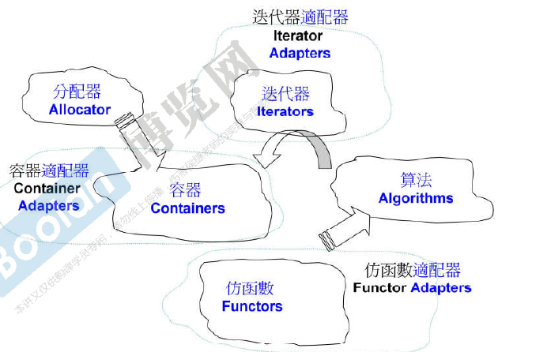
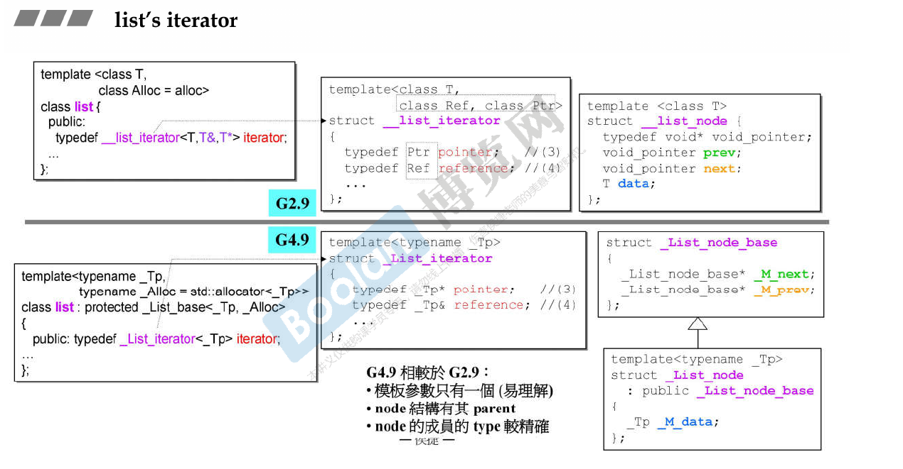

侯捷stl学习笔记

[TOC]
# Introduction
- C++ Standard Library
- C++ Standard Template Library

STL 是 C++ 标准库的一个重要组成部分

STL 是标准库中专注于泛型数据结构和算法的部分

- C++ 标准库的 header files 不带扩展名 (.h)，例如 `#include <vector>`
- 新式 C header files 不带扩展名 .h，例如 `#include <cstdio>`
- 旧式 C header files (带有扩展名 .h) 仍然可用，例如 `#include <stdio.h>`
- 新式 headers 内的组件封装于 namespace "std"
  - using namespace std; or
  - using std::cout; (for example)
- 旧式 headers 内的组件不封装于 namespace "std"

例子：

| 对比项 | `<cstdio>` | `<stdio.h>` |
|--------|------------|--------------|
| 命名空间 | 所有名称定义在 `std` **命名空间**中| 所有名称定义在全局命名空间中|
| 头文件风格 | C++ 风格，不带 `.h` 后缀。 | C 风格，带 `.h` 后缀。 |
| 标准归属 | C++ 标准库头文件（C++98 起）。 | 原为 C 标准库头文件，C++ 为了兼容 C 而保留。 |

```cpp
// 使用 <cstdio>（C++ 风格）
#include <cstdio>
int main() {
    std::printf("Hello\n");  // 需要 std:: 前缀
}

// 使用 <stdio.h>（C 风格）
#include <stdio.h>
int main() {
    printf("Hello\n");       // 全局命名空间
}
```

stl 六大组件
- 容器 (Containers)
- 分配器 (Allocators)
- 算法 (Algorithms)
- 迭代器 (Iterators)
- 适配器 (Adapters)
- 仿函数 (Functors)



```cpp
#include <vector>
#include <algorithm>
#include <functional>
#include <iostream>

using namespace std;

int main()
{
    int ia[6] = { 27, 210, 12, 47, 109, 83 };
    vector<int, allocator<int>> vi(ia, ia + 6);  // allocator

    // iterator : vi.begin(), vi.end()
    // predicate : not1(bind2nd(less<int>(), 40))
    // function object : less<int>
    // function adapter (binder) : bind2nd
    // function adapter (negator) : not1
    cout << count_if(vi.begin(), vi.end(), not1(bind2nd(less<int>(), 40)));
    return 0;
}
```

iterator是左闭右开的

下面是stl container一览


# STL usage
这里的示例有点老了，新版的函数更加安全和快捷，不过作为学习的话还是做了点note

一个是`qsort`, 这里的签名其实是`c`语言中留下来的, 现在一般使用`std::sort` or `std::ranges::sort`了

```cpp
void qsort( void *ptr, std::size_t count,
            std::size_t size, /* c-compare-pred */* comp );
void qsort( void *ptr, std::size_t count,
            std::size_t size, /* compare-pred */* comp );

extern "C" using /* c-compare-pred */ = int(const void*, const void*);
extern "C++" using /* compare-pred */ = int(const void*, const void*);
```
> The two overloads provided by the C++ standard library are distinct because the types of the parameter `comp` are distinct (language linkage is part of its type).

参数解释
- **ptr** - 指向要检验的数组的指针  
- **count** - 数组中元素的数量  
- **size** - 数组中每个元素的大小，以字节表示  
- **comp** - 比较函数。如果首个参数小于第二个，那么返回负整数值；如果首个参数大于第二个，返回正整数值；如果两个参数等价，返回零。作为首个实参传递 key，作为第二个实参传递来自数组的元素。  

  比较函数的签名应等价于如下形式：  
  ```c
  int cmp(const void *a, const void *b);
  ```
  该函数必须不修改传递给它的对象，并且在调用比较函数时必须返回一致的结果，与它们在数组中的位置无关。

```cpp
#include <array>
#include <climits>
#include <compare>
#include <cstdlib>
#include <iostream>

int main()
{
    std::array a{-2, 99, 0, -743, INT_MAX, 2, INT_MIN, 4};
    
    std::qsort
    (
        a.data(),
        a.size(),
        sizeof(decltype(a)::value_type),
        [](const void* x, const void* y)
        {
            const int arg1 = *static_cast<const int*>(x);
            const int arg2 = *static_cast<const int*>(y);
            const auto cmp = arg1 <=> arg2;
            if (cmp < 0)
                return -1;
            if (cmp > 0)
                return 1;
            return 0;
        }
    );
    
    for (int ai : a)
        std::cout << ai << ' ';
    std::cout << '\n';
}
```

接着是`std::bsearch`, 现在一般使用`std::lower_bound` or `std::upper_bound`了

函数签名如下
```cpp
void* bsearch( const void* key, const void* ptr, std::size_t count,
               std::size_t size, /* C 比较谓词 */* comp );
void* bsearch( const void* key, const void* ptr, std::size_t count,
               std::size_t size, /* 比较谓词 */* comp );
/* notice: 在c++26里面 key 不使用 const 修饰了 */
```

```cpp
#include <array>
#include <cstdlib>
#include <iostream>

template<typename T>
int compare(const void *a, const void *b)
{
    const auto &arg1 = *(static_cast<const T*>(a));
    const auto &arg2 = *(static_cast<const T*>(b));
    const auto cmp = arg1 <=> arg2;
    return cmp < 0 ? -1
        :  cmp > 0 ? +1
        :  0;
}

int main()
{
    std::array arr{1, 2, 3, 4, 5, 6, 7, 8};
    
    for (const int key : {4, 8, 9})
    {
        const int* p = static_cast<int*>(
            std::bsearch(&key,
                arr.data(),
                arr.size(),
                sizeof(decltype(arr)::value_type),
                compare<int>));
        
        std::cout << "值 " << key;
        if (p)
            std::cout << "在位置 " << (p - arr.data())<< " 找到了";
        else
            std::cout << "没有找到";
    }
}
```

## deque
`std::deque` 采用**分段连续**的方式，由以下两部分构成：

### map array
- 是一个**指针数组**（通常称作 `map`），每个指针指向一个实际存储元素的**缓冲区**（buffer / block）。
- 这个数组本身是动态增长的（当现有 map 空间不足时会重新分配更大的 map 并迁移指针）。

### buffer / block
- 每个缓冲区是一块固定大小的连续内存（例如 512 字节或元素个数的固定倍数，具体取决于实现）。
- 缓冲区的数量根据元素数量动态增加或减少。

### structure

```
Central map (指针数组)
┌───────┬───────┬───────┬───────┬───────┐
│  ptr0 │  ptr1 │  ptr2 │  ptr3 │  ptr4 │ ... (可能还有未使用的槽位)
└───┬───┴───┬───┴───┬───┴───┬───┴───┬───┘
    ▼       ▼       ▼       ▼       ▼
  buffer0 buffer1 buffer2 buffer3 buffer4
  [元素]  [元素]  [元素]  [元素]  [元素]
  [元素]  [元素]  [元素]  [元素]  [元素]
   ...     ...     ...     ...     ...
```

- **`push_back`**：如果最后一个缓冲区还有空闲位置，直接放入；否则分配新缓冲区并更新 map 末尾。
- **`push_front`**：如果第一个缓冲区头部还有空闲位置，直接放入；否则分配新缓冲区并插入到 map 开头（或重新分配 map 以腾出空间）。
- 两端插入时不会移动已有元素。

### random access implementation

`deque` 支持 O(1) 随机访问，通过计算：

```
地址 = map[块索引] + 块内偏移
```

具体步骤：
- 已知 `deque` 中每个缓冲区的大小（例如 `_M_blocksize` 表示每个缓冲区可容纳的元素个数）。
- 给定下标 `i`：
  - `块索引 = (i + 起始偏移) / 缓冲区大小`
  - `块内偏移 = (i + 起始偏移) % 缓冲区大小`
- 这里的“起始偏移”是为了处理头部有空位的逻辑（例如第一个缓冲区可能不是从索引 0 开始存放元素）。

### deque summary
- `deque` = **map 数组** + **多个固定大小的缓冲区**。
- 两端增删 O(1)，无需移动元素。
- 随机访问比 `vector` 多一次间接寻址（查 map + 块内偏移），故略慢。
- 中间插入/删除仍需移动元素，效率 O(n)。

## stack and queue
`std::deque` 涵盖了`std::stack`和`std::queue`的功能

`std::stack` 和 `std::queue` 默认使用 `std::deque` 作为底层容器。

## associate container
`multiset` 和 `multimap` 是允许重复键的有序容器。
- `multiset`：需要有序存储重复元素（例如成绩列表、允许重复的排行榜）。
- `multimap`：一个键对应多个值的映射（例如学生选课：一个学生多门课；目录索引：一个关键词对应多篇文章）。

`unordered_multiset / unordered_multimap`哈希表版本

# architecture & source
1. OOP(Object-Oriented-programming) 企图将 datas 和 methods 关联在一起
2. GP(Generic programming) 是将 datas 和 methods 分开来

STL 是 GP 的思想

> 所有 algorithms，其内最终涉及元素本身的操作，无非就是比大小。

于是要学习操作重载和模板

## Operator Overloading

| Expression | As member function | As non-member function | Example |
|---|---|---|---|
| @a | (a).operator@() | operator@ (a) | !std::cin calls std::cin.operator!() |
| a@b | (a).operator@ (b) | operator@ (a, b) | std::cout << 42 calls std::cout.operator<<(42) |
| a=b | (a).operator= (b) | cannot be non-member | std::string s; s = "abc"; calls s.operator="abc" |
| a[b] | (a).operator\[\](b) | cannot be non-member | std::map<int, int> m; m\[1\] = 2; calls m.operator\[\](1) |
| a-> | (a).operator->() | cannot be non-member | std::unique_ptr<S> ptr(new S); ptr->bar() calls ptr.operator->() |
| a@ | (a).operator@ (0) | operator@ (a, 0) | std::vector<int>::iterator i = v.begin(); i++ calls i.operator++(0) |

> In this table, @ is a placeholder representing all matching operators: all prefix operators in @a, all postfix operators other than -> in a@, all infix operators other than = in a@b

Specialization

这里的思想和 rust 的`trait`的思想很像

泛化指的是定义模板时的**通用**版本（主模板，primary template），适用于所有类型。

特化是指针对**一个或多个特定模板参数**给出专门的实现
- 全特化（Explicit Specialization）：指定所有模板参数。
- 偏特化（Partial Specialization）：只指定部分模板参数（仅限类模板）。

```cpp
template <class Key> struct hash { };

template<>  
STL_TEMPLATE_NULL struct hash<char> {  
    size_t operator()(char x) const { return x; }  
};  

STL_TEMPLATE_NULL struct hash<short>() {  
    size_t operator()(short x) const { return x; }  
};  

STL_TEMPLATE_NULL struct hash<unsigned short> {  
    size_t operator()(unsigned short x) const { return x; }  
};  

STL_TEMPLATE_NULL struct hash<int> {  
    size_t operator()(int x) const { return x; }  
};  

STL_TEMPLATE_NULL struct hash<unsigned int> {  
    size_t operator()(unsigned int x) const { return x; }  
};  

STL_TEMPLATE_NULL struct hash<long> {  
    size_t operator()(long x) const { return x; }  
};  

STL_TEMPLATE_NULL struct hash<unsigned long> {  
    size_t operator()(unsigned long x) const { return x; }  
};  
```

# allocator
侯捷老师在这里主要讲解了vs6, bc5, gnuc2.9(`<defalloc.h>`)的`allocator`的实现，底层都是使用`malloc()`, `free()`实现的， 效果都不太理想

在典型的c语言的`malloc()`下内存里面会记录分配的大小，于是`free()`的时候不需要进行大小指定。

但是在`container`的思想下我们知道单个容器的大小，无需再分配的内存里面储存分配的大小

后面就是介绍了gnuc 2.9 `<stl::alloc>`

**GCC 2.9 STL 分配器 (`std::alloc`)**核心要点：
- **两级配置器**：以 **128 字节** 为界。
  - **第一级**：大内存（>128B）→ 直接调用 `malloc`/`free`。
  - **第二级**：小内存（≤128B）→ 内存池 + 自由链表管理。
- **自由链表**：16 条链表，负责大小 **8, 16, … , 128 字节**（8 的倍数）的内存块。
- **无 cookie 开销**：内存池从系统申请一大块，内部分配的小块无额外头部信息，极大节约内存。
- **效率高**：避免频繁调用 `malloc`，减少碎片。

GCC 4.9 STL Allocator 的默认分配器就是`malloc()/free()`的包装

GCC 2.9 时代的 `std::alloc` 的后继成为了`__gnu_cxx::__pool_alloc<T>`

# Iterator
迭代器通常会定义一些内嵌类型：
- `iterator_category`：迭代器类型（如输入、输出、随机访问等）。
- `value_type`：元素类型（例如 `int`）。
- `difference_type`：表示两个迭代器之间距离的类型（通常是 `ptrdiff_t`）。
- `pointer`：指向元素的指针类型。
- `reference`：指向元素的引用类型。

`iterator_traits` 提供了**统一的访问接口**。

```cpp
template <class I>
struct iterator_traits {
    typedef typename I::iterator_category iterator_category;
    typedef typename I::value_type value_type;
    typedef typename I::difference_type difference_type;
    typedef typename I::pointer pointer;
    typedef typename I::reference reference;
};
```

- 对于**自定义迭代器类**（其内部定义了上述类型），`iterator_traits<I>` 直接取出这些类型。
- 对于**原生指针**（如 `int*`），标准库提供了**偏特化版本**：
  ```cpp
  template <class T>
  struct iterator_traits<T*> {
      typedef random_access_iterator_tag iterator_category;
      typedef T value_type;
      typedef ptrdiff_t difference_type;
      typedef T* pointer;
      typedef T& reference;
  };
  ```
  这样，`iterator_traits<int*>::value_type` 就是 `int`，无需指针自己定义类型。

iterator_category分为五大类
- **输入迭代器 (Input Iterator)**：这种迭代器所指的对象，不允许外界改变。只读（read only）。
- **输出迭代器 (Output Iterator)**：唯写（write only）。
- **前向迭代器 (Forward Iterator)**：允许“写入型”算法（例如 `replace()`）在此种迭代器所形成的区间上进行读写操作。
- **双向迭代器 (Bidirectional Iterator)**：可双向移动。某些算法需要逆向走访某个迭代器区间（例如逆向拷贝某范围内的元素），可以使用双向迭代器。
- **随机访问迭代器 (Random Access Iterator)**：前四种迭代器都只供应一部分指针算术能力（前三种支持 `operator++`，第四种再加上 `operator--`），第五种则涵盖所有指针算术能力，包括 `p+n`, `p-n`, `p[n]`, `p1-p2`, `p1<p2`。

从属关系如下

```
          Input Iterator        Output Iterator
              │                      │
              └──────────┬───────────┘
                         ▼
                  Forward Iterator
                         │
                         ▼
                Bidirectional Iterator
                         │
                         ▼
               Random Access Iterator
```
# Container 

## vector
这里直接看主要的源码就好了, gnuc 2.9

```cpp
// ---------- vector 核心定义 ----------
template <class T, class Alloc = allocator<T> >
class vector {
public:
    typedef T value_type;
    typedef T* iterator;            // 迭代器就是原生指针
    typedef const T* const_iterator;
    typedef size_t size_type;
    typedef ptrdiff_t difference_type;

protected:
    iterator start;          // 已用空间起始
    iterator finish;         // 已用空间末尾（最后一个元素之后）
    iterator end_of_storage; // 可用空间末尾

    // 内部工具函数
    void allocate_and_fill(size_type n, const T& x) {
        start = Alloc::allocate(n);
        finish = uninitialized_fill_n(start, n, x);
        end_of_storage = start + n;
    }

public:
    // 构造与析构
    vector() : start(0), finish(0), end_of_storage(0) {}

    vector(size_type n, const T& value) {
        allocate_and_fill(n, value);
    }

    vector(const vector& other) {
        size_type n = other.size();
        start = Alloc::allocate(n);
        finish = uninitialized_copy(other.begin(), other.end(), start);
        end_of_storage = start + n;
    }

    ~vector() {
        destroy(start, finish);
        Alloc::deallocate(start, capacity());
    }

    vector& operator=(const vector& other) {
        if (this != &other) {
            // 简单实现：先销毁再拷贝
            destroy(start, finish);
            Alloc::deallocate(start, capacity());
            size_type n = other.size();
            start = Alloc::allocate(n);
            finish = uninitialized_copy(other.begin(), other.end(), start);
            end_of_storage = start + n;
        }
        return *this;
    }

    // 迭代器
    iterator begin() { return start; }
    const_iterator begin() const { return start; }
    iterator end() { return finish; }
    const_iterator end() const { return finish; }

    // 容量相关
    size_type size() const { return size_type(finish - start); }
    size_type capacity() const { return size_type(end_of_storage - start); }
    bool empty() const { return start == finish; }

    // 元素访问
    T& operator[](size_type n) { return *(start + n); }
    const T& operator[](size_type n) const { return *(start + n); }

    T& front() { return *start; }
    T& back()  { return *(finish - 1); }

    // 核心修改操作
    void push_back(const T& x) {
        if (finish != end_of_storage) {
            construct(finish, x);
            ++finish;
        } else {
            insert_aux(end(), x);
        }
    }

    void pop_back() {
        --finish;
        destroy(finish);
    }

    void reserve(size_type n) {
        if (n > capacity()) {
            iterator new_start = Alloc::allocate(n);
            iterator new_finish = uninitialized_copy(start, finish, new_start);
            destroy(start, finish);
            Alloc::deallocate(start, capacity());
            start = new_start;
            finish = new_finish;
            end_of_storage = new_start + n;
        }
    }

    // 通用插入辅助（当容量不足时被 push_back 调用）
    void insert_aux(iterator position, const T& x) {
        if (finish != end_of_storage) {
            // 还有备用空间：从 position 开始向后移动元素
            construct(finish, *(finish - 1));
            ++finish;
            T x_copy = x;
            // 从后往前移动
            iterator it = finish - 2;
            for (; it != position; --it)
                *it = *(it - 1);
            *position = x_copy;
        } else {
            // 扩容：新容量 = 旧容量 * 2 (或 1)
            size_type old_size = size();
            size_type new_capacity = old_size != 0 ? 2 * old_size : 1;
            iterator new_start = Alloc::allocate(new_capacity);
            iterator new_finish = new_start;
            // 拷贝到新内存
            new_finish = uninitialized_copy(start, position, new_start);
            construct(new_finish, x);
            ++new_finish;
            new_finish = uninitialized_copy(position, finish, new_finish);
            // 清理旧内存
            destroy(start, finish);
            Alloc::deallocate(start, capacity());
            // 更新指针
            start = new_start;
            finish = new_finish;
            end_of_storage = new_start + new_capacity;
        }
    }

    // 清空
    void clear() {
        erase(begin(), end());
    }

    // 擦除区间 [first, last)
    iterator erase(iterator first, iterator last) {
        iterator i = uninitialized_copy(last, finish, first);
        destroy(i, finish);
        finish = finish - (last - first);
        return first;
    }

    iterator erase(iterator position) {
        return erase(position, position + 1);
    }

    // 插入单个元素（简单版本）
    void insert(iterator position, const T& x) {
        if (position == end()) {
            push_back(x);
        } else {
            // 通用插入，此处简化：直接调用 insert_aux
            // 实际 SGI STL 中有更精细的实现
            insert_aux(position, x);
        }
    }
};
```

## list

值得一提的是`iterator`是指针的容器，对于类似`++iterator`的操作我们希望指向下一个`node`, 而不是数值的增加，所以`iterator`其实是一个类容器来实现了指定的operator overloading，算是某种意义上的智能指针。

下面是gnuc 2.9 stl 的list主要讲解代码, 要记得postfix form 和 prefix form 的`++`的函数行为

```cpp
template <class T>
struct __list_node {
    typedef void* void pointer;
    void pointer prev;
    void pointer next;
    T data;
};

template <class T, class Alloc = alloc>
class list {
protected:
    typedef __list_node<T> list_node;
public:
    typedef list_node* link_type;
    typedef __list_iterator<T,T&,T*> iterator;
protected:
    link_type node;
...
};

template<class T, class Ref, class Ptr>
struct __list_iterator {
    typedef T value_type;
    typedef Ptr pointer;
    typedef Ref reference;
...

template<class T, class Ref, class Ptr>
struct __list_iterator {
    typedef __list_iterator<T, Ref, Ptr> self;
    typedef bidirectional_iterator_tag iterator_category; //(1)
    typedef T value_type;    //(2)
    typedef Ptr pointer;    //(3)
    typedef Ref reference;    //(4)
    typedef __list_node<T>* link_type;
    typedef ptrdiff_t difference_type;    //(5)

    link_type node;

    reference operator*() const { return (*node).data; }
    pointer operator->() const { return &(operator*()); }
    self& operator++()
    {
        node = (link_type)((*node).next); return *this;
    }
    self operator++(int)
    {
        self tmp = *this; ++*this; return tmp;
    }
};
```

gnuc 4.9 stl 的 list 实现的传值就优雅了很多, 但是类之间的继承关系就复杂了不少



记得`iterator`的设计是左闭右开的，所以list的实现是在最后创建一个额外不包含`data`的节点, 这个节点的`prev`指向最后一个有效元素，`next`指向第一个有效元素

## array and forward-list

这里不多做介绍了, 基本的模板设计还是大差不差的

## deque queue stack

前面已经介绍`deque`了, `queue` 和 `stack` 的底层可以是`deque`或者是`list`.

`stack` 和 `queue` 不**允许**遍历，也不提供`iterator`

## rb_tree
rb_tree 的 iterator 的走法是中序遍历的走法, 这里基于SGI STL代码进行学习

```cpp
template <class Key, class Value, class KeyOfValue, class Compare, class Alloc = alloc>
class rb_tree { ... };
```
*   **`Key`**: 排序依据的键值类型。
*   **`Value`**: 红黑树节点的数据类型。在 `set` 里 `Value` 就是键值本身；在 `map` 里则是 `pair<const Key, T>`。
*   **`KeyOfValue`**: 一个**仿函数**，用于从 `Value` 中提取出 `Key` 来比较。
*   **`Compare`**: 比较两个 `Key` 大小的仿函数，默认为 `std::less<Key>`。
*   **`Alloc`**: 空间配置器，默认为 SGI 高效的内存池分配器 `alloc`。

SGI STL 对节点采用了双层设计，将树的组织逻辑与节点数据分离。一个名为 `header` 的“超级头节点”简化了边界情况的处理，它并不存放具体数据，其指针分别指向根节点、最左节点和最右节点。

```cpp
// ---------- 节点定义 ----------
typedef bool _Rb_tree_Color_type;
const _Rb_tree_Color_type _S_rb_tree_red = false;    // 红色为0
const _Rb_tree_Color_type _S_rb_tree_black = true;   // 黑色为1

// 节点基础结构，只包含树的组织信息
struct _Rb_tree_node_base {
    _Rb_tree_Color_type _M_color;          // 红黑树的颜色标记
    _Base_ptr _M_parent;                   // 指向父节点
    _Base_ptr _M_left;                     // 指向左子节点
    _Base_ptr _M_right;                    // 指向右子节点
};

// 真正的节点，继承自基础结构，并添加数据字段
template <class _Value>
struct _Rb_tree_node : public _Rb_tree_node_base {
    _Value _M_value_field;                 // 节点中实际存储的数据
};
```

红黑树只记录三个核心变量

```cpp
template <class Key, class Value, ...>
class rb_tree {
protected:
    size_type node_count;   // 1. 记录树中节点总数
    link_type header;       // 2. 指向巧妙的“header”节点
    Compare key_compare;    // 3. 键值大小比较的函数对象
    ...
};
```

`rb_tree` 支持两种插入模式，其底层逻辑高度抽象，所有旋转和调整操作均封装在底层的`_M_insert`函数中，插入后都会调用统一的恢复函数 `_M_rebalance` 来修正红黑树的性质。

*   **允许重复键 (`insert_equal`)**：当遇到等于当前节点的键时，它会**向右**搜索，直到找到合适的位置插入。
*   **禁止重复键 (`insert_unique`)**：当遇到等于当前节点的键时，它会返回该键所在位置，避免重复插入。

`erase` 的逻辑比插入更复杂。SGI STL 在删除节点时，采用的是**替换连接 (relink)** 而非拷贝值 (copy) 的方式。这种方法的好处在于，它只会使**指向被删除节点的迭代器**失效，而指向其他元素的迭代器则保持有效。

gnuc 4.9 版本的实现符合oop的 handle/body pattern, 看起来关系就复杂了一些


## set/multiset
set/multiset 以 rb_tree 作为底层结构, 它们的`value`和`key`合一, `key`就是`value`

可以看一下带有解释的代码(gnuc 2.9)

```cpp
template <class Key, class Compare = less<Key>, class Alloc = alloc>
class set {
public:
    // 类型定义
    typedef Key key_type;
    typedef Key value_type;          // key 和 value 类型相同
    typedef Compare key_compare;
    typedef Compare value_compare;

private:
    // 底层红黑树：identity<value_type> 直接返回键值本身
    typedef rb_tree<key_type, value_type,
                    identity<value_type>, key_compare, Alloc> rep_type;
    rep_type t;   // 核心存储

public:
    // ---------- 迭代器相关 ----------
    // 关键：set 的 iterator 是底层红黑树的 const_iterator
    // 原因：set 的元素不允许通过迭代器修改，以维护有序性和唯一性
    typedef typename rep_type::const_iterator iterator;
    typedef typename rep_type::const_iterator const_iterator;
    
    // 反向迭代器同理，也是 const 版本
    typedef typename rep_type::const_reverse_iterator reverse_iterator;
    typedef typename rep_type::const_reverse_iterator const_reverse_iterator;

    // 迭代器获取函数：直接返回底层红黑树的 const 迭代器
    iterator begin() const { return t.begin(); }
    iterator end()   const { return t.end(); }
    const_iterator cbegin() const { return t.begin(); }
    const_iterator cend()   const { return t.end(); }
    
    reverse_iterator rbegin() const { return t.rbegin(); }
    reverse_iterator rend()   const { return t.rend(); }

    // ---------- 其余接口（仅为示例）----------
    set() : t() {}
    explicit set(const Compare& comp) : t(comp) {}
    
    // 插入（保证唯一性）
    pair<iterator, bool> insert(const value_type& x) {
        pair<typename rep_type::iterator, bool> p = t.insert_unique(x);
        return pair<iterator, bool>(p.first, p.second);
    }
    
    iterator find(const key_type& x) const { return t.find(x); }
    size_type erase(const key_type& x) { return t.erase(x); }
    size_type size() const { return t.size(); }
    bool empty() const { return t.empty(); }
    // ... 其他成员函数类似
};

/* 迭代器特性说明：
 *
 * 1. 类型：双向迭代器 (bidirectional_iterator_tag)
 *    - 支持 ++, -- 操作，但不支持随机跳转（如 it + n）
 *    - 递增/递减操作均摊 O(1)
 *
 * 2. 只读性：
 *    - set 的 iterator 实际是 const_iterator，因此 *it 返回 const Key&
 *    - 无法通过迭代器修改元素值（保证有序容器的不变性）
 *
 * 3. 有效性：
 *    - 插入操作：所有已有迭代器保持有效（红黑树不重新分配节点）
 *    - 删除操作：仅指向被删除元素的迭代器失效，其他迭代器依然有效
 *
 * 4. 遍历顺序：
 *    - 按升序遍历（由 Compare 决定，默认为 less<Key>）
 *    - 基于红黑树的中序遍历（左-根-右）实现
 *
 * 5. 底层实现：
 *    - 复用 rb_tree 的 const_iterator，不单独编写迭代器类
 *    - 因此 set 的迭代器行为与 rb_tree 的 const 迭代器完全一致
 */
 ```

 ## map/multimap

`map/multimap` 都是以 `rb_tree` 作为底层，排序的依据是 `key`

也是建议看带解释的源码

 ```cpp
 // gnuc 2.9 slt map

template <class Key, class T, class Compare = less<Key>, class Alloc = alloc>
class map {
public:
    // 类型定义
    typedef Key key_type;
    typedef T data_type;
    typedef T mapped_type;
    typedef pair<const Key, T> value_type;   // 注意：键是 const 的
    typedef Compare key_compare;

    // 比较仿函数：用于比较两个 value_type 的键
    class value_compare : public binary_function<value_type, value_type, bool> {
        friend class map;
    protected:
        Compare comp;
        value_compare(Compare c) : comp(c) {}
    public:
        bool operator()(const value_type& x, const value_type& y) const {
            return comp(x.first, y.first);
        }
    };

private:
    // 底层红黑树：Key 为键类型，Value 为 pair<const Key, T>
    // select1st<value_type> 用于从 pair 中取出 first（即键）
    typedef rb_tree<key_type, value_type,
                    select1st<value_type>, key_compare, Alloc> rep_type;
    rep_type t;   // 核心存储

public:
    // ---------- 迭代器相关 ----------
    // map 的迭代器不是 const 的！因为允许修改值（mapped_type）
    // 但键部分不可修改（因为 value_type 的 first 是 const）
    typedef typename rep_type::iterator iterator;
    typedef typename rep_type::const_iterator const_iterator;
    typedef typename rep_type::reverse_iterator reverse_iterator;
    typedef typename rep_type::const_reverse_iterator const_reverse_iterator;

    // 迭代器获取函数
    iterator begin() { return t.begin(); }
    const_iterator begin() const { return t.begin(); }
    iterator end()   { return t.end(); }
    const_iterator end() const { return t.end(); }
    
    reverse_iterator rbegin() { return t.rbegin(); }
    const_reverse_iterator rbegin() const { return t.rbegin(); }
    reverse_iterator rend()   { return t.rend(); }
    const_reverse_iterator rend() const { return t.rend(); }

    // ---------- 核心接口 ----------
    map() : t() {}
    explicit map(const Compare& comp) : t(comp) {}

    // 插入：使用 insert_unique（键唯一）
    pair<iterator, bool> insert(const value_type& x) {
        return t.insert_unique(x);
    }

    // 查找：基于键
    iterator find(const key_type& k) {
        // 需要临时构造一个 value_type 对象用于查找，但只比较键
        // 实际红黑树实现有优化版本
        return t.find(value_type(k, T()));
    }
    const_iterator find(const key_type& k) const {
        return t.find(value_type(k, T()));
    }

    // 通过键访问值（如果不存在则插入默认值）
    T& operator[](const key_type& k) {
        return (*((insert(value_type(k, T()))).first)).second;
    }

    // 删除
    size_type erase(const key_type& k) {
        return t.erase(k);
    }
    void erase(iterator pos) { t.erase(pos); }

    size_type size() const { return t.size(); }
    bool empty() const { return t.empty(); }
    void clear() { t.clear(); }
    // ... 其他成员函数类似
};

/* 迭代器特性说明：
 *
 * 1. 类型：双向迭代器 (bidirectional_iterator_tag)
 *    - 支持 ++, --，但不支持随机跳转
 *
 * 2. 修改限制：
 *    - iterator 指向 value_type (即 pair<const Key, T>)
 *    - 可以通过 it->second = new_value 修改值（mapped_type）
 *    - 不能通过 it->first 修改键，因为 first 是 const
 *
 * 3. 与 set 的迭代器对比：
 *    - set 的 iterator 是 const_iterator，完全不可修改元素
 *    - map 的 iterator 可以修改 second，不能修改 first
 *
 * 4. 有效性规则（同 rb_tree）：
 *    - 插入操作不使任何已有迭代器失效
 *    - 删除操作仅使指向被删元素的迭代器失效
 *
 * 5. 遍历顺序：
 *    - 按键的升序遍历（由 Compare 决定，默认 less<Key>）
 *    - 基于中序遍历（左-根-右），因此输出有序
 *
 * 6. 底层关键点：
 *    - select1st<value_type> 仿函数：从 pair 中提取键用于比较
 *      其实现为：const Key& operator()(const pair<Key,T>& p) const { return p.first; }
 *    - 红黑树的 Key 和 Value 不同，KeyOfValue 用于从 Value 中提取 Key
 *    - 这使得 rb_tree 可以存储任何类型，只要提供提取键的方法
 */
```

## hashtable
`hashtable` 是 SGI STL 中实现 `hash_set`、`hash_map`、`hash_multiset`、`hash_multimap` 等非标准关联容器的底层数据结构。

采用**开链法**（separate chaining）处理哈希碰撞，具有平均 O(1) 的插入、查找和删除性能。

### `hashtable` 类模板参数

```cpp
template <class Value, class Key, class HashFcn,
          class ExtractKey, class EqualKey, class Alloc>
class hashtable { ... };
```

| 参数 | 说明 |
|------|------|
| `Value` | 节点值的类型（`pair<const Key, T>` 或直接 `Key`） |
| `Key` | 键的类型 |
| `HashFcn` | 哈希函数对象，将 `Key` 转换为 `size_t` |
| `ExtractKey` | 从 `Value` 中提取 `Key` 的函数对象 |
| `EqualKey` | 比较两个键是否相等的函数对象 |
| `Alloc` | 空间配置器，默认 `alloc` |

### `hash_set`/`hash_map`

`hash_set` 和 `hash_map` 是 `hashtable` 的直接适配器，几乎没有额外逻辑：

```cpp
// hash_set 简化示意
template <class Key, class HashFcn, class EqualKey, class Alloc>
class hash_set {
    typedef hashtable<Key, Key, HashFcn, identity<Key>, EqualKey, Alloc> ht;
    ht rep;   // 底层哈希表
public:
    iterator begin() const { return rep.begin(); }
    pair<iterator, bool> insert(const value_type& x) { return rep.insert_unique(x); }
    // ... 其他接口类似
};
```

`hash_multiset` 和 `hash_multimap` 则使用 `hashtable` 的 `insert_equal` 接口，**允许重复键**。

### 概览

| 方面 | SGI STL `hashtable` 特点 |
|------|--------------------------|
| **碰撞解决** | 开链法（separate chaining），每个桶指向一个节点链表 |
| **桶数组** | 使用 `vector<node*>`，支持动态扩容和随机访问 |
| **扩容策略** | 桶大小取质数（预定义 28 个），元素数超过桶数时 `rehash` |
| **迭代器** | 前向迭代器，仅支持 `++` 操作；内部记录当前节点和所属哈希表 |
| **节点结构** | 自定义单向链表节点，无前驱指针 |
| **哈希计算** | `bkt_num()` → `hash(key) % n` |
| **泛型参数** | `Value`、`Key`、`HashFcn`、`ExtractKey`、`EqualKey`、`Alloc` |

SGI STL 的 `hashtable` 实现是 C++11 之后 `std::unordered_set`、`std::unordered_map` 等容器的前身，其**开链法+质数扩容+前向迭代器**的核心思想一直延续至今。

### 源码学习

```cpp
// 节点定义 -------------------------------------------------------------
// 哈希表的每个元素存储在一个单向链表节点中
template <class Value>
struct __hashtable_node {
    __hashtable_node* next;   // 指向链表中的下一个节点（碰撞时链接）
    Value val;                // 实际存储的值（对于 hash_map 是 pair<const Key, T>）
};

// 迭代器定义 -----------------------------------------------------------
// 这是一个前向迭代器（ForwardIterator），只能单向移动（++），不支持 --。
template <class Value, class Key, class HashFcn, class ExtractKey, class EqualKey, class Alloc>
struct __hashtable_iterator {
    // 迭代器类型定义（用于 iterator_traits）
    typedef forward_iterator_tag iterator_category;
    typedef Value value_type;
    typedef Value* pointer;
    typedef Value& reference;
    typedef ptrdiff_t difference_type;
    typedef __hashtable_iterator<Value, Key, HashFcn, ExtractKey, EqualKey, Alloc> self;
    typedef hashtable<Value, Key, HashFcn, ExtractKey, EqualKey, Alloc> hashtable;

    // 迭代器内部状态
    __hashtable_node<Value>* cur;   // 当前节点指针
    hashtable* ht;                  // 指向所属哈希表（用于跨桶跳转）

    // 构造函数
    __hashtable_iterator() : cur(0), ht(0) {}
    __hashtable_iterator(__hashtable_node<Value>* c, hashtable* h) : cur(c), ht(h) {}

    // 解引用操作
    reference operator*() const { return cur->val; }
    pointer operator->() const { return &(operator*()); }

    // 前置 ++（核心：实现跨桶遍历）
    self& operator++() {
        const __hashtable_node<Value>* old = cur;
        cur = cur->next;                     // 第一步：尝试移动到当前链表的下一个节点
        if (!cur) {                          // 当前链表已到末尾，需要跨到下一个非空桶
            // 计算当前节点原先所在的桶号（需要根据旧节点值计算）
            size_t bucket = ht->bkt_num(old->val);
            // 从下一个桶开始向后搜索，直到找到一个非空桶
            while (!cur && ++bucket < ht->buckets.size())
                cur = ht->buckets[bucket];   // 将 cur 指向该桶的第一个节点
        }
        return *this;
    }

    // 后置 ++
    self operator++(int) {
        self tmp = *this;
        ++*this;
        return tmp;
    }

    // 比较两个迭代器是否相等（依据是否指向同一个节点）
    bool operator==(const self& it) const { return cur == it.cur; }
    bool operator!=(const self& it) const { return cur != it.cur; }
};

// 模板参数说明：
//   Value      : 节点存储的值类型（对于 hash_set = Key，对于 hash_map = pair<const Key,T>）
//   Key        : 键的类型
//   HashFcn    : 哈希函数对象，函数签名 size_t operator()(const Key&) const
//   ExtractKey : 从 Value 中提取 Key 的函数对象，例如 identity (原样返回) 或 select1st (取 pair.first)
//   EqualKey   : 判断两个 Key 是否相等的函数对象
//   Alloc      : 空间配置器，默认 SGI 内存池 alloc
template <class Value, class Key, class HashFcn,
          class ExtractKey, class EqualKey, class Alloc>
class hashtable {
public:
    // 对外公开的类型定义
    typedef Key key_type;
    typedef Value value_type;
    typedef HashFcn hasher;
    typedef EqualKey key_equal;
    typedef size_t size_type;

    // 内部使用的节点类型和桶数组类型
    typedef __hashtable_node<Value> node;
    typedef vector<node*, Alloc> bucket_type;      // 桶数组：每个元素是指向链表的指针
    typedef __hashtable_iterator<Value, Key, HashFcn, ExtractKey, EqualKey, Alloc> iterator;

private:
    // 成员变量
    hasher      hash;           // 哈希函数对象
    key_equal   equals;         // 比较键是否相等的函数对象
    ExtractKey  get_key;        // 从 Value 中提取 Key 的函数对象
    bucket_type buckets;        // 桶数组，大小总是质数
    size_type   num_elements;   // 当前哈希表中元素的总数

    // ---------- 私有辅助函数 ----------
    // 根据键和桶数量计算桶号（取模）
    size_type bkt_num_key(const key_type& key, size_type n) const {
        return hash(key) % n;
    }
    // 使用当前桶数组大小计算桶号
    size_type bkt_num_key(const key_type& key) const {
        return bkt_num_key(key, buckets.size());
    }
    // 根据值（通过 get_key 提取键）和桶数量计算桶号
    size_type bkt_num(const value_type& obj, size_type n) const {
        return bkt_num_key(get_key(obj), n);
    }
    // 使用当前桶数组大小计算桶号
    size_type bkt_num(const value_type& obj) const {
        return bkt_num(obj, buckets.size());
    }

    // 分配并构造一个新节点（使用空间配置器）
    node* new_node(const value_type& obj) {
        node* tmp = Alloc::allocate(sizeof(node));    // 分配原始内存
        new (tmp) node;                               // placement new 构造节点对象（设置 next=0）
        tmp->next = 0;
        try {
            construct(&tmp->val, obj);                // 构造节点中的值对象
        } catch (...) {
            Alloc::deallocate(tmp, sizeof(node));     // 异常安全：释放已分配内存
            throw;
        }
        return tmp;
    }

    // 析构节点并释放内存
    void delete_node(node* n) {
        destroy(&n->val);          // 调用 value 的析构函数
        Alloc::deallocate(n, sizeof(node));
    }

    // 重新散列（扩容）：将当前所有元素重新分配到更大的桶数组中
    void rehash() {
        // 1. 确定新桶数组大小：从质数表中找到第一个大于当前 buckets.size() 的质数
        const size_type new_buckets_count = __stl_next_prime(buckets.size());
        // 2. 创建新桶数组，所有桶指针初始化为 0
        bucket_type new_buckets(new_buckets_count, (node*)0);
        // 3. 遍历所有旧桶及其链表节点
        for (size_type bucket = 0; bucket < buckets.size(); ++bucket) {
            node* cur = buckets[bucket];
            while (cur) {
                node* next = cur->next;
                // 重新计算当前节点在新桶数组中的桶号
                size_type new_bucket = bkt_num(cur->val, new_buckets_count);
                // 头插法：将节点插入到 new_buckets[new_bucket] 的头部
                cur->next = new_buckets[new_bucket];
                new_buckets[new_bucket] = cur;
                cur = next;
            }
        }
        // 4. 交换新旧桶数组（原数组自动析构）
        buckets.swap(new_buckets);
    }

public:
    // ---------- 构造与析构 ----------
    // 构造函数：n 为期望的最小桶数（实际会取不小于 n 的质数）
    hashtable(size_type n, const hasher& hf, const key_equal& eql)
        : hash(hf), equals(eql), get_key(), num_elements(0) {
        buckets.resize(__stl_next_prime(n));
    }

    // 析构函数：清空所有元素并释放桶数组内存
    ~hashtable() {
        clear();
    }

    // 清空所有元素
    void clear() {
        for (size_type i = 0; i < buckets.size(); ++i) {
            node* cur = buckets[i];
            while (cur) {
                node* next = cur->next;
                delete_node(cur);
                cur = next;
            }
            buckets[i] = 0;   // 将桶指针置空
        }
        num_elements = 0;
    }

    // ---------- 基本容量操作 ----------
    size_type size() const { return num_elements; }
    bool empty() const { return num_elements == 0; }

    // ---------- 迭代器 ----------
    // 返回第一个非空桶的第一个节点迭代器
    iterator begin() {
        for (size_type i = 0; i < buckets.size(); ++i)
            if (buckets[i])
                return iterator(buckets[i], this);
        return end();
    }
    // 返回尾后迭代器（cur == 0, ht == this）
    iterator end() { return iterator(0, this); }

    // ---------- 插入操作（不允许重复键）----------
    // 对外接口：插入前检查是否需要扩容
    pair<iterator, bool> insert_unique(const value_type& obj) {
        resize(num_elements + 1);               // 若元素数+1 > 桶数则扩容
        return insert_unique_noresize(obj);
    }

    // 实际插入（不进行扩容检查）
    pair<iterator, bool> insert_unique_noresize(const value_type& obj) {
        const size_type bucket = bkt_num(obj);   // 计算桶号
        node* first = buckets[bucket];           // 该桶的链表头
        // 遍历链表，检查是否已存在相等的键（通过 EqualKey 比较）
        for (node* cur = first; cur; cur = cur->next)
            if (equals(get_key(cur->val), get_key(obj)))
                return pair<iterator, bool>(iterator(cur, this), false);
        // 不存在，则创建新节点并头插
        node* tmp = new_node(obj);
        tmp->next = first;
        buckets[bucket] = tmp;
        ++num_elements;
        return pair<iterator, bool>(iterator(tmp, this), true);
    }

    // ---------- 插入操作（允许重复键）----------
    // 用于 hash_multiset / hash_multimap
    iterator insert_equal(const value_type& obj) {
        resize(num_elements + 1);
        return insert_equal_noresize(obj);
    }

    iterator insert_equal_noresize(const value_type& obj) {
        const size_type bucket = bkt_num(obj);
        node* first = buckets[bucket];
        node* tmp = new_node(obj);
        // 头插法（不检查重复）
        tmp->next = first;
        buckets[bucket] = tmp;
        ++num_elements;
        return iterator(tmp, this);
    }

    // ---------- 查找操作 ----------
    // 根据键查找，返回迭代器（指向第一个匹配的元素）
    iterator find(const key_type& key) {
        size_type bucket = bkt_num_key(key);
        node* cur = buckets[bucket];
        while (cur) {
            if (equals(get_key(cur->val), key))
                return iterator(cur, this);
            cur = cur->next;
        }
        return end();
    }

    // ---------- 计数操作 ----------
    // 返回与 key 相等的元素个数
    size_type count(const key_type& key) const {
        size_type bucket = bkt_num_key(key);
        node* cur = buckets[bucket];
        size_type result = 0;
        while (cur) {
            if (equals(get_key(cur->val), key))
                ++result;
            cur = cur->next;
        }
        return result;
    }

    // ---------- 删除操作 ----------
    // 通过迭代器删除一个元素
    void erase(iterator it) {
        if (it.cur == 0) return;          // 空迭代器不做任何事
        const size_type bucket = bkt_num(it.cur->val);
        node* cur = buckets[bucket];
        node* prev = 0;
        while (cur) {
            if (cur == it.cur) {
                if (prev)
                    prev->next = cur->next;
                else
                    buckets[bucket] = cur->next;
                delete_node(cur);
                --num_elements;
                return;
            }
            prev = cur;
            cur = cur->next;
        }
    }

    // 删除所有键等于 key 的元素，返回删除数量
    size_type erase(const key_type& key) {
        size_type bucket = bkt_num_key(key);
        node* cur = buckets[bucket];
        node* prev = 0;
        size_type erased = 0;
        while (cur) {
            if (equals(get_key(cur->val), key)) {
                node* next = cur->next;
                if (prev)
                    prev->next = next;
                else
                    buckets[bucket] = next;
                delete_node(cur);
                ++erased;
                cur = next;
            } else {
                prev = cur;
                cur = cur->next;
            }
        }
        num_elements -= erased;
        return erased;
    }

    // ---------- 扩容控制 ----------
    // 检查是否需要扩容（若 hint > 当前桶数则 rehash）
    void resize(size_type num_elements_hint) {
        if (num_elements_hint > buckets.size())
            rehash();
    }

    // 交换两个哈希表的内容
    void swap(hashtable& other) {
        buckets.swap(other.buckets);
        swap(num_elements, other.num_elements);
        swap(hash, other.hash);
        swap(equals, other.equals);
    }
};
```

# algorithm

## iterator

由于 iterator 是 algorithm 和 container 之间的桥梁, 不同的 container 的 iterator 行为可能会有差距，于是要使用 iterator_category 来辨别

---

关系图

```
        Input Iterator       Output Iterator
              │                    │
              └──────────┬─────────┘
                         ▼
                 Forward Iterator
                         │
                         ▼
               Bidirectional Iterator
                         │
                         ▼
               Random Access Iterator
```


迭代器标签

```cpp
struct input_iterator_tag { };
struct output_iterator_tag { };
struct forward_iterator_tag : public input_iterator_tag { };
struct bidirectional_iterator_tag : public forward_iterator_tag { };
struct random_access_iterator_tag : public bidirectional_iterator_tag { };
```

---

容器与迭代器类型对应表

| 容器 | 迭代器类型 |
|------|-----------|
| `vector` / `string` / `array` / `deque` | 随机访问迭代器 |
| `list` / `set` / `map` / `multiset` / `multimap` | 双向迭代器 |
| `forward_list` / `unordered_set` / `unordered_map` / `unordered_multiset` / `unordered_multimap` | 前向迭代器 |
| `istream_iterator` | 输入迭代器 |
| `ostream_iterator` | 输出迭代器 |

概览

| 迭代器类别 | 方向 | 读 | 写 | 多次遍历 | 随机访问 |
|-----------|------|----|----|---------|---------|
| 输入迭代器 | 单向 | ✅ | ❌ | ❌ | ❌ |
| 输出迭代器 | 单向 | ❌ | ✅ | ❌ | ❌ |
| 前向迭代器 | 单向 | ✅ | ✅ | ✅ | ❌ |
| 双向迭代器 | 双向 | ✅ | ✅ | ✅ | ❌ |
| 随机访问迭代器 | 任意 | ✅ | ✅ | ✅ | ✅ |

算法通过 `std::iterator_traits<Iter>::iterator_category` 获取迭代器类型，从而选择最优实现（如 `std::distance` 对随机访问迭代器使用减法，否则逐次递增）。

```cpp
// 针对输入迭代器的 distance 实现（逐个计数）
template<class InputIterator>
inline iterator_traits<InputIterator>::difference_type
    distance(InputIterator first, InputIterator last,
    input_iterator_tag) {
    iterator_traits<InputIterator>::difference_type n = 0;
    while (first != last) {
        ++first; ++n;
    }
    return n;
}

// 针对随机访问迭代器的 distance 实现（直接相减）
template<class RandomAccessIterator>
inline iterator_traits<RandomAccessIterator>::difference_type
    distance(RandomAccessIterator first, RandomAccessIterator last,
    random_access_iterator_tag) {
    return last - first;
}

// 对外接口：根据迭代器类型标签分发到对应的重载版本
template<class InputIterator>
inline iterator_traits<InputIterator>::difference_type
    distance(InputIterator first, InputIterator last) {
    typedef typename
        iterator_traits<InputIterator>::iterator_category category;
    return distance(first, last, category());
}
```

## 关于binary_search

`binary_search`其实就是调用了`lower_bound`来进行检查，所以查找某个元素就直接使用`lower_bound`就好了, 而不是检查在不在里面然后再二分查找(感觉有点废话了)

```cpp
template <class ForwardIterator, class T>
bool binary_search (ForwardIterator first,
    ForwardIterator last,
    const T& val)
{
    first = std::lower_bound(first, last, val);
    return (first != last && !(val < *first));
}
```

# functor

## 介绍

functor 相对于 lambda 函数而言，功能更强大一些

仿函数是一个重载了 `operator()` 的类对象，可以像函数一样被调用.

Lambda 表达式简化了仿函数的定义, Lambda 本质上是一个匿名仿函数，编译器会为它生成唯一的类类型。

| 特性 | 普通函数 | 仿函数 |
|------|---------|--------|
| 状态 | 无状态（只能用静态/全局变量，不安全） | 可以有**成员变量**，存储状态 |
| 内联 | 可能被内联，但函数指针不易内联 | 类模板实例化后更容易内联 |
| 类型 | 不同类型的函数指针本质相同 | 每个仿函数有独立类型，便于编译期优化 |
| 泛型 | 需要写多个重载或模板 | 配合模板，单一类适配多种类型 |
| 效率 | 函数指针调用有间接开销 | 编译器可完全内联，零开销 |

## STL 中的预定义仿函数

STL 提供了许多现成的仿函数，定义在 `<functional>` 头文件中。

算术运算

| 仿函数 | 作用 |
|--------|------|
| `plus<T>` | `x + y` |
| `minus<T>` | `x - y` |
| `multiplies<T>` | `x * y` |
| `divides<T>` | `x / y` |
| `modulus<T>` | `x % y` |
| `negate<T>` | `-x` |

关系比较

| 仿函数 | 作用 |
|--------|------|
| `equal_to<T>` | `x == y` |
| `not_equal_to<T>` | `x != y` |
| `greater<T>` | `x > y` |
| `less<T>` | `x < y` |
| `greater_equal<T>` | `x >= y` |
| `less_equal<T>` | `x <= y` |

逻辑运算

| 仿函数 | 作用 |
|--------|------|
| `logical_and<T>` | `x && y` |
| `logical_or<T>` | `x || y` |
| `logical_not<T>` | `!x` |

使用示例：

```cpp
#include <functional>
#include <algorithm>
#include <vector>

int main() {
    std::vector<int> v = {3,1,4,1,5};
    // 使用 less 仿函数进行升序排序
    std::sort(v.begin(), v.end(), std::less<int>());
    // 等价于默认行为，也可以写成 std::greater<int>() 进行降序
}
```

## 函数适配器

在 C++11 之前，通过 `binder1st`、`binder2nd`、`not1`、`not2` 等适配器改造仿函数, ：

```cpp
#include <functional>
#include <vector>
#include <algorithm>

int main() {
    std::vector<int> v = {10, 20, 30, 40, 50};
    // 绑定 less<int> 的第二参数为 30，形成“小于30”的一元谓词
    auto bind = std::bind2nd(std::less<int>(), 30);
    // 再取反 => 大于等于30
    auto pred = std::not1(bind);
    int cnt = std::count_if(v.begin(), v.end(), pred); // 3
}
```
> [!NOTE]
>
> 上面这些适配器在 C++17 被舍弃了

C++11 引入了 `std::bind` 和 lambda，更灵活，旧适配器逐渐被弃用。

## 仿函数（Functor）的可适配（Adaptable）条件

这一部分仅作为了解学习内容

在 C++98/03 时代，STL 中的**函数适配器**（如 `bind1st`、`bind2nd`、`not1`、`not2`、`ptr_fun`、`mem_fun` 等）要求被操作的仿函数提供特定的**嵌套类型**（typedef），以便适配器能够推断参数类型和返回类型。满足这些条件的仿函数称为 **可适配的（Adaptable）**。

### 可适配仿函数需要提供的类型成员

| 类别 | 需要的嵌套类型 | 说明 |
|------|---------------|------|
| **一元仿函数** (Unary Functor) | `argument_type`<br>`result_type` | 参数类型<br>返回值类型 |
| **二元仿函数** (Binary Functor) | `first_argument_type`<br>`second_argument_type`<br>`result_type` | 第一个参数类型<br>第二个参数类型<br>返回值类型 |

### 辅助基类：`unary_function` 和 `binary_function`

STL 提供了两个模板类，用于快速满足可适配条件：

```cpp
template <class Arg, class Result>
struct unary_function {
    typedef Arg argument_type;
    typedef Result result_type;
};

template <class Arg1, class Arg2, class Result>
struct binary_function {
    typedef Arg1 first_argument_type;
    typedef Arg2 second_argument_type;
    typedef Result result_type;
};
```

仿函数只需继承这些基类，即可自动获得所需的 typedef：

```cpp
// 可适配的一元仿函数
struct IsEven : public std::unary_function<int, bool> {
    bool operator()(int x) const { return x % 2 == 0; }
};

// 可适配的二元仿函数
struct MyLess : public std::binary_function<int, int, bool> {
    bool operator()(int a, int b) const { return a < b; }
};
```

适配器内部需要知道仿函数的参数类型和返回值类型。例如 `not1` 接受一元谓词并返回其否定：

```cpp
template <class Predicate>
class unary_negate {
    Predicate pred;  // 仿函数
public:
    // 需要知道参数类型，以便重载 operator()
    bool operator()(const typename Predicate::argument_type& x) const {
        return !pred(x);
    }
};
```

如果没有 `argument_type` 这个嵌套类型，适配器无法声明参数类型。

### 标准库提供的预定义仿函数已经是可适配的

所有 STL 预定义的仿函数（如 `std::less<int>`、`std::plus<int>` 等）都继承自 `unary_function` 或 `binary_function`，因此可以直接用于适配器。

### 现代 C++（C++11 起）的变化

- **Lambda 表达式**：默认不是可适配的（没有嵌套类型），但 C++11 引入了 `std::function` 和 `std::bind`，它们不依赖嵌套类型。
- **`std::bind`**：可以绑定任何可调用对象，不需要仿函数提供嵌套类型。
- **弃用适配器**：`bind1st`、`bind2nd`、`not1`、`not2` 等在 C++11 中标记为**弃用**，C++17 中**正式移除**。
- **新工具**：`std::not_fn`（C++17）替代 `not1`/`not2`，不要求嵌套类型。

> [!note]
>
> `unary_function` 和 `binary_function` 已在 **C++17** 中移除。新代码不应依赖它们，应使用 lambda 或手动定义嵌套类型（如果确实需要适配旧接口）。

# other adapter

## bind2nd/not1

这里不做介绍了

## reverse_iterator

reverse_iterator是一种适配器

```cpp
template <class Iterator>
class reverse_iterator {
protected:
    Iterator current;   // 底层迭代器
public:
    // 类型定义（与底层迭代器保持一致）
    using iterator_category = typename Iterator::iterator_category;
    using value_type = typename Iterator::value_type;
    using difference_type = typename Iterator::difference_type;
    using pointer = typename Iterator::pointer;
    using reference = typename Iterator::reference;

    // 构造函数
    reverse_iterator() : current() {}
    explicit reverse_iterator(Iterator x) : current(x) {}
    
    // 获取底层迭代器（重要！）
    Iterator base() const { return current; }
    
    // 解引用：返回 *（current - 1）
    reference operator*() const {
        Iterator tmp = current;
        --tmp;
        return *tmp;
    }
    
    // 前置 ++：变成 --current
    reverse_iterator& operator++() {
        --current;
        return *this;
    }
    
    // 后置 ++
    reverse_iterator operator++(int) {
        reverse_iterator tmp = *this;
        --current;
        return tmp;
    }
    
    // 前置 --：变成 ++current
    reverse_iterator& operator--() {
        ++current;
        return *this;
    }
    
    // 其他运算符：+, -, +=, -=, [] 等（随机访问迭代器时）
    // ...
};
```

## ostream_iterator

`std::ostream_iterator` 是一个**输出迭代器适配器**，它把对迭代器的赋值操作**转换为对输出流（如 `std::cout`、`std::ofstream`）的插入操作**（`<<`）。

常用于将容器中的元素序列写入到输出流，配合 `std::copy` 等算法使用。

### 基本定义

头文件：`<iterator>`

```cpp
template< class T,
          class CharT = char,
          class Traits = std::char_traits<CharT> >
class ostream_iterator;
```

- `T`：要写入的元素类型（如 `int`、`std::string`）
- `CharT`：字符类型（默认 `char`）
- `Traits`：字符特性（默认 `std::char_traits<char>`）

### 构造函数

```cpp
// 只指定输出流（不写入分隔符）
ostream_iterator(ostream_type& stream);

// 指定输出流和分隔符（每次写入元素后自动添加）
ostream_iterator(ostream_type& stream, const CharT* delimiter);
```

### 核心操作

`ostream_iterator` 是**输出迭代器**，只支持以下操作：

| 操作 | 说明 |
|------|------|
| `*it` | 返回迭代器自身（用于形成左值） |
| `++it` / `it++` | 返回迭代器自身（无实际效果，仅为满足迭代器协议） |
| `it = value` | **关键操作**：将 `value` 通过 `<<` 写入流，若指定了分隔符则还会写入分隔符 |

**重要**：赋值操作 `=` 是实际执行输出的地方。

### 使用示例

#### 基本用法：向 `std::cout` 输出元素

```cpp
#include <iostream>
#include <iterator>
#include <vector>

int main() {
    std::vector<int> v = {1, 2, 3, 4, 5};

    // 创建 ostream_iterator，写入 cout，元素间用空格分隔
    std::ostream_iterator<int> out_it(std::cout, " ");

    for (int x : v) {
        *out_it = x;   // 等价于 std::cout << x << " ";
        // 或 out_it = x;  因为 operator= 通常返回引用，但习惯上写 *out_it = x
    }
    // 输出：1 2 3 4 5 
}
```

#### 配合 `std::copy` 算法（更常用）

```cpp
#include <algorithm>
#include <iostream>
#include <iterator>
#include <vector>

int main() {
    std::vector<int> v = {10, 20, 30, 40, 50};
    // 将 v 的内容复制到输出流，元素间用 ", " 分隔
    std::copy(v.begin(), v.end(),
              std::ostream_iterator<int>(std::cout, ", "));
    // 输出：10, 20, 30, 40, 50, 
}
```

### 原理简析

`std::ostream_iterator` 内部持有一个指向 `std::basic_ostream<CharT, Traits>` 的指针和一个分隔符字符串。其 `operator=` 实现大致如下：

```cpp
// 简化版实现
template<typename T>
class ostream_iterator {
    std::ostream* os;
    const char* delim;
public:
    ostream_iterator(std::ostream& s, const char* d) : os(&s), delim(d) {}
    
    // 解引用返回自身
    ostream_iterator& operator*() { return *this; }
    // 前置++返回自身
    ostream_iterator& operator++() { return *this; }
    // 后置++返回自身（通过临时对象）
    ostream_iterator operator++(int) { return *this; }
    
    // 核心：赋值操作写出元素
    ostream_iterator& operator=(const T& value) {
        *os << value;          // 写入值
        if (delim) *os << delim; // 写入分隔符
        return *this;
    }
};
```

**注意**：`operator*` 和 `operator++` 不做任何实质性工作，只是为了让迭代器协议通过（算法会先解引用再赋值，如 `*out_it = value`）。

## istream_iterator
`std::istream_iterator` 是一个**输入迭代器适配器**，它把对迭代器的读取操作（`++` 和解引用 `*`）**转换为从输入流（如 `std::cin`、`std::ifstream`）读取元素**（使用 `>>` 操作符）。

常与 `std::copy` 等算法配合，将流中的数据读入容器。


### 基本定义

头文件：`<iterator>`

```cpp
template< class T,
          class CharT = char,
          class Traits = std::char_traits<CharT>,
          class Distance = std::ptrdiff_t >
class istream_iterator;
```

- `T`：要读取的元素类型（必须支持 `operator>>`）
- `CharT`：字符类型（默认 `char`）
- `Traits`：字符特性
- `Distance`：迭代器距离类型（默认 `ptrdiff_t`）

### 构造函数

```cpp
// 默认构造函数：构造一个“流结束迭代器”（end-of-stream iterator）
istream_iterator();

// 绑定到指定输入流，准备从该流读取
istream_iterator(istream_type& stream);
```

**关键**：
- 当使用 `istream_iterator(stream)` 构造时，迭代器会**立即尝试读取第一个元素**（预读），后续 `++` 时再读下一个。
- 默认构造的迭代器表示**流结束**，通常用作 `end()`。

### 核心操作

`istream_iterator` 是**输入迭代器**，支持：

| 操作 | 说明 |
|------|------|
| `*it` | 返回当前已读取的元素的引用（不进行新的读取） |
| `++it` | 丢弃当前元素，并从流中读取下一个元素，并存储到内部缓冲区 |
| `it++` | 后置递增，返回旧迭代器副本 |
| `it1 == it2` | 比较两个迭代器是否相等（通常一个有效，另一个是流结束迭代器） |
| `it1 != it2` | 不等比较 |

**注意**：输入迭代器是**单遍扫描**（只能递增一次，不能保存多个副本并独立遍历）。

### 使用示例

从 `std::cin` 读取整数直到结束

```cpp
#include <iostream>
#include <iterator>
#include <vector>

int main() {
    // 从标准输入读取 int，直到文件结束或类型不匹配
    std::istream_iterator<int> in_it(std::cin);
    std::istream_iterator<int> end_it;   // 默认构造，表示流结束

    std::vector<int> vec;
    while (in_it != end_it) {
        vec.push_back(*in_it);
        ++in_it;
    }

    // 输出读入的元素
    for (int x : vec) std::cout << x << " ";
}
```

配合 `std::copy` 将输入流读入容器

```cpp
#include <algorithm>
#include <iostream>
#include <iterator>
#include <vector>

int main() {
    std::istream_iterator<int> in_it(std::cin), end_it;
    std::vector<int> vec;

    // 将输入流中的所有整数复制到 vector 中
    std::copy(in_it, end_it, std::back_inserter(vec));

    // 或者直接用范围构造
    std::vector<int> vec2(in_it, end_it);
}
```

从文件读取

```cpp
#include <fstream>
#include <iterator>
#include <vector>

int main() {
    std::ifstream file("data.txt");
    std::istream_iterator<int> file_it(file), end_it;
    std::vector<int> data(file_it, end_it);  // 将文件所有整数读入 vector
}
```

### 原理简析

`std::istream_iterator` 内部持有一个指向 `std::basic_istream<CharT, Traits>` 的指针和一个内部缓冲区（存储一个 `T` 类型的值）。核心行为：

- **构造时立即预读**：当用有效流构造时，它调用 `operator>>` 读取第一个元素并存入内部缓存；若读取失败（如遇到 EOF），迭代器状态变为“流结束”，与默认构造的 `end_it` 相等。
- **解引用** `*it`：返回内部缓存中已读取元素的引用（如果迭代器有效）。
- **前置递增** `++it`：
  1. 若当前有效，则尝试读取下一个元素到内部缓存；
  2. 若读取失败（EOF 或类型错误），则置为“流结束”状态；
  3. 返回自身。
- **相等比较**：两个迭代器相等当且仅当：
  - 两者都是流结束迭代器；或
  - 两者指向同一个流且内部状态一致（实际实现中通常简单判断是否都指向同一流且尚未结束）。

简化版伪代码：

```cpp
template<typename T>
class istream_iterator {
    std::istream* stream;
    T value;               // 已读取的值
    bool eof;              // 是否已到达流尾

    void read() {
        if (stream && (*stream >> value)) eof = false;
        else { eof = true; stream = nullptr; }
    }
public:
    istream_iterator() : stream(nullptr), eof(true) {}
    istream_iterator(std::istream& s) : stream(&s) { read(); }

    const T& operator*() const { return value; }
    const T* operator->() const { return &value; }

    istream_iterator& operator++() {
        read();
        return *this;
    }

    bool operator==(const istream_iterator& other) const {
        return (eof && other.eof) || (stream == other.stream && !eof && !other.eof);
    }
};
```
