---
ebook:
    author: lencelg from Arcadia Bay
    title: algorithm review note
---

[TOC]

# 递归
  
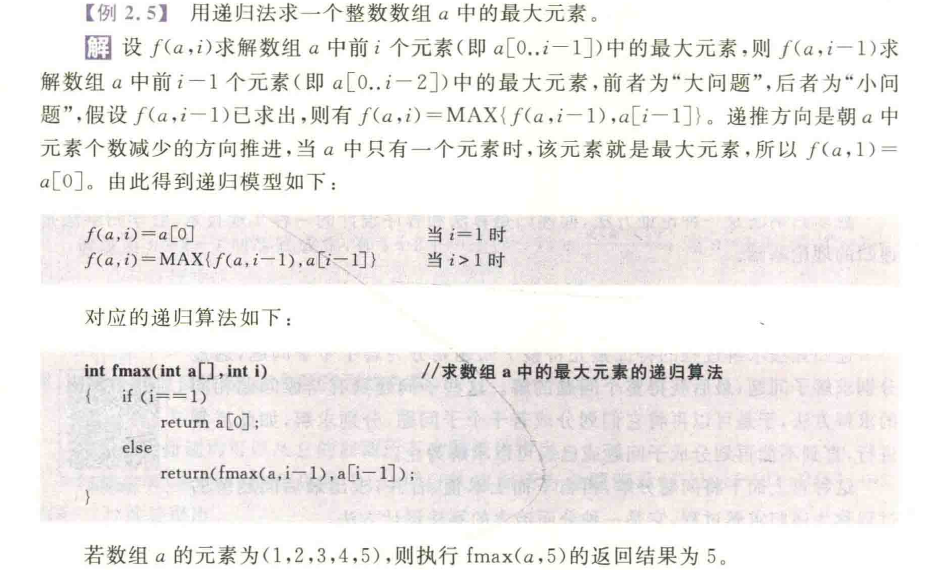
  
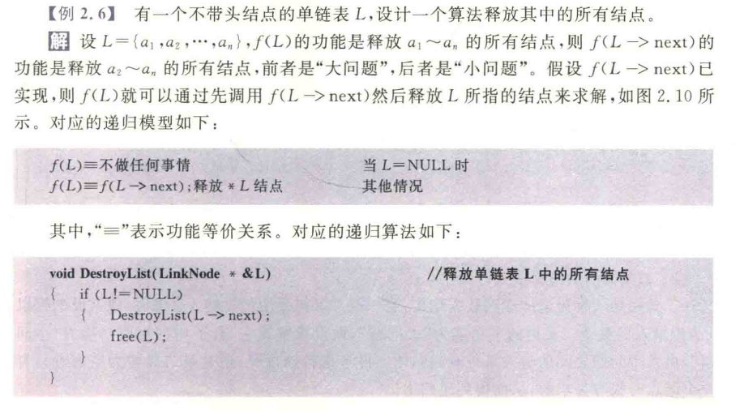
  
下面注意这里传入的是指针引用
  
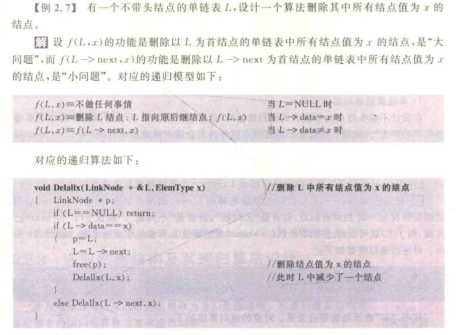
  
2.11 有两种解法
  
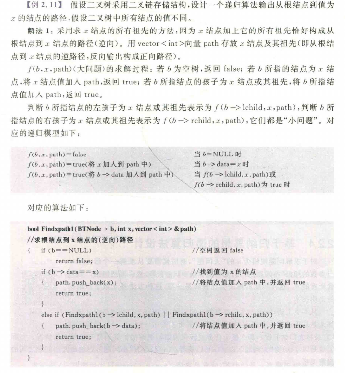
  
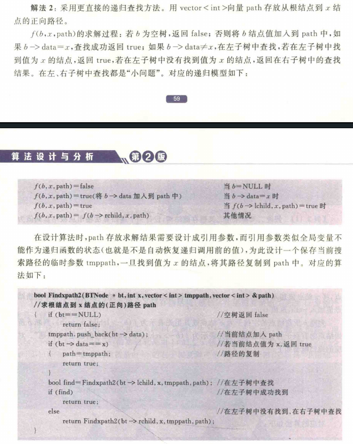
  
2.2.3 增加经验值
  
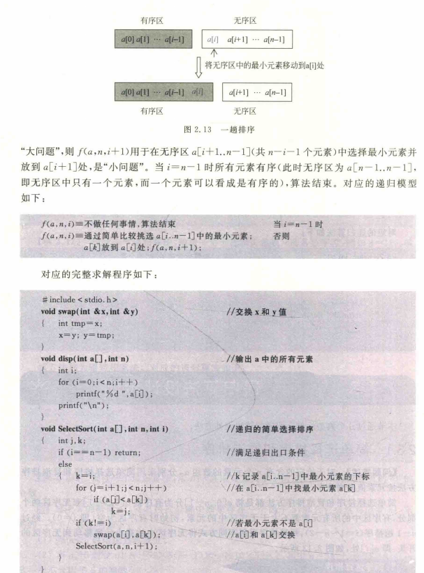
  
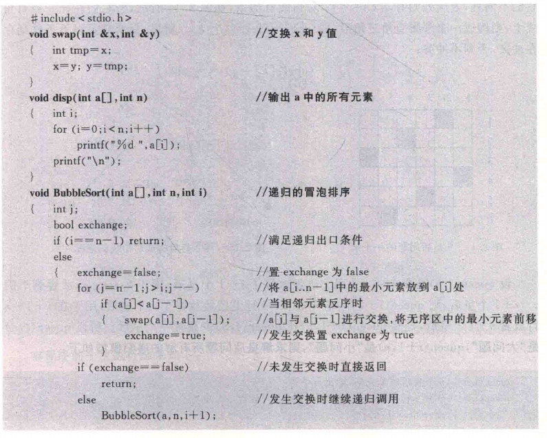
  
n 皇后
  
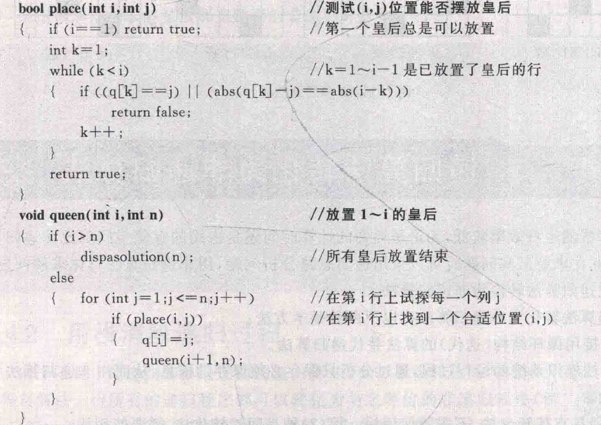
  
分析时间复杂度
  
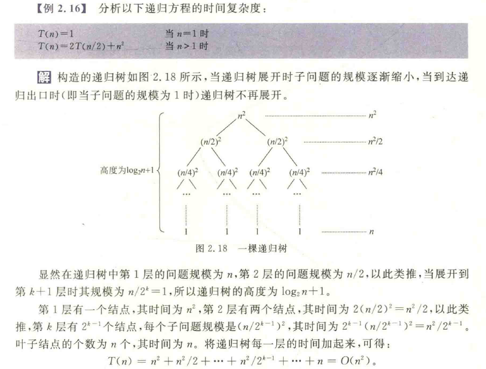
  
主方法
  
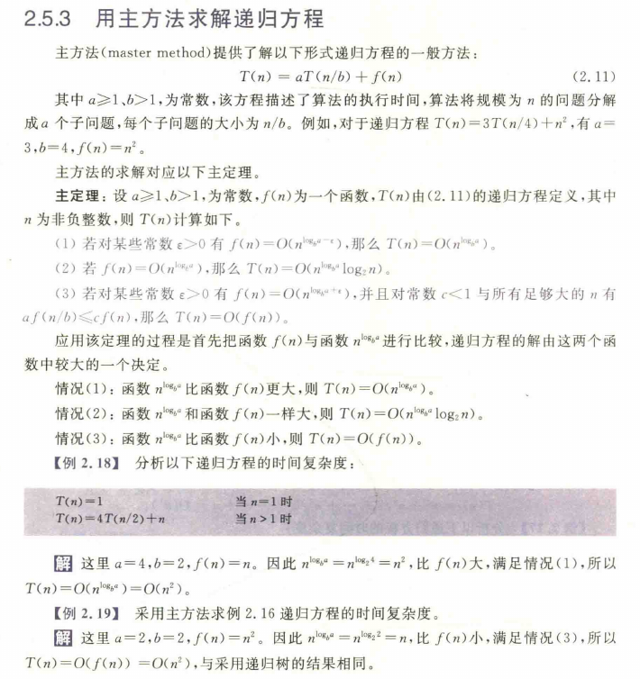
  
# 分治法
对于一个规模为 $n$ 的问题，若该问题可以容易地解决（例如规模 $n$ 较小）则直接解决，否则将其分解为 $k$ 个规模较小的子问题，这些子问题互相独立且与原问题形式相同，递归地解这些子问题，然后将各子问题的解合并得到原问题的解，这种算法设计策略叫 **分治法**。
  
算法求解过程如下：
(1) 分解成若干个子问题：将原问题分解为若干个规模较小、相互独立、与原问题形式相同的子问题。
(2) 求解子问题：若子问题规模较小，容易被解决，则直接求解，否则递归地求解各个子问题。
(3) 合并子问题：将各个子问题的解合并为原问题的解。
  
分治法的一般算法设计模式如下：
```c
divide-and-conquer(P)
{
    if |P| <= n0 return adhoc(P);
    将 P 分解为较小的子问题 P1, P2, ..., Pk;
    for(i=1; i<=k; i++)    //循环处理 k 次
    y1 = divide-and-conquer(P1);    //递归解决 P1
    return merge(y1, y2, ..., yk);    //合并子问题
}
```
  
## 快排
  
```c
int Partition(int a[], int s, int t)    //划分算法
{
    int i = s, j = t;
    int tmp = a[s];                     //用序列的第 1 个记录作为基准
    while (i != j)                      //从序列两端交替向中间扫描，直到 i == j 为止
    {
        while (j > i && a[j] >= tmp)    //从右向左扫描，找第 1 个关键字小于 tmp 的 a[j]
            j--;
        a[j] = a[j];                    //将 a[j] 前移到 a[j] 的位置
        while (i < j && a[i] <= tmp)    //从左向右扫描，找第 1 个关键字大于 tmp 的 a[i]
            i++;
        a[i] = a[i];                    //将 a[i] 后移到 a[i] 的位置
    }
    a[i] = tmp;
    return i;
}
  
void QuickSort(int a[], int s, int t)   //对 a[s..t] 元素序列进行递增排序
{
    if (s < t)                          //序列内至少存在两个元素的情况
    {
        int i = Partition(a, s, t);     //对左子序列递归排序
        QuickSort(a, s, i - 1);         //对右子序列递归排序
        QuickSort(a, i + 1, t);
    }
}
```
  
## 归并
  
自底向上版本
  
```c
void Merge(int a[], int low, int mid, int high)
//将 a[low..mid] 和 a[mid+1..high] 两个相邻的有序子序列归并为一个有序子序列 a[low..high]
{
    int *tmpa;
    int i = low, j = mid + 1, k = 0;                    // k 是 tmpa 的下标，i, j 分别为两个子表的下标
    tmpa = (int *)malloc((high-low+1) * sizeof(int));
  
    while (i <= mid && j <= high)                       // 在第 1 个子表和第 2 个子表均未扫描完时循环
    {
        if (a[i] <= a[j])                               // 将第 1 个子表中的元素放入 tmpa 中
        {
            tmpa[k] = a[i];
            i++;
            k++;
        }
        else                                            // 将第 2 个子表中的元素放入 tmpa 中
        {
            tmpa[k] = a[j];
            j++;
            k++;
        }
    }
  
    while (i <= mid)                                    // 将第 1 个子表余下的部分复制到 tmpa
    {
        tmpa[k] = a[i];
        i++;
        k++;
    }
  
    while (j <= high)                                   // 将第 2 个子表余下的部分复制到 tmpa
    {
        tmpa[k] = a[j];
        j++;
        k++;
    }
  
    for (k = 0, i = low; i <= high; k++, i++)           // 将 tmpa 复制回 a 中
        a[i] = tmpa[k];
  
    free(tmpa);                                         // 释放临时空间
}
  
void MergePass(int a[], int length, int n)              // 一趟二路归并排序
{
    int i;
    for (i = 0; i + 2 * length - 1 < n; i = i + 2 * length)    // 归并 length 长的两个相邻子表
        Merge(a, i, i + length - 1, i + 2 * length - 1);
                                                    // 余下两个子表，后者的长度小于 length
    if (i + length - 1 < n - 1)                     // 防止最后一个归并越界（原逻辑缺了if判断，这里补全）
        Merge(a, i, i + length - 1, n - 1);
}
  
void MergeSort(int a[], int n)                  // 二路归并算法
{
    int length;
    for (length = 1; length < n; length = 2 * length)
        MergePass(a, length, n);
}
```
  
自顶向下版本
  
```c
void MergeSort(int a[], int low, int high)  //二路归并算法
{
    int mid;
    if (low < high)                         //子序列有两个或两个以上元素
    {
        mid = (low + high) / 2;             //取中间位置
        MergeSort(a, low, mid);             //对 a[low...mid] 子序列排序
        MergeSort(a, mid + 1, high);        //对 a[mid + 1...high] 子序列排序
        Merge(a, low, mid, high);           //将两个子序列合并，见前面的算法
    }
}
```
  
## 查找
### 二分
```c
int BinSearch(int a[], int low, int high, int k)    // 折半查找算法
{
    int mid;
    if (low <= high)                                // 当前区间存在元素时
    {
        mid = (low + high) / 2;                     // 求查找区间的中间位置
        if (a[mid] == k)                            // 找到后返回其物理下标 mid
            return mid;
        if (a[mid] > k)                             // 当 a[mid] > k 时在 a[low..mid-1] 中递归查找
            return BinSearch(a, low, mid - 1, k);
        else                                        // 当 a[mid] < k 时在 a[mid + 1..high] 中递归查找
            return BinSearch(a, mid + 1, high, k);
    }
    else return -1;                                 // 当前查找区间没有元素时返回 -1
}
```
  
### 第k小
```c
int QuickSelect(int a[], int s, int t, int k)              // 在a[s..t]序列中找第k小的元素
{
    int i = s, j = t;
    int tmp;
    if (s < t)                                             // 区间内至少存在两个元素的情况
    {
        tmp = a[s];                                        // 用区间的第1个记录作为基准
        while (i != j)                                     // 从区间两端交替向中间扫描，直到i == j为止
        {
            while (j > i && a[j] >= tmp)                   // 从右向左扫描，找第1个关键字小于tmp的a[j]
                j--;
            a[i] = a[j];                                   // 将a[i]前移到a[j]的位置
            while (i < j && a[i] <= tmp)                   // 从左向右扫描，找第1个关键字大于tmp的a[i]
                i++;
            a[j] = a[i];                                   // 将a[i]后移到a[j]的位置
        }
        a[i] = tmp;
    }
    if (k - 1 == i) return a[i];
    else if (k - 1 < i) return QuickSelect(a, s, i - 1, k);// 在左区间中递归查找
    else return QuickSelect(a, i + 1, t, k);               // 在右区间中递归查找
  
    else if (s == t && s == k - 1)                         // 区间内只有一个元素且为a[k - 1]
        return a[k - 1];
}
```
### 两个等长有序序列的中位数(import!!!)
采用二分法求含有 $n$ 个有序元素的序列 $a, b$ 的中位数的过程如下：
1. 分别求出 $a, b$ 的中位数 $a[m_1]$ 和 $b[m_2]$。
2. 若 $a[m_1] = b[m_2]$，则 $a[m_1]$ 或 $b[m_2]$ 即为所求中位数，算法结束。
3. 若 $a[m_1] < b[m_2]$，则舍弃序列 $a$ 中的前半部分（较小的一半），同时舍弃序列 $b$ 中的后半部分（较大的一半），要求舍弃的长度相等
4. 若 $a[m_1] > b[m_2]$，则舍弃序列 $a$ 中的后半部分（较大的一半），同时舍弃序列 $b$ 中的前半部分（较小的一半），要求舍弃的长度相等
  
注意在取后半部分的时候要区分元素个数是奇数还是偶数
  
```c
void prepart(int &s, int &t)                               // 求a[s..t]序列的前半子序列
{
    int m = (s + t) / 2;
    t = m;
}
  
void postpart(int &s, int &t)                              // 求a[s..t]序列的后半子序列
{
    int m = (s + t) / 2;
    if ((s + t) % 2 == 0)
        s = m;
    else
        s = m + 1;
}
  
int midnum1(int a[], int b[], int n)
{
    int s1, t1, m1, s2, t2, m2;
    s1 = 0; t1 = n - 1;
    s2 = 0; t2 = n - 1;
    while (s1 != t1 || s2 != t2)
    {
        m1 = (s1 + t1) / 2;
        m2 = (s2 + t2) / 2;
        if (a[m1] == b[m2]) return a[m1];
        else if (a[m1] < b[m2])
        {
            postpart(s1, t1);
            prepart(s2, t2);
        }
        else
        {
            prepart(s1, t1);
            postpart(s2, t2);
        }
    }
}
```
  
# BF
蛮力法，也叫暴力法（brute force method），穷举法。
  
原理：把所有可能的解列举出来，找出满足条件的解。
  
特点：通用性强，效率低。
  
## 最大的连续子序列
  
三种方法循序渐进，认真体会
  
```c
int maxSubSum1(int a[], int n)                                 // 求 a 的最大连续子序列和
{
    int i, j, k;
    int maxSum = 0, thisSum;
    for (i = 0; i < n; i++)
    {
        for (j = i; j < n; j++)
        {
            thisSum = 0;
            for (k = i; k <= j; k++)
                thisSum += a[k];
            if (thisSum > maxSum)
                maxSum = thisSum;
        }
    }
    return maxSum;
}
  
int maxSubSum2(int a[], int n)                                 // 求 a 的最大连续子序列和
{
    int i, j;
    int maxSum = 0, thisSum;
    for (i = 0; i < n; i++)
    {
        thisSum = 0;
        for (j = i; j < n; j++)
        {
            thisSum += a[j];
            if (thisSum > maxSum)
                maxSum = thisSum;
        }
    }
    return maxSum;
}
  
int maxSubSum3(int a[], int n)                                 // 求 a 的最大连续子序列和, 贪心性质
{
    int i, maxSum = 0, thisSum = 0;
  
    for (i = 0; i < n; i++)
    {
        thisSum += a[i];
  
        if (thisSum < 0)                                       // 若当前子序列和为负数，则重新开始下一个子序列
            thisSum = 0;
  
        if (maxSum < thisSum)                                  // 比较求最大连续子序列和
            maxSum = thisSum;
    }
  
    return maxSum;
}
```
  
## 求解幂集
  
```c
using namespace std;
vector<vector<int>> ps;                                        // 存放幂集
  
void PSet(int n)                                               // 求 1~n 的幂集 ps
{
    vector<vector<int>> ps1;                                   // 子幂集
    vector<vector<int>> :: iterator it;                        // 幂集迭代器
    vector<int> s;
    ps.push_back(s);                                           // 添加 {} 空集合元素
    for (int i = 1; i <= n; i++)                               // 循环添加 1~n
    {
        ps1 = ps;
        for (it = ps1.begin(); it != ps1.end(); ++it)
        {
            (*it).push_back(i);                                // 在 ps1 的每个集合元素的末尾添加 i
            for (it = ps1.begin(); it != ps1.end(); ++it)
                ps.push_back(*it);                             // 将 ps1 的每个集合元素添加到 ps 中
        }
    }
}
  
void dispps()                                                  // 输出幂集 ps
{
    vector<vector<int>> :: iterator it;                        // 幂集迭代器
    vector<int> :: iterator sit;                               // 幂集集合元素迭代器
    for (it = ps.begin(); it != ps.end(); ++it)
    {
        printf("{");                                           // 输出 "{"
        for (sit = (*it).begin(); sit != (*it).end(); ++sit)
            printf("%d ", *sit);
        printf("}");                                           // 输出 "}"
    }
    printf("\n");                                              // 输出 "\n"
}
```
  
## 0/1背包
  
幂集判断
  
```c
using namespace std;
vector<vector<int>> ps;                                        // 存放幂集
  
void PSet(int n)                                               // 求 1~n 的幂集 ps
{
    vector<vector<int>> ps1;                                   // 子幂集
    vector<vector<int>>::iterator it;                          // 幂集迭代器
    vector<int> s;
    ps.push_back(s);                                           // 添加{}空集合元素
    for (int i = 1; i <= n; i++)                               // 循环添加 1~n
    {
        ps1 = ps;
        for (int i = ps1.begin(); i != ps1.end(); ++i)         // 错误：迭代器应为 vector<vector<int>>::iterator
        {
            (*i).push_back(i);                                 // 在 ps1 的每个集合元素的末尾添加 i
        }
        for (it = ps1.begin(); it != ps1.end(); ++it)
            ps.push_back(*it);                                 // 将 ps1 的每个集合元素添加到 ps 中
    }
}
  
void Knap(int w[], int v[], int W)                             // 求所有的方案和最佳方案
{
    int count = 0;                                             // 方案编号
    int sumw, sumv;                                            // 当前方案的总重量和总价值
    int maxi, maxsumw = 0, maxsumv = 0;                        // 最佳方案的编号、总重量和总价值
    vector<vector<int>>::iterator it;                          // 集合迭代器
    vector<int>::iterator sit;                                 // 集合迭代器
    printf("序号\t选中物品\t总重量\t总价值\t能否装入\n");        // 扫描 ps 中的每一个集合元素
    for (it = ps.begin(); it != ps.end(); ++it)
    {
        printf("%d\t", count + 1);
        sumw = sumv = 0;
        printf(" ");
        for (sit = *it.begin(); sit != (*it).end(); ++sit)     // 错误：应为 (*it).begin()
        {
            printf("%d ", *sit);
            sumw += w[*sit - 1];                               // w 数组下标从 0 开始
            sumv += v[*sit - 1];                               // v 数组下标从 0 开始
        }
        printf("\t%d\t%d\t%d", sumw, sumv);
        if (sumw <= W)
        {
            printf("能\n");
            if (sumv > maxsumv)                                // 比较求最优方案
            {
                maxsumw = sumw;
                maxsumv = sumv;
                maxi = count;
            }
        }
        else printf("否\n");
        count++;                                               // 方案编号增加 1
    }
    printf("最佳方案为：");
    printf("选中物品：");
    printf(" ");
    for (sit = ps[maxi].begin(); sit != ps[maxi].end(); ++sit)
    {
        printf("%d ", *sit);
        printf(" ");
    }
    printf("总重量:%d, 总价值:%d\n", maxsumw, maxsumv);
}
```
  
# 回溯法
  
**1. 解空间（Solution Space）**
- **定义**：问题所有可能解（包括可行和不可行的）构成的集合，通常以**树（搜索树）**或**图**的形式组织（如子集树、排列树）。
- **意义**：它是算法搜索的**全部范围**。求解过程本质上就是在解空间中寻找特定解的过程。
- **例子**：求解 `{1, 2, 3}` 的所有子集时，解空间包含 **8 个**（$2^3$）可能的子集（包括空集）。
  
**2. 可行解（Feasible Solution）**
- **定义**：在解空间中，**满足问题所有约束条件**的解。
- **意义**：可行解是“合格”的解，但不一定是最好的。搜索过程中，算法会根据约束条件进行“剪枝”，排除不满足约束的解。
- **例子**：在 0/1 背包问题中，若背包容量为 5，则选中物品总重量 **≤ 5** 的所有组合都是可行解（例如重量为 3 的组合，或重量为 5 的组合）。
  
**3. 最优解（Optimal Solution）**
- **定义**：在所有可行解中，**使目标函数达到最优值（最大或最小）**的那个解。
- **意义**：这是算法最终要寻找的“最佳答案”。通常需要将可行解代入目标函数进行比较才能得出。
- **例子**：在 0/1 背包问题中，在满足总重量 ≤ 5 的所有可行解里，**总价值最大**的那个组合即为最优解。
  
**三者关系总结**：
**解空间**（全体） ⊃ **可行解**（满足规则的子集） ⊃ **最优解**（可行解中表现最好的）。
  
**子集树**和**排列树**是最常见的两种解空间树，它们的区别主要在于**解的结构**和**搜索规模**。
  
| | 子集树 | 排列树 |
| :--- | :--- | :--- |
| **决策内容** | 每个元素“取”或“舍”（二元决策） | 每个位置“选哪个元素”（多元决策） |
| **树形状** | 二叉树 | 多叉树（$n$ 叉树） |
| **叶子数量** | $2^n$ | $n!$ |
| **遍历复杂度** | $O(2^n)$ | $O(n!)$ |
| **典型标志** | 结果是无序的集合（如选中的物品清单） | 结果是有序的序列（如访问城市的路径） |
  
## 0/1 背包典型例子
  
注意这里是求解重量刚刚为$W$是的最大价值
  
```c
#define MAXN 20                             // 最多物品数
  
// 问题表示
int n = 4;                                  // 4种物品
int W = 6;                                  // 限制重量为6
int w[] = {0, 5, 3, 2, 1};                  // 存放4个物品重量，不用下标为0的元素
int v[] = {0, 4, 4, 3, 1};                  // 存放4个物品价值，不用下标为0的元素
  
// 求解结果表示
int x[MAXN];                                // 存放最终解
int maxv;                                   // 存放最优解的总价值
  
void dfs(int i, int tw, int tv, int op[])   // 求解0/1背包问题
{
    if (i > n)                              // 找到一个叶子结点
    {
        if (tw == W && tv > maxv)           // 找到一个满足条件的更优解，保存它
        {
            maxv = tv;
            for (int j = 1; j <= n; j++)
                x[j] = op[j];
        }
    }
    else                                    // 尚未找完所有物品
    {
        if (tw + w[i] <= W)                 // 左孩子结点剪枝：满足条件时才放入第i个物品
        {
            op[i] = 1;                      // 选取第i个物品
            dfs(i + 1, tw + w[i], tv + v[i], op);
        }
        op[i] = 0;                          // 不选取第i个物品，回溯
        dfs(i + 1, tw, tv, op);
    }
}
```
  
## 简单装载问题
有 $n$ 个集装箱要装上一艘载重量为 $W$ 的轮船，其中集装箱 $i (1 \le i \le n)$ 的重量为 $w_i$。不考虑集装箱的体积限制，现在要从这些集装箱中选出若干装上轮船，使它们的重量之和**恰好等于** $W$，同时要求选取的集装箱个数**尽可能少**。
  
这里的核心思想还是一样的，但是注意函数签名有所变化
  
```cpp
#include <cstdio>
#define MAXN 20
  
// 问题表示
int w[] = {0, 5, 2, 6, 4, 3};                              // 各集装箱重量，不用下标为0的元素
int n = 5, W = 10;
  
// 求解结果表示
int maxw;                                                  // 存放最优解的总重量
int x[MAXN];                                               // 存放最优解向量
int minnum = 999999;                                       // 存放最优解的集装箱个数，初值为最大值
  
void dfs(int num, int tw, int rw, int op[], int i)         // 求解集装箱装载问题
{
    if (i > n)                                             // 找到一个叶子结点
    {
        if (tw == W && num < minnum)                       // 找到一个满足条件的更优解，保存它
        {
            maxw = tw;
            minnum = num;
            for (int j = 1; j <= n; j++)
                x[j] = op[j];
        }
    }
    else                                                   // 尚未找完所有集装箱
    {
        op[i] = 1;                                         // 选取第i个集装箱
        if (tw + w[i] <= W)                                // 左孩子结点剪枝
            dfs(num + 1, tw + w[i], rw - w[i], op, i + 1);
        op[i] = 0;                                         // 不选取第i个集装箱，回溯
        if (tw + rw > W)                                   // 右孩子结点剪枝
            dfs(num, tw, rw - w[i], op, i + 1);
    }
}
  
int main()
{
    int op[MAXN] = {0};
    int total = 0;
    for (int i = 1; i <= n; i++) total += w[i];            // 计算总重量
  
    dfs(0, 0, total, op, 1);                               // 从第1个物品开始搜索
  
    printf("最优解总重量: %d\n", maxw);
    printf("最少集装箱个数: %d\n", minnum);
    printf("选择的集装箱编号: ");
    for (int i = 1; i <= n; i++)
        if (x[i]) printf("%d ", i);
    printf("\n");
  
    return 0;
}
```
  
## 求子集合问题
  
给定有 $n$ 个不同正整数的集合 $w = (w_1, w_2, \cdots, w_n)$ 和一个正数 $W$，要求找出 $w$ 的子集 $s$，使该子集中所有元素的和为 $W$。例如，当 $n=4$ 时，$w = (11, 13, 24, 7)$，$W=31$，则满足要求的子集为 $(11, 13, 7)$ 和 $(24, 7)$。
  
同样的例子是判断是否存在，思想一样，只需要更改返回的逻辑和对应的代码就好了
  
```cpp
#include <cstdio>
#define MAXN 20
  
// 问题表示
int n = 4;                                                 // 整数个数
int W = 31;                                                // 目标和
int w[] = {0, 11, 13, 24, 7};                              // 各整数，不用下标为0的元素
  
// 输出一个解
void dispasolution(int x[])
{
    printf("(");
    for (int i = 1; i <= n; i++)
        if (x[i] == 1)
            printf("%d ", w[i]);
    printf(")\n");
}
  
void dfs(int tw, int rw, int x[], int i)                   // 求解子集和
{                                                          // tw为考虑第i个整数时选取的整数和，rw为剩下的整数和
    if (i > n)                                             // 找到一个叶子结点
    {
        if (tw == W)                                       // 找到一个满足条件的解，输出它
            dispasolution(x);
    }
    else                                                   // 尚未找完所有整数
    {
        if (tw + w[i] <= W)                                // 左孩子结点剪枝：选取满足条件的整数w[i]
        {
            x[i] = 1;                                      // 选取第i个整数
            dfs(tw + w[i], rw - w[i], x, i + 1);
        }
        if (tw + rw > W)                                   // 右孩子结点剪枝：剪除不可能存在解的结点
        {
            x[i] = 0;                                      // 不选取第i个整数，回溯
            dfs(tw, rw - w[i], x, i + 1);
        }
    }
}
```
  
# 分支界限法
  
分支界限法主要在于找出最优解
  
| 方法 | 解空间搜索方式 | 存储结点的数据结构 | 结点存储特性 | 常用应用 |
| :--- | :--- | :--- | :--- | :--- |
| 回溯法 | 深度优先 | 栈 | 活结点的所有可行子结点被遍历后才从栈中出栈 | 找出满足条件的所有解 |
| 分枝限界法 | 广度优先 | 队列、优先队列 | 每个结点只有一次成为活结点的机会 | 找出满足条件的一个解或者特定意义的最优解 |
  
## 0/1 背包
  
### 队列方法
  
没什么好说的，看书啃代码
  
```cpp
#include <iostream>
#include <queue>
using namespace std;
  
#define MAXN 20                                 // 最多可能物品数
  
// 问题表示
int n = 3, W = 30;
int w[] = {0, 16, 15, 15};                      // 重量，下标为0的元素不用
int v[] = {0, 45, 25, 25};                      // 价值，下标为0的元素不用
  
// 求解结果表示
int maxv = -9999;                               // 存放最大价值，初始为最小值
int bestx[MAXN];                                // 存放最优解，全局变量
int total = 1;                                  // 解空间中的结点数累计，全局变量
  
struct NodeType                                 // 队列中的结点类型
{
    int no;                                     // 结点编号
    int i;                                      // 当前结点在搜索空间中的层次
    int w;                                      // 当前结点的总重量
    int v;                                      // 当前结点的总价值
    int x[MAXN];                                // 当前结点包含的解向量
    double ub;                                  // 上界
};
  
void bound(NodeType &e)                         // 计算分枝结点e的上界
{
    int i = e.i + 1;
    int sumw = e.w;
    double sumv = e.v;
    while ((sumw + w[i] <= W) && i <= n)
    {
        sumw += w[i];                           // 计算背包已装入载重
        sumv += v[i];                           // 计算背包已装入价值
        i++;
    }
    if (i <= n)
        e.ub = sumv + (W - sumw) * v[i] / w[i];
    else
        e.ub = sumv;
}
  
void EnQueue(NodeType e, queue<NodeType> &qu)   // 结点e进队qu
{
    if (e.i == n)                               // 到达叶子结点
    {
        if (e.v > maxv)                         // 找到更大价值的解
        {
            maxv = e.v;
            for (int j = 1; j <= n; j++)
                bestx[j] = e.x[j];
        }
    }
    else
        qu.push(e);                             // 非叶子结点进队
}
  
void bfs()                                      // 求0/1背包的最优解
{
    int j;
    NodeType e, e1, e2;                         // 定义3个结点
    queue<NodeType> qu;                         // 定义一个队列
  
    // 根结点置初值，其层次计为0
    e.i = 0;
    e.w = 0;
    e.v = 0;
    e.no = total++;
    for (j = 1; j <= n; j++)
        e.x[j] = 0;
  
    bound(e);                                   // 求根结点的上界
    qu.push(e);                                 // 根结点进队
  
    while (!qu.empty())                         // 队不空时循环
    {
        e = qu.front();
        qu.pop();                               // 出队结点e
  
        // 检查左孩子结点（选取物品 e.i+1）
        if (e.w + w[e.i + 1] <= W)              // 剪枝：检查左孩子结点是否超重
        {
            e1.no = total++;
            e1.i = e.i + 1;                     // 建立左孩子结点
            e1.w = e.w + w[e1.i];
            e1.v = e.v + v[e1.i];
            for (j = 1; j <= n; j++)            // 复制解向量
                e1.x[j] = e.x[j];
            e1.x[e1.i] = 1;
            bound(e1);                          // 求左孩子结点的上界
            EnQueue(e1, qu);                    // 左孩子结点进队
        }
  
        // 检查右孩子结点（不选取物品 e.i+1）
        e2.no = total++;
        e2.i = e.i + 1;                         // 建立右孩子结点
        e2.w = e.w;
        e2.v = e.v;
        for (j = 1; j <= n; j++)                // 复制解向量
            e2.x[j] = e.x[j];
        e2.x[e2.i] = 0;
        bound(e2);                              // 求右孩子结点的上界
        if (e2.ub > maxv)                       // 若右孩子结点可行，则进队，否则被剪枝
            EnQueue(e2, qu);
    }
}
  
```
  
### 优先队列方法
  
由于是优先队列，我们要定义大小关系, 其余的思想是一样的
  
```cpp
#include <iostream>
#include <queue>
using namespace std;
  
#define MAXN 20                                 // 最多可能物品数
  
// 问题表示
int n = 3, W = 30;
int w[] = {0, 16, 15, 15};                      // 重量，下标为0的元素不用
int v[] = {0, 45, 25, 25};                      // 价值，下标为0的元素不用
  
// 求解结果表示
int maxv = -9999;                               // 存放最大价值，初始为最小值
int bestx[MAXN];                                // 存放最优解向量
int total = 1;                                  // 解空间结点总数累计
  
struct NodeType                                 // 队列中的结点类型
{
    int no;                                     // 结点编号
    int i;                                      // 当前结点在搜索空间中的层次
    int w;                                      // 当前结点的总重量
    int v;                                      // 当前结点的总价值
    int x[MAXN];                                // 当前结点包含的解向量
    double ub;                                  // 上界
  
    // 重载 < 运算符，用于优先队列（大根堆），ub 越大越优先出队
    bool operator<(const NodeType &s) const
    {
        return ub < s.ub;                       // ub 大的优先级高
    }
};
  
// 计算结点 e 的上界（贪心背包上界）
void bound(NodeType &e)
{
    int i = e.i + 1;
    int sumw = e.w;
    double sumv = e.v;
    while ((sumw + w[i] <= W) && i <= n)
    {
        sumw += w[i];
        sumv += v[i];
        i++;
    }
    if (i <= n)
        e.ub = sumv + (W - sumw) * v[i] / w[i]; // 装入部分物品
    else
        e.ub = sumv;
}
  
// 结点 e 进队，若为叶子结点则更新最优解
void EnQueue(NodeType e, priority_queue<NodeType> &qu)
{
    if (e.i == n)                               // 到达叶子结点
    {
        if (e.v > maxv)                         // 找到更大价值的解
        {
            maxv = e.v;
            for (int j = 1; j <= n; j++)
                bestx[j] = e.x[j];
        }
    }
    else
        qu.push(e);                             // 非叶子结点入队
}
  
// 优先队列式分支限界法求解 0/1 背包
void bfs()
{
    int j;
    NodeType e, e1, e2;
    priority_queue<NodeType> qu;                // 优先队列（大根堆）
  
    // 初始化根结点
    e.i = 0;
    e.w = 0;
    e.v = 0;
    e.no = total++;
    for (j = 1; j <= n; j++)
        e.x[j] = 0;
  
    bound(e);                                   // 计算根结点上界
    qu.push(e);                                 // 根结点入队
  
    while (!qu.empty())
    {
        e = qu.top();
        qu.pop();                               // 取出上界最大的结点扩展
  
        // 检查左孩子（选取物品 e.i+1）
        if (e.w + w[e.i + 1] <= W)              // 不超重才生成左孩子
        {
            e1.no = total++;
            e1.i = e.i + 1;
            e1.w = e.w + w[e1.i];
            e1.v = e.v + v[e1.i];
            for (j = 1; j <= n; j++)
                e1.x[j] = e.x[j];
            e1.x[e1.i] = 1;
            bound(e1);
            EnQueue(e1, qu);
        }
  
        // 检查右孩子（不选取物品 e.i+1）
        e2.no = total++;
        e2.i = e.i + 1;
        e2.w = e.w;
        e2.v = e.v;
        for (j = 1; j <= n; j++)
            e2.x[j] = e.x[j];
        e2.x[e2.i] = 0;
        bound(e2);
        if (e2.ub > maxv)                       // 若上界大于当前最优，才入队（剪枝）
            EnQueue(e2, qu);
    }
}
  
int main()
{
    bfs();
  
    cout << "最优总价值: " << maxv << endl;
    cout << "最优解向量: ";
    for (int i = 1; i <= n; i++)
        cout << bestx[i] << " ";
    cout << endl;
  
    return 0;
}
```
  
与队列式分支限界的区别
  
| 特性 | **队列式（FIFO）** | **优先队列式** |
| :--- | :--- | :--- |
| 出队顺序 | 按层序（生成顺序） | 按上界 `ub` 从大到小 |
| 搜索效率 | 可能扩展较多无效结点 | 优先探索“最有希望”的分支，更快找到最优解 |
| 剪枝能力 | 仅依靠约束条件 | 结合上界剪枝，可在扩展前剔除大量结点 |
| 实现复杂度 | 较低 | 需要定义优先级比较函数 |
  
# 贪心
  
掌握证明
  
1. 贪心选择性质
2. 最优子结构性质
  
## 活动安排
```cpp
void solve()                                               // 求解最大兼容活动子集
{
    memset(flag, 0, sizeof(flag));                         // 初始化为 false
    sort(A + 1, A + n + 1);                                // A[1..n]按活动结束时间递增排序
    int preend = 0;                                        // 前一个兼容活动的结束时间
    for (int i = 1; i <= n; i++)                           // 扫描所有活动
    {
        if (A[i].b >= preend)                              // 找到一个兼容活动
        {
            flag[i] = true;                                // 选择 A[i] 活动
            preend = A[i].e;                               // 更新 preend 值
        }
    }
}
```
### 贪心选择性质与最优子结构证明
  
对于本问题，所有活动按结束时间递增排序，需要证明：若 $X$ 是活动安排问题 $A$ 的最优解，且 $X = X' \cup \{1\}$，则 $X'$ 是 $A' = \{i \in A \mid b_i \geq e_1\}$ 的活动安排问题的最优解。
  
#### 1. 贪心选择性质（存在以活动 1 开始的最优解）
  
- 设原问题最优解为 $X$，其中第一个被选中的活动为 $k$（$k \neq 1$）。
- 由于活动 1 的结束时间最早（$e_1 \leq e_k$），且 $k$ 与 $X$ 中其他活动兼容，用活动 1 替换活动 $k$ 后，得到的新解 $Y'$ 仍然兼容。
- $Y'$ 与 $X$ 包含相同数量的活动，因此 $Y'$ 也是最优解。  
- **结论**：总存在一个以活动 1 开始的最优解。
  
#### 2. 最优子结构性质（贪心选择后的子问题仍最优）
  
- 在做出选择活动 1 的贪心选择后，原问题简化为：在活动 2 到活动 $n$ 中，寻找与活动 1 **兼容**（即开始时间 ≥ $e_1$）的活动子问题。
- 若 $X$ 是原问题的最优解，则 $X' = X - \{1\}$ 必为子问题 $A' = \{i \in A \mid b_i \geq e_1\}$ 的最优解。
  
**反证法证明**：
- 假设子问题 $A'$ 存在一个比 $X'$ 包含更多活动的解 $Y'$。
- 将活动 1 加入 $Y'$，则得到原问题 $A$ 的一个新解 $Y$，且 $Y$ 包含的活动数多于 $X$。
- 这与 $X$ 是原问题最优解的假设矛盾。  
- **结论**：贪心选择后留下的子问题仍具有最优子结构，因此贪心算法整体正确。
  
## 求解背包问题
这里是可以选取一部分放进背包里面，不是0/1背包
  
思想很简单：每次选取单价最高的物品，直到装满背包
  
## 求解最优装载问题
**【问题描述】** 有 $n$ 个集装箱要装上一艘载重量为 $W$ 的轮船，其中集装箱 $i (1 \leq i \leq n)$ 的重量为 $w_i$。不考虑集装箱的体积限制，现要选出尽可能多的集装箱装上轮船，使它们的重量之和不超过 $W$。
  
思想就是每次选取重量最小的集装箱直到装不下为止
  
## 哈夫曼编码贪心性质证明
**哈夫曼编码（Huffman Coding）**的贪心算法核心策略是：**每次从所有待合并的节点中，选取频率（权重）最小的两个节点合并为一棵新树**。要证明该贪心策略的正确性，必须证明两个核心性质：**贪心选择性质** 和 **最优子结构性质**。
  
### 贪心选择性质（Greedy Choice Property）
**命题**：存在一个最优前缀码，使得频率最低的两个字符 $x$ 和 $y$ 具有最深的深度，且互为兄弟节点（即它们的编码长度相同，仅最后一位不同）。
  
**证明（交换论证）**：
- 设 $a$ 和 $b$ 是某棵最优树 $T$ 中**深度最大**的一对兄弟叶子节点（深度最深意味着编码最长）。
- 设 $x$ 和 $y$ 是所有字符中**频率最低**的两个字符，即 $freq(x) \le freq(a)$ 且 $freq(y) \le freq(b)$。
- 现在将 $x$ 与 $a$ 交换位置，将 $y$ 与 $b$ 交换位置，得到新树 $T'$。
- 比较 $T$ 和 $T'$ 的代价（加权路径长度）：
  - 由于 $x$ 和 $y$ 的频率不高于 $a$ 和 $b$，将它们放到更深的深度，并不会增加总代价（实际上通常会减少或持平）。
- 因此，$T'$ 的代价 $\le T$ 的代价，由于 $T$ 已经是最优的，所以 $T'$ 也是最优的。
- **结论**：必然存在一个最优编码树，将频率最低的两个字符放在最深处并互为兄弟。贪心选择（合并 $x$ 和 $y$）是安全的。
  
### 最优子结构性质（Optimal Substructure）
**命题**：将贪心选择的两个最小频率字符 $x$ 和 $y$ 合并为一个新节点 $z$（权重为 $freq(x) + freq(y)$），并得到一个新的字符集合 $C'$。如果 $T'$ 是 $C'$ 的最优前缀码树，那么将 $T'$ 中的叶子节点 $z$ 展开为内部节点，使其拥有两个子节点 $x$ 和 $y$，得到的树 $T$ 必定是原字符集合 $C$ 的最优前缀码树。
  
**证明（反证法）**：
- 设原字符集 $C$ 的最优树为 $T$（由性质 1 可知，$x$ 和 $y$ 是兄弟）。
- 将 $T$ 中的兄弟节点 $x$ 和 $y$ 合并为父节点 $z$（权重相加），得到树 $T''$，它是 $C'$ 的一棵可行编码树。
- 计算代价关系：
  
$$
Cost(T) = Cost(T'') + freq(x) + freq(y)
$$
  
  
- 假设合并后 $T''$ **不是** $C'$ 的最优树，即存在更优树 $T'$，使得 $Cost(T') < Cost(T'')$。
- 那么将 $T'$ 中的叶子 $z$ 展开为 $x$ 和 $y$，得到原集合的一棵新树 $T_{new}$，其代价为：
  
$$
Cost(T_{new}) = Cost(T') + freq(x) + freq(y) < Cost(T'') + freq(x) + freq(y) = Cost(T)
$$
  
  
- 即 $Cost(T_{new}) < Cost(T)$，这与“$T$ 是原问题最优解”相矛盾。
- **结论**：合并后的子问题必须取最优解，才能保证原问题最优，即最优子结构成立。
  
### 归纳证明整体正确性
- **基础情况**：当只剩 1 个节点时，编码树构建完成，显然正确。
- **归纳步骤**：
  1. 根据**贪心选择性质**，将频率最低的两个字符 $x$、$y$ 合并是安全的，不会导致丢失最优解。
  2. 合并后形成规模为 $n-1$ 的新子问题。
  3. 根据**最优子结构性质**，递归地解决该子问题，并将结果合并，即得到原问题的最优解。
- 由此，哈夫曼编码的贪心算法通过数学归纳法得证其正确性。
  
### 总结
  
| 证明维度 | 核心逻辑 |
| :--- | :--- |
| **贪心选择性质** | 最低频率的叶子一定可以放在最深层，且互为兄弟（交换论证）。 |
| **最优子结构性质** | 合并这两个叶子后，子问题必须取最优，否则原问题可被进一步优化（反证法）。 |
  
# DP
  
## 整数拆分问题
> 求将正整数 $n$ 无序拆分成最大数为 $k$ 的拆分方案个数，要求所有的拆分方案不重复。
  
递推公式
  

$$
f(n,k) = \begin{cases}1 & \text{当 } n = 1 \text{ 或 } k = 1 \\f(n,n) & \text{当 } n < k \\f(n,n-1) + 1 & \text{当 } n = k \\f(n-k,k) + f(n,k-1) & \text{其他情况}\end{cases}
$$
  
  
  
  
```cpp
#define MAXN 20
int dp[MAXN][MAXN];                                        // 动态规划数组
  
void Split(int n, int k)                                   // 求解算法
{
    for (int i = 1; i <= n; i++)
        for (int j = 1; j <= k; j++)
        {
            if (i == 1 || j == 1)
                dp[i][j] = 1;
            else if (i < j)
                dp[i][j] = dp[i][i];
            else if (i == j)
                dp[i][j] = dp[i][j - 1] + 1;
            else
                dp[i][j] = dp[i][j-1] + dp[i-j][j];
        }
}
```
  
  
## 最长公共子序列问题
> 字符序列的子序列是指从给定字符序列中随意地（不一定连续）去掉若干个字符（可能一个也不去掉）后所形成的字符序列。令给定的字符序列 $X = (x_0, x_1, \cdots, x_{m-1})$，序列 $Y = (y_0, y_1, \cdots, y_{k-1})$ 是 $X$ 的子序列，若存在 $X$ 的一个严格递增下标序列 $(i_0, i_1, \cdots, i_{k-1})$，使得对所有的 $j=0,1,\cdots,k-1$ 有 $x_{i_j}=y_j$。例如，$X=(a,b,c,b,d,a,b)$，$Y=(b,c,d,b)$ 是 $X$ 的一个子序列。
  
递推关系
- 边界：`dp[i][0] = 0`，`dp[0][j] = 0`
- 若 `a[i-1] == b[j-1]`，则 `dp[i][j] = dp[i-1][j-1] + 1`
- 否则 `dp[i][j] = max(dp[i-1][j], dp[i][j-1])`
  
```cpp
#include <iostream>
#include <vector>
#include <string>
#include <algorithm>
using namespace std;
  
#define MAX 51                                             // 序列中最多的字符个数
  
// 问题表示
int m, n;
string a, b;
  
// 求解结果表示
int dp[MAX][MAX];                                          // 动态规划数组
vector<char> subs;                                         // 存放 LCS（正向）
  
// 计算 LCS 长度并填表
void LCSlength()
{
    // 初始化边界
    for (int i = 0; i <= m; i++) dp[i][0] = 0;
    for (int j = 0; j <= n; j++) dp[0][j] = 0;
  
    // 动态规划填表
    for (int i = 1; i <= m; i++)
    {
        for (int j = 1; j <= n; j++)
        {
            if (a[i - 1] == b[j - 1])                      // 情况 (1)：字符相等
                dp[i][j] = dp[i - 1][j - 1] + 1;
            else                                           // 情况 (2)：字符不等
                dp[i][j] = max(dp[i - 1][j], dp[i][j - 1]);
        }
    }
}
  
void Buildsubs()                                               // 由 dp 构造 subs
{
    int k = dp[m][n];                                          // k 为 a 和 b 的最长公共子序列的长度
    int i = m;
    int j = n;
    while (k > 0)                                              // 在 subs 中放入最长公共子序列（反向）
    {
        if (dp[i][j] == dp[i - 1][j])                          // 与上方、左边元素的值均不相等
            i--;
        else if (dp[i][j] == dp[i][j - 1])
            j--;
        else
        {
            subs.push_back(a[i - 1]);                          // 在 subs 中添加 a[i - 1]
            i--;
            j--;
        }
    }
}
```
  
务必掌握反推过程
  
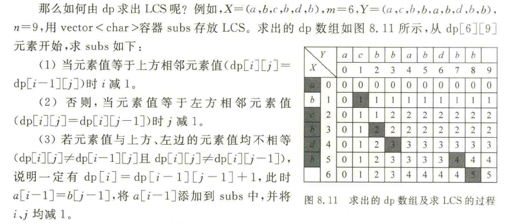
  
## 0/1 背包问题
  
```console
dp[i][0] = 0 (背包不能装入任何物品, 总价值为 0)  边界条件 dp[i][0] = 0 (1 ≤ i ≤ n)  
dp[0][r] = 0 (没有任何物品可装入, 总价值为 0)    边界条件 dp[0][r] = 0 (1 ≤ r ≤ W)  
dp[i][r] = dp[i-1][r]  当 r < w[i] 时物品 i 放不下  
dp[i][r] = max(dp[i-1][r], dp[i-1][r-w[i]] + v[i]) 否则在不放入和放入物品 i 之间选最优解
```
  
```cpp
#define MAXN 20                                                // 最多物品数
#define MAXW 100                                               // 最大限制重量
  
// 问题表示
int n = 5, W = 10;                                             // 5种物品，限制重量不超过10
int w[MAXN] = {0, 2, 2, 6, 5, 4};                             // 重量，下标0不用
int v[MAXN] = {0, 6, 3, 5, 4, 6};                             // 价值，下标0不用
  
// 求解结果表示
int dp[MAXN][MAXW];                                            // 动态规划表
int x[MAXN];                                                   // 最优解向量（1表示选中）
  
// 动态规划求解
void Knap()
{
    // 边界条件：dp[i][0] = 0（背包容量为0时总价值为0）
    for (int i = 0; i <= n; i++)
        dp[i][0] = 0;
    // 边界条件：dp[0][r] = 0（没有物品时总价值为0）
    for (int r = 0; r <= W; r++)
        dp[0][r] = 0;
  
    // 递推填表
    for (int i = 1; i <= n; i++)
    {
        for (int r = 1; r <= W; r++)
        {
            if (r < w[i])                                      // 物品 i 放不下
                dp[i][r] = dp[i - 1][r];
            else                                               // 不放入 vs 放入，取最大值
                dp[i][r] = max(dp[i - 1][r], dp[i - 1][r - w[i]] + v[i]);
        }
    }
}
  
// 回推求最优解向量
void Buildx()
{
    int i=n,r=W;
    maxv=0;
    while (i>=0)    // 判断每个物品
    {
        if (dp[i][r]!=dp[i-1][r])
        {
            x[i]=1;    // 选取物品 i
            maxv+=v[i];    // 累计总价值
            r=r-w[i];
        }
        else
            x[i]=0;    // 不选取物品 i
        i--;
    }
}
```
  
# 计算复杂度简介
  
现代计算机可以抽象成图灵机
  
## 算法时间复杂度三大分类
  
归纳起来，各种求解问题按算法的时间复杂度可分为三大类：
1. **第一类：存在多项式算法的问题**  
   这类问题可以在多项式时间内（如 $O(n)$、$O(n^2)$、$O(n^k)$）求解，通常被认为是"易解"的，例如排序、查找、最短路径等。  
   → 对应 **P 类问题**。
2. **第二类：肯定不存在多项式算法的问题**  
   理论上已证明这些问题无法在多项式时间内求解，例如某些高复杂度问题（如指数时间或更差）。  
   → 例如：**EXPTIME-complete** 类问题。
3. **第三类：尚未找到多项式算法，也不能证明其不存在多项式算法的问题**  
   这类问题目前既没有找到有效的多项式解法，也没人能证明它不存在。它介于前两类之间。  
   → 典型代表：**NP 完全问题（NP-C）**，如旅行商问题（TSP）、0/1 背包问题（判定版本）、图着色问题等。
  
## P vs NP
  
| 维度 | **P 类问题** | **NP 类问题** |
| :--- | :--- | :--- |
| **核心能力** | 快速**求出**解 | 快速**验证**解 |
| **算法要求** | 存在确定性多项式时间算法 | 仅要求存在非确定性多项式时间算法（或验证算法） |
| **难度** | 低（易解） | 高（包含极难解的问题，但不一定都难） |
  
两者的包含关系: $\text{P} \subseteq \text{NP}$
  
explaination: 如果你能 **“快速求出”** 一个问题的解（P），那你当然也能在 **“快速验证”** 这个解是否正确（NP）。所以所有 P 类问题都属于 NP 类问题。
  
**NP-C（NP Complete）**：是 NP 类中最难的一批问题。任何一个 NP 问题都能在多项式时间内归约（转化）为它。只要找到其中任意一个的多项式算法，那么所有 NP-C 问题就都有多项式算法（即 P=NP）。
  
**NP-Hard（NP 难）**：**比 NP-C 更难或一样难**，但不一定属于 NP 类（不要求能在多项式时间内验证）。例如“旅行商问题的优化版（求最短具体路径）”就属于 NP-Hard。
  
  