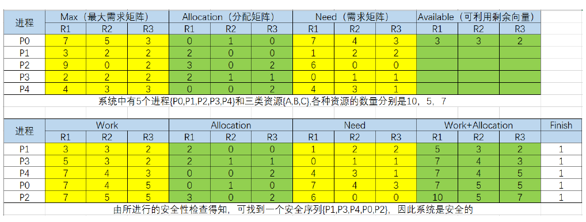
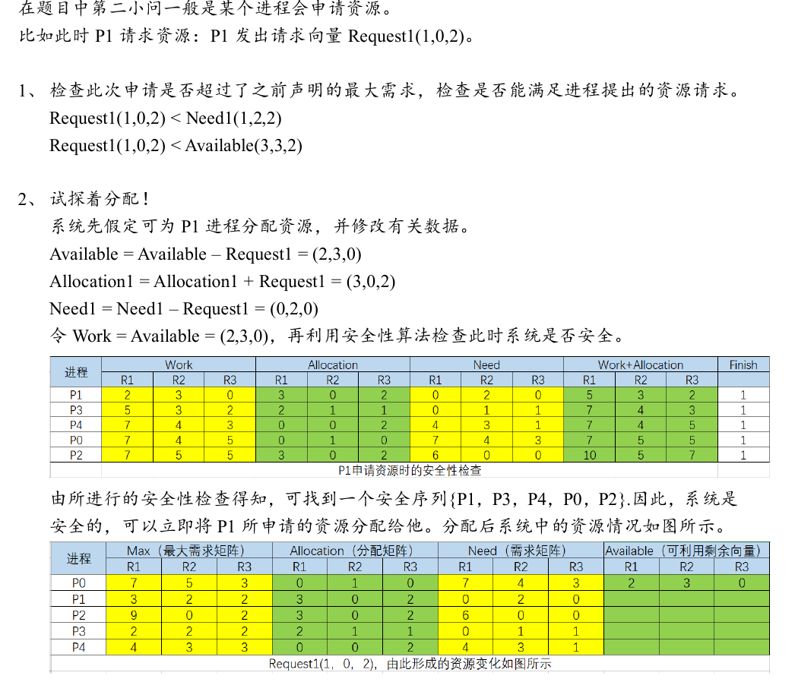
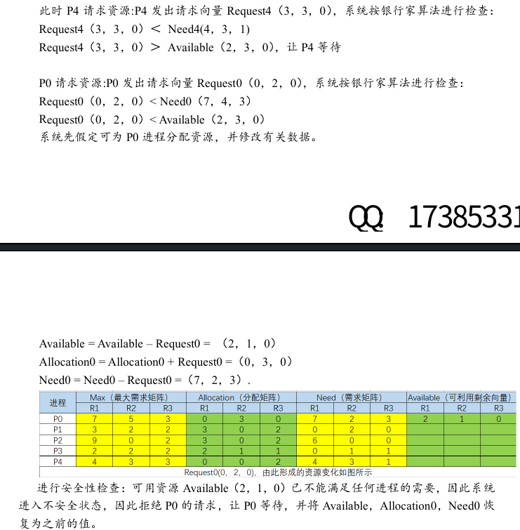

---
ebook:
    author: "lencleg from Arcadia Bay"
    title: "os review note"
---

- [PV 同步](#pv-同步)
  - [生产者-消费者问题](#生产者-消费者问题)
  - [读者-写者问题](#读者-写者问题)
  - [哲学家就餐问题](#哲学家就餐问题)
    - [解法一：设置“互斥信号量”，限制同时拿筷子的人数](#解法一设置互斥信号量限制同时拿筷子的人数)
    - [解法二：奇偶哲学家取筷顺序相反（破坏循环等待）](#解法二奇偶哲学家取筷顺序相反破坏循环等待)
    - [解法三：仅当两根筷子都空闲时才拿（破坏“持有并等待”）](#解法三仅当两根筷子都空闲时才拿破坏持有并等待)
    - [速查表](#速查表)
  - [习题](#习题)
  - [银行家算法](#银行家算法)
    - [算法一：安全性检查算法](#算法一安全性检查算法)
    - [算法二：资源请求算法（进程申请资源时）](#算法二资源请求算法进程申请资源时)
    - [example](#example)
    - [对比表](#对比表)
  - [summary](#summary)

# PV 同步
竞争条件
-   **场景**：多个进程并发执行，共享内存或变量（如缓冲区）。
-   **问题**：如果不加以控制，进程调度的随机性会导致**临界区（Critical Section）**冲突，最终结果依赖于进程执行的先后顺序（即“竞争条件”），导致数据错乱。
-   **目标**：实现**互斥（Mutual Exclusion）(临界资源)**与**同步（Synchronization）(访问的顺序)**。


忙等待（Busy Waiting）—— 整型信号量
-   **核心机制**：操作系统提供一个整型变量 `S`，仅通过原子操作 `P`（测试）和 `V`（增加）来访问。
-   **伪代码逻辑**：
    ```c
    // P操作（申请资源）
    while(S <= 0) ;  // ★ 关键：若资源不够，CPU在此处死循环空转
    S--;

    // V操作（释放资源）
    S++;
    ```
-   **致命缺点（为什么被淘汰）**：
    1.  **CPU空转（低效）**：进程在等待资源时**仍占用CPU时间片**，不停循环检查，造成计算资源极大浪费。
    2.  **优先级反转**：若高优先级进程忙等一个被低优先级进程占有的资源，可能导致系统死锁。
    3.  **仅能简单计数**：没有“排队”概念，无法管理谁在等待。

阻塞与唤醒（Blocking）—— 记录型信号量（现代PV操作）
-   **核心机制**：升级数据结构，将 **（整数值 + 进程等待队列）** 捆绑在一起。
-   **底层微观操作（原语实现）**：
    ```c
    typedef struct {
        int value;           // 资源计数
        struct process *L;   // 等待队列
    } semaphore;

    // P操作 (wait) —— 申请资源
    void P(semaphore *S) {
        S->value--;          
        if (S->value < 0) {  
            // 调用 block() 原语，进程状态变为“阻塞态”，主动让出CPU
            block(S->L);     
        }
    }

    // V操作 (signal) —— 释放资源
    void V(semaphore *S) {
        S->value++;
        if (S->value <= 0) { 
            // 调用 wakeup() 原语，进程转为“就绪态”
            wakeup(S->L);    
        }
    }
    ```
-   **核心优势**：
    -   **无忙等**：拿不到资源就“睡眠”（阻塞），CPU转去执行其他进程，彻底解决空转浪费。
    -   **负值含义**：当 `value < 0` 时，其绝对值直接代表**等待队列中阻塞的进程个数**，便于系统监控。

现代操作系统：自适应机制
> *注：纯阻塞涉及进程上下文切换（开销大）。现代Linux系统（如`futex`）为了极致性能，采用“混合策略”：*
> **先尝试自旋（短时间忙等）** -> **若临界区未结束则阻塞**。
> 即：短等待用忙等（避免切换开销），长等待用阻塞（节省CPU）。

## 生产者-消费者问题

**信号量定义**：
-   `mutex`（= 1）：保护缓冲区互斥访问。
-   `empty`（= N）：空闲缓冲区数量。
-   `full`（= 0）：产品数量。

```c
// 生产者
producer () {
    while (1) {
        生产一个产品;
        P(empty);  // 【同步-消费者V唤醒】消耗空闲资源。若满，阻塞在此，等待消费者V(empty)
        P(mutex);  // 【互斥】进入临界区
        把产品放入缓冲区;
        V(mutex);  // 【互斥】退出临界区
        V(full);   // 【同步-唤醒消费者】增加产品数量，若消费者在等待P(full)，将其唤醒
    }
}

// 消费者
consumer () {
    while (1) {
        P(full);   // 【同步-生产者V唤醒】消耗产品。若空，阻塞在此，等待生产者V(full)
        P(mutex);  // 【互斥】进入临界区
        从缓冲区取出产品;
        V(mutex);  // 【互斥】退出临界区
        V(empty);  // 【同步-唤醒生产者】增加空闲位，若生产者在等待P(empty)，将其唤醒
        使用产品;
    }
}
```

**P操作的顺序必须是：先 `P(同步信号量)`，再 `P(mutex)`。**
- 错误：先 `P(mutex)` 再 `P(empty)`。若缓冲区满，生产者拿着锁（mutex）去睡觉（等empty），消费者因拿不到锁无法消费，导致**互相死锁**。
- 正确：先去“测试条件”（同步P），条件不满足时**不拿锁**，直接睡觉，互不影响。

## 读者-写者问题

这里需要注意的就是`count`是临界资源，要上锁访问

```c
semaphore rw = 1;      // 文件互斥访问
int count = 0;         // 当前读进程数
semaphore mutex = 1;   // 保护 count
semaphore w = 1;       // 写优先控制（写者排队时阻塞新读者）

// ========== 读者进程 ==========
reader () {
    while(1) {
        P(w);                // ① 写者在等时，新读者在此阻塞（实现写优先）
        P(mutex);            // ② 保护 count
        if(count == 0)
            P(rw);           // ③ 第一个读者占用文件
        count++;
        V(mutex);
        V(w);                // ④ 允许其他读者或写者进来（写者优先已在上层P(w)保证）

        // ---------- 读文件（临界区） ----------
        读文件...;

        P(mutex);            // ⑤ 保护 count
        count--;
        if(count == 0)
            V(rw);           // ⑥ 最后一个读者释放文件
        V(mutex);
    }
}

// ========== 写者进程 ==========
writer () {
    while(1) {
        P(w);                // ① 抢占写优先权（阻塞后续所有读者）
        P(rw);               // ② 独占文件（等待当前读者读完）
        // ---------- 写文件（临界区） ----------
        写文件...;
        V(rw);               // ③ 释放文件独占权
        V(w);                // ④ 释放写优先权（此时若有读者等待，可进入；若有写者等待，写者因P(rw)可能先抢）
    }
}
```

## 哲学家就餐问题
错误示范如下：

```c
semaphore chopstick[5] = {1,1,1,1,1};

// 哲学家 i 的进程（i = 0 ~ 4）
Pi() {
    while(1) {
        // 1. 思考
        思考;

        // 2. 拿筷子（先左后右）
        P(chopstick[i]);                // 拿起左边的筷子
        P(chopstick[(i+1) % 5]);        // 拿起右边的筷子

        // 3. 进餐
        进餐;

        // 4. 放筷子（先左后右）
        V(chopstick[i]);
        V(chopstick[(i+1) % 5]);
    }
}
```

当 **5 位哲学家同时饥饿** 并且 **都同时执行了 `P(chopstick[i])`**（即每个人都先拿起了自己左边的筷子）, 当每个哲学家试图执行 `P(chopstick[(i+1)%5])` 拿右边筷子时，会发现右边筷子被邻居占用，于是全部进入**阻塞状态**。每个哲学家都拿着左边的筷子不放手，等待右边的筷子，形成**循环等待**，系统陷入**死锁**。

### 解法一：设置“互斥信号量”，限制同时拿筷子的人数

**思路**：允许最多 **4 个人** 同时拿筷子。因为 4 个人无论如何分配，至少会有 1 个人能同时拿到两根筷子（鸽巢原理），从而打破循环等待。

```c
semaphore chopstick[5] = {1,1,1,1,1};
semaphore mutex = 1;

Pi() {
    while(1) {
        思考;
        
        P(mutex);          // ★ 进入拿筷子区域，人数限制 4
        P(chopstick[i]);
        P(chopstick[(i+1) % 5]);
        V(mutex);          // ★ 拿完筷子立刻释放名额（注意：不是吃饭完才释放）

        进餐;

        V(chopstick[i]);
        V(chopstick[(i+1) % 5]);
    }
}
```

`V(mutex)` 必须放在 **拿到两根筷子之后**，而不是放筷子之后。这样能确保即使某个人被阻塞（拿不到第二根筷子），也不会占用“名额”，其他人可以继续进来尝试。

### 解法二：奇偶哲学家取筷顺序相反（破坏循环等待）

规定奇数号哲学家先拿右边筷子，再拿左边；偶数号哲学家先拿左边，再拿右边。这样就**破坏了“循环等待”**（所有人都在等同一方向的资源）。

```c
Pi() {
    while(1) {
        思考;
        
        // ★ 根据编号决定拿取顺序
        if (i % 2 == 0) {
            P(chopstick[i]);                 // 偶：先左后右
            P(chopstick[(i+1) % 5]);
        } else {
            P(chopstick[(i+1) % 5]);         // 奇：先右后左
            P(chopstick[i]);
        }

        进餐;

        // 放筷子顺序无所谓，但习惯与拿取顺序相反
        V(chopstick[i]);
        V(chopstick[(i+1) % 5]);
    }
}
```

### 解法三：仅当两根筷子都空闲时才拿（破坏“持有并等待”）

使用一个互斥锁保护“拿筷子”这个动作，确保检查 + 拿取是一个原子操作。但这种方法**并发度较低**（相当于一次只让一个人判断拿筷子）。

```c
semaphore chopstick[5] = {1, 1, 1, 1, 1};
semaphore mutex = 1;      // ★ 互斥锁，保护“拿筷子”这个动作

Pi() {
    while(1) {
        // 1. 思考
        思考;

        // 2. 拿筷子（进入临界区保护）
        P(mutex);                          // ★ 加锁，不允许别人同时拿筷子
        P(chopstick[i]);                   // 拿起左边
        P(chopstick[(i+1) % 5]);           // 拿起右边
        V(mutex);                          // ★ 解锁（注意：这里必须立刻解锁！）

        // 3. 进餐
        进餐;

        // 4. 放筷子（无需互斥保护，因为此时筷子是私有的）
        V(chopstick[i]);
        V(chopstick[(i+1) % 5]);
    }
}
```


### 速查表

| 方案 | 核心思想 | 破坏的死锁条件 | 并发度 |
| :--- | :--- | :--- | :--- |
| **基础法（错误）** | 先左后右无条件拿 | 不破坏，死锁 | 极低（死锁） |
| **解法一：加互斥锁** | 限制最多 4 人进入取筷区 | 破坏 **“循环等待”**（资源不够分时先让一个人退出） | 较高 |
| **解法二：奇偶反序** | 改变拿取方向，避免环形依赖 | 破坏 **“循环等待”** | 最高 |
| **解法三：原子拿取** | 两根筷子一起拿 | 破坏 **“持有并等待”**（要么不拿，要么全拿） | 较低 |


## 习题
阅览室问题

**题目**: 有一阅览室，共有 100 个作为，为了很好地利用它，读者进入时必须现在登记表上进行登记。该表表目没有座位号和读者姓名，离开时再将其登记删除。试问：

**(1) 为描述读者的动作，应编写几个程序？应设几个进程？它们之间关系是什么？**

2 个程序：1、读者进入登记信息 2、读者离开消除信息

2 个进程：1、enter 2、exit

关系：只有座位不空时，读者才能进入。

只有读者不空时，离开才可以消除数据。

**(2) 试用信号量机制描述进程之间的同步算法。**


```c
semaphore seats = 100; // 空余座位数 100
semaphore readers = 0; // 馆内读者数 0
semaphore mutex = 1; // 互斥访问登记表

Enter {
    P(seats);
    P(mutex);
    登记信息;
    V(mutex);
    V(readers);
    阅读;
}

Exit {
    P(readers);
    P(mutex);
    消除信息;
    V(mutex);
    V(seats);
    离开;
}
```

## 银行家算法

这里我建议做题理解

银行家算法（Banker's Algorithm）**避免死锁（Deadlock Avoidance）**的经典算法，由 Dijkstra 提出。它与前面学的“哲学家就餐”（那是**预防**死锁）思路完全不同。

1. 核心思想（类比银行借贷）
- **银行家（操作系统）**：手上有一定量的资金（资源）。
- **客户（进程）**：提前声明自己**最多**需要多少钱（Max），但分批借（Allocation）。
- **规则**：银行家在每次放款前，都要**“预演”**一下：如果把这笔钱借出去，我剩下的钱（Available）还能不能让**所有客户**都顺利完成业务并还钱（找到安全序列）。**如果找不到安全序列，这笔钱坚决不借！**

假设系统有 `n` 个进程，`m` 类资源。

| 数据结构 | 符号 | 含义 | 维度 |
| :--- | :--- | :--- | :--- |
| **可利用资源向量** | `Available` | 系统当前**还剩**多少各类资源 | 长度为 `m` 的一维数组 |
| **最大需求矩阵** | `Max` | 每个进程**总共最多**需要多少各类资源 | `n × m` 矩阵 |
| **分配矩阵** | `Allocation` | 每个进程**当前已经占**了多少各类资源 | `n × m` 矩阵 |
| **需求矩阵** | `Need` | 每个进程**还缺**多少各类资源 | `n × m` 矩阵 |

> `Need[i][j] = Max[i][j] - Allocation[i][j]`

### 算法一：安全性检查算法

当系统分配资源前，先用它查一下，如果安全就分配，不安全就阻塞。

1. **初始化**：
   - `Work = Available`（当前空闲资源，会动态变化）。
   - `Finish = [false, ..., false]`（记录进程是否已完成）。
2. **寻找可执行的进程**：
   从进程集合中找一个满足以下条件的进程 `P_i`：
   - `Finish[i] == false`
   - `Need[i] <= Work`（即该进程还缺的资源，系统当前剩余的资源**全部能满足**）
3. **回收资源（模拟运行）**：
   找到后，假设该进程运行完毕，立即释放它占用的资源：
   - `Work = Work + Allocation[i]`
   - `Finish[i] = true`
   - 记录下这个进程的编号（这就是安全序列的一部分）。
4. **循环**：重复步骤 2 和 3，直到：
   - **安全**：所有 `Finish` 都为 `true`，得到一条 **安全序列**（如 `P1 -> P3 -> P0...`）。
   - **不安全**：遍历完所有进程，仍有 `Finish[i] == false`，说明系统处于**不安全状态**（可能死锁）。

### 算法二：资源请求算法（进程申请资源时）

当进程 `P_i` 发出资源请求 `Request_i`（长度为 `m` 的向量）时
- **Step 1（检查上限）**：如果 `Request_i <= Need[i]`，转到 Step 2；否则报错（需求超过声明的最大需求）。
- **Step 2（检查当前余量）**：如果 `Request_i <= Available`，转到 Step 3；否则让进程等待（资源不够）。
- **Step 3（预分配 + 安全性检查）**：
   - **假装分配**（试探性）：
     - `Available = Available - Request_i`
     - `Allocation[i] = Allocation[i] + Request_i`
     - `Need[i] = Need[i] - Request_i`
   - 执行算法一
     - 若**安全** → 正式分配（刚才的假装作数）。
     - 若**不安全** → **回退**（恢复 Step 3 修改前的三个值），让进程等待。

### example

建议跟着图片练习(后面llm的生成习题当作是额外的理解就好了)







假设系统中有 5 个进程 P0~P4，三类资源 A、B、C。在 T0 时刻，系统状态如下：

| 进程 | **Max (A B C)** | **Allocation (A B C)** | **Need (A B C)** | (A B C) |
| :--- | :--- | :--- | :--- | :--- |
| P0 | 7 5 3 | 0 1 0 | 7 4 3 | |
| P1 | 3 2 2 | 2 0 0 | **1 2 2** | |
| P2 | 9 0 2 | 3 0 2 | 6 0 0 | |
| P3 | 2 2 2 | 2 1 1 | **0 1 1** | |
| P4 | 4 3 3 | 0 0 2 | 4 3 1 | |
| **Available** | | | | **3 3 2** |

**（1）问：T0 时刻是否安全？求安全序列。**

- 初始 `Work = (3, 3, 2)`
- **找满足 `Need <= Work` 的**：
  - P1 的 `(1,2,2) <= (3,3,2)` ✅ → 运行 P1，释放 `(2,0,0)`，新 `Work = (5,3,2)`
  - P3 的 `(0,1,1) <= (5,3,2)` ✅ → 运行 P3，释放 `(2,1,1)`，新 `Work = (7,4,3)`
  - P0 的 `(7,4,3) <= (7,4,3)` ✅ → 运行 P0，释放 `(0,1,0)`，新 `Work = (7,5,3)`
  - P2 的 `(6,0,0) <= (7,5,3)` ✅ → 运行 P2，释放 `(3,0,2)`，新 `Work = (10,5,5)`
  - P4 的 `(4,3,1) <= (10,5,5)` ✅ → 运行 P4。
- **结论**：安全序列为 **`<P1, P3, P0, P2, P4>`**（非唯一，只要满足条件的都能走）。

**（2）问：如果 P1 此时发出请求 `Request_1 = (1, 0, 2)`，系统能否分配？**
- Step 1：`(1,0,2) <= Need(1,2,2)` ✅
- Step 2：`(1,0,2) <= Available(3,3,2)` ✅
- Step 3（预分配）：
  - 新 Available = `(2, 3, 0)`
  - 新 Allocation[1] = `(3, 0, 2)`
  - 新 Need[1] = `(0, 2, 0)`
- 重新执行安全性检查：Work=`(2,3,0)`，发现 P1 的 `(0,2,0)` 满足，释放后 Work=`(5,3,2)`，后续能走通。**结论：安全，立即分配！**

### 对比表

| 对比维度 | **哲学家就餐（死锁预防）** | **银行家算法（死锁避免）** |
| :--- | :--- | :--- |
| **核心策略** | 限制资源分配方式（如拿筷顺序） | 动态检查分配后的状态是否安全 |
| **破坏条件** | 破坏“循环等待”或“持有并等待” | **不破坏**死锁四个必要条件，而是在分配前“预测” |
| **并发度** | 较低（资源被硬性限制） | 较高（只要安全，允许灵活分配） |
| **前提要求** | 无特殊要求 | **必须事先知道每个进程的最大需求 Max**（实际上很难满足） |
| **结果** | 必然不死锁 | 安全时不死锁，不安全时阻塞进程 |

## summary

对比总结

| 维度 | 第一阶段：整型信号量 | 第二阶段：记录型信号量（标准PV） | 备注 |
| :--- | :--- | :--- | :--- |
| **数据结构** | 仅有整型值 `S` | `value` + 等待队列 `L` | 核心升级点 |
| **等待机制** | **忙等待**（占用CPU空转） | **阻塞等待**（让出CPU，进入睡眠） | 效率本质区别 |
| **P操作逻辑** | `while(S<=0); S--;` | `value--; if(value<0) block();` | 后者不浪费CPU |
| **V操作逻辑** | `S++;` | `value++; if(value<=0) wakeup();` | 后者负责精准唤醒 |
| **代码对应** | 纯软件算法（Dekker/Peterson） | `sem_wait` / `sem_post`| 现代操作系统标准 |
| **在生产者-消费者中的角色** | （几乎不用） | `mutex` 负责互斥；`empty/full` 负责跨进程同步 | 分清“一个进程内”与“两个进程间” |

口诀：
> **互斥锁**，成对现（同一进程内先P后V）；<br>
> **同步量**，隔空喊（生产者V，消费者P；反之亦然）；<br>
> **先同步，后互斥**，顺序颠倒必死锁；<br>
> **阻塞睡，唤醒醒**，告别空转CPU。<br>
