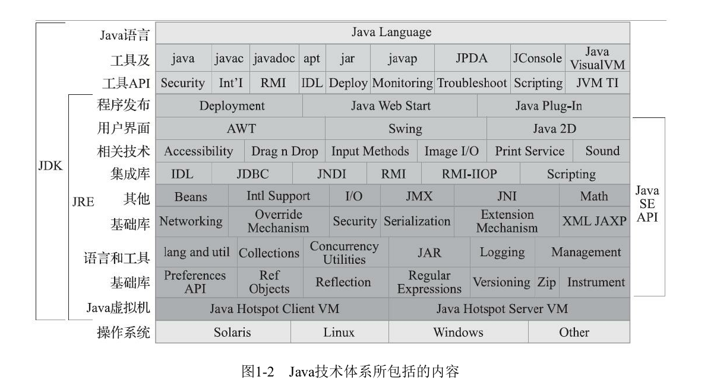
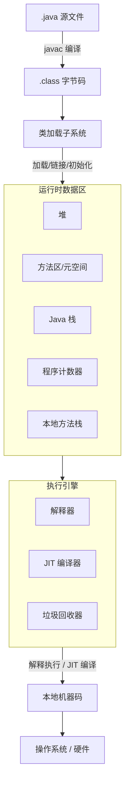

reference note : [youthlql/JavaYouth](https://github.com/youthlql/JavaYouth/tree/main)

just for exploring the secret of java cross-platform

[TOC]

# introduction

Java程序设计语言、Java虚拟机、Java类库这三部分统称为JDK（Java DevelopmentKit），JDK是用于支持Java程序开发的最小环境



Java编译器输入的指令流基本上是一种**基于栈的指令集架构**，另外一种指令集架构则是**基于寄存器的指令集架构**。具体来说：这两种架构之间的区别：

## 基于栈的指令集架构

基于栈式架构的特点：

1.  设计和实现更简单，适用于资源受限的系统；
2.  避开了寄存器的分配难题：使用零地址指令方式分配
3.  指令流中的指令大部分是零地址指令，其执行过程依赖于操作栈。指令集更小，编译器容易实现
4.  不需要硬件支持，可移植性更好，更好实现跨平台

## 基于寄存器的指令级架构

基于寄存器架构的特点：

1.  典型的应用是x86的二进制指令集：比如传统的PC以及Android的Davlik虚拟机。
2.  指令集架构则完全依赖硬件，与硬件的耦合度高，可移植性差
3.  性能优秀和执行更高效
4.  花费更少的指令去完成一项操作
5.  在大部分情况下，基于寄存器架构的指令集往往都以一地址指令、二地址指令和三地址指令为主，而基于栈式架构的指令集却是以零地址指令为主

## 两种架构的举例

同样执行2+3这种逻辑操作，其指令分别如下：

*   **基于栈的计算流程（以Java虚拟机为例）：**
    ```java
    iconst_2 //常量2入栈
    istore_1
    iconst_3 // 常量3入栈
    istore_2
    iload_1
    iload_2
    iadd //常量2/3出栈，执行相加
    istore_0 // 结果5入栈
    ```
   
8个指令
    
*   **而基于寄存器的计算流程**
    ```java
    mov eax,2 //将eax寄存器的值设为1
    add eax,3 //使eax寄存器的值加3
    ```
    
2个指令

## JVM架构总结
**由于跨平台性的设计，Java的指令都是根据栈来设计的**。不同平台CPU架构不同，所以不能设计为基于寄存器的。栈的优点：跨平台，指令集小，编译器容易实现，缺点是性能比寄存器差。

因为基于栈的架构跨平台性好、指令集小，虽然相对于基于寄存器的架构来说，基于栈的架构编译得到的指令更多，执行性能也不如基于寄存器的架构好，但考虑到其跨平台性与移植性，java还是选用栈的架构

具体JVM的内存结构，其实取决于其实现，不同厂商的JVM，或者同一厂商发布的不同版本，都有可能存在一定差异。主要以Oracle HotSpot VM为默认虚拟机。

# 类加载器子系统


Java虚拟机的主要部分
- 类加载器
- 执行引擎

# **the following note is generated by llm**

字节码是由 Oracle 维护的 **《Java 虚拟机规范》（JVMS）** 正式定义的。

## 字节码文件（.class）示例

`.class` 文件是一组**紧凑排列的二进制字节流**，全部按 **大端字节序**存储。它的整体结构如下：

| 顺序 | 字段名称 | 长度 | 含义 |
|------|---------|------|------|
| 1 | `magic` | 4 字节 | 魔数，`0xCAFEBABE` |
| 2 | `minor_version` | 2 字节 | 次版本号 |
| 3 | `major_version` | 2 字节 | 主版本号（如 0x37 代表 JDK 7, 0x38 代表 JDK 8） |
| 4 | `constant_pool_count` | 2 字节 | 常量池条目数 |
| 5 | `constant_pool[]` | 变长 | 常量池 |
| 6 | `access_flags` | 2 字节 | 类的访问标志（public、final、interface 等） |
| 7 | `this_class` | 2 字节 | 指向当前类的符号引用 |
| 8 | `super_class` | 2 字节 | 指向父类的符号引用 |
| 9 | `interfaces_count` | 2 字节 | 实现的接口数 |
| 10 | `interfaces[]` | 变长 | 接口列表 |
| 11 | `fields_count` | 2 字节 | 字段数量 |
| 12 | `fields[]` | 变长 | 字段信息（名称、类型、修饰符） |
| 13 | `methods_count` | 2 字节 | 方法数量 |
| 14 | `methods[]` | 变长 | 方法信息（名称、参数、返回值、以及**字节码指令**） |
| 15 | `attributes_count` | 2 字节 | 属性数量 |
| 16 | `attributes[]` | 变长 | 附加属性 |

```java
public class Hello {
    public static void main(String[] args) {
        int a = 1;
    }
}
```

用 `javap -v Hello.class` 查看反编译结果，可以直观地看到：

- **开头**：`0xCAFEBABE 0x00000034` —— 前四个字节是 `cafe babe`，紧接着是版本号 0x34（对应 Java 8）。
- **常量池**：里面存了这个类引用的所有常量，比如类名 `Hello`、方法名 `main`、参数类型描述符 `([Ljava/lang/String;)V` 等。
- **方法区**：`main` 方法的字节码指令就是一行：
  ```text
  iconst_1   # 把整数 1 压到栈顶
  istore_1   # 把栈顶的值存到局部变量表的 1 号槽位
  return
  ```

> 可以用 `javap -c Hello.class` 快速查看字节码指令，用 `javap -v` 查看全部细节。

---

### 2.1 魔数：`0xCAFEBABE`

`.class` 文件的头 4 个字节固定是 **`0xCAFEBABE`**（十六进制），"Coffee Baby"。JVM 加载文件时会先检查这 4 个字节，不匹配就拒绝加载。它也被称作"咖啡宝贝"。

### 2.2 版本号

紧接着的 4 个字节（5、6 是次要版本，7、8 是主版本）。JVM 会根据版本号判断自己的版本是否支持该 `.class` 文件，不支持会直接报错。

### 2.3 常量池

常量池是 `.class` 文件里**占用空间最大的部分**，相当于一个巨大的符号表，里面存了类名、方法名、字段名、字符串常量等。JVM 运行时会把常量池加载到内存，并把里面的符号引用（比如 `"main"`）转换为真正的内存地址。

### 2.4 方法与字节码

最重要的部分在 `methods[]`：每个方法对应一个 `Code` 属性，里面存放的就是**真正的字节码指令序列**，也就是 JVM 最终要执行的指令列表。比如 `System.out.println("Hello")` 可能被编译成 `getstatic #2`、`ldc #3`、`invokevirtual #4` 等几个指令。

---

## 字节码指令

字节码指令由一个**操作码**（1 字节）和**0 到多个操作数**组成。指令总共有 **256 种可能的操作码**

理论上最多 256 种不同的指令，但目前只有约 200 个在使用。

JVM 是**面向栈**的（而不是面向寄存器），大部分指令直接从操作数栈取操作数，因此**单字节指令占主导**，指令本身非常紧凑。

操作码常用助记符表示，比如：
- `iconst_1` → 把整数 1 压入栈
- `iadd` → 把栈顶两个 int 相加
- `invokevirtual` → 调用实例方法

### 3.1 类型前缀

很多指令以类型前缀开头：
- **i** → int
- **l** → long
- **f** → float
- **d** → double
- **a** → 引用

比如 `iload` 加载 int，`aload` 加载引用。

### 3.2 指令分类

字节码指令大致可以分为以下几类：

| 分类 | 作用 | 典型指令 |
|------|------|----------|
| **加载与存储** | 在局部变量表和操作数栈之间搬数据 | `iload_0`, `istore_1`, `aload_2` |
| **算术运算** | 执行加减乘除等运算 | `iadd`, `isub`, `imul`, `idiv` |
| **类型转换** | 在基本类型之间转换 | `i2l`, `i2f`, `d2i` |
| **对象创建与访问** | 创建对象、存取字段 | `new`, `getfield`, `putfield` |
| **操作数栈管理** | 直接操作栈 | `pop`, `dup`, `swap` |
| **控制转移** | 条件/无条件跳转 | `ifeq`, `goto`, `tableswitch` |
| **方法调用与返回** | 调用方法并返回 | `invokevirtual`, `invokespecial`, `ireturn` |
| **异常处理** | 抛出异常 | `athrow` |
| **同步** | 线程同步（跟 `synchronized` 有关） | `monitorenter`, `monitorexit` |

## 设计原因

字节码的规定里藏着一个核心矛盾：要在不同 CPU（x86、ARM 等）之间兼顾**编译简单、执行高效、兼容性强**。

完全针对每种 CPU 的机器码都不同——x86 存的是复杂指令集，ARM 存的是精简指令集，格式各异。C、C++ 选择直接在这类"方言"中编码，丢失了跨平台的天然能力。Java 字节码用一套**固定的、紧凑的、设计时考虑过的中间指令**来编码，相当于编码成了一种比方言更通用的"世界语"。最终由 JVM 把它翻译成目标平台的机器码，实现跨平台。


## JVM 如何工作：从源码到运行的完整旅程

Java 虚拟机（JVM）是整个 Java 平台的发动机。要理解它如何工作，可以沿着一个 Java 程序从编写到执行的生命周期来探索。

下面这张图概括了 JVM 的核心工作流程：



# 整个执行流程

## 一、类加载阶段：把字节码请进 JVM

当你运行 `java Hello`，JVM 会启动并完成以下步骤：

### 1. 加载（Loading）
- **找到** `.class` 文件（从文件系统、JAR、网络等）。
- **读取** 字节码，按照 JVM 规范解析成内存中的数据结构。
- 生成一个 `java.lang.Class` 对象，作为该类的元数据入口。

### 2. 链接（Linking）
- **验证**：检查字节码是否合法（比如不会跳转到非法地址、方法调用参数正确等）。
- **准备**：为静态变量分配内存，并设置默认初始值（0、null、false 等）。
- **解析**：将符号引用（比如类名、方法名）替换为直接地址（内存指针），这个步骤有时会延迟到首次使用时。

### 3. 初始化（Initialization）
- 执行类的静态初始化块（`static {}`）和静态变量赋值。
- 此时类才算真正“就绪”。

类加载采用 **双亲委派模型**：当需要加载一个类时，先委托给父类加载器，父类找不到再自己加载。这保证了核心类（如 `java.lang.Object`）的唯一性，避免恶意代码篡改。

---

## 二、运行时数据区：JVM 管理的内存“房间”

JVM 在运行时会把内存划分为几个逻辑区域，各自承担不同职责：

| 区域 | 归属 | 存放内容 | 是否 GC |
|------|------|----------|--------|
| **堆** | 线程共享 | 所有 Java 对象实例、数组 | ✅ 是 |
| **方法区**（Java 8 后为**元空间**） | 线程共享 | 类的结构信息、常量池、静态变量、JIT 编译后的代码 | 部分回收 |
| **Java 栈** | 线程私有 | 栈帧：局部变量表、操作数栈、方法出口等 | ❌ 否 |
| **程序计数器** | 线程私有 | 当前线程执行到哪一条字节码指令 | ❌ 否 |
| **本地方法栈** | 线程私有 | 调用 native 方法（C/C++ 实现）时的信息 | ❌ 否 |

> 每个方法调用都会创建一个新的**栈帧**，压入当前线程的 Java 栈。方法返回时，栈帧弹出。

---

## 三、执行引擎

执行引擎是 JVM 的心脏，它负责读取字节码并执行。主要包含三个组件：

### 1. 解释器（Interpreter）
- **工作方式**：逐条读取字节码指令，每读一条就翻译成当前平台的机器码并立即执行。
- **优点**：启动快，无需等待编译。
- **缺点**：重复执行同一段代码时，每次都重新翻译，效率低。

### 2. JIT 编译器（Just-In-Time Compiler）
- **工作方式**：监控运行过程，发现被频繁执行的“热点代码”（比如循环体、被多次调用的方法），将其编译成本地机器码，并缓存到代码缓存区（CodeCache）。下次执行直接运行机器码，不再解释执行。
- **优点**：长期运行性能极高，经常接近 C++。
- **缺点**：编译本身消耗 CPU 和时间，启动时可能稍慢。

**聪明的混合模式**：JVM 默认启动时先用解释器快速启动，后台 JIT 线程异步编译热点方法。编译完成后，下次调用自动切换到编译后的版本。这就是 **分层编译**（Tiered Compilation）。

### 3. 垃圾回收器（Garbage Collector）
- **职责**：自动回收堆中不再被引用的对象，防止内存泄漏。
- **工作方式**：
  - 首先**标记**哪些对象是“活着的”（从 GC Roots 出发能到达的对象）。
  - 然后**清理**未标记的对象。
  - 可选**整理**内存碎片（移动活对象，使得空闲内存连续）。
- **常见 GC 算法**：复制、标记-清除、标记-整理。
- **常见 GC 实现**：G1、ZGC、Parallel GC 等，各有侧重（低延迟、高吞吐等）。

> GC 是 JVM 区别于 C/C++ 最显著的特征，让开发者免于手动释放内存。

## 四、字节码执行示例

假设我们有这个 Java 方法：

```java
public int add(int a, int b) {
    return a + b;
}
```

编译后字节码（通过 `javap -c` 查看）：

```
public int add(int, int);
    Code:
       0: iload_1          // 将局部变量1（a）推入操作数栈
       1: iload_2          // 将局部变量2（b）推入栈
       2: iadd             // 弹出两个 int，相加，结果压回栈
       3: ireturn          // 返回栈顶 int 值
```

**JVM 如何执行**：
1. 解释器从 `0:` 开始，读 `iload_1`，翻译成当前 CPU 的加载指令并执行。
2. 更新程序计数器到 `1:`。
3. 继续读 `iload_2`、`iadd`、`ireturn`。
4. 如果 `add` 方法被调用上万次，JIT 编译器可能会把整个方法编译成本地机器码，下次调用直接运行编译后的版本（甚至可能被内联到调用者中）。

## 五、本地方法接口（JNI）：调用系统底层

JVM 不是孤岛。当 Java 需要调用操作系统功能（比如读写文件、发送网络包）或访问特定硬件时，会通过 **Java Native Interface (JNI)** 调用用 C/C++ 编写的本地库。这些本地方法的执行进入**本地方法栈**，由操作系统直接处理。

## 六、JVM 生命周期

- **启动**：通过 `java` 命令指定主类，JVM 加载它，调用 `main` 方法。
- **运行**：不断加载新类、执行字节码、分配对象、触发 GC。
- **退出**：当所有非守护线程执行完毕，或调用 `System.exit()` 时，JVM 退出。

## 总结

> **JVM 通过类加载器把字节码读入内存，划分不同区域存放数据和代码，然后用解释器 + JIT 编译器把它翻译成当前平台的机器码，并自动进行垃圾回收。整个过程屏蔽了底层差异，实现了跨平台。**

# personal summary
java的跨平台实现优雅, jvm的思想简单而强大, 对java语言的看法有所改观。

jvm的部分学习笔记不是很深入，算是作为门外汉来大概了解了一下

<div align='right'>
ending of note
</div>