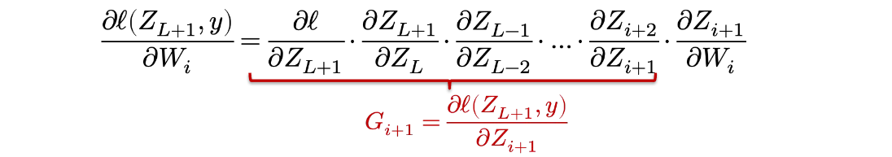

[TOC]

# Lec 2: ML Refresher / Softmax Regression
outline
- How to use mugrade
- Basics of machine learning
- Example: softmax regression

算是复习课

Three ingredients of a machine learning algorithm
- The hypothesis class
- The loss function
- An optimization method

## Loss function 1: classification error
The simplest loss function, typically use to assess the *quality* of classifiers.  

$$
\ell_{err}(h(x), y) = 
\begin{cases} 
0 & \text{if } \arg\max_i h_i(x) = y \\ 
1 & \text{otherwise} 
\end{cases}
$$

problem: the error is a bad loss function to use for *optimization*, i.e., selecting the best parameters, because it is **not differentiable**.

## Loss function 2: softmax / cross-entropy loss
exponentiating and normalizing its entries (to make them all positive and sum to one)

$$z_i = p(\text{label} = i) = \frac{\exp(h_i(x))}{\sum_{j=1}^k \exp(h_j(x))} \iff z \equiv \text{softmax}(h(x))$$

define a loss to be the (negative) log probability of the true class: this is called **softmax** or **cross-entropy loss**

$$\ell_{ce}(h(x), y) = -\log p(\text{label} = y) = -h_y(x) + \log \sum_{j=1}^k \exp(h_j(x))$$

## Optimization: gradient descent
For a matrix-input, scalar output function \( f : \mathbb{R}^{n \times k} \to \mathbb{R} \), the **gradient** is defined as the matrix of partial derivatives

$$
\nabla_\theta f(\theta) \in \mathbb{R}^{n \times k} = 
\begin{bmatrix}
\frac{\partial f(\theta)}{\partial \theta_{11}} & \cdots & \frac{\partial f(\theta)}{\partial \theta_{1k}} \\
\vdots & \ddots & \vdots \\
\frac{\partial f(\theta)}{\partial \theta_{n1}} & \cdots & \frac{\partial f(\theta)}{\partial \theta_{nk}}
\end{bmatrix}
$$

Gradient points in the direction that most increases \( f \) (locally)

## Stochastic gradient descent
take many gradient steps each based upon a **minibatch** (small partition of data)

$$
\begin{align*}
\text{Repeat:}&\\
&\text{Sample a minibatch of data X} \in \mathbb{R}^{B \times n}, y \in \{1, \dots, k\}^B \\
&\text{Update parameters }\theta := \theta - \frac{\alpha}{B} \sum_{i=1}^B \nabla_\theta \ell(h_\theta(x^{(i)}), y^{(i)})
\end{align*}
$$

## The gradient of the softmax objective
the gradient of the softmax loss itself: for vector \( h \in \mathbb{R}^k \)

$$
\begin{align*}
\frac{\partial l_{ce}(h, y)}{\partial h_i} &= \frac{\partial}{\partial h_i} \left( -h_y + \log \sum_{j=1}^k \exp h_j \right)\\
&= -1 \{ i = y \} + \frac{\exp h_i}{\sum_{j=1}^k \exp h_j}
\end{align*}
$$

in vector form: \(\nabla_h l_{ce}(h, y) = z - e_y\), where \(z = \text{softmax}(h)\)
## The gradient of the softmax objective
1. Pretend everything is a scalar, use the typical chain rule
2. then rearrange / transpose matrices/vectors to make the sizes work
3. finally check your answer numerically

整个过程借助教授的板书更好理解


$\theta$ 在SGD的更新规则如下

\[\theta := \theta - \frac{\alpha}{B} X^T (Z - I_y)\]

# Lec 3: Manual Neural Networks / Backprop
outline
- From linear to nonlinear hypothesis classes
- Neural networks
- Backpropagation (i.e., computiing gradients)

linear hypothesis problem: how to generate nonlinear classification boundaries?

**One idea:** apply a linear classifier to some (potentially higher-dimensional) features of the data  

\[h_\theta(x) = \theta^T \phi(x)\]

\[\theta \in \mathbb{R}^{d \times k}, \, \phi: \mathbb{R}^n \to \mathbb{R}^d\]

but how to create the features function $\phi$ ? 

记得所有线性组合的结果依旧是线性的.
## Universal function approximation
**Theorem (1D case):** Given any smooth function \( f: \mathbb{R} \to \mathbb{R} \), closed region \( \mathcal{D} \subset \mathbb{R} \), and \( \epsilon > 0 \), we can construct a one-hidden-layer neural network \( \hat{f} \) such that  
\[\max_{x \in \mathcal{D}} |f(x) - \hat{f}(x)| \leq \epsilon\]

**Proof:** Select some dense sampling of points \( (x^{(i)}, f(x^{(i)})) \) over \( \mathcal{D} \). Create a neural network that passes exactly through these points (see next slide). Because the neural network function is piecewise linear, and the function \( f \) is smooth, by choosing the \( x^{(i)} \) close enough together, we can approximate the function arbitrarily closely.

powerful but need a lot of sample  points, not practical

## Backpropagation
math time

### The gradient(s) of a two-layer network
warm up math of a two-layer network gradients

\[\nabla_{\{W_1, W_2\}} \ell_{ce}(\sigma(XW_1)W_2, y)\]

The gradient w.r.t. \(W_2\) looks identical to the softmax regression case:
$$
\begin{align*}
\frac{\partial \ell_{ce}(\sigma(XW_1)W_2, y)}{\partial W_2} &= \frac{\partial \ell_{ce}(\sigma(XW_1)W_2, y)}{S - I_y} \cdot \frac{\partial \sigma(XW_1)W_2}{\partial W_2}\\
&= (S - I_y) \cdot (\sigma(XW_1))\\
\end{align*}
$$

$$
\text{note that S} = \text{normalize}(\exp(\sigma(XW_1)W_2)) \\
(S - I_y) \in \mathbb{R^{m \times k}} \quad, (\sigma{XW_1}) \in \mathbb{R^{m \times d}}
$$

the rearrange

$$
\nabla_{W_2} \ell_{ce}(\sigma(XW_1)W_2, y) = \sigma(XW_1)^T (S - I_y)
$$

$$
\text{so the gradient matrix} \in \mathbb{R}^{d \times k}
$$

the gradient w.r.t. \( W_1 \ldots \)
$$
\begin{align*}
\frac{\partial \ell_{ce}(\sigma(XW_1)W_2, y)}{\partial W_1} &= \frac{\partial \ell_{ce}(\sigma(XW_1)W_2, y)}{(\partial \sigma(XW_1)W_2)} \cdot \frac{\partial \sigma(XW_1)W_2}{\partial \sigma(XW_1)} \cdot \frac{\partial XW_1}{\partial W_1}\\
&= (S - I_y) \cdot (W_2) \cdot (\sigma'(XW_1)) \cdot (X)
\end{align*}
$$

notice that 
$$
(S - I_y) \in \mathbb{R^{m \times k}} \quad W_2 \in \mathbb{R^{d \times k}} \quad (\sigma'(XW_1)) \in \mathbb{R^{m \times d}} \quad X \in \mathbb{R^{m \times n}}
$$
so the gradient is

$$
\nabla_{W_1} \ell_{ce}(\sigma(XW_1)W_2, y) = X^T \left( (S - I_y)W_2^T \circ \sigma'(XW_1) \right)\\ 
\text{so the gradient matrix} \in \mathbb{R}^{n \times d}
$$

where $\circ$ denotes **elementwise multiplication**

### "general" backpropagation
"backpropagation" is just chain rule + intelligent caching of intermediate results

consider our fully-connected network:

\[Z_{i+1} = \sigma_i(Z_i W_i), \quad i = 1, \dots, L\]

Then

\[\frac{\partial \ell(Z_{L+1}, y)}{\partial W_i} = \frac{\partial \ell}{\partial Z_{L+1}} \cdot \frac{\partial Z_{L+1}}{\partial Z_L} \cdot \frac{\partial Z_{L-1}}{\partial Z_{L-2}} \cdots \frac{\partial Z_{i+2}}{\partial Z_{i+1}} \cdot \frac{\partial Z_{i+1}}{\partial W_i}\]


\[G_{i+1} = \frac{\partial \ell(Z_{L+1}, y)}{\partial Z_{i+1}}\]

Then a simple “backward” iteration to compute the \( G_i \)’s

\[G_i = G_{i+1} \cdot \frac{\partial Z_{i+1}}{\partial Z_i} = G_{i+1} \cdot \frac{\partial \sigma_i(Z_i W_i)}{\partial Z_i W_i} \cdot \frac{\partial Z_i W_i}{\partial Z_i} = G_{i+1} \cdot \sigma'(Z_i W_i) \cdot W_i\]

notice $G_{i + 1}$ is



then remeber to rearrange the shape to make to size work


### putting it all together
we can efficiently compute **all** the gradients we need for a neural network by following the procedure below

1. Initialize: \( Z_1 = X \)  
   Iterate: \( Z_{i+1} = \sigma_i(Z_i W_i), \quad i = 1, \dots, L \)

2. Initialize: \( G_{L+1} = \nabla_{Z_{L+1}} \ell(Z_{L+1}, y) = S - I_y \)  
   Iterate: \( G_i = (G_{i+1} \circ \sigma'_i(Z_i W_i)) W_i^T, \quad i = L, \dots, 1 \)

And compute all the needed gradients along the way  

$$
\nabla_{W_i} \ell(Z_{k+1}, y) = Z_i^T (G_{i+1} \circ \sigma'_i(Z_i W_i))
$$

the last thing to mention about is $\frac{\partial Z_{i+1}}{\partial W_i}$, an operation called the “vector Jacobian product”

# Lec 4: Automatic Differentiation
outline
- General introduction to different differentiation methods
- Reverse mode automatic differentiation

## Numerical differentiation
Directly compute the partial gradient by definition  

\[\frac{\partial f(\theta)}{\partial \theta_i} = \lim_{\epsilon \to 0} \frac{f(\theta + \epsilon e_i) - f(\theta)}{\epsilon}\]

A more numerically accurate way to approximate the gradient, 这和泰勒展开和中分误差有关, 截断误差为二阶精度。

\[\frac{\partial f(\theta)}{\partial \theta_i} = \frac{f(\theta + \epsilon e_i) - f(\theta - \epsilon e_i)}{2\epsilon} + o(\epsilon^2)\]

Suffer from numerical error, less efficient to compute, two times of forward to compute

### ps: 推导
对于前向差分：

\[ \frac{f(\theta + \epsilon e_i) - f(\theta)}{\epsilon} = f'(\theta) + \frac{1}{2} f''(\theta) \epsilon + O(\epsilon^2) \]

截断误差为 \(O(\epsilon)\)（一阶精度）。

中心差分的误差

对 \(f(\theta + \epsilon e_i)\) 和 \(f(\theta - \epsilon e_i)\) 分别泰勒展开：

\[ f(\theta + \epsilon) = f(\theta) + f'(\theta)\epsilon + \frac{1}{2}f''(\theta)\epsilon^2 + \frac{1}{6}f'''(\theta)\epsilon^3 + O(\epsilon^4) \]

\[ f(\theta - \epsilon) = f(\theta) - f'(\theta)\epsilon + \frac{1}{2}f''(\theta)\epsilon^2 - \frac{1}{6}f'''(\theta)\epsilon^3 + O(\epsilon^4) \]

两式相减：

\[ f(\theta + \epsilon) - f(\theta - \epsilon) = 2 f'(\theta)\epsilon + \frac{1}{3}f'''(\theta)\epsilon^3 + O(\epsilon^5) \]

因此：

\[ \frac{f(\theta + \epsilon) - f(\theta - \epsilon)}{2\epsilon} = f'(\theta) + \frac{1}{6}f'''(\theta)\epsilon^2 + O(\epsilon^4) \]

截断误差为 \(O(\epsilon^2)\)（二阶精度）。

## Numerical gradient checking
However, numerical differentiation is a powerful tool to **check an implement of an automatic differentiation algorithm in unit test cases**

\[\delta^T \nabla_\theta f(\theta) = \frac{f(\theta + \epsilon\delta) - f(\theta - \epsilon\delta)}{2\epsilon} + o(\epsilon^2)\]

Pick \(\delta\) from unit ball, check the above invariance.

just check whether left is closer enough to the right

## Forward mode automatic differentiation (AD)


缺点在于有 $n$ 个参数的时候要进行 $n$ 次 forward AD。

in deeplearning case, we mostly care about the situation where $k = 1$ and large $n$

## Reverse mode automatic differentiation(AD)


but need to consider the multiple pathway case

## Derivation for the multiple pathway case

\( v_1 \) is being used in multiple pathways (\( v_2 \) and \( v_3 \))

\[v_1 \rightarrow v_2, v_3 \rightarrow v_4 \rightarrow y\]

\( y \) can be written in the form of \( y = f(v_2, v_3) \)

\[\overline{v_1} = \frac{\partial y}{\partial v_1} = \frac{\partial f(v_2, v_3)}{\partial v_2} \frac{\partial v_2}{\partial v_1} + \frac{\partial f(v_2, v_3)}{\partial v_3} \frac{\partial v_3}{\partial v_1} = \overline{v_2} \frac{\partial v_2}{\partial v_1} + \overline{v_3} \frac{\partial v_3}{\partial v_1}\]

Define partial adjoint

\[\overline{v_{i \rightarrow j}} = \overline{v_j} \frac{\partial v_j}{\partial v_i}\]

for each input output node pair \( i \) and \( j \)

\[\overline{v_i} = \sum_{j \in \text{next}(i)} \overline{v_{i \rightarrow j}}\]

compute partial adjoints separately then sum them together

one implementation would look like this

$$
\begin{array}{l}
\text{def } \text{gradient}(out): \\
\quad \text{node\_to\_grad} \leftarrow \{ out: [1] \} \\
\quad \text{for } i \text{ in } \text{reverse\_topo\_order}(out): \\
\quad \quad \bar{v}_i = \sum_j \bar{v}_{i \to j} = \operatorname{sum}(\text{node\_to\_grad}[i]) \\
\quad \quad \text{for } k \in \text{inputs}(i): \\
\quad \quad \quad \text{compute } \bar{v}_{k \to i} = \bar{v}_i \cdot \frac{\partial v_i}{\partial v_k} \\
\quad \quad \quad \text{append } \bar{v}_{k \to i} \text{ to } \text{node\_to\_grad}[k] \\
\quad \text{return adjoint of input } \bar{v}_{\text{input}}
\end{array}
$$

## extending the computational graph
推导的过程跟 TQ 走一遍就明白了


构造的计算图的计算过程是固定，所以对于不同的输入计算图还是一样，这样就不用重新构建了。由于引用了部分的值，所以空间的开销也变少了。

反向传播
- 先前向，后反向
- 不显式创建反向图，只是按顺序计算导数并传播。

反向模式 AD（显式构建反向图）
- 可以计算导数的导数(get it for free)
- 可以存储、优化或多次执行

## Reverse mode AD on Tensors
扩展定义来支持 Tensor

**matrix**
$$
X, W \rightarrow Z \rightarrow v \rightarrow y
$$

**Forward evaluation trace**

\[Z_{ij} = \sum_k X_{ik} W_{kj}\]

\[v = f(Z)\]

**Forward matrix form**

\[Z = XW\]

\[v = f(Z)\]

**Define adjoint for tensor values**

\[\bar{Z} = 
\begin{bmatrix}
\frac{\partial Y}{\partial Z_{1,1}} & \cdots & \frac{\partial Y}{\partial Z_{1,n}} \\
\vdots & \ddots & \vdots \\
\frac{\partial Y}{\partial Z_{m,1}} & \cdots & \frac{\partial Y}{\partial Z_{m,n}}
\end{bmatrix}\]

**Reverse evaluation in scalar form**

\[\bar{X}_{i,k} = \sum_j \frac{\partial Z_{i,j}}{\partial X_{i,k}} \bar{Z}_{i,j} = \sum_j W_{k,j} \bar{Z}_{i,j}\]

**Reverse matrix form**

\[\bar{X} = \bar{Z} W^T\]

# Lec 5: AD implementation
`detach()` 函数可以断开计算图的节点从而节省内存
```python
x = ndl.Tensor([1], dtype="float32")
sum_loss = ndl.Tensor([0], dtype="float32")

for i in range(100):
   sum_loss += x * x
```

上面的例子会构建一个计算图，在这种情况下带来不必要的开销, 使用 `detach()` 改写：

```python
sum_loss = (sum_loss + x * x).detach()
```