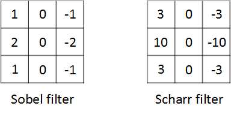
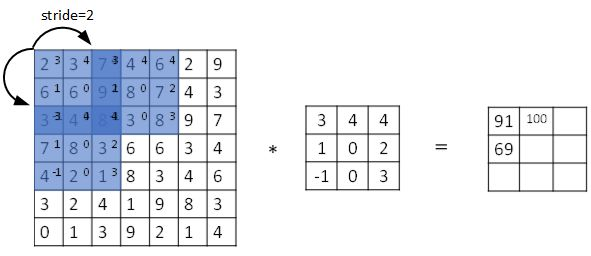
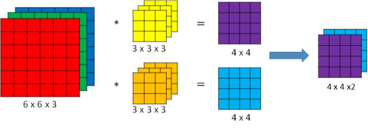
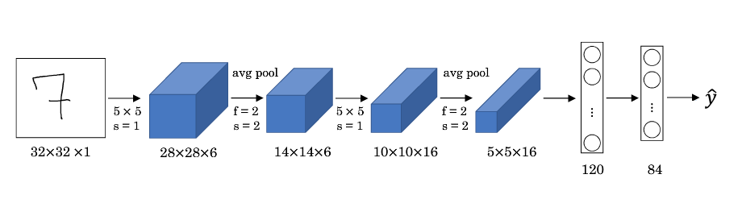
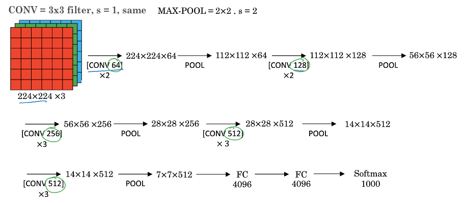
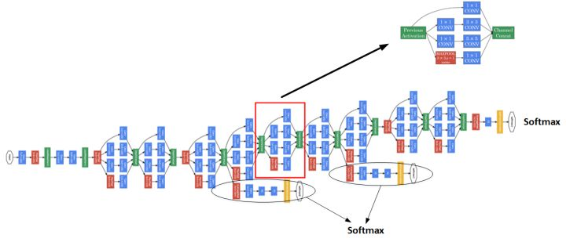

this note is made from coursera deep learning course, good reference note: [bighuang624/Andrew-Ng-Deep-Learning-notes](https://kyonhuang.top/Andrew-Ng-Deep-Learning-notes/#/)

[TOC]

# Week1
## Computer vision introduction
computer problems
* Image classification : 图片分类
* Object detection : 目标检测
* Neural Style Transfer : 神经风格转换

the challenge is the input image is very large, one solution is to use **Convolutional neural netorwk** (CNN)

## Edge detection
**Convolutional Operation** is the basis of component of convolutional neural network

two mainly type of edge detection
* Vertical edges
* Horizontal edges

a dynamic example of convolutional operation as follow: 

卷积操作的 API：
* 在 Python 中，卷积用`conv_forward()`表示；
* 在 Tensorflow 中，卷积用`tf.nn.conv2d()`表示；
* 在 keras 中，卷积用`Conv2D()`表示。

### filter
typical filter
- Sobel filter
- Scharr filter

滤波器中的值还可以设置为 **参数** ，通过模型训练来得到。这样，神经网络使用反向传播算法可以学习到一些低级特征，从而实现对图片所有边缘特征的检测, 这是一个很强大的想法

### padding
假设输入图片的大小为 $n \times n$，而滤波器的大小为 $f \times f$，则卷积后的输出图片大小为 $(n-f+1) \times (n-f+1)$。

the problem without padding
* shrinking output
* throw away info from edge of input

use padding to pad zeros to extend the original image

设每个方向扩展像素点数量为 $p$，则填充后原始图片的大小为 $(n+2p) \times (n+2p)$，滤波器大小保持 $f \times f$不变，则输出图片大小为 $(n+2p-f+1) \times (n+2p-f+1)$。

typical convolution
- Valid convolution: no padding, output size is $(n-f+1) \times (n-f+1)$;
- Same convolution: padding to make the output size to be the same as input size,  $p = \frac{f-1}{2}$ .

在计算机视觉领域，$f$通常为奇数。原因包括 Same 卷积中 $p = \frac{f-1}{2}$能得到自然数结果，并且滤波器有一个便于表示其所在位置的中心点。

### strided convolutions
设置**步长（Stride）** 来压缩一部分信息

设步长为 $s$，填充长度为 $p$，输入图片大小为 $n \times n$，滤波器大小为 $f \times f$，则卷积后图片的尺寸为：

$$\biggl\lfloor \frac{n+2p-f}{s}+1   \biggr\rfloor \times \biggl\lfloor \frac{n+2p-f}{s}+1 \biggr\rfloor$$

目前为止我们学习的“卷积”实际上被称为**互相关（cross-correlation）**，而非数学意义上的卷积。真正的卷积操作在做元素乘积求和之前，要将滤波器沿水平和垂直轴翻转（相当于旋转 180 度）。因为这种翻转对一般为水平或垂直对称的滤波器影响不大，按照机器学习的惯例，我们通常不进行翻转操作，在简化代码的同时使神经网络能够正常工作。

## Convolution over volumes
三维卷积的图示如下

如果想同时检测垂直和水平边缘，或者更多的边缘检测，可以增加更多的滤波器组。例如设置第一个滤波器组实现垂直边缘检测，第二个滤波器组实现水平边缘检测。设输入图片的尺寸为 $n \times n \times n\_c$（$n\_c$为通道数），滤波器尺寸为 $f \times f \times n_c$，则卷积后的输出图片尺寸为 $(n-f+1) \times (n-f+1) \times n'_c$，$n'_c$为滤波器组的个数。

对于一个 3x3x3 的滤波器，包括偏移量 $b$在内共有 28 个参数。不论输入的图片有多大，用这一个滤波器来提取特征时，参数始终都是 28 个，固定不变。即**选定滤波器组后，参数的数目与输入图片的尺寸无关**

因此，卷积神经网络的参数相较于标准神经网络来说要少得多。这是 CNN 的优点之一。

## Notation
设 $l$ 层为卷积层：

* $f^{[l]}$：**滤波器的高（或宽）**
* $p^{[l]}$：**填充长度**
* $s^{[l]}$：**步长**
* $n^{[l]}_c$：**滤波器组的数量**

* **输入维度**：$n^{[l-1]}_H \times n^{[l-1]}_W \times n^{[l-1]}_c$ 。其中 $n^{[l-1]}_H$表示输入图片的高，$n^{[l-1]}_W$表示输入图片的宽。之前的示例中输入图片的高和宽都相同，但是实际中也可能不同，因此加上下标予以区分。

* **输出维度**：$n^{[l]}_H \times n^{[l]}_W \times n^{[l]}_c$ 。其中

$$n^{[l]}_H = \biggl\lfloor \frac{n^{[l-1]}_H+2p^{[l]}-f^{[l]}}{s^{[l]}}+1   \biggr\rfloor$$

$$n^{[l]}_W = \biggl\lfloor \frac{n^{[l-1]}_W+2p^{[l]}-f^{[l]}}{s^{[l]}}+1   \biggr\rfloor$$

* **每个滤波器组的维度**：$f^{[l]} \times f^{[l]} \times n^{[l-1]}_c$ 。其中$n^{[l-1]}_c$ 为输入图片通道数（也称深度）。
* **权重维度**：$f^{[l]} \times f^{[l]} \times n^{[l-1]}_c \times n^{[l]}_c$
* **偏置维度**：$1 \times 1 \times 1 \times n^{[l]}_c$

## Convolutional neural netowrk architecture
随着神经网络计算深度不断加深，图片的高度和宽度 $n^{[l]}_H $、$n^{[l]}_W$一般逐渐减小，而 $n^{[l]}_c$在增加。

a typical convolutional neural network contains three parts
- Convolution layer : 卷积层
- Pooling layer : 池化层
- Fully Connected layer : 全连接层

## Pooling layer
**池化层** 的作用是缩减模型的大小，提高计算速度，同时减小噪声提高所提取特征的稳健性。

max pooling

avarage pooling

Hyperparameters
- f: filter size
- s: stride
- Max or avarage pooling

input dimensions:

$$n_H \times n_W \times n_c$$

output dimensions：

$$\biggl\lfloor \frac{n_H-f}{s}+1   \biggr\rfloor \times \biggl\lfloor \frac{n_W-f}{s}+1   \biggr\rfloor \times n_c$$

## Convolutional neural network example

FC3 和 FC4 为全连接层，与标准的神经网络结构一致.

|| Activation shape | Activation Size | #parameters|
|:--- | :--- | :--- | :--- |
|**Input:** | (32, 32, 3) | 3072 | 0
|**CONV1(f=5, s=1)** | (28, 28, 6) | 4704 | 158
|**POOL1** | (14, 14, 6) | 1176 | 0
|**CONV2(f=5, s=1)** | (10, 10, 16) | 1600 | 416
|**POOL2** | (5, 5, 16) | 400 | 0
|**FC3** | (120, 1) | 120 | 48120
|**FC4** | (84, 1) | 84 | 10164
|**Softmax** | (10, 1) | 10 | 850

## CNN advantages

相比标准神经网络，对于大量的输入数据，卷积过程有效地减少了 CNN 的参数数量，原因有以下两点：

* **参数共享（Parameter sharing）** ：特征检测如果适用于图片的某个区域，那么它也可能适用于图片的其他区域。即在卷积过程中，不管输入有多大，一个特征探测器（滤波器）就能对整个输入的某一特征进行探测。
* **稀疏连接（Sparsity of connections）** ：在每一层中，由于滤波器的尺寸限制，输入和输出之间的连接是稀疏的，每个输出值只取决于输入在局部的一小部分值。

池化过程则在卷积后很好地聚合了特征，通过降维来减少运算量。

由于 CNN 参数数量较小，所需的训练样本就相对较少，因此在一定程度上不容易发生过拟合现象。并且 CNN 比较擅长捕捉区域位置偏移。即进行物体检测时，不太受物体在图片中位置的影响，增加检测的准确性和系统的健壮性。

# Week2
## Outline
classic networks
- LeNet-5
- AlexNet
- VGG

ResNet (Residual Network，残差网络)

Inception Neural network

## Classic networks
### LeNet-5
refernce note is good enough to cover all the details

特点：

* LeNet-5 针对灰度图像而训练，因此输入图片的通道数为 1。
* 该模型总共包含了约 6 万个参数，远少于标准神经网络所需。
* 典型的 LeNet-5 结构包含卷积层（CONV layer），池化层（POOL layer）和全连接层（FC layer），排列顺序一般为 CONV layer->POOL layer->CONV layer->POOL layer->FC layer->FC layer->OUTPUT layer。一个或多个卷积层后面跟着一个池化层的模式至今仍十分常用。
* 当 LeNet-5模型被提出时，其池化层使用的是平均池化，而且各层激活函数一般选用 Sigmoid 和 tanh。现在，我们可以根据需要，做出改进，使用最大池化并选用 ReLU 作为激活函数。

### AlexNet

特点：

* AlexNet 模型与 LeNet-5 模型类似，但是更复杂，包含约 6000 万个参数。另外，AlexNet 模型使用了 ReLU 函数。
* 当用于训练图像和数据集时，AlexNet 能够处理非常相似的基本构造模块，这些模块往往包含大量的隐藏单元或数据。

### VGG

特点：

* VGG 又称 VGG-16 网络，“16”指网络中包含 16 个卷积层和全连接层。
* 超参数较少，只需要专注于构建卷积层。
* 结构不复杂且规整，在每一组卷积层进行滤波器翻倍操作。
* VGG 需要训练的特征数量巨大，包含多达约 1.38 亿个参数。

## ResNet
因为存在梯度消失和梯度爆炸问题，网络越深，就越难以训练成功。**残差网络（Residual Networks，简称为 ResNets）**可以有效解决这个问题。

上图的结构被称为**残差块（Residual block）**。通过**捷径（Short cut，或者称跳远连接，Skip connections）**可以将 $a^{[l]}$添加到第二个 ReLU 过程中，直接建立 $a^{[l]}$与 $a^{[l+2]}$之间的隔层联系。表达式如下：

$$z^{[l+1]} = W^{[l+1]}a^{[l]} + b^{[l+1]}$$

$$a^{[l+1]} = g(z^{[l+1]})$$

$$z^{[l+2]} = W^{[l+2]}a^{[l+1]} + b^{[l+2]}$$

$$a^{[l+2]} = g(z^{[l+2]} + a^{[l]})$$

构建一个残差网络就是将许多残差块堆积在一起，形成一个深度网络。

在理论上，随着网络深度的增加，性能应该越来越好。但实际上，对于一个普通网络，随着神经网络层数增加，训练错误会先减少，然后开始增多.

残差网络的训练效果显示，即使网络再深，其在训练集上的表现也会越来越好.

### Inituition
假设有一个大型神经网络，其输入为 $X$，输出为 $a^{[l]}$。给这个神经网络额外增加两层，输出为 $a^{[l+2]}$。将这两层看作一个具有跳远连接的残差块。为了方便说明，假设整个网络中都选用 ReLU 作为激活函数，因此输出的所有激活值都大于等于 0。

则有：

$$
\begin{equation}
\begin{split}
 a^{[l+2]} &= g(z^{[l+2]}+a^{[l]})  
     \\\ &= g(W^{[l+2]}a^{[l+1]}+b^{[l+2]}+a^{[l]})
\end{split}
\end{equation}
$$

当发生梯度消失时，$W^{[l+2]}\approx0$，$b^{[l+2]}\approx0$，则有：

$$a^{[l+2]} = g(a^{[l]}) = ReLU(a^{[l]}) = a^{[l]}$$

因此，这两层额外的残差块不会降低网络性能。而如果没有发生梯度消失时，训练得到的非线性关系会使得表现效果进一步提高。

注意，如果 $a^{[l]}$与 $a^{[l+2]}$的维度不同，需要引入矩阵 $W_s$与 $a^{[l]}$相乘，使得二者的维度相匹配。参数矩阵 $W_s$既可以通过模型训练得到，也可以作为固定值，仅使 $a^{[l]}$截断或者补零。

## 1x1 convolution
1x1 卷积（1x1 convolution，或称为 Network in Network）指滤波器的尺寸为 1。当通道数为 1 时，1x1 卷积意味着卷积操作等同于乘积操作。

而当通道数更多时，1x1 卷积的作用实际上类似全连接层的神经网络结构，从而降低（或升高，取决于滤波器组数）数据的维度。

池化能压缩数据的高度（$n_H$）及宽度（$n_W$），而 1×1 卷积能压缩数据的通道数（$n_C$）。在如下图所示的例子中，用 32 个大小为 1×1×192 的滤波器进行卷积，就能使原先数据包含的 192 个通道压缩为 32 个。

## Inception Network
在之前的卷积网络中，我们只能选择单一尺寸和类型的滤波器。而 **Inception 网络的作用**即是代替人工来确定卷积层中的滤波器尺寸与类型，或者确定是否需要创建卷积层或池化层。

Inception 网络选用不同尺寸的滤波器进行 Same 卷积，并将卷积和池化得到的输出组合拼接起来，最终让网络自己去学习需要的参数和采用的滤波器组合。

为了解决计算量大的问题，可以引入 1x1 卷积来减少其计算量,  1x1 的卷积层通常被称作 **瓶颈层（Bottleneck layer）**

多个 Inception 模块组成一个完整的 Inception 网络（被称为 GoogLeNet，以向 LeNet 致敬）

## Transfer learning
对于已训练好的卷积神经网络，可以将所有层都看作是**冻结的**，只需要训练与你的 Softmax 层有关的参数即可。大多数深度学习框架都允许用户指定是否训练特定层的权重。

而冻结的层由于不需要改变和训练，可以看作一个固定函数。可以将这个固定函数存入硬盘，以便后续使用，而不必每次再使用训练集进行训练了。

上述的做法适用于你只有一个较小的数据集。如果你有一个更大的数据集，应该冻结更少的层，然后训练后面的层。越多的数据意味着冻结越少的层，训练更多的层。如果有一个极大的数据集，你可以将开源的网络和它的权重整个当作初始化（代替随机初始化），然后训练整个网络。

## Data Augmentation
计算机视觉领域的应用都需要大量的数据

**数据扩增（Data Augmentation）** 利用现有的数据生成更多的数据

常用的数据扩增包括镜像翻转、随机裁剪、色彩转换。

## The state of computer vision
通常，学习算法有两种知识来源：

* 被标记的数据
* 手工工程

**手工工程（Hand-engineering，又称 hacks）**指精心设计的特性、网络体系结构或是系统的其他组件。手工工程是一项非常重要也比较困难的工作。在数据量不多的情况下，手工工程是获得良好表现的最佳方式。正因为数据量不能满足需要，历史上计算机视觉领域更多地依赖于手工工程。近几年数据量急剧增加，因此手工工程量大幅减少。

另外，在模型研究或者竞赛方面，有一些方法能够有助于提升神经网络模型的性能：

* 集成（Ensembling）：独立地训练几个神经网络，并平均输出它们的输出
* Multi-crop at test time：将数据扩增应用到测试集，对结果进行平均

但是由于这些方法计算和内存成本较大，一般不适用于构建实际的生产项目。