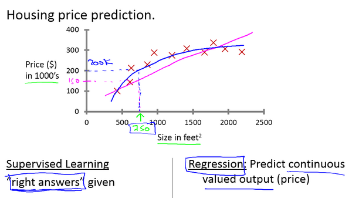

# Introduction
machine learning is widely used
* web search
* spam identification
* DNA Sequence
---
machine learning algorithm
* Supervised learning
* Unsupervised learning
* Recommended system
* Reinforcement learning
## Supervised Learning 
### Regression
`predict number` 

example 

### Classification
`predict categories` 

example 

## Unsupervised Learning
find `structure` in unlabled data 
* Clustering
* Dimensionality reduction
* Anomaly detection
# Linear Regression

## Cost Function
define how well the linear regression works 

Squared error cost function
$$ J(\theta_{0}, \theta_{1}) = \frac{1}{2m} \sum_{i = 1}^{m}(h_{\theta}(x^{i}) - y ^ {i}) ^ {2} $$

### Gradient Descent
find the `best parameters` to `minimize` the cost function 

* local minimum
* global minimum
---
gradient descent algorithm 

`learning rate` 

fixed learning rate
* Near a local minimum
  * Derivative becomes smaller
  * Update steps becomes smaller
---
## Multiple features
multiple feature function
$$h_{\theta}(x) = \theta_0 + \theta_1 x_1 + \theta_2 x_2 + \theta_3 x_3 + ... + \theta_n x_n$$

`Vectorlization`:

$$h_{\theta}(x) = \big[\theta_0\ \ \theta_1\ \ ... \ \ \theta_n\big] \left[\begin{matrix}x_0\\\ x_1\\\ ...\\\ x_n\end{matrix}\right]= \theta^Tx$$
### Gradient Descent
$$\theta_j := \theta_j - \alpha\frac{\partial}{\partial \theta_j}J(\theta)$$

for m >= 1: 
 
$$\frac{\partial}{\partial \theta_j}J(\theta) = \frac{1}{m}\sum^m_{i=1}(h\_{\theta}(x^{(i)}) - y^{(i)})x^{(i)}_j$$

notice that:

$$J(\theta) = \frac{1}{2m}\sum^m_{i=1}(h_{\theta}(x^{(i)}) - y^{(i)})^2$$