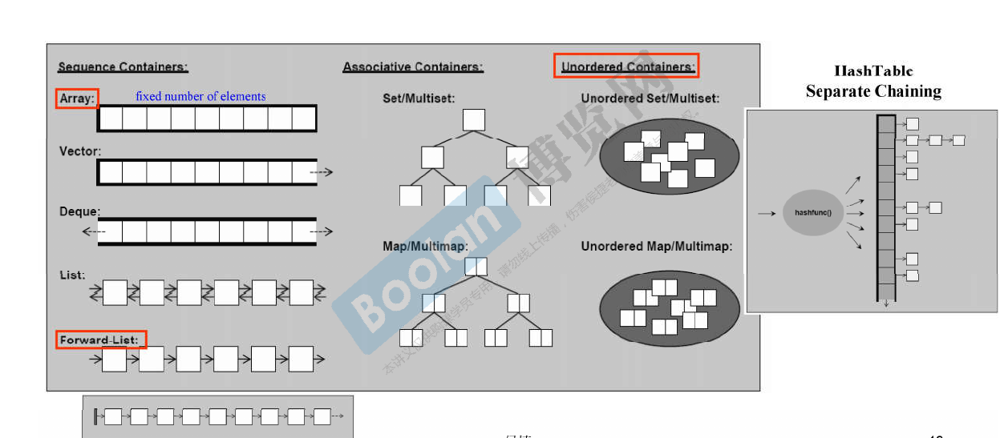

侯捷stl学习笔记

[TOC]
# Introduction
- C++ Standard Library
- C++ Standard Template Library

STL 是 C++ 标准库的一个重要组成部分

STL 是标准库中专注于泛型数据结构和算法的部分

- C++ 标准库的 header files 不带扩展名 (.h)，例如 `#include <vector>`
- 新式 C header files 不带扩展名 .h，例如 `#include <cstdio>`
- 旧式 C header files (带有扩展名 .h) 仍然可用，例如 `#include <stdio.h>`
- 新式 headers 内的组件封装于 namespace "std"
  - using namespace std; or
  - using std::cout; (for example)
- 旧式 headers 内的组件不封装于 namespace "std"

例子：

| 对比项 | `<cstdio>` | `<stdio.h>` |
|--------|------------|--------------|
| 命名空间 | 所有名称定义在 `std` **命名空间**中| 所有名称定义在全局命名空间中|
| 头文件风格 | C++ 风格，不带 `.h` 后缀。 | C 风格，带 `.h` 后缀。 |
| 标准归属 | C++ 标准库头文件（C++98 起）。 | 原为 C 标准库头文件，C++ 为了兼容 C 而保留。 |

```cpp
// 使用 <cstdio>（C++ 风格）
#include <cstdio>
int main() {
    std::printf("Hello\n");  // 需要 std:: 前缀
}

// 使用 <stdio.h>（C 风格）
#include <stdio.h>
int main() {
    printf("Hello\n");       // 全局命名空间
}
```

stl 六大组件
- 容器 (Containers)
- 分配器 (Allocators)
- 算法 (Algorithms)
- 迭代器 (Iterators)
- 适配器 (Adapters)
- 仿函数 (Functors)


```cpp
#include <vector>
#include <algorithm>
#include <functional>
#include <iostream>

using namespace std;

int main()
{
    int ia[6] = { 27, 210, 12, 47, 109, 83 };
    vector<int, allocator<int>> vi(ia, ia + 6);  // allocator

    // iterator : vi.begin(), vi.end()
    // predicate : not1(bind2nd(less<int>(), 40))
    // function object : less<int>
    // function adapter (binder) : bind2nd
    // function adapter (negator) : not1
    cout << count_if(vi.begin(), vi.end(), not1(bind2nd(less<int>(), 40)));
    return 0;
}
```

iterator是左闭右开的

下面是stl container一览



# STL usage
这里的示例有点老了，新版的函数更加安全和快捷，不过作为学习的话还是做了点note

一个是`qsort`, 这里的签名其实是`c`语言中留下来的, 现在一般使用`std::sort` or `std::ranges::sort`了

```cpp
void qsort( void *ptr, std::size_t count,
            std::size_t size, /* c-compare-pred */* comp );
void qsort( void *ptr, std::size_t count,
            std::size_t size, /* compare-pred */* comp );

extern "C" using /* c-compare-pred */ = int(const void*, const void*);
extern "C++" using /* compare-pred */ = int(const void*, const void*);
```
> The two overloads provided by the C++ standard library are distinct because the types of the parameter `comp` are distinct (language linkage is part of its type).

参数解释
- **ptr** - 指向要检验的数组的指针  
- **count** - 数组中元素的数量  
- **size** - 数组中每个元素的大小，以字节表示  
- **comp** - 比较函数。如果首个参数小于第二个，那么返回负整数值；如果首个参数大于第二个，返回正整数值；如果两个参数等价，返回零。作为首个实参传递 key，作为第二个实参传递来自数组的元素。  

  比较函数的签名应等价于如下形式：  
  ```c
  int cmp(const void *a, const void *b);
  ```
  该函数必须不修改传递给它的对象，并且在调用比较函数时必须返回一致的结果，与它们在数组中的位置无关。

```cpp
#include <array>
#include <climits>
#include <compare>
#include <cstdlib>
#include <iostream>

int main()
{
    std::array a{-2, 99, 0, -743, INT_MAX, 2, INT_MIN, 4};
    
    std::qsort
    (
        a.data(),
        a.size(),
        sizeof(decltype(a)::value_type),
        [](const void* x, const void* y)
        {
            const int arg1 = *static_cast<const int*>(x);
            const int arg2 = *static_cast<const int*>(y);
            const auto cmp = arg1 <=> arg2;
            if (cmp < 0)
                return -1;
            if (cmp > 0)
                return 1;
            return 0;
        }
    );
    
    for (int ai : a)
        std::cout << ai << ' ';
    std::cout << '\n';
}
```

接着是`std::bsearch`, 现在一般使用`std::lower_bound` or `std::upper_bound`了

函数签名如下
```cpp
void* bsearch( const void* key, const void* ptr, std::size_t count,
               std::size_t size, /* C 比较谓词 */* comp );
void* bsearch( const void* key, const void* ptr, std::size_t count,
               std::size_t size, /* 比较谓词 */* comp );
/* notice: 在c++26里面 key 不使用 const 修饰了 */
```

```cpp
#include <array>
#include <cstdlib>
#include <iostream>

template<typename T>
int compare(const void *a, const void *b)
{
    const auto &arg1 = *(static_cast<const T*>(a));
    const auto &arg2 = *(static_cast<const T*>(b));
    const auto cmp = arg1 <=> arg2;
    return cmp < 0 ? -1
        :  cmp > 0 ? +1
        :  0;
}

int main()
{
    std::array arr{1, 2, 3, 4, 5, 6, 7, 8};
    
    for (const int key : {4, 8, 9})
    {
        const int* p = static_cast<int*>(
            std::bsearch(&key,
                arr.data(),
                arr.size(),
                sizeof(decltype(arr)::value_type),
                compare<int>));
        
        std::cout << "值 " << key;
        if (p)
            std::cout << "在位置 " << (p - arr.data())<< " 找到了";
        else
            std::cout << "没有找到";
    }
}
```

## deque
`std::deque` 采用**分段连续**的方式，由以下两部分构成：

### map array
- 是一个**指针数组**（通常称作 `map`），每个指针指向一个实际存储元素的**缓冲区**（buffer / block）。
- 这个数组本身是动态增长的（当现有 map 空间不足时会重新分配更大的 map 并迁移指针）。

### buffer / block
- 每个缓冲区是一块固定大小的连续内存（例如 512 字节或元素个数的固定倍数，具体取决于实现）。
- 缓冲区的数量根据元素数量动态增加或减少。

### structure

```
Central map (指针数组)
┌───────┬───────┬───────┬───────┬───────┐
│  ptr0 │  ptr1 │  ptr2 │  ptr3 │  ptr4 │ ... (可能还有未使用的槽位)
└───┬───┴───┬───┴───┬───┴───┬───┴───┬───┘
    ▼       ▼       ▼       ▼       ▼
  buffer0 buffer1 buffer2 buffer3 buffer4
  [元素]  [元素]  [元素]  [元素]  [元素]
  [元素]  [元素]  [元素]  [元素]  [元素]
   ...     ...     ...     ...     ...
```

- **`push_back`**：如果最后一个缓冲区还有空闲位置，直接放入；否则分配新缓冲区并更新 map 末尾。
- **`push_front`**：如果第一个缓冲区头部还有空闲位置，直接放入；否则分配新缓冲区并插入到 map 开头（或重新分配 map 以腾出空间）。
- 两端插入时不会移动已有元素。

### random access implementation

`deque` 支持 O(1) 随机访问，通过计算：

```
地址 = map[块索引] + 块内偏移
```

具体步骤：
- 已知 `deque` 中每个缓冲区的大小（例如 `_M_blocksize` 表示每个缓冲区可容纳的元素个数）。
- 给定下标 `i`：
  - `块索引 = (i + 起始偏移) / 缓冲区大小`
  - `块内偏移 = (i + 起始偏移) % 缓冲区大小`
- 这里的“起始偏移”是为了处理头部有空位的逻辑（例如第一个缓冲区可能不是从索引 0 开始存放元素）。

### deque summary
- `deque` = **map 数组** + **多个固定大小的缓冲区**。
- 两端增删 O(1)，无需移动元素。
- 随机访问比 `vector` 多一次间接寻址（查 map + 块内偏移），故略慢。
- 中间插入/删除仍需移动元素，效率 O(n)。

## stack and queue
`std::deque` 涵盖了`std::stack`和`std::queue`的功能

`std::stack` 和 `std::queue` 默认使用 `std::deque` 作为底层容器。

## associate container
`multiset` 和 `multimap` 是允许重复键的有序容器。
- `multiset`：需要有序存储重复元素（例如成绩列表、允许重复的排行榜）。
- `multimap`：一个键对应多个值的映射（例如学生选课：一个学生多门课；目录索引：一个关键词对应多篇文章）。

`unordered_multiset / unordered_multimap`哈希表版本

# architecture & source
1. OOP(Object-Oriented-programming) 企图将 datas 和 methods 关联在一起
2. GP(Generic programming) 是将 datas 和 methods 分开来

STL 是 GP 的思想

> 所有 algorithms，其内最终涉及元素本身的操作，无非就是比大小。

于是要学习操作重载和模板

## Operator Overloading

| Expression | As member function | As non-member function | Example |
|---|---|---|---|
| @a | (a).operator@() | operator@ (a) | !std::cin calls std::cin.operator!() |
| a@b | (a).operator@ (b) | operator@ (a, b) | std::cout << 42 calls std::cout.operator<<(42) |
| a=b | (a).operator= (b) | cannot be non-member | std::string s; s = "abc"; calls s.operator="abc" |
| a[b] | (a).operator\[\](b) | cannot be non-member | std::map<int, int> m; m\[1\] = 2; calls m.operator\[\](1) |
| a-> | (a).operator->() | cannot be non-member | std::unique_ptr<S> ptr(new S); ptr->bar() calls ptr.operator->() |
| a@ | (a).operator@ (0) | operator@ (a, 0) | std::vector<int>::iterator i = v.begin(); i++ calls i.operator++(0) |

> In this table, @ is a placeholder representing all matching operators: all prefix operators in @a, all postfix operators other than -> in a@, all infix operators other than = in a@b

Specialization

这里的思想和 rust 的`trait`的思想很像

泛化指的是定义模板时的**通用**版本（主模板，primary template），适用于所有类型。

特化是指针对**一个或多个特定模板参数**给出专门的实现
- 全特化（Explicit Specialization）：指定所有模板参数。
- 偏特化（Partial Specialization）：只指定部分模板参数（仅限类模板）。

```cpp
template <class Key> struct hash { };

template<>  
STL_TEMPLATE_NULL struct hash<char> {  
    size_t operator()(char x) const { return x; }  
};  

STL_TEMPLATE_NULL struct hash<short>() {  
    size_t operator()(short x) const { return x; }  
};  

STL_TEMPLATE_NULL struct hash<unsigned short> {  
    size_t operator()(unsigned short x) const { return x; }  
};  

STL_TEMPLATE_NULL struct hash<int> {  
    size_t operator()(int x) const { return x; }  
};  

STL_TEMPLATE_NULL struct hash<unsigned int> {  
    size_t operator()(unsigned int x) const { return x; }  
};  

STL_TEMPLATE_NULL struct hash<long> {  
    size_t operator()(long x) const { return x; }  
};  

STL_TEMPLATE_NULL struct hash<unsigned long> {  
    size_t operator()(unsigned long x) const { return x; }  
};  
```

## allocator
侯捷老师在这里主要讲解了vs6, bc5, gnuc2.9(`<defalloc.h>`)的`allocator`的实现，底层都是使用`malloc()`, `free()`实现的， 效果都不太理想

在典型的c语言的`malloc()`下内存里面会记录分配的大小，于是`free()`的时候不需要进行大小指定。

但是在`container`的思想下我们知道单个容器的大小，无需再分配的内存里面储存分配的大小

后面就是介绍了gnuc 2.9 `<stl::alloc>`

**GCC 2.9 STL 分配器 (`std::alloc`)**核心要点：
- **两级配置器**：以 **128 字节** 为界。
  - **第一级**：大内存（>128B）→ 直接调用 `malloc`/`free`。
  - **第二级**：小内存（≤128B）→ 内存池 + 自由链表管理。
- **自由链表**：16 条链表，负责大小 **8, 16, … , 128 字节**（8 的倍数）的内存块。
- **无 cookie 开销**：内存池从系统申请一大块，内部分配的小块无额外头部信息，极大节约内存。
- **效率高**：避免频繁调用 `malloc`，减少碎片。

GCC 4.9 STL Allocator 的默认分配器就是`malloc()/free()`的包装

GCC 2.9 时代的 `std::alloc` 的后继成为了`__gnu_cxx::__pool_alloc<T>`
