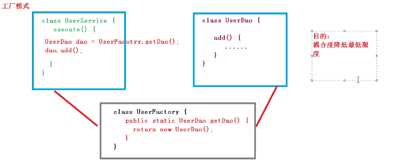

PS: reason? just want to know more about java backend

[TOC]

# Basic
java basis is similar to other language, so only record part of it

## classpath
`classpath` 是 JVM 用到的一个环境变量，它用来指示JVM如何搜索 `class` .

`classpath`是一组目录的集合.

在windows上用`;`分隔， linux上用`:`分隔

`java -cp .;C:\work\project1\bin;C:\shared abc.xyz.Hello`的命令
- 先在`.`目录里面寻找
- 然后`C:\work\project1\bin`
- 最后就是`C:\shared`

由于可能有很多`.class`文件，逐个声明还是很麻烦的，于是把目录的结构变成单独的一个`jar`包

jar包实际上就是一个zip格式的压缩文件，而jar包相当于目录。

个人感觉应该就是src目录和bin目录的下面的目录结构打包成jar包就好了，但是一般使用管理构建工具，如`Maven`

## Module
一个大型Java程序会生成自己的jar文件，同时引用依赖的第三方jar文件.

problem: jar只是用于存放class的容器，它并不关心class之间的依赖。

method: 编写module来声明依赖关系

目录的结构如下：

```console
oop-module
├── bin
├── build.sh
└── src
    ├── com
    │   └── itranswarp
    │       └── sample
    │           ├── Greeting.java
    │           └── Main.java
    └── module-info.java
```

`src` 目录下的`module-info.java`就是编写module的文件

```java
module hello.world {
    exports com.itranswarp.sample;

    requires java.base;
	requires java.xml;
}
```

但是一般使用管理构建工具自动帮助完成，感觉大概了解一下就好了

# Core class
## 字符串
- java的字符串不可变
- 两个字符串比较，必须总是使用`.equals()`的方法

## StringBuilder
可以高效拼接字符串

`.append()`, `.toString()`

## StringJoiner
类似用分隔符拼接数组的需求很常见，于是有`StringJoiner`来干这个事情

```java
import java.util.StringJoiner;
public class Main {
    public static void main(String[] args) {
        String[] names = {"Bob", "Alice", "Grace"};
        var sj = new StringJoiner(", ", "Hello ", "!");
        for (String name : names) {
        sj.add(name);
    }
        System.out.println(sj.toString());
    }
}
```

这里面的第一个参数是分隔符，第二个是开头的字符串，第三个是结尾的字符串

## String.join()
`String.join()`算是joiner的简化便捷版，但是不能指定开头和结尾

```java
String[] names = {"Bob", "Alice", "Grace"};
var s = String.join(", ", names);
```

## 包装类
Java核心库提供的包装类型可以把**基本类型**包装为`class`

自动装箱和自动拆箱都是在**编译期**完成的

装箱和拆箱会影响执行效率，且拆箱时可能发生 `NullPointerException` ；

包装类型的比较必须使用 `equals()` ；

整数和浮点数的包装类型都继承自 Number ；

包装类型提供了大量实用方法。

## enum
为了让编译器能自动检查某个值在枚举的集合内，并且，不同用途的枚举需要不同的类型来标记，不能混用，使用`enum`来定义枚举类;

## exceptions
在`catch`中抛出异常，不会影响`finally`的执行。JVM会先执行`finally`，然后抛出异常。

### logging
java 本身的logging库用的不多, api 如下
```java
Logger logger = Logger.getLogger(Main.class.getName());
logger.server("some info string");
logger.info("some info string");
logger.warning("some info string");
logger.config("some info string");
logger.fine("some info string");
logger.finer("some info string");
logger.finest("some info string");
```

Commons Logging是一个第三方日志库，它是由Apache创建的日志模块. 参数其实和java自身的差不多，但是有重载的`(String, Throwable)`的方法, 还有`getClass()`也是很方便的
```java
static final Log log = LogFactory.getLog(getClass());
log.info();
log.error();
log.warning();
log.debug();
log.trace();
log.fatal();
```

后面介绍的就是日志的实现框架，大概意思就是可以通过xml文件来定义日志的基础格式之类的，了解一下就可以了

# reflection
反射让代码可以“反观自身” —— 可以在不直接知道类名的情况下，操作该类。

暂时做一些简单的了解就算了

# generics
对于静态方法，我们可以单独改写为“泛型”方法，只需要使用另一个类型即可。 use `<K>` instead of `<T>`
```java
public class Pair<T> {
    private T first;
    private T last;
    public Pair(T first, T last) {
        this.first = first;
        this.last = last;
    }
    public T getFirst() { ... }
    public T getLast() { ... }

    // 静态泛型方法应该使用其他类型区分:
    public static <K> Pair<K> create(K first, K last) {
        return new Pair<K>(first, last);
    }
}
```

虚拟机JVM对泛型其实一无所知，所有的工作都是编译器做的。

Java的泛型是采用**擦拭法(type erase)**实现的；

擦拭法决定了泛型<T>：
- 不能是基本类型，例如：`int`；
- 不能获取带泛型类型的Class，例如：`Pair<String>.class`；
- 不能判断带泛型类型的类型，例如：`x instanceof Pair<String>`；
- 不能实例化T类型，例如：`new T()`。
- 泛型方法要防止重复定义方法，例如：`public boolean equals(T obj)`；

使用类似 `<? extends Number>` 通配符作为方法参数时表示：

- 方法内部可以调用获取 `Number` 引用的方法，例如：  
  ```java
  Number n = obj.getFirst();
  ```

- 方法内部无法调用传入 `Number` 引用的方法（`null` 除外），例如：  
  ```java
  obj.setFirst(Number n);
  ```

即一句话总结：使用 `extends` 通配符表示可以读，不能写。

使用类似 `<T extends Number>` 定义泛型类时表示：

- 泛型类型限定为 `Number` 以及 `Number` 的子类。

使用类似 `<? super Integer>` 通配符作为方法参数时表示：

- 方法内部可以调用传入 `Integer` 引用的方法，例如：`obj.setFirst(Integer n);`
- 方法内部无法调用获取 `Integer` 引用的方法（`Object` 除外），例如：`Integer n = obj.getFirst();`

使用 `super` 通配符表示只能写不能读。

使用 `extends` 和 `super` 通配符要遵循PECS原则。

无限定通配符 `<? extends T>` 很少使用，可以用 `<T>` 替换，同时它是所有 `<T>` 类型的超类。

# Collections
`java.util`包主要提供了以下三种类型的集合：
- `List`
    - `ArrayList`
    - `LinkedList`
- `Map`
- `Set`

不应该继续使用的遗留类：
- `Hashtable`：一种线程安全的`Map`实现；
- `Vector`：一种线程安全的`List`实现；
- `Stack`：基于`Vector`实现的`LIFO`的栈。

不应该使用的遗留接口： `Enumeration<E>`：已被`Iterator<E>`取代。

## List
`List` 和 `Array` 可以装换， 使用`.toArray()` 就可以了

## equals()
`equals()` 必须满足以下条件：
- 自反性（Reflexive）：对于非 `null` 的`x` 来说，`x.equals(x)` 必须返回 `true`；
- 对称性（Symmetric）：对于非 `null` 的 `x` 和 `y` 来说，如果 `x.equals(y)` 为 `true`，则 `y.equals(x)` 也必须为 `true`；
- 传递性（Transitive）：对于非 `null` 的 `x`、`y` 和 `z` 来说，如果 `x.equals(y)` 为 `true`，`y.equals(z)` 也为 `true`，那么 `x.equals(z)` 也必须为 `true`；
- 一致性（Consistent）：对于非 `null` 的 `x` 和 `y` 来说，只要 `x` 和 `y` 状态不变，则 `x.equals(y)` 总是一致地返回 `true` 或者 `false`；
- 对 `null` 的比较：即 `x.equals(null)` 永远返回 `false`。

## Map
iterate a map

```java
import java.util.HashMap;
import java.util.Map;

public class Main {
    public static void main(String[] args) {
        Map<String, Integer> map = new HashMap<>();
        map.put("apple", 123);
        map.put("pear", 456);
        map.put("banana", 789);
        for (String key : map.keySet()) {
            Integer value = map.get(key);
            System.out.println(key + " = " + value);
        }
    }
}
```

or use

```java
for (Map.Entry<String, Integer> entry : map.entrySet()) {
    String key = entry.getKey();
    Integer value = entry.getValue();
    System.out.println(key + " = " + value);
}
```

## Hashcode()
在计算`hashCode()`的时候，经常借助`Objects.hash()`来计算：

```java
int hashCode() {
    return Objects.hash(firstName, lastName, age);
}
```
要正确使用 HashMap，作为 key 的类必须正确覆写 `equals()` 和 `hashCode()` 方法；

一个类如果覆写了 `equals()`，就必须覆写 `hashCode()`，并且覆写规则是：
- 如果 `equals()` 返回 `true`，则 `hashCode()` 返回值必须相等；
- 如果 `equals()` 返回 `false`，则 `hashCode()` 返回值尽量不要相等。

## TreeMap
`SortedMap`是接口，它的实现类是`TreeMap`, 它在内部会对Key进行排序.

使用`Comparator`来构建比较的方法
```java
Map<Student, Integer> map = new TreeMap<>(new Comparator<Student>() {
            public int compare(Student p1, Student p2) {
                return p1.score > p2.score ? -1 : 1;
            }
        });
        map.put(new Student("Tom", 77), 1);
        map.put(new Student("Bob", 66), 2);
        map.put(new Student("Lily", 99), 3);
        for (Student key : map.keySet()) {
            System.out.println(key);
        }
        System.out.println(map.get(new Student("Bob", 66))); // 2
```

## Set
`Set`
- `HashSet`是无序的
- `TreeSet`是有序的

# Thread
java 的 thread 接口还是很简洁的, 和一些主流语言的概念都差不多
- `start()`
- `join()`
- `synchronized(resource)`
- `setDaemon()`

Java的`synchronized`锁是可重入锁；

死锁产生的条件是多线程各自持有不同的锁，并互相试图获取对方已持有的锁，导致无限等待；

避免死锁的方法是多线程获取锁的**顺序要一致**。

`synchronized` 并没有解决多线程协调的问题。

在典型的producer-consumer里面就知道了，当资源之间的关系需要协调就会出问题

```java
class TaskQueue {
    Queue<String> queue = new LinkedList<>();

    public synchronized void addTask(String s) {
        this.queue.add(s);
    }

    public synchronized String getTask() {
        while (queue.isEmpty()) {
        }
        return queue.remove();
    }
}
```

`wait()`可以释放获得的锁, `wait()`方法返回时，线程又会重新试图获得锁。

`notify()`可以让等待的线程被重新唤醒, `notifyAll()`唤醒所有当前正在等待某个锁的线程

## ReentrantLock
problem: `synchronized`锁很重，并且获取时必须一直等待，没有额外的尝试机制。

`java.util.concurrent.locks`包提供的`ReentrantLock`用于替代`synchronized`加锁

```java
public class Counter {
    private final Lock lock = new ReentrantLock();
    private int count;

    public void add(int n) {
        lock.lock();
        try {
            count += n;
        } finally {
            lock.unlock();
        }
    }
}
```

`ReentrantLock`是可重入的锁

使用`conditional`来进行`ReentrantLock`的协调关系
- `await()`会释放当前锁，进入等待状态；
- `signal()`会唤醒某个等待线程；
- `signalAll()`会唤醒所有等待线程；
- 唤醒线程从`await()`返回后需要重新获得锁。

完整的例子如下：

```java
class TaskQueue {
    private final Lock lock = new ReentrantLock();
    private final Condition condition = lock.newCondition();
    private Queue<String> queue = new LinkedList<>();

    public void addTask(String s) {
        lock.lock();
        try {
            queue.add(s);
            condition.signalAll();
        } finally {
            lock.unlock();
        }
    }

    public String getTask() {
        lock.lock();
        try {
            while (queue.isEmpty()) {
                condition.await();
            }
            return queue.remove();
        } finally {
            lock.unlock();
        }
    }
}
```

## ReadWriteLock
`ReentrantLock`保证了只有一个线程可以执行临界区代码：

`ReadWriteLock`是典型的读者-写者问题的锁：
- 只允许一个线程写入（其他线程既不能写入也不能读取）；
- 没有写入时，多个线程允许同时读（提高性能）。

```java
public class Counter {
    private final ReadWriteLock rwlock = new ReentrantReadWriteLock();
    // 注意: 一对读锁和写锁必须从同一个rwlock获取:
    private final Lock rlock = rwlock.readLock();
    private final Lock wlock = rwlock.writeLock();
    private int[] counts = new int[10];

    public void inc(int index) {
        wlock.lock(); // 加写锁
        try {
            counts[index] += 1;
        } finally {
            wlock.unlock(); // 释放写锁
        }
    }

    public int[] get() {
        rlock.lock(); // 加读锁
        try {
            return Arrays.copyOf(counts, counts.length);
        } finally {
            rlock.unlock(); // 释放读锁
        }
    }
}
```
## StampledLock
problem: `ReadWriteLock` 如果有线程正在读，写线程需要等待读线程释放锁后才能获取写锁，即读的过程中不允许写，这是一种悲观的读锁。

`StampedLock` 是java新的读写锁: 读的过程中也允许获取写锁后写入！这样一来，我们**读的数据就可能不一致**，所以需要一点**额外的代码**来判断读的过程中是否有写入，这种读锁是一种**乐观锁**。

乐观锁于悲观锁
- 乐观锁的意思就是乐观地估计读的过程中大概率不会有写入
- 悲观锁则是读的过程中拒绝有写入，也就是写入必须等待。

首先通过`tryOptimisticRead()`获取一个乐观读锁，并返回版本号

接着进行读取，读取完成后，我们通过validate()去验证版本号，如果在读取过程中没有写入，版本号不变，验证成功，我们就可以放心地继续后续操作。

这里有趣的是评论区的话题： 最后的return部分可能被一个写的线程改变了 `x`, `y`的值，所以返回的数据还是正确的。

```java
public class Point {
    private final StampedLock stampedLock = new StampedLock();

    private double x;
    private double y;

    public void move(double deltaX, double deltaY) {
        long stamp = stampedLock.writeLock(); // 获取写锁
        try {
            x += deltaX;
            y += deltaY;
        } finally {
            stampedLock.unlockWrite(stamp); // 释放写锁
        }
    }

    public double distanceFromOrigin() {
        long stamp = stampedLock.tryOptimisticRead(); // 获得一个乐观读锁
        // 注意下面两行代码不是原子操作
        // 假设x,y = (100,200)
        double currentX = x;
        // 此处已读取到x=100，但x,y可能被写线程修改为(300,400)
        double currentY = y;
        // 此处已读取到y，如果没有写入，读取是正确的(100,200)
        // 如果有写入，读取是错误的(100,400)
        if (!stampedLock.validate(stamp)) { // 检查乐观读锁后是否有其他写锁发生
            stamp = stampedLock.readLock(); // 获取一个悲观读锁
            try {
                currentX = x;
                currentY = y;
            } finally {
                stampedLock.unlockRead(stamp); // 释放悲观读锁
            }
        }
        return Math.sqrt(currentX * currentX + currentY * currentY);
    }
}
```
`StampledLock`是不可以重入的锁，但是并发性高了一些

## Semaphore
本质上锁的目的是保护一种受限资源.

还有一种受限资源，它需要保证同一时刻最多有N个线程能访问.

`Semaphore`本质上就是一个信号计数器，用于限制同一时间的最大访问数量。

```java
public class AccessLimitControl {
    // 任意时刻仅允许最多3个线程获取许可:
    final Semaphore semaphore = new Semaphore(3);

    public String access() throws Exception {
        // 如果超过了许可数量,其他线程将在此等待:
        semaphore.acquire();
        try {
            // TODO:
            return UUID.randomUUID().toString();
        } finally {
            semaphore.release();
        }
    }
}
```

`Semaphore(1)`就相当于锁的功能

## Concurrent sets
thread-safe datastructures

| interface     | non-thread-safe           | thread-safe    |
|---|---|---|
| List          | ArrayList                 | CopyOnWriteArrayList    |
| Map           | HashMap                   | ConcurrentHashMap    |
| Set           | HashSet / TreeSet         | CopyOnWriteArrayList    |
| Queue         | ArrayDeque / LinkedList   | ArrayBlockingQueue / LinkedBlockingQueue |
| Deque         | ArrayDeque / LinkedList   | LinkedBlockingDeque    |

## Atomic
使用`java.util.concurrent.atomic`提供的原子操作可以简化多线程编程：
- 原子操作实现了无锁的线程安全；
- 适用于计数器，累加器等。

## thread pool
创建线程需要操作系统资源（线程资源，栈空间等），频繁创建和销毁大量线程需要消耗大量时间。

可以把很多小任务让一组线程来执行，而不是一个任务对应一个新线程。这种能接收大量小任务并进行分发处理的就是**线程池**。

`ExecutorService`接口表示线程池, Java标准库提供实现类有：
- `FixedThreadPool`：线程数固定的线程池；
- `CachedThreadPool`：线程数根据任务动态调整的线程池；
- `SingleThreadExecutor`：仅单线程执行的线程池。

评论区的提问： 大厂规定不能使用Executors去创建线程池?

answer: 因为容易OOM，Executors的底层实现的`BlockingQueue`是一个无边界的队列，默认没有限制创建线程的个数，默认是最大Integer.MAX_VALUE;

## Future
Future异步的教程介绍一般，没有多少内容

# Java8
## lambda
```console
// 1. 不需要参数,返回值为 5  
() -> 5  
  
// 2. 接收一个参数(数字类型),返回其2倍的值  
x -> 2 * x  
  
// 3. 接受2个参数(数字),并返回他们的差值  
(x, y) -> x – y  
  
// 4. 接收2个int型整数,返回他们的和  
(int x, int y) -> x + y  
  
// 5. 接受一个 string 对象,并在控制台打印,不返回任何值(看起来像是返回void)  
(String s) -> System.out.print(s)
```

## Optional
Optional 类是一个可以为null的容器对象。

如果值存在则`isPresent()`方法会返回`true`，调用`get()`方法会返回该对象。

# JavaWeb

> **JavaWeb** 是使用 Java 技术开发动态 Web 资源（如 Servlet、JSP）的一整套技术栈。
> 它运行在 Web 服务器（如 Tomcat）中，通过 HTTP 协议与客户端（浏览器）交互。
> JavaWeb 是基于**请求**和**响应**来开发的。

| 概念           | 说明                                                         |
| -------------- | ------------------------------------------------------------ |
| **JavaWeb**    | 基于 Java 的 Web 开发技术体系，包含 Servlet、JSP、JDBC 等。 |
| **Web 服务器** | 如 Tomcat，为 JavaWeb 程序提供运行环境。                    |
| **HTTP 协议**  | JavaWeb 程序遵循的通信规则（请求-响应模型）。                |

于是要先了解一下web的组成

先是html, css.

html定义了基本的元素
- ol
- ul
- form
- div
- p
- span

可以在tag里面设置属性。

考虑到复用，于是有了`id`, `class`的标识可以制定来复用属性。

css作为单独的文件可以专门设置这些样式，独立开来方便了也更强大。

在html里面考虑执行代码来做简单的逻辑来动态改变内容，更强大。

使用的语言是javascript, 里面内置了`dom（Document Object Model）`可以方便的对html元素进行操作

| 类别             | 方法名                                   | 描述                                                             |
| ---------------- | ---------------------------------------- | ---------------------------------------------------------------- |
| **获取元素**     | `getElementById(id)`                     | 根据 `id` 获取唯一元素                                          |
|                  | `getElementsByClassName(className)`      | 根据类名获取元素集合（HTMLCollection）                          |
|                  | `getElementsByTagName(tagName)`          | 根据标签名获取元素集合（HTMLCollection）                        |
|                  | `querySelector(selector)`                | 根据 CSS 选择器获取第一个匹配元素                               |
|                  | `querySelectorAll(selector)`             | 根据 CSS 选择器获取所有匹配元素（NodeList）                     |
| **创建元素**     | `createElement(tagName)`                 | 创建新的元素节点                                                |
| **添加/插入**    | `appendChild(node)`                      | 将节点添加为父节点的最后一个子节点                              |
|                  | `insertBefore(newNode, referenceNode)`   | 在参考节点前插入新节点                                          |
|                  | `append()` / `prepend()`                 | 在父节点内部末尾/开头插入内容（可多个节点或字符串）             |
| **删除/替换**    | `removeChild(node)`                      | 移除父节点下的指定子节点                                        |
|                  | `replaceChild(newNode, oldNode)`         | 用新节点替换父节点下的旧节点                                    |
|                  | `remove()`                               | 直接移除当前节点（现代方法）                                    |
| **操作属性与内容**| `setAttribute(name, value)`              | 设置元素属性                                                    |
|                  | `getAttribute(name)`                     | 获取元素属性值                                                  |
|                  | `innerHTML` / `textContent`              | 获取或设置元素的 HTML 内容 / 纯文本内容                         |
| **事件**         | `addEventListener(type, listener)`       | 为元素绑定事件监听器（如 `click`、`keydown` 等）                |

然而写起来还是有点麻烦，于是有了第三方库`JQuery`, 它通过封装JavaScript的常用功能，提供了一套简洁优雅的API，极大地简化了HTML文档遍历、事件处理、动画和Ajax交互等操作来更加方便的进行开发，标识符是`$`

jQuery的方法通常返回其自身（即jQuery对象），因此可以将多个操作像链条一样连接起来，代码更流畅。例如，将ID为box的元素背景变蓝，然后宽度变为200像素，最后淡出消失：

```javascript
$('#box')
    .css('background', 'blue')
    .animate({width: '200px'}, 500)
    .fadeOut(300);
```

然后是xml的介绍，应用场景如下：
- **配置文件**  
- **数据交换格式**  
- **文档结构与办公格式**  
- **轻量级数据库**  
- **行业特定标准**  
- **其他**  

我个人感觉xml就是依托，其他的不多说。

接着就是在java里面读取xml, `dom4j` 是一个专为 Java 平台设计的开源 XML 处理框架。

```java
// 示例代码如下
import org.dom4j.Document;
import org.dom4j.io.SAXReader;
import java.io.File;

public class Dom4jDemo {
    public static void main(String[] args) throws Exception {
        // 1. 解析XML文件
        SAXReader reader = new SAXReader();
        Document document = reader.read(new File("books.xml"));
        // 2. 获取根元素
        // Element root = document.getRootElement();
    }
}
```

接着是 Tomcat 。
> Tomcat = 运行 Java 动态网站的容器
> 它负责：监听端口 → 接收请求 → 调用你的 Java 程序 → 返回响应给浏览器

其他的不多说

然后是 Servlet, 由于容器其实托管，所以实际的响应是额外制定的

Servlet 是 Java 定义的、运行在 Web 服务器（如 Tomcat）中的`小型 Java 程序`，专门用于接收客户端（浏览器）的 HTTP 请求、处理业务逻辑，并返回动态响应（HTML、JSON 等）。

> Servlet 就是 JavaWeb 项目的“请求接待员”和“响应生成器”。

| 对比 | Servlet | JSP |
|------|---------|-----|
| **角色** | Java 类，偏业务逻辑控制 | 视图模板，偏页面展示 |
| **编写方式** | 在 Java 代码中输出 HTML（繁琐） | 在 HTML 中嵌入 Java 代码（`<% %>`） |
| **本质** | JSP 最终会被编译成 Servlet | 运行时会转为 Servlet |
| **适用场景** | 控制器、API 接口、Ajax 处理 | 较老项目的前端页面（如今已少用） |

> 现在开发通常采用 **Spring MVC** 等框架，`@Controller` 底层仍然是 Servlet，但封装得更优雅。

所以其实算是淘汰的东西了

# Spring
大名鼎鼎的spring炒面。

首先是简介
1. Spring 是轻量级的开源的 JavaEE 框架。
2. Spring 可以解决企业应用开发的复杂性。
3. Spring 有两个核心部分：IOC 和 Aop。  
   (1) IOC：控制反转，把创建对象过程交给 Spring 进行管理。  
   (2) Aop：面向切面，不修改源代码进行功能增强。
4. Spring 特点：  
   (1) 方便解耦，简化开发。  
   (2) Aop 编程支持。  
   (3) 方便程序测试。  
   (4) 方便和其他框架进行整合。  
   (5) 方便进行事务操作。  
   (6) 降低 API 开发难度。

其实就是更加方便的开发罢了，更好的工具

IOC 和 AOP 值得了解，下面进行介绍。



1. 什么是 IOC
    (1) 控制反转，把对象创建和对象之间的调用过程，交给 Spring 进行管理。
    (2) 使用 IOC 目的：为了耦合度降低。
    (3) 做入门案例就是 IOC 实现。
2. IOC 底层原理
    (1) xml 解析、工厂模式、反射。

IoC 底层执行流程（三步）
```text
1. 加载配置文件（xml/注解）
   ↓
2. 通过 DOM4J 等解析 XML，获取类全路径（如 com.atguigu.UserDao）
   ↓
3. 使用反射（Class.forName().newInstance()）创建对象实例
   ↓
4. 将对象存入 Spring 容器（一个 Map 结构，key=beanId，value=实例）
   ↓
5. 当 Service 需要使用时，从容器中获取并注入（DI）
```

关于AOP的内容是llm生成的，作为了解还是的。

**AOP（Aspect Oriented Programming，面向切面编程）** 是一种编程范式，它允许将跨越多个模块的公共行为（如日志、事务、权限）抽取出来，形成独立的“切面”，并在不修改原始代码的情况下，将这些行为“织入”到业务方法中。

> 简单说：**AOP 让我们专注于核心业务，而将通用功能“横切”进去。**

## 为什么需要 AOP？

在传统代码中，通用功能会散落在各个方法中，导致：
- **代码重复**：每个方法都写相同的日志/事务代码
- **职责混乱**：业务方法既要处理业务，又要管理事务、日志等
- **维护困难**：修改日志格式需要改几十个文件

AOP 通过**横向抽取**解决这些问题。

## AOP 核心术语

| 术语 | 含义 |
|------|------|
| **切面（Aspect）** | 封装横切关注点的类（如 `LoggingAspect`） |
| **连接点（Join Point）** | 程序执行中可以被拦截的点（通常是方法执行） |
| **通知（Advice）** | 切面在连接点处执行的具体动作（如 `@Before`、`@After`） |
| **切点（Pointcut）** | 匹配连接点的表达式，决定通知被应用到哪些方法 |
| **目标对象（Target）** | 被增强的业务对象 |
| **代理（Proxy）** | AOP 动态生成的对象，包含增强逻辑 |
| **织入（Weaving）** | 将切面应用到目标对象并创建代理的过程 |

## Spring AOP 的通知类型

| 类型 | 注解 | 执行时机 |
|------|------|----------|
| 前置通知 | `@Before` | 目标方法执行前 |
| 后置通知（返回） | `@AfterReturning` | 目标方法正常返回后 |
| 后置通知（异常） | `@AfterThrowing` | 目标方法抛异常后 |
| 最终通知 | `@After` | 目标方法执行完毕（无论是否异常） |
| 环绕通知 | `@Around` | 完全控制目标方法执行，可加前置/后置/异常逻辑 |

## Spring AOP 底层原理

- **JDK 动态代理**：目标类实现接口时，生成接口的代理对象。
- **CGLib 代理**：目标类没有接口时，生成目标类的子类作为代理。

Spring 自动选择，也可强制指定。

## 一个最简单的 AOP 例子

```java
@Aspect
@Component
public class LogAspect {
    
    @Before("execution(* com.example.service.*.*(..))")
    public void logBefore(JoinPoint joinPoint) {
        System.out.println("方法执行前：" + joinPoint.getSignature().getName());
    }
}
```

## AOP 的典型应用场景

- **声明式事务**（`@Transactional`）
- **日志记录**
- **性能监控**（统计方法耗时）
- **权限校验**（`@PreAuthorize`）
- **异常统一处理**
- **缓存管理**（`@Cacheable`）

## 总结

> **AOP = 将通用功能从业务代码中抽离，动态织入，实现解耦与复用。**

结合 IoC（管理对象），AOP 增强对象行为，两者共同构成 Spring 框架的基石。

## Spring "生态体系"

Spring（也就是 `Spring Framework`）是整个生态的基石

Spring 生态目前包含 **22 个主要活跃项目**，每个项目都有独立的代码仓库和版本号，专注解决特定领域的问题。

这些项目共同构成了一个庞大的生态：**Spring Framework 是地基，其他项目是在地基之上建的房子**。

- 2002年前后，企业级Java开发（J2EE/EJB）极度臃肿：代码复杂、难以测试、部署笨重。Rod Johnson为解决这些痛点而创建了 Spring。
- Spring Framework 是一个开源、分层、轻量级的 Java 应用框架，核心基于 **IoC（控制反转）** 和 **AOP（面向切面编程）** 两大理念。它是整个 Spring 生态的基础，所有其他 Spring 项目都依赖它运行。
- 提供了 **核心容器（IoC/DI）**：自动创建和管理对象（Bean），实现松耦合。
- 提供 **AOP 模块**：将日志、事务等横切关注点从业务逻辑中分离出来。
- 提供 **数据访问模块**（JDBC/ORM）：简化数据库操作。
- 提供 **Web MVC 模块**：基于 `DispatcherServlet` 构建 Web 应用和 REST API。
- 提供 **WebFlux 模块**（Spring 5+）：支持响应式编程（非阻塞、高并发）。

###  Spring Boot（加速器和脚手架）

**为什么出现？**
- 随着 Spring 项目规模扩大，XML 配置繁琐、第三方框架整合复杂、依赖管理混乱、需手动部署到外部 Tomcat 等问题暴露出来。2013 年，Spring Boot 项目正式启动来解决这些痛点。

**是什么？**
- Spring Boot **不是**Spring 的替代品，而是 **Spring 的"加速器"和"体验优化器"**。它在 Spring Framework 之上，通过"约定优于配置"的理念，大幅简化应用的搭建和开发。

**用来干什么？**
- **自动配置**：根据 classpath 中的依赖自动配置 Bean、数据源等，XML 基本消失。
- **起步依赖（Starter）**：通过一个依赖引入某技术栈所需的所有库，比如 `spring-boot-starter-web` 直接引入 Spring MVC + 内嵌 Tomcat。
- **内嵌 Web 服务器**：支持 Tomcat、Jetty、Undertow 等，打包成 jar 直接运行，无需部署 WAR。
- **生产级监控**：通过 Actuator 模块轻松监控应用健康状态、指标等。
- **微服务首选**：成为构建微服务和云原生应用的事实标准。

###  Spring Cloud（微服务全家桶）

**为什么出现？**
- 微服务架构将单体应用拆分为多个独立部署的服务，但带来了服务发现、配置统一管理、负载均衡、熔断等分布式系统的复杂问题，需要一套统一解决方案来应对这些挑战。

**是什么？**
- Spring Cloud 是一套基于 Spring Boot 的 **微服务架构解决方案集**，整合了 Netflix OSS、Alibaba 等开源组件，提供了一站式的分布式系统开发工具链。

**用来干什么？**
- **服务注册与发现**（Eureka / Nacos）：让服务自动找到彼此，无需硬编码 IP。
- **配置中心**（Spring Cloud Config / Nacos）：集中管理所有服务的配置文件，支持动态刷新。
- **负载均衡**（Ribbon / Spring Cloud LoadBalancer）：将请求均衡分发到多个服务实例。
- **熔断降级**（Hystrix / Sentinel）：防止一个服务故障引发雪崩效应。
- **API 网关**（Spring Cloud Gateway）：统一入口，负责路由、鉴权、日志等。
- **分布式消息**（Spring Cloud Stream）：将不同的消息中间件（Kafka、RabbitMQ 等）抽象统一。
- **分布式事务**（Seata）等也在生态中提供。

---

###  Spring Data（数据库访问统一层）

**为什么出现？**
- 不同的数据库（MySQL、Redis、MongoDB 等）访问方式差异大，开发者需要为每种数据库学习不同的 API、编写大量重复的数据访问代码（CRUD、分页、排序等）。

**是什么？**
- Spring Data 是一个 **伞项目**，它是一套子项目的集合，为数据访问提供 **统一、一致的编程模型**（但各数据库底层保留自己的特性）。

**用来干什么？**
- **统一 Repository 模式**：无论操作什么数据库，都使用几乎相同的接口（如 `CrudRepository`）完成增删改查。
- **方法名自动派生查询**：只需定义接口方法名（如 `findByNameAndAge`），Spring Data 自动生成查询语句。
- **覆盖主流数据库**：Spring Data JPA（关系数据库）、Spring Data Redis（键值存储）、Spring Data MongoDB（文档数据库）、Spring Data for Apache Cassandra 等。

### Spring Security（安全防护盾）

**为什么出现？**
- 几乎所有 Web 应用都需要认证（你是谁）和授权（你能做什么）功能，但手写一套安全体系不仅代码重复严重，还容易产生 CSRF、SQL 注入等漏洞。

**是什么？**
- Spring Security 是一个功能全面、高度可定制的安全框架，基于 Servlet 过滤器链（Filter Chain）架构，为 Spring 应用提供全方位的认证、授权和攻击防护。

**用来干什么？**
- **认证（Authentication）**：支持表单登录、HTTP Basic、OAuth 2.0、JWT、LDAP、CAS 等多种认证方式。
- **授权（Authorization）**：URL 级授权（如 `/admin/**` 限管理员）、方法级授权（如 `@PreAuthorize` 注解）、RBAC 权限模型支持。
- **攻击防护**：自动防御 CSRF、XSS、点击劫持等常见 Web 攻击。
- **生态适配**：完美适配单体应用、前后端分离架构、OAuth2 资源服务器等多种场景。

| 项目 | 层级定位 | 一句话核心职责 | 主要解决什么问题 |
|------|---------|---------------|-----------------|
| Spring Framework | 地基（底层核心） | 提供 IoC（控制反转）容器和 AOP（面向切面编程）基础能力 | 对象管理、事务、Web MVC 等基础功能 |
| Spring Boot | 速建层（脚手架构件） | "约定优于配置"，开箱即用 | 简化 Spring 应用的搭建、配置和部署 |
| Spring Cloud | 分布式层（微服务全家桶） | 分布式系统通用模式解决方案 | 服务发现、配置中心、网关、熔断、负载均衡等 |
| Spring Data | 数据层（统一数据访问） | 统一多种数据库的访问接口 | 简化不同数据库的 CRUD 操作 |
| Spring Security | 安全层（安全防护） | 全面的认证、授权和攻击防护 | Web 应用/API 的安全控制 |
| Spring AI | AI 集成层 | 连接企业数据与 AI 大模型 | 构建 AI 驱动的企业应用 |
| Spring Batch | 批处理层 | 高效处理大批量数据作业 | ETL、报表生成、数据迁移 |
| Spring for Apache Kafka | 消息层 | 为 Kafka 提供 Spring 风格抽象 | 简化消息队列接入 |


