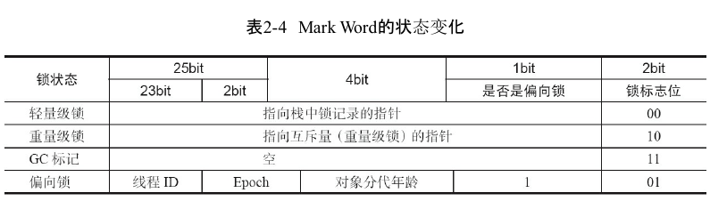
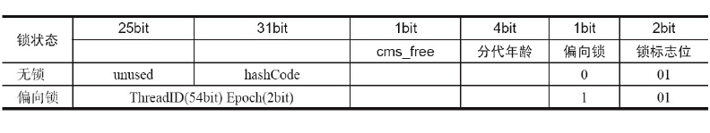

[TOC]

第一本书是java的并发编程艺术

# 并发编程的挑战
并发存在线程的切换，切换时有代价的，所以任务的颗粒度很重要，**并发** 的程序执行时间不一定比 **串行**

减少上下文切换的方法有无锁并发编程、CAS算法、使用最少线程和使用协程。
- **无锁并发编程**: 多线程竞争锁时，会引起上下文切换，所以多线程处理数据时，可以用一些办法来避免使用锁，如将数据的ID按照Hash算法取模分段，不同的线程处理不同段的数据。
- **CAS算法**: Java的Atomic包使用CAS算法来更新数据，而不需要加锁。
- **使用最少线程**: 避免创建不需要的线程，比如任务很少，但是创建了很多线程来处理，这样会造成大量线程都处于等待状态。
- **协程**：在单线程里实现多任务的调度，并在单线程里维持多个任务间的切换。

# Java并发机制的底层实现原理

## volatile

`volatile`是 Java 中的一种轻量级同步机制，主要用于修饰变量, 保证了**可见性**和**有序性**，但不保证**原子性**。
- **可见性**: 一个线程对 `volatile` 变量的修改，会立即被写入主内存，其他线程读取时总是看到最新的值（不会被 CPU 缓存或编译器优化导致线程间不可见）。
- **禁止指令重排序**: 编译器和处理器不会对 `volatile` 变量的读写操作进行重排序，从而保证代码执行顺序与程序顺序一致。

```java
instance = new Singleton(); // instance是volatile变量
```

在X86处理器下查看汇编的指令有volatile变量修饰的共享变量进行写操作的时候会多出第二行汇编代码

```asm
0x01a3de1d: movb $0×0,0×1104800(%esi);0x01a3de24: lock addl $0×0,(%esp);
```

Lock前缀的指令在多核处理器下会引发了两件事情
- 将当前处理器缓存行的数据写回到系统内存。
- 这个写回内存的操作会使在其他CPU里缓存了该内存地址的数据无效。

## synchronized

Java中的每一个对象都可以作为锁。具体表现为以下3种形式。
- 对于普通同步方法，锁是当前实例对象。
- 对于静态同步方法，锁是当前类的Class对象。
- 对于同步方法块，锁是Synchonized括号里配置的对象。

JVM基于**进入和退出Monitor对象**来实现方法同步和代码块同步，但两者的实现细节不一样。

代码块同步是使用`monitorenter`和`monitorexit`指令实现的

方法同步是使用另外一种方式实现的，细节在JVM规范里并没有详细说明

`monitorenter`指令是在编译后插入到同步代码块的开始位置，而`monitorexit`是插入到方法结束处和异常处，JVM要保证每个`monitorenter`必须有对应的`monitorexit`与之配对。

线程执行到`monitorenter`指令时，将会尝试获取对象所对应的`monitor`的所有权，即尝试获得对象的锁。

## java 对象头
在 64 位 JVM 中，普通 Java 对象的对象头由两部分组成：

- **Mark Word**（标记字段）：8 字节（32 位 JVM 为 4 字节）
- **Klass Pointer**（类型指针）：8 字节（默认开启指针压缩时为 4 字节）

如果是数组对象，还会有一个 **数组长度** 字段（4 字节）。

```
普通对象（64位，未压缩指针）：
+-------------------+-------------------+
|   Mark Word (8B)  | Klass Pointer (8B)|
+-------------------+-------------------+

数组对象：
+-------------------+-------------------+-------------------+
|   Mark Word (8B)  | Klass Pointer (8B)| Array Length (4B) |
+-------------------+-------------------+-------------------+
```

Mark Word 的核心 —— **状态动态复用**

Mark Word 是一个多用途的数据结构，根据对象的状态（无锁、偏向锁、轻量级锁、重量级锁、GC 标记）采用不同的位布局。**它只有 64 位，所以不同信息是复用的**。

32位下的结构如下：



64为的结果如下：



锁一共有4种状态，级别从低到高依次是：无锁状态、偏向锁状态、轻量级锁状态和重量级锁状态，这几个状态会随着竞争情况逐渐升级。

**锁可以升级但不能降级**, 目的是为了提高获得锁和释放锁的效率

偏向锁

大多数情况下，锁不仅不存在多线程竞争，而且总是由同一线程多次获得，为了让线程获得锁的代价更低而引入了偏向锁。

> 当一个线程访问同步块并
> 获取锁时，会在对象头和栈帧中的锁记录里存储锁偏向的线程ID，以后该线程在进入和退出
> 同步块时不需要进行CAS操作来加锁和解锁，只需简单地测试一下对象头的Mark Word里是否
> 存储着指向当前线程的偏向锁。如果测试成功，表示线程已经获得了锁。如果测试失败，则需
> 要再测试一下Mark Word中偏向锁的标识是否设置成1（表示当前是偏向锁）：如果没有设置，则
> 使用CAS竞争锁；如果设置了，则尝试使用CAS将对象头的偏向锁指向当前线程。

## atomic operation
32位IA-32处理器使用基于对缓存加锁或总线加锁的方式来实现多处理器之间的原子操作。
1. 通过总线锁保证原子性: 是使用处理器提供的一个LOCK＃信号，当一个处理器在总线上输出此信号时，其他处理器的请求将被阻塞住，那么该处理器可以独占共享内存。
2. 通过缓存锁定来保证原子性: 频繁使用的内存会缓存在处理器的L1、L2和L3高速缓存里，那么原子操作就可以直接在处理器内部缓存中进行，并不需要声明总线锁.

两种情况下处理器不会使用缓存锁定
1. 操作的数据不能被缓存在处理器内部，或操作的数据跨多个缓存行（cache line）时，则处理器会调用总线锁定。
2. 有些处理器不支持缓存锁定。

## 循环CAS
CAS全称**Compare-and-Swap（比较并交换）**，JVM中的CAS操作是依赖处理器提供的cmpxchg指令完成的，CAS指令中有3个操作数，分别是内存位置V、旧的预期值A和新值B

当CAS指令执行时，当且仅当内存位置V符合旧预期值时A时，处理器才会用新值B去更新V的值，否则就不执行更新，但是无论是否更新V，都会返回V的旧值，该操作过程就是一个原子操作

**CAS实现原子操作的三大问题**
 
**1、ABA问题**：初次读取内存旧值时是A，再次检查之前这段期间，如果内存位置的值发生过从A变成B再变回A的过程，我们就会错误的检查到旧值还是A，认为没有发生变化，其实已经发生过A-B-A得变化，这就是CAS操作的ABA问题

解决方法：使用版本号，即1A-2B-3A，这样就会发现1A到3A的变化，不存在ABA变化无感知问题，JDK的atomic包中提供一个带有标记的原子引用类AtomicStampedReference来解决ABA问题

**2、循环时间长开销大**：自旋CAS如果长时间不成功，会给CPU带来非常大的执行开销

**3、只能保证一个共享变量的原子操作**：当对一个共享变量执行操作时，可以使用循环CAS来保证原子操作，但是多个共享变量操作时，就无法保证了

解决方法：
- 将多个变量组合成一个共享变量，jdk提供了AtomicReference类来保证引用对象之间的原子性，那么就可以把多个变量放在一个对象里来进行CAS操作
- 使用锁

## 锁

锁机制保证了只有获得锁的线程才能够操作锁定的内存区域。

JVM内部实现了很多锁机制，有偏向锁、轻量级锁和互斥锁。除了偏向锁，JVM实现锁的方式都用了**循环CAS**，即当一个线程想进入同步块的时候使用循环CAS的方式来获取锁，当它退出同步块的时候使用循环CAS释放锁。

# java 内存模型

在Java中，所有实例域、静态域和数组元素都存储在堆内存中，堆内存在线程之间共享

从Java源代码到最终实际执行的指令序列，会分别经历下面3种重排序


## volatile 的内存语义
一个volatile变量的单个读/写操作，与一个普通变量的读/写操作都 是使用同一个锁来同步，它们之间的执行效果相同。

```java
public class VolatileFeaturesExample {

	volatile long vl = 0L;

	public void set(long l) {
		vl = l;
	}

	public void getAndIncrement() {
		vl++;// 复合（多个）volatile变量的读/写
	}

	public long get() {
		return vl;// 单个volatile变量的读
	}

}
```

等价于

```java
class VolatileFeaturesExample1 {
	long vl = 0L;

	public synchronized void set(long l) {
		vl = l;
	}

	public synchronized long get() {
		return vl;
	}

	public void getAndIncrement() {
		long temp = get();
		temp += 1L;
		set(temp);

	}
}
```
