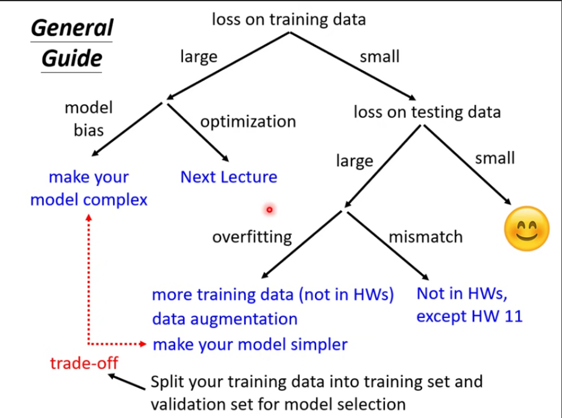
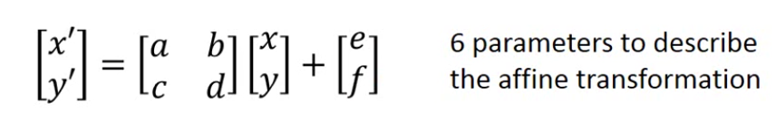
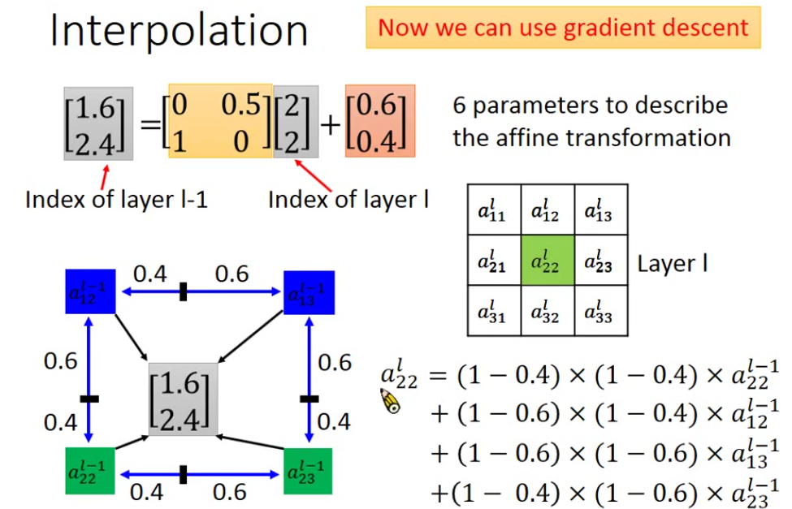

[TOC]

# pytorch basic usage

PyTorch

- **定义**：基于 Python 的开源机器学习框架，主打两大核心功能：
  1. **GPU 加速的张量计算**（类似 NumPy，但可运行在 GPU 上）。
  2. **自动微分机制**（autograd），方便训练神经网络，无需手动计算梯度。

## Dataset and DataLoader

### Dataset

需要自定义类继承 `torch.utils.data.Dataset`，并实现三个方法：

| 方法 | 作用 | 注意事项 |
|------|------|----------|
| `__init__(self, file)` | 读取数据文件，进行预处理（如归一化、切分），存储为列表或数组 | 可以在此处将数据加载到内存（小数据集）或仅保存文件路径（大数据集） |
| `__getitem__(self, index)` | 返回第 `index` 个样本（通常是一个元组 `(特征, 标签)`） | 若数据较大，可以在此处动态读取；返回类型应为 `torch.Tensor` |
| `__len__(self)` | 返回数据集总大小 | 供 DataLoader 确定迭代次数 |

**代码模板**：
```python
from torch.utils.data import Dataset, DataLoader

class MyDataset(Dataset):
    def __init__(self, file):
        # 读取原始数据（例如用 pandas 或 numpy）
        self.data = ...   # shape: (N, features)
        self.labels = ... # shape: (N,)

    def __getitem__(self, idx):
        x = torch.tensor(self.data[idx], dtype=torch.float32)
        y = torch.tensor(self.labels[idx], dtype=torch.long)  # 分类用long，回归用float
        return x, y

    def __len__(self):
        return len(self.data)
```

### 2. DataLoade
- 作用：将 Dataset 输出的单个样本组装成**批次**，支持**随机打乱**和**多进程并行加载**。
- 常用参数：
  - `batch_size`：每个 batch 的样本数。
  - `shuffle`：每个 epoch 是否重新打乱数据（训练集为 `True`，验证/测试集为 `False`）。
  - `num_workers`：加载数据的子进程数（Windows 下常设为 0，Linux/macOS 可设 >0）。
  - `drop_last`：若样本总数不能被 batch_size 整除，是否丢弃最后一个不完整的 batch（训练时常设为 `True`）。

```python
train_dataset = MyDataset("train.csv")
train_loader = DataLoader(train_dataset, batch_size=64, shuffle=True, num_workers=2)

valid_loader = DataLoader(valid_dataset, batch_size=64, shuffle=False)
```

## Tensor

### 概念
- 标量（0 维）、向量（1 维）、矩阵（2 维）、更高维数组。
- 例如：
  - 音频：1 维（时间轴）
  - 灰度图：2 维（高×宽）
  - RGB 图：3 维（高×宽×3）
  - 视频：4 维（时间×高×宽×3）

### 创建

| 方法 | 示例 |
|------|------|
| 从列表 | `torch.tensor([[1,2],[3,4]])` |
| 从 NumPy | `torch.from_numpy(np.array([1,2,3]))` |
| 全零 | `torch.zeros(2,3)` → shape (2,3) |
| 全一 | `torch.ones(2,3)` |
| 随机初始化 | `torch.rand(2,3)`（均匀分布）、`torch.randn(2,3)`（标准正态） |
| 等差数列 | `torch.arange(0, 10, 2)` |

### 形状操作

| 操作 | 描述 | 示例 |
|------|------|------|
| `x.shape` 或 `x.size()` | 查看形状 | `torch.Size([2,3])` |
| `x.view(new_shape)` | 重塑（要求元素总数不变） | `x.view(3,2)` |
| `x.reshape(new_shape)` | 类似 view，但更灵活（会自动处理连续内存） | `x.reshape(3,2)` |
| `x.transpose(dim0, dim1)` | 交换两个维度 | `x.transpose(0,1)` |
| `x.squeeze(dim)` | 删除指定维度中长度为 1 的维度 | `x.squeeze(1)` |
| `x.unsqueeze(dim)` | 在指定位置增加一个长度为 1 的维度 | `x.unsqueeze(0)` |
| `torch.cat([a,b], dim)` | 沿指定维度拼接（其他维度必须一致） | `torch.cat([x,y,z], dim=1)` |

### 数据类型

| 数据类型 | dtype | 张量类型 | 典型用途 |
|----------|-------|-----------|----------|
| 32位浮点 | `torch.float32` | `torch.FloatTensor` | 模型参数、输入特征 |
| 64位浮点 | `torch.float64` | `torch.DoubleTensor` | 更高精度要求 |
| 32位整数 | `torch.int32` | `torch.IntTensor` | 索引 |
| 64位整数 | `torch.long` | `torch.LongTensor` | 分类标签 |

**注意**：不同 dtype 的张量不能直接运算，需转换：`x.to(torch.float)`。

### 设备管理
- 默认所有张量在 CPU 上创建。
- 移动到 GPU：
  ```python
  device = torch.device("cuda" if torch.cuda.is_available() else "cpu")
  x = x.to(device)
  ```
- 检查 GPU 是否可用：`torch.cuda.is_available()`
- 多 GPU：`cuda:0`、`cuda:1` 等。

### 自动梯度
- 设置 `requires_grad=True` 后，PyTorch 会追踪对该张量的所有操作，构建计算图。
- 调用 `backward()` 后，梯度累积到 `.grad` 属性中。

```python
x = torch.tensor([1., 2., 3.], requires_grad=True)
y = x.pow(2).sum()   # y = 1^2+2^2+3^2 = 14
y.backward()         # 计算梯度 dy/dx = 2x
print(x.grad)        # tensor([2., 4., 6.])
```

- **注意**：每轮训练前需清空梯度（`optimizer.zero_grad()` 或手动 `x.grad.zero_()`），否则梯度会累加。

---

## torch.nn

### 常用网络层

| 层 | 类 | 说明 |
|----|----|------|
| 全连接层（线性层） | `nn.Linear(in_features, out_features)` | 包含权重 `weight` 和偏置 `bias` |
| 激活函数 | `nn.ReLU()`、`nn.Sigmoid()`、`nn.Tanh()` | 引入非线性 |
| 二维卷积 | `nn.Conv2d(in_ch, out_ch, kernel_size)` | 图像处理 |
| 池化 | `nn.MaxPool2d(kernel_size)` | 降采样 |
| Dropout | `nn.Dropout(p=0.5)` | 防止过拟合，训练时启用，eval 时自动关闭 |
| 批归一化 | `nn.BatchNorm1d` / `nn.BatchNorm2d` | 加速收敛 |

### 自定义模型

#### 写法一：`nn.Sequential`（简单堆叠）

```python
class MyModel(nn.Module):
    def __init__(self):
        super().__init__()
        self.net = nn.Sequential(
            nn.Linear(10, 32),
            nn.ReLU(),
            nn.Linear(32, 1)
        )
    def forward(self, x):
        return self.net(x)
```

#### 写法二：手动定义每一层

```python
class MyModel(nn.Module):
    def __init__(self):
        super().__init__()
        self.fc1 = nn.Linear(10, 32)
        self.relu = nn.ReLU()
        self.fc2 = nn.Linear(32, 1)

    def forward(self, x):
        x = self.fc1(x)
        x = self.relu(x)
        x = self.fc2(x)
        return x
```

### 损失函数（Loss Function）

| 任务类型 | 常用损失函数 | 类 |
|----------|--------------|-----|
| 回归（预测连续值） | 均方误差 | `nn.MSELoss()` |
| 二分类 | 二元交叉熵 | `nn.BCELoss()`（需配合 Sigmoid）、`nn.BCEWithLogitsLoss()`（推荐，内部包含 Sigmoid） |
| 多分类 | 交叉熵 | `nn.CrossEntropyLoss()`（内部包含 Softmax，输入为 logits，标签为类别索引） |

**example**：
```python
criterion = nn.CrossEntropyLoss()
loss = criterion(model_output, labels)   # model_output shape: (batch, num_classes)
```

## 优化器：torch.optim

- 作用：根据梯度更新模型参数，常用优化算法有 SGD、Adam、RMSprop 等。

### 创建优化器
```python
optimizer = torch.optim.SGD(model.parameters(), lr=0.01, momentum=0.9)
# 或 Adam
optimizer = torch.optim.Adam(model.parameters(), lr=0.001)
```

### 每个训练步骤的三行标准代码

```python
optimizer.zero_grad()   # 清零旧梯度
loss.backward()         # 反向传播计算梯度
optimizer.step()        # 更新参数
```

## 完整训练、验证与测试流程

### 前置设置

```python
device = torch.device("cuda" if torch.cuda.is_available() else "cpu")
model = MyModel().to(device)
criterion = nn.CrossEntropyLoss()
optimizer = torch.optim.Adam(model.parameters(), lr=0.001)
```

### 训练循环

```python
n_epochs = 20
for epoch in range(n_epochs):
    model.train()               # 设置为训练模式（影响 Dropout/BatchNorm）
    total_train_loss = 0
    for batch_x, batch_y in train_loader:
        batch_x, batch_y = batch_x.to(device), batch_y.to(device)
        optimizer.zero_grad()
        pred = model(batch_x)
        loss = criterion(pred, batch_y)
        loss.backward()
        optimizer.step()
        total_train_loss += loss.item() * batch_x.size(0)
    avg_train_loss = total_train_loss / len(train_loader.dataset)
    print(f"Epoch {epoch+1}, Train Loss: {avg_train_loss:.4f}")
```

### 验证（Validation）

```python
model.eval()                # 切换到评估模式
total_val_loss = 0
with torch.no_grad():       # 禁用梯度计算，节省内存
    for batch_x, batch_y in val_loader:
        batch_x, batch_y = batch_x.to(device), batch_y.to(device)
        pred = model(batch_x)
        loss = criterion(pred, batch_y)
        total_val_loss += loss.item() * batch_x.size(0)
avg_val_loss = total_val_loss / len(val_loader.dataset)
```

### 测试（Test，无标签）

```python
model.eval()
all_preds = []
with torch.no_grad():
    for batch_x in test_loader:
        batch_x = batch_x.to(device)
        pred = model(batch_x)
        all_preds.append(pred.cpu())
final_preds = torch.cat(all_preds, dim=0)   # (total_samples, num_classes)
```

### 4. 关键区别：`model.train()` vs `model.eval()`
- `model.train()`：启用 dropout 随机失活，BatchNorm 使用当前 batch 的统计量。
- `model.eval()`：禁用 dropout，BatchNorm 使用训练阶段保存的全局统计量。
- **必须成对使用**，否则验证/测试结果会错误。

### 5. `torch.no_grad()` 的作用
- 被包裹的代码不会构建计算图，因而无法反向传播，但大幅减少内存占用并加速。
- 验证/测试时必须使用，训练时不需要（但不会报错，只是浪费内存）。

## 保存与加载模型

### 只保存参数
```python
# 保存
torch.save(model.state_dict(), "model_weights.pth")

# 加载
model = MyModel()  # 先创建相同结构的模型
model.load_state_dict(torch.load("model_weights.pth"))
model.to(device)
model.eval()  # 加载后通常用于推理，需转为 eval 模式
```

### 保存整个模型

```python
torch.save(model, "whole_model.pth")
model = torch.load("whole_model.pth")
```

### 保存 checkpoint（包含优化器状态，用于恢复训练）

```python
checkpoint = {
    'epoch': epoch,
    'model_state_dict': model.state_dict(),
    'optimizer_state_dict': optimizer.state_dict(),
    'loss': loss,
}
torch.save(checkpoint, "checkpoint.pth")

# 恢复
checkpoint = torch.load("checkpoint.pth")
model.load_state_dict(checkpoint['model_state_dict'])
optimizer.load_state_dict(checkpoint['optimizer_state_dict'])
start_epoch = checkpoint['epoch'] + 1
```

## 常见错误与调试建议

| 错误现象 | 可能原因 | 解决办法 |
|----------|----------|----------|
| `RuntimeError: Expected object of device type cuda but got device type cpu` | 模型和数据不在同一设备 | 使用 `.to(device)` 统一移动 |
| `RuntimeError: shape mismatch` | 输入张量维度不符合网络定义 | 打印 `x.shape` 检查，或用 `view`/`reshape` 调整 |
| 损失不下降 | 学习率过大/过小、梯度消失/爆炸 | 调整 lr，检查梯度（`torch.norm(param.grad)`） |
| 验证损失远高于训练损失 | 过拟合 | 增加 Dropout、正则化、数据增强或减小模型容量 |
| `UserWarning: Implicit dimension choice for softmax` | 未指定 softmax 的维度 | 使用 `nn.LogSoftmax(dim=1)` 明确指定 |
| GPU 内存不足（CUDA out of memory） | batch_size 太大或模型太大 | 减小 batch_size，使用梯度累积，或切换到更大显存的 GPU |

# general guide for hw



# optimizer

## SGD（随机梯度下降）
- **原理**：每次从训练集中随机抽取一个样本（或一个小批量）计算梯度，并沿梯度负方向更新参数。  
  \[
  w \leftarrow w - \eta \cdot \nabla L(w)
  \]
- **优点**：计算快、内存小、可在线学习。  
- **缺点**：收敛路径震荡大，易陷入局部最优或鞍点；对学习率η敏感。  
- **适用**：数据量大、对收敛速度要求不苛刻时。

## SGD with Momentum（带动量的SGD）
- **原理**：引入动量项（历史梯度的指数加权平均），让更新方向既依赖当前梯度，也依赖历史动量，从而加速收敛并抑制震荡。  
  \[
  v \leftarrow \beta v + \eta \cdot \nabla L(w) \quad,\quad w \leftarrow w - v
  \]
- **优点**：加速穿过平坦区域，减少震荡，提高收敛稳定性。  
- **缺点**：引入额外的超参数β（通常0.9），仍需手动调整学习率。  
- **适用**：大多数标准任务，尤其是损失曲面有较长平缓区域时。

## Adagrad（自适应梯度算法）
- **原理**：对每个参数使用不同的学习率 – 梯度累计平方和大的参数学习率减小快，反之则学习率保持较大。  
  \[
  w_i \leftarrow w_i - \frac{\eta}{\sqrt{G_{ii}+\epsilon}} \nabla_{w_i}L
  \]
- **优点**：适合稀疏特征（如词嵌入），无需手动调整全局学习率。  
- **缺点**：学习率单调递减，后期易过早停止学习。  
- **适用**：稀疏数据、自然语言处理中词频不均的场景。

## RMSProp（均方根传播）
- **原理**：在Adagrad基础上引入指数衰减移动平均，避免学习率快速归零。  
  \[
  E[g^2]_t \leftarrow \beta E[g^2]_{t-1} + (1-\beta)(\nabla L)^2
  \]
  \[
  w \leftarrow w - \frac{\eta}{\sqrt{E[g^2]_t+\epsilon}} \nabla L
  \]
- **优点**：解决了Adagrad后期学习率过小的问题，适合非平稳目标。  
- **缺点**：仍需要设定初始学习率η和衰减率β（常用0.9）。  
- **适用**：循环神经网络（RNN）、强化学习等非平稳或在线任务。

## Adam（自适应矩估计）
- **原理**：结合动量（一阶矩）和RMSProp（二阶矩），并加入偏差修正。  
  \[
  m_t = \beta_1 m_{t-1} + (1-\beta_1)g_t,\quad v_t = \beta_2 v_{t-1} + (1-\beta_2)g_t^2
  \]
  \[
  \hat{m}_t = m_t/(1-\beta_1^t),\quad \hat{v}_t = v_t/(1-\beta_2^t)
  \]
  \[
  w \leftarrow w - \eta \cdot \hat{m}_t / (\sqrt{\hat{v}_t}+\epsilon)
  \]
- **优点**：收敛快、对超参数不敏感（默认η=0.001，β1=0.9，β2=0.999），效果好。  
- **缺点**：在某些情况下可能泛化性能略差于带动量的SGD；需要更多显存存储动量。  
- **适用**：绝大多数现代深度学习任务的默认首选。

problem with adam

| statement| explaination|
|------|------|
| 最大移动距离上界 ≈ \(\sqrt{1/(1-\beta_2)}\,\eta\) | Adam 单步更新不可能无限大，被二阶动量历史与 \(\beta_2\) 限制。 |
| 非信息性梯度贡献更大 | 由于有效学习率 \(\propto 1/\sqrt{v_t}\)，微小梯度使 \(v_t\) 变小 → 步长反而变大，造成不利影响。 |

## comparison table

| 算法             | 自适应学习率 | 动量 | 适用场景                         | 收敛速度 |
|----------------|--------|------|--------------------------------|------|
| SGD            | ❌     | ❌    | 简单模型、数据流                  | 慢    |
| SGD+Momentum   | ❌     | ✅    | 标准任务、连续优化               | 较快  |
| Adagrad        | ✅     | ❌    | 稀疏特征（NLP、推荐系统）         | 早期快后期慢 |
| RMSProp        | ✅     | ❌    | RNN、非平稳目标                  | 快    |
| Adam           | ✅     | ✅    | 大多数深度学习任务（默认推荐）  | 很快  |

## AMSGrad

**AMSGrad不适合实际使用**

核心思想很简单：通过记录历史二阶动量的最大值并用于参数更新，确保了学习率的单调递减，从而在数学上保证了算法的收敛性。

   \[
   g_t = \nabla_\theta J(\theta_t)
   \]

   \[
   m_t = \beta_1 m_{t-1} + (1-\beta_1) g_t
   \]

   \[
   v_t = \beta_2 v_{t-1} + (1-\beta_2) g_t^2
   \]

   \[
   \hat{m}_t = \frac{m_t}{1 - \beta_1^t}, \qquad 
   \tilde{v}_t = \frac{v_t}{1 - \beta_2^t}
   \]

   \[
   \hat{v}_t = \max(\hat{v}_{t-1},\; \tilde{v}_t), \quad \text{where } \hat{v}_0 = 0
   \]

   \[
   \theta_{t+1} = \theta_t - \eta \cdot \frac{\hat{m}_t}{\sqrt{\hat{v}_t} + \epsilon}
   \]

AMSGrad 的实际表现一般，不如原本的Adam

本质还是monotonically decreasing learning rate, 没有真正解决问题

## AdaBound
**AdaBound在很多库很久都没有更新维护了， 实际使用存在争议，表现落伍于后续的优化器**

AdaBound 的核心思想是利用**动态边界**机制

*  \( g_t = \nabla J(\theta_{t-1}) \)
*  \( m_t = \beta_1 m_{t-1} + (1 - \beta_1) g_t \)
*  \( v_t = \beta_2 v_{t-1} + (1 - \beta_2) g_t^2 \)
*  \( \theta_t = \theta_{t-1} - \eta \cdot \frac{m_t}{\sqrt{v_t} + \epsilon} \)

AdaBound 的核心公式如下：
\[
\hat{\eta}_t = \text{Clip}\left(\frac{\alpha}{\sqrt{V_t}}, \eta_l(t), \eta_u(t)\right)
\]
*   \( \alpha \) 是初始学习率。
*   \( V_t = \text{diag}(v_t) \)，即由二阶动量 \( v_t \) 构成的对角矩阵，是Adam的自适应部分。
*   \( \eta_l(t) \) 和 \( \eta_u(t) \) 是动态变化的下界和上界(一般是经验法则界限的，"not adaptive at all")

最后更新

\[
\theta_{t+1} = \theta_t - \hat{\eta}_t \odot m_t
\]

## Something may helps with optimization
- Data Shuffing
- Dropout
- Gradient noise
- Warm-up
- Fine-tuning
- Normalization
- Regularization

# Week 3
深度学习本质是在拟合一个函数。

于是神经网络的设计可以成shallow，也可以是deep networks

但是一个直观的思想就是deep networks 可以复用前面学习到的某些特征，从而比shallow的网络设计的参数量少得多

And...
- Deep networks outperforms shallow ones when the required functions are complex and regular.
- Deep is exponentially better than shallow even when $v = x^2$ .

## Spatial Transformer Layer
Spatial Transformer Layer（空间变换器层）是深度学习网络中的一个可微模块，旨在让网络主动地、动态地对输入数据（图像或特征图）进行空间变换，例如平移、旋转、缩放或裁剪

传统的卷积神经网络（CNN）通过卷积和池化操作具有一定的**局部平移不变性**，即能容忍目标在小范围内移动。

然而，CNN本身并**不具备**尺度不变性（scaling invariant）和旋转不变性（rotation invariant）。例如，一个被旋转或缩放的物体，对CNN来说可能是完全不同的东西。

image transformation 本质可以看作是原图片到目标图片的映射，具体来说是采样点的映射。



Spatial Transformer Layer由三个顺序执行的组件构成：

1. **参数预测 (Localisation Net)**
    *   它的任务是接收输入的特征图（U），并**预测出空间变换所需的参数（θ）(e.g 上图二维的a, b, c, d, e, f)**。
    *   根据不同的输入内容，动态地生成最适合它的变换参数。
2. **坐标映射 (Grid Generator)**
    *   在输入特征图（U）上**计算出采样点的坐标网格**。
3. **像素采集 (Sampler)**
    *   这是最后一步，它根据第二步生成的坐标网格，**从输入特征图（U）中采集像素值，从而生成最终的输出特征图（V）**。
    *   由于映射后的坐标通常是**小数**，无法直接对应到输入图上的整数像素点，因此这一步需要使用 **插值(interpolation)** （如双线性插值）来计算该位置的像素值。
    *   使用插值的可以使得整个变换过程是**可微分的**, 这意味着损失函数的梯度可以反向传播，从而端到端地训练整个网络，包括用来预测变换参数的Localisation Net。

下面是slide关于interpolation的介绍，作为补充



# Week 4

## Self-Attention

对于序列的数据输入，数据的顺序本身存在信息，我们需要另外的设计来学习这种信息

Vectors sets as input 
- One-hot Encoding(every vector do not have relationship with other vectors) 
- Word Embedding

then comes to self-attention

Self-Attention
\[
\text{Attention}(Q, K, V) = \text{softmax}\left(\frac{QK^T}{\sqrt{d_k}}\right)V
\]


signle explaination as follow:
- **点积**：计算 \( Q \times K^T \)。得到的是一个 \( N \times N \) 的矩阵（\( N \) 是序列长度）。里面的数值 \( (i, j) \) 代表“第 \( i \) 个词”对“第 \( j \) 个词”的原始关注强度（相似度）。
- **缩放**：除以 \( \sqrt{d_k} \)。因为维度 \( d_k \) 很大时，点积数值会变得很大，导致 Softmax 落入梯度极小的区域，除以根号维度是为了把方差拉回 1。
- **归一化** ：对 \( N \times N \) 矩阵的每一行做 Softmax。现在每一行的数值变成了概率，和为 1。这意味着：“对于当前的词 \( i \)，它把 100% 的注意力权重，按重要性分摊给了所有词（包括它自己）。”
- **加权求和** ：将这个概率矩阵乘以 \( V \)。每个词的新向量，都融合了**全局所有词**的信息，且融合的比例由相关性决定。

but might have problems:
- **Position 盲区**：在计算步骤 1（\( Q \times K^T \)）时，只涉及向量的点积。点积是**交换律**的（\( a \cdot b = b \cdot a \)）。这意味着，如果“我”在第1位，“你”在第2位，和“你”在第1位，“我”在第2位，计算出来的 Attention 分数**一模一样**。
- **结论**：Self-Attention 本身把输入当作**“无序的一袋水果”**。它只关心“苹果”和“梨”的语义特征是否匹配，**完全不关心“苹果是在梨的左边还是右边”**。这就是为什么 Transformer 必须在输入层 **强制加上（Add）位置编码**——位置编码是在给这袋水果强行贴上门牌号，否则 Self-Attention 根本无法区分“人咬狗”和“狗咬人”。

code for learning the idea

```python
# x (batch, seq_len, dim)
# x_pe = x + pe (pe stands for position encoding vector)

Q = x_pe @ W_q
K = x_pe @ W_k
V = x_pe @ W_v

# attn_weights shape : (batch, seq_len, seq_len)
attn_weights = softmax(Q @ K.transpose(-2, -1) / sqrt(dk))

# attn_weights 矩阵的第 i 行，只依赖于 Q_i 和所有 K_j
```

## Multi-head self-attention
简单理解
- **单头注意力**：只能整体地算出一个注意力权重。模型可能被迫折中，既关注“吃草”的动作，又关注“跳过”的动作，结果两件事都没关注透彻，变成“大杂烩”。
- **多头注意力（8个头）**：
  - **头 1（Head 1）**：专门盯着**邻近词**（“河边”紧挨着“吃草”），学习局部语法。
  - **头 3（Head 3）**：专门盯着**远距离指代**（“鹿”和“它”虽然没有，但这里“鹿”和“跳过”跨了很远，照样抓取）。
  - **头 7（Head 7）**：专门盯着**实体类型**（区分“动物”和“地理”）。
最后，模型把 8 个专家的意见**汇总拼接**，得到一个信息极其丰富的向量。

单头的公式：\( \text{Attention}(Q, K, V) = \text{softmax}(\frac{QK^T}{\sqrt{d_k}})V \)

多头数学定义为：
\[
\text{MultiHead}(Q, K, V) = \text{Concat}(\text{head}_1, \text{head}_2, ..., \text{head}_h)W^O
\]
\[
\text{其中 } \text{head}_i = \text{Attention}(QW_i^Q, KW_i^K, VW_i^V)
\]

3 个投影矩阵 \( W_i^Q, W_i^K, W_i^V \)：

- 假设词嵌入维度是 \( d_{model} = 512 \)。
- 用 \( h = 8 \) 个头。
- 每个头的维度 \( d_k = d_v = d_{model} / h = 512 / 8 = 64 \)。

\( W_i^Q \) 的形状是 \( 512 \times 64 \)。这意味着，**每个头会把原始的 512 维向量，通过不同的投影矩阵，压缩映射到一个 64 维的“子空间”里**。因为 8 个头的投影矩阵 \( W_i \) 都是**随机初始化、独立训练**的，所以它们会从原始数据中**“提炼”出 8 种不同的特征角度**。


code for learning the idea

```python
# 假设输入 x: (batch_size, seq_len, d_model=512)
# 多头数: 8, 每个头维度: 64

# 1. 线性变换并拆分为多组
# W_q, W_k, W_v 形状均为 (512, 512)
Q = x @ W_q  # (batch, seq_len, 512)
# 关键：把最后一维拆成 (8, 64)，并交换维度
Q = Q.view(batch_size, seq_len, 8, 64).transpose(1, 2)  
# 现在 Q 的形状: (batch_size, 8, seq_len, 64)
# 这就实现了 8 个头并行计算，互不干扰！

# 2. 计算缩放点积注意力（此时在 64 维空间中算）
# scores = (Q @ K.transpose(-2,-1)) / sqrt(64)
# 得到 attn 形状: (batch, 8, seq_len, seq_len)

# 3. 加权求和后，把 8 个头拼回去
# 形状变回 (batch, seq_len, 512)
# 4. 最后过一层输出投影 W_o (512, 512)
```

## RNN
